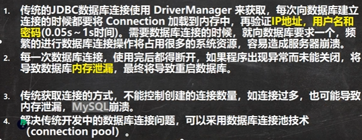
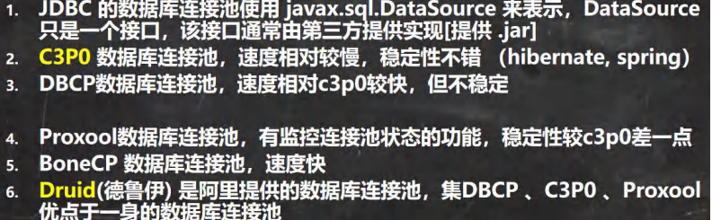
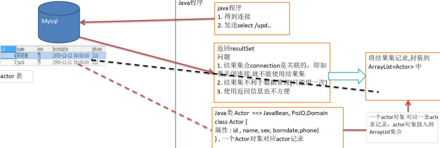

# JDBC

## JDBC概述

1. JDBC为访问不同的数据库提供了统一的接口，为使用者屏蔽了细节问题
2. Java程序员使用JDBC，可以连接任何提供了JDBC驱动程序的数据库系统，从而完成对数据库的各种操作
3. JDBC的基本原理
   - 
4. JDBC带来的好处
   - 
5. JDBC是Java提供一套用于数据库操作的接口API，**Java程序员只需要面向这套接口编程即可**。
   不同的数据库厂商，需针对这套接口，提供不同的实现。

**JDBC程序编写步骤**
1. 注册驱动-加载Driver类
2. 获取连接-得到Connection
3. 执行增删改查-发送SQL给mysql执行
4. 释放资源-关闭相关连接
5. 

```java
package com.charlie.jdbc;

import com.mysql.jdbc.Driver;

import java.sql.Connection;
import java.sql.SQLException;
import java.sql.Statement;
import java.util.Properties;

/**
 * 第一个jdbc程序，完成简单的操作
 */
public class Jdbc01 {
    public static void main(String[] args) throws SQLException {
        /*
        前置工作：在项目下创建一个文件夹比如 libs
        将 mysql.jar 拷贝到该目录下，点击 add to project 加入到项目中
         */

        // 1. 注册驱动
        Driver driver = new Driver();   // 创建driver对象

        // 2. 得到连接
        /*
        1) jdbc:mysql:// 规定好的表示协议，通过jdbc方式连接mysql
        2) localhost 主机，可以是IP地址
        3) 3306 表示mysql监听的接口
        4) /hsp_db02 表示连接到 mysql dbms 的哪个数据库
        5) mysql的连接本质上就是 socket 连接
         */
        String url = "jdbc:mysql://localhost:3306/hsp_db02";
       // 将用户名和密码放入到 Properties 对象
        Properties properties = new Properties();
        // 说明：user和password是规定号的，后面的值根据实际情况写
        properties.setProperty("user", "root"); // 用户
        properties.setProperty("password", "011121"); // 密码

        Connection connect = driver.connect(url, properties);

        // 3. 执行sql
//        String sql = "insert into actor values(null, '刘德华', '男', '1970-11-11', '135')";
//        String sql = "update actor set `name` = '周星驰' where id = 1";
        String sql = "delete from actor where id = 1";

        // statement 用于执行静态SQL语句并返回生成结果的对象
        Statement statement = connect.createStatement();
        int rows = statement.executeUpdate(sql);    // 如果是dml语句，返回的就是影响的行数

        System.out.println(rows > 0 ? "成功" : "失败");

        // 4. 关闭连接资源
        statement.close();
        connect.close();
    }
}
```

## 获取数据库连接的5种方式

> 提示：
> 1. mysql驱动5.1.6可以无需 `Class.forName("com.mysql.jdbc.Driver");`
> 2. 从jdk1.5以后使用jdbc4，不需要再显式调用 `Class.forName()` 注册驱动而是自动调用驱动
>     jar包下 `META-INF\services\java.sql.Driver` 文本种的类名称去注册
> 3. 建议写上 `Class.forName()` 更加明确

- 

```java
package com.charlie.jdbc;

import com.mysql.jdbc.Driver;
import org.junit.Test;

import java.io.FileInputStream;
import java.io.FileNotFoundException;
import java.io.IOException;
import java.sql.Connection;
import java.sql.DriverManager;
import java.sql.SQLException;
import java.sql.Statement;
import java.util.Properties;

/**
 * Java连接mysql的5种方式
 */
public class JdbcConn {

    public static void main(String[] args) throws Exception {
        // 使用方式5完成练习
        Properties properties = new Properties();
        String fileName = "src\\mysql.properties";
        properties.load(new FileInputStream(fileName));
        String url = properties.getProperty("url");
        String user = properties.getProperty("user");
        String password = properties.getProperty("password");
        String driver = properties.getProperty("driver");

        Class.forName(driver);
        Connection connection = DriverManager.getConnection(url, user, password);
        Statement statement = connection.createStatement();
        String sql1 = "create table news " +
                "(id int primary key auto_increment," +
                "`name` varchar(32) not null default ''," +
                "content text not null);";
        int row1 = statement.executeUpdate(sql1);
        System.out.println(row1 > 0 ? "创建成功" : "创建失败");

        String sql2 = "insert into news values" +
                "(null, '北京日报', '建设美丽中国')," +
                "(null, '今晚报', '自由民主')," +
                "(null, '联合早报', '花园城市')," +
                "(null, '南方周末', '民以食为天')," +
                "(null, '新京报', '跨年');";
        int row2 = statement.executeUpdate(sql2);
        System.out.println(row2 > 0 ? "添加成功" : "添加失败");

        String sql3 = "update news set content = 'hello, world' where id = 1;";
        int row3 = statement.executeUpdate(sql3);
        System.out.println(row3 > 0 ? "修改成功" : "修改失败");

        String sql4 = "delete from news where id = 3;";
        int row4 = statement.executeUpdate(sql4);
        System.out.println(row4 > 0 ? "删除成功" : "删除失败");

        // 关闭连接资源
        statement.close();
        connection.close();
    }

    @Test
    public void connect01() throws SQLException {
        Driver driver = new Driver();   // 创建 driver 对象
        String url = "jdbc:mysql://localhost:3306/hsp_db02";
        Properties properties = new Properties();
        properties.setProperty("user", "root");
        properties.setProperty("password", "011121");
        Connection connect = driver.connect(url, properties);
        System.out.println("方式1：" + connect);
    }

    @Test
    public void connect02() throws ClassNotFoundException, InstantiationException, IllegalAccessException, SQLException {
        // 使用反射加载Driver类，动态加载，更加灵活，减少依赖性
        Class<?> aClass = Class.forName("com.mysql.jdbc.Driver");
        Driver driver = (Driver) aClass.newInstance();

        String url = "jdbc:mysql://localhost:3306/hsp_db02";
        Properties properties = new Properties();
        properties.setProperty("user", "root");
        properties.setProperty("password", "011121");
        Connection connect = driver.connect(url, properties);
        System.out.println("方式2：" + connect);
    }

    @Test
    public void connect03() throws Exception {
        // 使用 DriverManager 替代 Driver 进行统一管理
        Class<?> aClass = Class.forName("com.mysql.jdbc.Driver");
        Driver driver = (Driver) aClass.newInstance();

        // 创建 url user 和 password
        String url = "jdbc:mysql://localhost:3306/hsp_db02";
        String user = "root";
        String password = "011121";

        DriverManager.registerDriver(driver); // 注册
        Connection connection = DriverManager.getConnection(url, user, password);
        System.out.println("方式3：" + connection);
    }

    @Test /* 推荐使用 */
    public void connect04() throws Exception {
        // 方式4：使用 Class.forName 自动完成注册驱动，简化代码
        // 在加载Driver类是，完成注册
        /*
        1. 静态代码块，在类加载时，会执行一次
        2. DriverManager.registerDriver(new Driver());
        3. 因此注册driver的工作已经完成
            static {
                try {
                    DriverManager.registerDriver(new Driver());
                } catch (SQLException var1) {
                    throw new RuntimeException("Can't register driver!");
                }
            }
         */
        Class.forName("com.mysql.jdbc.Driver");
        String url = "jdbc:mysql://localhost:3306/hsp_db02";
        String user = "root";
        String password = "011121";
        Connection connection = DriverManager.getConnection(url, user, password);
        System.out.println("方式4：" + connection);
    }

    // 方式5：在方式4的基础商改进，增加配置文件，让连接mysql更加灵活
    @Test
    public void connect05() throws IOException, ClassNotFoundException, SQLException {
        // 通过 Properties对象 获取配置文件的信息
        Properties properties = new Properties();
        properties.load(new FileInputStream("src\\mysql.properties"));
        String user = properties.getProperty("user");
        String password = properties.getProperty("password");
        String driver = properties.getProperty("driver");
        String url = properties.getProperty("url");

        Class.forName(driver);  // 建议写上

        Connection connection = DriverManager.getConnection(url, user, password);
        System.out.println("方式5：" + connection);
    }
}
```

## ResultSet结果集

1. `ResultSet`表示数据库结果集的数据表，通常通过执行擦汗寻数据库的语句生成
2. `ResultSet`对象保持一个光标指向其当前的数据行。最初，光标位于第一行之前
3. `next`方法将光标移动到下一行，并且由于在 `ResultSet` 对象种没有更多行时返回 `false`
   因此可以在 while循环种使用循环来遍历结果集
- 

```java
package com.charlie.jdbc.resultset_;

import java.io.FileInputStream;
import java.sql.*;
import java.util.Properties;

/**
 * 演示一个查询语句返回 ResultSet
 */
public class ResultSet_ {
    public static void main(String[] args) throws Exception {
        String mysqlFile = "src\\mysql.properties";
        Properties properties = new Properties();
        properties.load(new FileInputStream(mysqlFile));
        // 获取相关值
        String url = properties.getProperty("url");
        String user = properties.getProperty("user");
        String password = properties.getProperty("password");
        String driver = properties.getProperty("driver");
        // 1. 注册驱动
        Class.forName(driver);
        // 2. 得到连接
        Connection connection = DriverManager.getConnection(url, user, password);
        // 3. 得到statement
        Statement statement = connection.createStatement();
        // 4. sql语句
        String sql = "select id, name, gender, borndate from actor";
        // 执行给定的SQL语句，返回单个 ResultSet 对象
        ResultSet resultSet = statement.executeQuery(sql);
        /*
        +----+-----------+--------+---------------------+-------+
        | id | name      | gender | borndate            | phone |
        +----+-----------+--------+---------------------+-------+
        |  2 | 李自成    | 男     | 1997-12-20 00:00:00 | 136   |
        |  3 | 高育良    | 男     | 1950-08-07 00:00:00 | 166   |
        +----+-----------+--------+---------------------+-------+
         */

        // 5. 使用while取出数据
        while (resultSet.next()) {  // 让光标向后移动，如果没有更多行，则返回false
            int id = resultSet.getInt(1);    // 获取该行的第1列数据
            String name = resultSet.getString(2); // 第2列
            String gender = resultSet.getString(3);
            Date date = resultSet.getDate(4);
            System.out.println(id + "\t" + name + "\t" + gender + "\t" + date);
        }

        // 6. 关闭连接
        statement.close();
        connection.close();
    }
}
```

## Statement

1. `Statement`对象，用于执行静态SQL的语句并返回其生成的结果的对象
2. 在连接建立后，需要对书库进行访问，执行命令或是SQL语句，可以通过
   - Statement-存在SQL注入
   - PreparedStatement-预处理
   - CallableStatement-存储过程
3. `Statement`对象执行SQL语句，存在**SQL注入**风险
4. SQL注入是利用某些系统没有对用户输入的数据进行充分的检查，而在用户输入数据中注入非法SQL语句段或命令
   恶意国际数据库
5. 要防范SQL注入，只要用 `PreparedStatement` 取代 Statement 即可

```java
package com.charlie.jdbc.statement_;

import java.io.FileInputStream;
import java.io.IOException;
import java.sql.*;
import java.util.Properties;
import java.util.Scanner;

/**
 * 演示SQL注入问题
 */
public class Statement_ {
    public static void main(String[] args) throws IOException, ClassNotFoundException, SQLException {
        Scanner scanner = new Scanner(System.in);
        // 让用户输入管理员名和密码
        System.out.print("请输入管理员的名字："); // next() 当接受到 空格 或者 单引号 时表示结束
        String admin_name = scanner.nextLine(); // 如果希望看到SQL注入，需要用 nextLine()
        System.out.print("请输入管理员的密码：");
        String admin_pwd = scanner.nextLine();

        String mysqlFile = "src\\mysql.properties";
        Properties properties = new Properties();
        properties.load(new FileInputStream(mysqlFile));
        // 获取相关值
        String url = properties.getProperty("url");
        String user = properties.getProperty("user");
        String password = properties.getProperty("password");
        String driver = properties.getProperty("driver");
        // 1. 注册驱动
        Class.forName(driver);
        // 2. 得到连接
        Connection connection = DriverManager.getConnection(url, user, password);
        // 3. 得到statement
        Statement statement = connection.createStatement();
        // 4. sql语句
//        String sql = "select name, pwd from admin";
        String sql = "select name, pwd from admin where name = '"
                + admin_name + "' and pwd = '" + admin_pwd + "';";
        ResultSet resultSet = statement.executeQuery(sql);

        if (resultSet.next()) { // 如果查询到一条记录，则说明该管理存在
            System.out.println("登录成功！");
        } else {
            System.out.println("登录失败~");
        }

        // 6. 关闭连接
        statement.close();
        connection.close();
    }
}
```

## PreparedStatement

1. `PreparedStatement`执行的SQL语句中的参数用问号`?`表示，调用`PreparedStatement`对象的`setXXX()`方法来设置这些参数
   `setXXX()`方法有两个参数，第一个参数是要设置的SQL语句中的参数的索引(从1开始)，第二个是设置的SQL语句中的参数的值
2. 调用 `executeQuery()` 返回 `ResultSet` 对象
3. 调用 `executeUpdate()` 执行更新，包括增、删、修改
4. 

```java
package com.charlie.jdbc;

import java.io.FileInputStream;
import java.io.IOException;
import java.sql.*;
import java.util.Properties;
import java.util.Scanner;

public class PreparedStatementExercise {
    public static void main(String[] args) throws IOException, ClassNotFoundException, SQLException {
        // 注册驱动
        String mysqlPath = "src\\mysql.properties";
        Properties properties = new Properties();
        properties.load(new FileInputStream(mysqlPath));
        String url = properties.getProperty("url");
        String user = properties.getProperty("user");
        String password = properties.getProperty("password");
        String driver = properties.getProperty("driver");

        // 建立连接
        Class.forName(driver);
        Connection connection = DriverManager.getConnection(url, user, password);

        // sql：创建admin表
        String sql1 = "create table admin (" +
                "id int primary key auto_increment," +
                "name varchar(32) not null default ''," +
                "pwd varchar(32) not null default ''" +
                ");";
        PreparedStatement preparedStatement = connection.prepareStatement(sql1);
        int rows1 = preparedStatement.executeUpdate();
        preparedStatement.close();
        System.out.println(rows1 > 0 ? "创表成功！" : "创表失败~");

        // sql：添加数据
//        String sql2 = "insert into admin values" +
//                "(null, 'jack', '123')," +
//                "(null, 'tom', '666')," +
//                "(null, 'hsp', 'hsp')," +
//                "(null, 'lzc', '111')," +
//                "(null, 'charlie', '777');";
        Scanner scanner = new Scanner(System.in);
        String adminName = "";
        String adminPwd = "";
        String sql2 = "insert into admin values" +
                "(null, ?, ?);";
        PreparedStatement preparedStatement1 = connection.prepareStatement(sql2);
        for (int i = 0; i < 5; i++) {
            System.out.print("请输入管理员姓名：");
            adminName = scanner.nextLine();
            System.out.print("请输入管理员密码：");
            adminPwd = scanner.nextLine();
            preparedStatement1.setString(1, adminName);
            preparedStatement1.setString(2, adminPwd);
            int j = preparedStatement1.executeUpdate();
            System.out.println(j > 0 ? "添加成功！" : "添加失败~");
        }
        preparedStatement1.close();

        // sql：修改记录
        String sql3 = "update admin set name = 'king' where name = 'tom'";
        PreparedStatement preparedStatement2 = connection.prepareStatement(sql3);
        int rows2 = preparedStatement2.executeUpdate();
        System.out.println(rows2 > 0 ? "修改成功！" : "修改失败~");

        // sql：删除记录
        String sql4 = "delete from admin where name = ?";
        PreparedStatement preparedStatement3 = connection.prepareStatement(sql4);
        System.out.print("请输入要删除的管理员姓名：");
        adminName = scanner.nextLine();
        preparedStatement3.setString(1, adminName);
        int rows3 = preparedStatement3.executeUpdate();
        preparedStatement3.close();
        System.out.println(rows3 > 0 ? "删除成功！" : "删除失败~");

        // sql：查询全部记录，并显示在控制台
        String sql = "select * from admin";
        PreparedStatement preparedStatement4 = connection.prepareStatement(sql);
        ResultSet resultSet = preparedStatement4.executeQuery(sql);
        while (resultSet.next()) {
            int id = resultSet.getInt(1);
            String name = resultSet.getString(2);
            String pwd = resultSet.getString(3);
            System.out.println(id + "\t" + name + "\t" + pwd);
        }

        // 关闭连接
        preparedStatement4.close();
        connection.close();
    }
}
```

## JDBC相关API小结

- **JDBC API**
  - `DriverManager`驱动管理类
    - `getConnection(url, user, pwd)`获取到连接
  - `Connection`接口
    - `createStatement`创建`Statement`对象
    - `preparedStatement(sql)`生成预处理对象
  - `Statement`接口
    - `executeUpdate(sql)`执行dml语句，返回影响的行数
    - `executeQuery(sql)`执行查询，返回`ResultSet`对象
    - `execute(sql)`执行任意的sql语句，返回布尔值
  - `PreparedStatement`接口
    - `executeUpdate(sql)`执行dml语句
    - `executeQuery(sql)`执行查询，返回`ResultSet`对象
    - `execute(sql)`执行任意的sql语句，返回布尔值
    - `setXXX(占位符索引, 占位符的值)` 解决SQL注入问题
    - `setObject(占位符索引, 占位符的值)`
  - `ResultSet`结果集
    - `next()`向下移动一行，如果没有下一行，返回`false`
    - `previous()`向上移动，如果没有上一行，返回`false`
    - `getXXX(列索引/列名)`，返回对应列的值，返回类型是XXX
    - `getObject(列索引/列名)`返回对应列的自豪，接收类型为`Object`

## 封装JDBCUtils

- [JDBCUtils](src/com/charlie/jdbc/utils/JDBCUtils.java)
- [测试工具类](src/com/charlie/jdbc/utils/JDBCUtils_Use.java)

```java
package com.charlie.jdbc.utils;

import java.io.FileInputStream;
import java.io.IOException;
import java.sql.*;
import java.util.Properties;

/**
 * 工具类，完成 mysql 的连接和关闭资源
 */
public class JDBCUtils {
    // 定义相关的属性(4个)，因为只需要一份，所以做成static
    private static final String user;
    private static final String password;
    private static final String url;
    private static final String driver;

    // 在static代码块中初始化
    static {
        try {
            Properties properties = new Properties();
            properties.load(new FileInputStream("src\\mysql.properties"));
            // 读取相关的属性值
            user = properties.getProperty("user");
            password = properties.getProperty("password");
            url = properties.getProperty("url");
            driver = properties.getProperty("driver");
        } catch (IOException e) {
            // 在实际开发中，可以这样梳理
            // 1. 将编译异常转成运行异常
            // 2. 这时调用者可以选择捕获该异常，也可以选择默认处理该异常，比较方便
            throw new RuntimeException(e);
        }
    }

    // 连接数据库，返回Connection
    public static Connection getConnection() {
        try {
            return DriverManager.getConnection(url, user, password);
        } catch (SQLException e) {
            throw new RuntimeException(e);
        }
    }

    // 关闭资源
    /*
    1. ResultSet 结果集
    2. Statement 或者 PreparedStatement
    3. Connection
    4. 如果需要关闭资源，就传入对象，否则传入null
     */
    public static void close(ResultSet set, Statement statement, Connection connection) {
        // 判断是否为null
        try {
            if (set != null) {
                set.close();
            }
            if (statement != null) {
                statement.close();
            }
            if (connection != null) {
                connection.close();
            }
        } catch (SQLException e) {
            // 将编译异常转成运行异常
            throw new RuntimeException(e);
        }
    }
}
```

```java
package com.charlie.jdbc.utils;

import org.junit.Test;

import java.sql.*;

/**
 * 演示如何使用 JDBCUtils 工具类，完成dml和select
 */
public class JDBCUtils_Use {
    public static void main(String[] args) {

    }

    @Test
    public void testDML() { // insert, update, delete
        // 1. 得到连接
        Connection connection = null;
        // 2. 编写sql
        String sql = "update actor set name = ? where id = ?;";
//        String sql = "insert into actor values (null, ?, null, null, ?)";
        // 3. 创建 PreparedStatement 对象
        PreparedStatement preparedStatement = null;
        try {
            connection = JDBCUtils.getConnection();
            preparedStatement = connection.prepareStatement(sql);
            // 给占位符赋值
            preparedStatement.setString(1, "李达康");
            preparedStatement.setInt(2, 2);
            // 执行
            preparedStatement.executeUpdate();
        } catch (SQLException e) {
            throw new RuntimeException(e);
        } finally {
            // 关闭资源
            JDBCUtils.close(null, preparedStatement, connection);
        }
    }

    @Test
    public void testSelect() {
        Connection connection = null;
        PreparedStatement preparedStatement = null;
        ResultSet set = null;
        try {
            connection = JDBCUtils.getConnection();
            String sql = "select * from actor;";
            preparedStatement = connection.prepareStatement(sql);
            set = preparedStatement.executeQuery();
            while (set.next()) {
                int id = set.getInt("id");
                String name = set.getString("name");
                String gender = set.getString("gender");
                Date date = set.getDate("borndate");
                String phone = set.getString("phone");
                System.out.println(id + "\t" + name + "\t" + gender + "\t" + date + "\t" + phone);
            }
        } catch (SQLException e) {
            throw new RuntimeException(e);
        } finally {
            // 关闭资源
            JDBCUtils.close(set, preparedStatement, connection);
        }
    }
}
```

## 事务

- 

```java
package com.charlie.jdbc.transaction_;

import com.charlie.jdbc.utils.JDBCUtils;
import org.junit.Test;

import java.sql.Connection;
import java.sql.PreparedStatement;
import java.sql.SQLException;

/**
 * 演示在JDBC中如何使用事务
 */
public class Transaction_ {

    @Test
    public void noTransaction() {
        // 1. 得到连接
        Connection connection = null;
        // 2. 编写sql
        String sql1 = "update account set balance = balance - 100 where id = 1;";
        String sql2 = "update account set balance = balance + 100 where id = 2;";
        // 3. 创建 PreparedStatement 对象
        PreparedStatement preparedStatement = null;
        try {
            connection = JDBCUtils.getConnection(); // connection在默认情况下是自动提交的
            preparedStatement = connection.prepareStatement(sql1);
            preparedStatement.executeUpdate();  // 执行第一条sql

            int i = 1 / 0;  // 没有使用事务

            preparedStatement = connection.prepareStatement(sql2);
            preparedStatement.executeUpdate();  // 执行第二条sql
        } catch (SQLException e) {
            throw new RuntimeException(e);
        } finally {
            // 关闭资源
            JDBCUtils.close(null, preparedStatement, connection);
        }
    }

    @Test
    public void useTransaction() {
        // 1. 得到连接
        Connection connection = null;
        // 2. 编写sql
        String sql1 = "update account set balance = balance - 100 where id = 1;";
        String sql2 = "update account set balance = balance + 100 where id = 2;";
        // 3. 创建 PreparedStatement 对象
        PreparedStatement preparedStatement = null;
        try {
            connection = JDBCUtils.getConnection();

            // 将 connection 设置为不自动提交
            connection.setAutoCommit(false);    // 相当于在这开启了事务

            preparedStatement = connection.prepareStatement(sql1);
            preparedStatement.executeUpdate();  // 执行第一条sql

//            int i = 1 / 0;  // 模拟异常

            preparedStatement = connection.prepareStatement(sql2);
            preparedStatement.executeUpdate();  // 执行第二条sql

            // 在这里提交事务
            connection.commit();
        } catch (Exception e) {
            // 这里可以进行回滚，即撤销执行的SQL
            System.out.println("执行发生了异常，撤销执行的sql语句");
            try {
                // 默认回滚到事务开始的状态
                connection.rollback();
            } catch (SQLException ex) {
                throw new RuntimeException(ex);
            }
            e.printStackTrace();
        } finally {
            // 关闭资源
            JDBCUtils.close(null, preparedStatement, connection);
        }
    }
}
```

## 批处理

- 当需要成批插入或者更新记录时，可以采用Java的批量更新机制，这一机制允许多条语句一次性提交给数据库批量处理，
  通常情况下比单独提交处理更有效率
- 
- JDBC连接Mysql时，如果要使用批处理功能，需要在url中加入参数 `?rewriteBatchedStatements=true`，如
  `url=jdbc:mysql://localhost:3306/hsp_db02?rewriteBatchedStatements=true`

```java
package com.charlie.jdbc.batch_;

import com.charlie.jdbc.utils.JDBCUtils;
import org.junit.Test;

import java.sql.Connection;
import java.sql.PreparedStatement;
import java.sql.SQLException;

/**
 * 演示java批处理
 */
public class Batch_ {

    // 传统方法，添加5000条数据到admin2
    @Test
    public void noBatch() throws SQLException {
        Connection connection = JDBCUtils.getConnection();
        String sql = "insert into admin2 values (null, ?, ?);";
        PreparedStatement preparedStatement = connection.prepareStatement(sql);
        System.out.println("===开始执行===");
        long start = System.currentTimeMillis();
        for (int i = 0; i < 5000; i++) {    // 5000次循环
            preparedStatement.setString(1, "jack" + i);
            preparedStatement.setString(2, "666");
            preparedStatement.executeUpdate();
        }
        long end = System.currentTimeMillis();
        System.out.println("传统方法 耗时：" + (end - start)); // 2477ms
        // 关闭连接
        JDBCUtils.close(null, preparedStatement, connection);
    }

    // 使用批量方式添加数据
    @Test
    public void batch() throws SQLException {
        Connection connection = JDBCUtils.getConnection();
        String sql = "insert into admin2 values (null, ?, ?)";  // 注意sql语句的末尾不要加分号 ;
        PreparedStatement preparedStatement = connection.prepareStatement(sql);
        System.out.println("===开始执行===");
        long start = System.currentTimeMillis();
        for (int i = 0; i < 5000; i++) {    // 5000次循环
            preparedStatement.setString(1, "jack" + i);
            preparedStatement.setString(2, "666");

            // 将sql语句加入到批处理包中
            /*  看源码 addBatch()
                1. 第一次会创建 ArrayList - elementData => Object[]
                2. elementData => Object[] 存放预处理的sql语句
                3. 当elementData满后，就按照1.5倍扩容
                4. 当添加到指定值后，就执行批量处理 executeBatch
                5. 批量处理会减少发送sql语句的次数，而且减少编译次数，因此效率提高
                public void addBatch() throws SQLException {
                    synchronized(this.checkClosed().getConnectionMutex()) {
                        if (this.batchedArgs == null) {
                            this.batchedArgs = new ArrayList();
                        }

                        for(int i = 0; i < this.parameterValues.length; ++i) {
                            this.checkAllParametersSet(this.parameterValues[i], this.parameterStreams[i], i);
                        }

                        this.batchedArgs.add(new BatchParams(this.parameterValues, this.parameterStreams, this.isStream, this.streamLengths, this.isNull));
                    }
                }
             */
            preparedStatement.addBatch();
            // 当有1000条记录时，再批量执行
            if ((i + 1) % 1000 == 0) {
                preparedStatement.executeBatch();
                // 清空一把
                preparedStatement.clearBatch();
            }
        }
        long end = System.currentTimeMillis();
        System.out.println("批量方式 耗时：" + (end - start)); //批量方式耗时： 34ms
        // 关闭连接
        JDBCUtils.close(null, preparedStatement, connection);
    }
}
```

## 数据库连接池

- 传统获取Connection问题分析
- 

```java
package com.charlie.jdbc.datasource;

import com.charlie.jdbc.utils.JDBCUtils_Test;
import org.junit.Test;

import java.sql.Connection;

public class ConnQuestion {
    // 测试连接MySQL 5000次
    @Test
    public void testConn() {
        long start = System.currentTimeMillis();
        for (int i = 0; i < 5000; i++) {
            // 使用传统jdbc方式，得到连接
            Connection connection = JDBCUtils_Test.getConnection();
            // 这里可以做一些工作，比如得到 preparedStatement
            /********** 不断开连接会报错 ： "Too many connections"  ***************/
            // 关闭
            JDBCUtils_Test.close(null, null, connection);
        }
        long end = System.currentTimeMillis();
        System.out.println("传统方式连接5000次，耗时：" + (end - start));  // 4145ms
    }
}
```

- 数据库连接池基本介绍
- 
- [c3p0](src/com/charlie/jdbc/datasource/C3P0_.java)
- [druid](src/com/charlie/jdbc/datasource/Druid_.java)
- [JDBCUtilsByDruid](src/com/charlie/jdbc/utils/JDBCUtilsByDruid.java)

```java
package com.charlie.jdbc.datasource;

import com.mchange.v2.c3p0.ComboPooledDataSource;
import org.junit.Test;

import javax.swing.plaf.IconUIResource;
import java.beans.PropertyVetoException;
import java.io.FileInputStream;
import java.io.FileNotFoundException;
import java.io.IOException;
import java.sql.Connection;
import java.sql.SQLException;
import java.util.Properties;

/**
 * 演示c3p0的使用
 */
public class C3P0_ {
    // 方式1：相关参数，在程序中指定 user, url, password等
    @Test
    public void testC3P0_01() throws Exception {
        // 1. 创建一个数据源对象
        ComboPooledDataSource comboPooledDataSource = new ComboPooledDataSource();
        // 2. 通过配置文件 mysql.properties 获取相关的信息
        Properties properties = new Properties();
        properties.load(new FileInputStream("src\\mysql.properties"));
        String url = properties.getProperty("url");
        String user = properties.getProperty("user");
        String password = properties.getProperty("password");
        String driver = properties.getProperty("driver");
        // 3. 给数据源 comboPooledDataSource 设置相关的参数
        // 注意：连接管理是由 comboPooledDataSource 来管理
        comboPooledDataSource.setDriverClass(driver);
        comboPooledDataSource.setJdbcUrl(url);
        comboPooledDataSource.setUser(user);
        comboPooledDataSource.setPassword(password);

        // 设置初始化连接数
        comboPooledDataSource.setInitialPoolSize(10);
        // 设置最大连接数
        comboPooledDataSource.setMaxPoolSize(50);

        // 测试连接池的效率，连接mysql 5000次操作
        long start = System.currentTimeMillis();
        for (int i = 0; i < 5000; i++) {
            // 获取连接
            Connection connection = comboPooledDataSource.getConnection();
            // 关闭连接
            connection.close();
        }
        long end = System.currentTimeMillis();
        System.out.println("C3P0 5000次连接mysql，耗时：" + (end - start));    // 193
    }

    // 第二种方式：使用配置文件模板来完成
    // 1. 将c3p0提供的 c3p0.config,xml 拷贝到 src 目录下
    // 2. 该文件指定了连接数据库和连接池的相关参数
    @Test
    public void testC3P0_02() throws SQLException {
        ComboPooledDataSource comboPooledDataSource = new ComboPooledDataSource("hsp_edu");
        long start = System.currentTimeMillis();
        for (int i = 0; i < 5000; i++) {
            Connection connection = comboPooledDataSource.getConnection();
//            System.out.println("连接成功~");
            connection.close();
        }
        long end = System.currentTimeMillis();
        System.out.println("C3P0 5000次连接mysql，耗时：" + (end - start));    // 197
    }
}
```

```java
package com.charlie.jdbc.datasource;

import com.alibaba.druid.pool.DruidDataSourceFactory;
import org.junit.Test;

import javax.sql.DataSource;
import java.io.FileInputStream;
import java.sql.Connection;
import java.util.Properties;

public class Druid_ {
    @Test
    public void testDruid() throws Exception {
        // 1. 加入 Druid jar包
        // 2. 加入 配置文件 到 src 目录下
        // 3. 创建 Properties 对象，读取配置文件
        Properties properties = new Properties();
        properties.load(new FileInputStream("src\\druid.properties"));
        // 4. 创建一个指定参数的数据库连接池
        DataSource dataSource = DruidDataSourceFactory.createDataSource(properties);
        long start = System.currentTimeMillis();
        for (int i = 0; i < 5000; i++) {
            Connection connection = dataSource.getConnection();
//            System.out.println("连接成功...");
            connection.close();
        }
        long end = System.currentTimeMillis();
        System.out.println("Druid连接池，连接5000次耗时：" + (end - start));  // 260
    }
}
```

```java
package com.charlie.jdbc.utils;

import com.alibaba.druid.pool.DruidDataSourceFactory;

import javax.sql.DataSource;
import java.io.FileInputStream;
import java.sql.*;
import java.util.Properties;

/**
 * 基于Druid数据库连接池的工具类
 */
public class JDBCUtilsByDruid {
    private static final String druidProperties = "src\\druid.properties";
    private static final DataSource ds;

    // 测试 该工具类
    public static void main(String[] args) throws Exception {
        String sql = "select * from admin";
        Connection connection = JDBCUtilsByDruid.getConnection();
        // class com.alibaba.druid.pool.DruidPooledConnection
        System.out.println(connection.getClass());
        PreparedStatement preparedStatement = connection.prepareStatement(sql);
        ResultSet resultSet = preparedStatement.executeQuery(sql);
        while (resultSet.next()) {
            int id = resultSet.getInt("id");
            String name = resultSet.getString("name");
            String pwd = resultSet.getString("pwd");
            System.out.println(id + "\t" + name + "\t" + pwd);
        }
        JDBCUtilsByDruid.close(resultSet, preparedStatement, connection);
    }

    static {
        Properties properties = new Properties();
        try {
            properties.load(new FileInputStream(druidProperties));
            ds = DruidDataSourceFactory.createDataSource(properties);
        } catch (Exception e) {
            throw new RuntimeException(e);
        }
    }

    public static Connection getConnection() throws SQLException {
        return ds.getConnection();
    }

    // 关闭连接，注意：在数据库连接池技术中，close不是真正地断掉连接
    // 而是把使用的 Connection对象 放回到连接池
    public static void close(ResultSet set, PreparedStatement preparedStatement, Connection connection) {
        try {
            if (set != null) {
                set.close();
            }
            if (preparedStatement != null) {
                preparedStatement.close();
            }
            if (connection != null) {
                connection.close();
            }
        } catch (SQLException e) {
            throw new RuntimeException(e);
        }
    }
}
```

## Apache-DBUtils

现有问题：
1. 关闭 `connection`后，`resultSet`结果集无法使用
2. `resultSet`不利于数据管理
3. 

```java
package com.charlie.jdbc.utils;

import org.junit.Test;

import java.sql.*;
import java.util.ArrayList;

/**
 * 基于Druid数据库连接池的工具类
 */
public class JDBCUtilsByDruid_USE {

    @Test
    public ArrayList<Actor> testSelectToArrayList() {
        Connection connection = null;
        PreparedStatement preparedStatement = null;
        ResultSet set = null;

        // 创建ArrayList对象，存放actor对象
        ArrayList<Actor> list = new ArrayList<>();

        try {
            connection = JDBCUtilsByDruid.getConnection();
            String sql = "select * from actor where id >= ?;";
            preparedStatement = connection.prepareStatement(sql);
            preparedStatement.setInt(1, 3);
            set = preparedStatement.executeQuery();
            while (set.next()) {
                int id = set.getInt("id");
                String name = set.getString("name");
                String gender = set.getString("gender");
                Date date = set.getDate("borndate");
                String phone = set.getString("phone");

                // 把得到的resultSet的记录，封装到Actor对象，放入到list集合
                list.add(new Actor(id, name, gender, date, phone));
            }
//            System.out.println("list集合数据：" + list);
        } catch (SQLException e) {
            throw new RuntimeException(e);
        } finally {
            // 关闭资源
            JDBCUtilsByDruid.close(set, preparedStatement, connection);
        }
        
        // 因为 ArrayList 和 connection 没有任何关联，所以该集合可以在关闭连接后继续使用
        return list;
    }
}
```

- 

```java
package com.charlie.jdbc.datasource;

import com.charlie.jdbc.utils.Actor;
import com.charlie.jdbc.utils.JDBCUtilsByDruid;
import org.apache.commons.dbutils.QueryRunner;
import org.apache.commons.dbutils.handlers.BeanHandler;
import org.apache.commons.dbutils.handlers.BeanListHandler;
import org.apache.commons.dbutils.handlers.ScalarHandler;
import org.junit.Test;

import java.sql.*;
import java.util.List;

/**
 * 基于Druid数据库连接池的工具类
 */
public class DBUtils_USE {

    // 使用 apache-DBUtils 工具类 + druid 完成对表的 crud 操作
    @Test
    public void testQueryMany() throws SQLException {
        // 1. 得到连接 druid
        Connection connection = JDBCUtilsByDruid.getConnection();
        // 2. 使用 DBUtils 类和接口，先引进 DBUtils 相关的 jar，加入到本project
        // 3. 创建 QueryRunner
        QueryRunner queryRunner = new QueryRunner();
        // 4. 就可以执行相关的方法，返回 ArrayList 结果集
//        String sql = "select * from actor where id >= ?";
        // 注意：sql语句也可以查询部分属性
        String sql = "select id, name from actor where id >= ?";

        /*
        1) query() 方法就是执行 sql语句，得到 resultSet --封装到--> ArrayList集合中
        2) 返回集合
        3) connection：连接
        4) sql：执行的sql语句
        5) new BeanListHandler<>(Actor.class) 在将resultSet -> Actor对象 -> 封装到 ArrayList
                底层使用反射机制获取 Actor类的属性，然后进行封装
        6) 1 就是传给 sql语句中的 ? 赋值，可以有多个值，因为是可变参数 Object... params
        7) 底层得到的 resultSet 会在 query 关闭，关闭 preparedStatement
         */
        /**
         *     public <T> T query(Connection conn, String sql, ResultSetHandler<T> rsh, Object... params) throws SQLException {
         *         PreparedStatement stmt = null;   // 定义 PreparedStatement
         *         ResultSet rs = null;             // 接收返回的 ResultSet
         *         T result = null;                 // 返回 ArrayList
         *
         *         try {
         *             stmt = this.prepareStatement(conn, sql); // 创建 PreparedStatement
         *             this.fillStatement(stmt, params);        // 对 sql 进行 ? 赋值
         *             rs = this.wrap(stmt.executeQuery());     // 执行sql 返回 resultSet
         *             result = rsh.handle(rs);                 // 返回的 resultSet --> ArrayList[resultSet] 底层使用到反射机制
         *         } catch (SQLException var33) {
         *             this.rethrow(var33, sql, params);
         *         } finally {
         *             try {
         *                 this.close(rs);                      // 关闭 resultSet
         *             } finally {
         *                 this.close((Statement)stmt);         // 关闭 preparedStatement
         *             }
         *         }
         *
         *         return result;
         *     }
         */
        List<Actor> list =
                queryRunner.query(connection, sql, new BeanListHandler<>(Actor.class), 1);
        System.out.println("输出集合信息");
        for (Actor actor : list) {
            System.out.print(actor);
        }
        // 释放资源
        JDBCUtilsByDruid.close(null, null, connection);
    }

    // 演示 apache-dbutils + druid 完成 返回的结果是单行记录(单个对象)
    @Test
    public void testQuerySingle() throws SQLException {
        // 1. 得到连接 druid
        Connection connection = JDBCUtilsByDruid.getConnection();
        // 2. 使用 DBUtils类和接口，创建 QueryRunner
        QueryRunner queryRunner = new QueryRunner();
        // 3. 执行相关方法，返回单个对象
        String sql = "select * from actor where id = ?";
        /*
        因为知道返回的是单行记录 <----> 单个对象，使用 Handler 是 BeanHandler
         */
        Actor actor = queryRunner.query(connection, sql, new BeanHandler<>(Actor.class), 4);
        if (actor != null) {
            System.out.println(actor);
        } else {
            System.out.println("查无此记录~");
        }
        // 释放资源
        JDBCUtilsByDruid.close(null, null, connection);
    }

    // 演示 apache-dbutils + druid 完成查询结果是单行单列-返回的就是object
    @Test
    public void testScalar() throws SQLException {
        Connection connection = JDBCUtilsByDruid.getConnection();
        QueryRunner queryRunner = new QueryRunner();
        String sql = "select name from actor where id = ?";
        /*
        因为返回的是一个对象，使用的 handler 是 ScalarHandler
         */
        Object obj = queryRunner.query(connection, sql, new ScalarHandler(), 3);
        if (obj == null) {
            System.out.println("查无此人");
        } else {
            System.out.println(obj);
        }
        JDBCUtilsByDruid.close(null, null, connection);
    }

    // 演示 apache-dbutils + druid 完成 dml (update, insert, delete)
    @Test
    public void testDML() throws SQLException {
        Connection connection = JDBCUtilsByDruid.getConnection();
        QueryRunner queryRunner = new QueryRunner();
        // 这里组织sql语句完成 update, insert, delete
//        String sql = "update actor set name = ? where id = ?";
//        String sql = "insert into actor values (null, '侯亮平', '男', '1975-1-9', '166')";
        String sql = "delete from actor where id = ?";
        /*
        1. 执行 dml 操作是 queryRunner.update()
        2. 返回值是受影响的行数
         */
        int affectedRow = queryRunner.update(connection, sql, 4);
        System.out.println(affectedRow > 0 ? "执行成功！" : "执行未影响到表");
        JDBCUtilsByDruid.close(null, null, connection);
    }
}
```

- 表和JavaBean的类型映射关系
- 
- `int`和`double`等在Java中都用**包装类**，因为mysql中的所有类型都可能是 `null`，而Java只有引用数据类型才有Null值

## DAO和增删改查通用方法-BasicDao

- `apache-dbutils` + `druid`简化了JDBC开发，但还有不足：
1. SQL语句是固定的，不能通过参数传入，通用性不好，需要进行改进，更方便执行**增删改查**
2. 对于select操作，如果有返回值，返回类型不能固定，需要使用泛型
3. 将来的表很多，业务需求复杂，不可能只靠一个Java类完成
4. 引入 ---> BasicDAO
- 
- `DAO`：(data access object)数据访问对象
- `BasicDao`即通用类，是专门和数据库交互的，即完成对数据库(表)的crud操作
- 在`BasicDao`的基础商，实现一张表对应一个Dao，更好的完成功能，
    比如 `Customer`表-`Customer.java`类(javabean)-`CustomerDao.java`
- 

- [dao/BasicDAO](src/com/charlie/dao_/dao/BasicDAO.java)
- [dao/ActorDAO](src/com/charlie/dao_/dao/ActorDAO.java)
- [domain/Actor](src/com/charlie/dao_/domain/Actor.java)
- [utils](src/com/charlie/dao_/utils/JDBCUtilsByDruid.java)
- [test/TestDAO](src/com/charlie/dao_/test/TestDAO.java)
