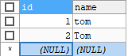

# MySQL

命令行窗口连接MySQL数据库
```
# 启动mysql数据库的常用方法[Dos命令]
> net start mysql   # 启动mysql服务
> net stop mysql    # 关闭服务

# 登录mysql服务，登录前保证服务启动
> mysql -h 主机名 -P 端口号 -u 用户名 -p密码
# 示例
> mysql -h 127.0.0.1 -P 3306 -u root -p9527
# 注意：-p和密码之间不空格，或者输入到-p直接回车，再进行密码验证
```

- 
- 使用 `netstat -abn` 查看服务及监听端口
- 
- 

## 数据库三层结构

1. 所谓安装Mysql数据库，就是在主机上安装一个数据库管理系统(database manage system, DBMS)，这个管理程序可以管理多个数据库
2. 一个数据库中可以创建多个表，以保存数据(信息)
3. 数据库管理系统(DBMS)、数据库和表的关系如下图所示：
   - 
   - Mysql数据库-普通表的本质仍然是**文件**
4. 数据在数据库中的存储方式
   - 
   - 表的一行称之为一条记录
   - 在java程序中，一行记录往往使用对象表示
5. SQL语句分类
   - DDL：数据定义语句 [create 表, 库...]
   - DML：数据操作语句 [增加 insert, 修改 update, 删除 delete]
   - DQL：数据查询语句 [select]
   - DCL：数据控制语句 [管理数据库：比如用户权限 grant revoke]

## 数据库

### 创建数据库

- 
  1. `CHARACTER SET`：指定数据库采样的字符集，如果不指定字符集，默认 `utf8`
  2. `COLLATE`：指定数据库字符集的校对规则
     1. `utf8_bin`：区分大小写
     2. `utf8_general_ci`：**不区分大小写，默认选项**

```mysql
# 创建数据库，默认不区分大小写
CREATE DATABASE IF NOT EXISTS hsp_db01;
# 删除数据库
DROP DATABASE hsp_db01;
# 创建数据库 hsp_db02 区分大小写
CREATE DATABASE hsp_db02 CHARACTER SET utf8 COLLATE utf8_bin;
# 查询语句，select 查询 * 表示所有字段
# from 从哪个表 where 从哪个字段 name = 'tom' 查询名字是tom
SELECT * FROM t1 WHERE NAME = 'tom';
```

- 
- 以上查询语句，对于 `hsp_db01` 和 `hsp_db02` 的执行结果分别如下：
  - 
  - 

### 查看、删除数据库

- 

```mysql
# 演示删除和查询数据库
# 查看当前数据库服务器中的所有数据库
SHOW DATABASES;
# 查看指定的数据库的定义信息
SHOW CREATE DATABASE hsp_db02;
# 在创建数据库，表时，为了规避关键字，可以使用反引号解决
CREATE DATABASE `create`;	# 创建名为 create 的数据库
# 删除前面创建创建的 hsp_db01 数据库
DROP DATABASE IF EXISTS hsp_db01;
```

### 备份和恢复数据库

- 

```mysql
# 备份和恢复数据库
# 备份数据库，需要在 DOS 下执行 mysqldump指令(即：Mysql\bin\mysqldump.exe)
# 备份的文件，其实就是对应的sql语句
# dos> mysqldump -u root -p -B db03 hsp_db02 > d:\\bak.sql

# 恢复数据库(注意：进入到Mysql命令行再执行)
# mysql> source d:\\bak.sql
# 恢复方法2：直接将 bak.sql 的内容放到查询编辑器中，全部执行即可


# 备份和恢复数据库的表
# dos> mysqldump -u -p 数据库 表1 表2 表n > d:\\bak1.sql
/* 恢复备份的数据库中的表
1. 进入到 mysql命令行
	dos> mysql -u root -p
2. 选择数据库
	mysql> use db03
3. 恢复数据库中备份的表
	mysql> source d:\\bak1.sql
*/
```

<hr/>

```mysql
# 显示所有数据库
SHOW DATABASES;
# 查询当前所在数据库
SELECT DATABASE();
# 创建数据库
CREATE DATABASE IF NOT EXISTS db01 CHARACTER SET utf8 COLLATE utf8_general_ci;
# 查看指定数据库创建语句
SHOW CREATE DATABASE db01;
# 删除指定数据库
DROP DATABASE IF EXISTS db01;
# 备份数据库，dos> 表示在dos命令行下运行该指令
# dos> mysqldump -u root -p -B db03 hsp_db02 > d:\\bak.sql
# 备份数据库中的表
# dos> mysqldump -u root -p db03 users > d:\\bak1.sql
# 恢复备份的数据库
/*
方式1：
# 进入mysql命令行
dos> mysql -u root -p
# 恢复备份
mysql> source d:\\bak.sql
方式2：
直接复制备份的数据库文件(其实就是sql语句)中的内容，在编辑器下全部运行即可
*/
```

## 表

### 创建表

- 

```mysql
# 创建表
CREATE TABLE `user` (
	id INT,
	`name` VARCHAR(255),
	`password` VARCHAR(32),
	`birthday` DATE)
	CHARACTER SET utf8 COLLATE utf8_bin ENGINE INNODB;
```

### Mysql常用数据类型(列类型)

- 
1. 数值类型
    - 整型
      - `tinyint[1个字节]`
      - `smallint[2个字节]`
      - `mediumint[3个字节]`
      - `int[4个字节]`：※
      - `bigint[8个字节]`
      - `BIT(M)`：位类型，M指定位数，默认值1，范围1~64
    - 小数类型
      - `float[单精度 4字节]`
      - `double[双精度 8字节]`：※
      - `decimal[M,D]`：根据M和D确定精度，M指定长度，D表示小数点的位数 ※
2. 文本类型(字符串类型)
   - `char`：0~255 ※
   - `varchar`：0~65535(2^16-1) ※
   - `text`：0~2^16-1 ※
   - `longtext`：0~2^32-1
3. 二进制数据类型
   - `blob`：0~2^16-1
   - `longblob`：0~2^32-1
4. 日期类型
   - `date`：日期：年/月/日
   - `time`：事件：时/分/秒
   - `datetime`：年月日时分秒 [YYYY-MM-DD-HH:mm:ss] ※
   - `timestamp`：时间戳
   - `year`：年

- 数值型(整数)的基本使用
1. 说明：在能满足需求的情况下，尽量选择占用空间小的类型
2. 

```mysql
# 演示整型使用
# 说明：表的字符集、校验规则、存储引擎使用默认
# 1. 如果没有指定 unsigned ，则默认数值类型都为有符号类型
# 2. 以 tinyint 为例，有符号范围 -128~127 无符号 0~255
CREATE TABLE t2 (
	id TINYINT);
CREATE TABLE t3 (
	id TINYINT UNSIGNED);	# 无符号类型

INSERT INTO t2 VALUES(-128);	# 添加语句
SELECT * FROM t2;

INSERT INTO t3 VALUES(255);
SELECT * FROM t3;
```

- 数值型(bit)
- `bit`字段显示时，按照位的方式显示
- 查询的时候仍然可以使用添加的数值进行查询，如添加255，在数据库中保存为 `b'11111111'`，
    在查询时，仍然可以按照 255 查询
- 如果一个值只有0和1，可以考虑使用 `bit(1)` 节约空间
- 位类型，`bit(M)` M指定位数，默认值1，范围1~64

```mysql
# 演示 bit类型 使用
/* 说明
1. bit(m) m范围1~64
2. 添加数据 范围按照给定的 位数 确定，比如m=8，表示一个字节 0~255
3. 显示按照的bit，即二进制格式
4. 查询时，仍然可以按照数来查询
*/
CREATE TABLE t4 (num BIT(8));	# 8位，范围0~255
INSERT INTO t4 VALUES(255);	# b'11111111'
SELECT * FROM t4;
SELECT * FROM t4 WHERE num = 255;
```

- 数值型(小数类型)
- 
- 

```mysql
# 演示decimal类型、float、double使用

# 创建表
CREATE TABLE t5 (
	num1 FLOAT,
	num2 DOUBLE,
	num3 DECIMAL(30, 20));	# 30位长，20个小数位
# 添加数据
INSERT INTO t5 VALUES (88.12345678912345, 88.12345678912345, 88.12345678912345);
SELECT * FROM t5;
```

- 字符串
- 
- 
- 

```mysql
# 演示字符串类型使用 char varchar
# 注释的快捷键：shift+ctrl+c 取消注释：shift+ctrl+r
/*
CHAR(size)
- 固定长度字符串，最大255   字符
VARCHAR(size)
- 可变长度字符串，最大65535 字节    [utf8编码最大21844个字符，1~3个字节用于记录大小]
-- 如果表的编码是 utf8 varchar(size) size = (65535 - 3) / 3 = 21844(字符)
-- 如果表的编码是 gbk varchar(size) size = (65535 - 3) / 2 = 32766(字符)
*/


CREATE TABLE t6 (
	`name` CHAR(255));
CREATE TABLE t7 (
	`name` VARCHAR(21844));
CREATE TABLE t8 (
	`name` VARCHAR(32766)) CHARSET gbk;
-- drop table t8;


# 字符串使用细节
/*
* 细节1
* 1. char(4) 这个4表示字符数(最大255)，不是字节数，不管是中文还是字母都是放4个，按字符计算
* 2. varchar(4) 这个4也是表示字符串，不管是字母还是中文都是以定义好的表的编码方式来存放数据
* 细节2
* 1. char(4)是定长(固定的大小)，即使插入 'aa' 也会占用分配的4个字符的空间
* 2. varchar(4)是变长(变化的大小)，即如果插入了 'aa'，实际占用空间大小并非4个字符，而是按照实际
*	占用空间分配。varchar本身还需要占用1~3个字节来记录存放内容长度。L(实际数据大小) + (1~3)字节
* 细节3
* 什么使用使用 char 什么时候使用varchar
* 1. 如果数据是定长，推荐使用char，比如md5的密码、邮编、手机号、身份证号码等
* 2. 如果一个字段的长度是不确定的，就是用varchar，比如留言、文章
* 3. 查询速度：char > varchar
*/
CREATE TABLE t6 (
	`name` CHAR(4));	# 4表示字符个数，不区分是字母还是汉字。可以少于，不可多于
INSERT INTO t6 VALUES('史塔克');
SELECT * FROM t6;

CREATE TABLE t7 (
	`name` VARCHAR(4));
INSERT INTO t7 VALUES('拜拉席恩');
SELECT * FROM t7;

# 如果varchar不够用，可以使用mediumtext或者longtext
# 也可以简单点，直接使用text
CREATE TABLE t8 (content TEXT, context2 MEDIUMTEXT, context3 LONGTEXT);
INSERT INTO t8 VALUES('史塔克', '犀利01', '拜拉席恩');
SELECT * FROM t8;
```

- 日期类型的基本使用
- 
- 

```mysql
# 演示事件相关的类型
# 创建一张表
CREATE TABLE t9 (
	birthday DATE,	-- 生日
	jobtime DATETIME, -- 记录年月日 时分秒
	login_time TIMESTAMP
		NOT NULL			-- 非空
		DEFAULT CURRENT_TIMESTAMP 	-- 默认当前时间
		ON UPDATE CURRENT_TIMESTAMP	-- 更新时更新为当前时间
	);
SELECT * FROM t9;
INSERT INTO t9(birthday, jobtime) 
	VALUES ('2023-12-23', '2023-12-23 19:25:30');
-- 如果更新 t9表的某条记录，login_time列会自动的以当前时间进行更新
```

### 修改表

- 

<hr/>

```mysql
# 创建一个员工表 emp
SELECT DATABASE();
# 删除数据库 db03
DROP DATABASE IF EXISTS db03;
# 查看当前有哪些数据库
SHOW DATABASES;
# 创建数据库 db01
CREATE DATABASE IF NOT EXISTS db01;
# 创建员工表 emp
CREATE TABLE emp (
	id INT,
	NAME VARCHAR(16),
	gender CHAR(1),
	birthday DATE,
	entry_date DATE,
	job VARCHAR(32),
	salary DOUBLE UNSIGNED,
	`resume` TEXT
	) CHARSET utf8 COLLATE utf8_general_ci ENGINE INNODB;
# 查看当前数据库有哪些表
SHOW TABLES;
# 查看表结构，可以查看表的所有列
DESC emp;


# 修改表
# 在 emp表 上增加一个 image列 varchar类型 要求在(resume列)后面
ALTER TABLE emp ADD image VARCHAR(16) NOT NULL DEFAULT '' 
			AFTER `resume`;	-- 在 resume字段 后面添加 image字段
# 修改 job列，使其长度为60
ALTER TABLE emp MODIFY job VARCHAR(60);
# 删除 gender列
ALTER TABLE emp DROP gender;
# 修改表名改为 employee
RENAME TABLE emp TO employee;
SHOW TABLES;	-- 查看发现已修改表名
DESC employee;
# 修改表的字符集为 utf8
ALTER TABLE employee CHARSET utf8;
# 将列名 name 修改为 user_name
ALTER TABLE employee CHANGE `name` use_name VARCHAR(32) NOT NULL DEFAULT '';
```

### CRUD

数据库C[create]R[read]U[update]D[delete]
1. Insert语句-添加数据
2. Update语句-更新数据
3. Delete语句-删除数据
4. Select语句-查找数据

- `insert`语句
- 

```mysql
-- 练习insert语句
SELECT DATABASE();
USE db01;
CREATE TABLE `goods` (
	id INT,
	good_name VARCHAR(10),
	price DOUBLE);

-- 添加数据
INSERT INTO goods (id, good_name, price)
	VALUES(10, 'HUAWEI', 2000);
INSERT INTO goods (id, good_name, price)
	VALUES(12, 'APPLE', 3600);
SELECT * FROM goods;


# insert语句的细节
-- 1. 插入的数据应与字段的数据类型相同。如把 'abc' 添加到 int 类型会报错
-- 	如把 '30' 添加到 int类型中，会尝试类型转换，可以进行
INSERT INTO goods (id, good_name, price)
	VALUES ('30', 'MI', 1800);
-- 2. 数据的长度应在列的规定范围内，例如：不能将一个长度为80的字符串加入到长度为40的列中
-- 3. 在values中列出的数据位置必须与被加入的列的排列位置相对应
-- 4. 字符和日期型数据应包含在单引号中
/*insert into goods (id, good_name, price)
	values (40, VIVO, 2200);
*/
-- 5. 列可以插入空值(前提是该字段允许为空，默认可以为空)
INSERT INTO goods (id, good_name, price)
	VALUES (40, 'vivo', NULL);
-- 6. insert into tab_name (列名...) values (), (), () 形式添加多条记录
INSERT INTO goods (id, good_name, price)
	VALUES (50, 'oppo', 1900), (60, 'SAM', 3200);
-- 7. 如果是给表中的所有字段添加数据，可以不写前面字段名称
INSERT INTO goods VALUES (70, 'X', 3000);
-- 8. 默认值的使用，当不给某个字段值时，如果有默认值就会添加默认值，否则报错
--	如果某列没有指定 not null 那么当添加数据时，没有给定值，则会默认为null
-- 	如果希望指定某个列的默认值，可以在创建表时指定 default
INSERT INTO goods (id, good_name)
	VALUES (80, '格力手机');
```

- `update`语句
- 
- 

```mysql
# 演示update
ALTER TABLE employee ADD salary DOUBLE NOT NULL DEFAULT 1000 AFTER job;
DESC employee;
SELECT * FROM employee;
INSERT INTO employee VALUES 
	(110, '小妖怪', '1997-10-06', '巡视员', 800, '2021-03-12 10:00:00', '巡逻', '大王叫我来巡山');
-- 1. 将所有员工的薪水修改为 5000元
UPDATE employee SET salary = 5000;	# 如果没有带 where 条件，会修改所有的记录，因此需要谨慎
-- 2. 将姓名为小妖怪的员工薪水修改为3000
UPDATE employee SET salary = 3000 WHERE user_name = '小妖怪';
-- 3. 将李自成的薪水在原有基础上增加1000元
UPDATE employee SET salary = salary + 1000 WHERE user_name = '李自成';
-- 4. update可以修改多个列，中间使用 , 分隔
UPDATE employee SET salary = salary + 1000, job = '起义' WHERE user_name = '李自成';

# 使用细节
/*
1. update语法可以用新值更新原有表中的各列
2. set子句指示要修改哪些列和要给予哪些值
3. where子句指定应更新哪些行。如果没有where，则更新所有行(记录)，因此需要谨慎
4. 如果需要修改多个字段，可以通过 set filed1 = value1, field2 = value2...
*/
```

- `delete`语句
- 

```mysql
# delete 语句演示
SELECT * FROM employee;
-- 删除表中名称为小妖怪的记录
DELETE FROM employee 
	WHERE user_name = '小妖怪';

# delete使用细节
-- 1. 如果不适用where子句，将删除表中所有数据
DELETE FROM employee;
-- 2. delete语句不能删除某一列的值(可使用update设置为null或者'')
UPDATE employee SET job = '' WHERE user_name = '李自成';
-- 3. 使用delete语句仅删除记录，不删除表本身。如果要删除表，使用 drop table 表名;
DROP TABLE employee;
```

- `select`语句
- 
- 
- 
- 

```mysql
# select 语句[重点，难点]
CREATE TABLE student (
	id INT NOT NULL DEFAULT 1,
	`name` VARCHAR(20) NOT NULL DEFAULT '',
	chinese FLOAT NOT NULL DEFAULT 0.0,
	english FLOAT NOT NULL DEFAULT 0.0,
	math FLOAT NOT NULL DEFAULT 0.0
	);
INSERT INTO student (id, `name`, chinese, english, math) VALUES 
	(1, '王熙凤', 78, 65, 89),
	(2, '妙玉', 85, 70, 76),
	(3, '薛宝钗', 100, 80, 97),
	(4, '贾宝玉', 90, 70, 80),
	(5, '林黛玉', 100, 85, 96),
	(6, '史湘云', 93, 70, 82),
	(7, '贾探春', 90, 85, 86);


-- 1. 查询表中所有学生信息
SELECT * FROM student;
-- 2. 查询表中所有学生的姓名和对应的语文成绩
SELECT `name`, chinese FROM student;
-- 3. 过滤表中重复数据
SELECT DISTINCT english FROM student;	# 去掉 english 成绩重复的数据
-- 4. 要查询的记录，每个字段都相同，才会去重
SELECT DISTINCT `name`, chinese FROM student;	# 虽然语文成绩相同，但是姓名都不同，不会被去重

# 使用表达式对查询的列进行运算
-- 1. 统计每个学生的总分
SELECT `name`, (chinese + english + math) FROM student;
-- 2. 在所有学生总分上加10分，设置别名表示 name 和 总分成绩
SELECT `name` AS '姓名', (chinese + english + math + 10) AS '总分' FROM student;


# 使用where子句，进行过滤查询
-- 1. 查询姓名为林黛玉的学生成绩
SELECT * FROM student WHERE `name` = '林黛玉';
-- 2. 查询语文成绩大于90分的同学
SELECT * FROM student WHERE chinese > 90;
-- 3. 查询总分大于260分的所有同学
SELECT * FROM student WHERE (chinese+english+math) > 260;
-- 4. 查询数学大于60并且语文大于85的学生成绩
SELECT * FROM student WHERE math > 60 AND chinese > 85;
-- 5. 查询数学成绩大于语文成绩的同学
SELECT * FROM student WHERE math > chinese;
-- 6. 查询总分大于240分 并且 数学成绩小于语文成绩的姓贾的学生
--	'林%' 表示 名字中以林开头就可以
SELECT *, (chinese+math+english) AS total_score FROM student 
	WHERE (math+chinese+english) > 240 AND math < chinese AND `name` LIKE '林%';

# 查询语文成绩在80~90之间的学生	between and 是闭区间[]
SELECT * FROM student WHERE chinese BETWEEN 80 AND 90;
# 查询数学分数为 89,90,91 的同学
SELECT * FROM student WHERE math IN (89, 90, 91);
# 查询所有姓贾的学生成绩
SELECT * FROM student WHERE `name` LIKE '贾%';
# 查询数学>80 或 语文>90的学生
SELECT * FROM student WHERE math > 80 OR chinese > 90;


## order by 子句排序查询
-- 1. 对语文成绩排序后输出[升序]
SELECT * FROM student ORDER BY chinese ASC;	-- 默认即升序
-- 2. 对总分按从高到低的顺序输出
SELECT `name`, (chinese + math + english) AS total_score FROM student 
	ORDER BY total_score DESC;	-- 使用别名排序
-- 3. 对姓贾的学生成绩排序输出(升序)
SELECT `name`, (chinese+math+english) AS total_score FROM student 
	WHERE `name` LIKE '贾%' ORDER BY total_score ASC;	-- 起别名后，排序也可以按照 (chinese+...)来
```

### 统计相关函数

- `count`返回行的总数
  - 
- `sum`返回满足`where`条件的行的和，一般使用在数值列
  - 
- `avg`函数返回满足`where`条件的一列的平均值
  - 
- `max/min`返回满足`where`条件的一列的最大/最小值
  - 

```mysql
# 演示mysql的统计函数的使用
-- 1. 统计一个班级中有多少学生
SELECT COUNT(*) FROM student;
-- 2. 统计语文大于90的学生人数
SELECT COUNT(*) FROM student WHERE chinese > 90;
-- 3. 统计总分大于250的人数
SELECT COUNT(*) FROM student WHERE (chinese+math+english) > 250;

/* count(*) 和 count(列名) 的区别
-- count(*)：返回满足条件的记录的行数
-- ocunt(列名)：统计满足条件的某列有多少个，但是会排序值为 NULL 的
*/
CREATE TABLE t1 (
	`name` VARCHAR(10));
INSERT INTO t1 VALUES ('tom'), ('jack'), (NULL);
SELECT * FROM t1;
SELECT COUNT(*), COUNT(`name`) FROM t1;	-- 3 2

# 演示sum函数的使用
-- 统计班级数学总成绩
SELECT SUM(math) FROM student;
-- 统计班级各科的总成绩
SELECT SUM(math), SUM(english), SUM(chinese) FROM student;
-- 统计班级总成绩的和
SELECT SUM(chinese+math+english) FROM student;
-- 统计一个班级语文的平均成绩
SELECT SUM(chinese) / COUNT(*) FROM student;

# 演示 avg 的使用
-- 求班级语文平均分
SELECT AVG(chinese) FROM student;
-- 求班级总成绩平均分
SELECT AVG(chinese+math+english), SUM(chinese+math+english)/COUNT(*) FROM student;

# 演示 max/min 使用
-- 求班级总分的最高分和最低分
SELECT MAX(math+chinese+english), MIN(chinese+math+english) FROM student;
-- 求出班级语文最高分和最低分
SELECT MAX(chinese), MIN(chinese) FROM student;
```

- `group by`对列进行分组
  - 
  - group by用于对查询的结果分组统计
- `having`对分组后的结果进行过滤
  - 
  - having子句用于限制分组显示结果
 
```mysql
# 演示 group by + having 使用
CREATE TABLE dept( /*部门表*/
	deptno MEDIUMINT   UNSIGNED  NOT NULL  DEFAULT 0,
	dname VARCHAR(20)  NOT NULL  DEFAULT '',
	loc VARCHAR(13) NOT NULL DEFAULT ''
	);
INSERT INTO dept VALUES 
	(10, 'accounting', 'NEW YORK'), 
	(20, 'RESEARCH', 'DALLAS'),
	(30, 'SALES', 'CHICAGO'),
	(40, 'OPERATIONS', 'BOSTON');
SELECT * FROM dept;

#创建表EMP雇员
CREATE TABLE emp
(empno  MEDIUMINT UNSIGNED  NOT NULL  DEFAULT 0, /*编号*/
ename VARCHAR(20) NOT NULL DEFAULT '', /*名字*/
job VARCHAR(9) NOT NULL DEFAULT '',/*工作*/
mgr MEDIUMINT UNSIGNED,/*上级编号*/
hiredate DATE NOT NULL,/*入职时间*/
sal DECIMAL(7,2)  NOT NULL,/*薪水*/
comm DECIMAL(7,2),/*红利*/
deptno MEDIUMINT UNSIGNED NOT NULL DEFAULT 0 /*部门编号*/
) ;
-- 添加测试数据
INSERT INTO emp VALUES(7369, 'SMITH', 'CLERK', 7902, '1990-12-17', 800.00, NULL, 20), 
(7499, 'ALLEN', 'SALESMAN', 7698, '1991-2-20', 1600.00, 300.00, 30),  
(7521, 'WARD', 'SALESMAN', 7698, '1991-2-22', 1250.00, 500.00, 30),  
(7566, 'JONES', 'MANAGER', 7839, '1991-4-2', 2975.00,NULL,20),  
(7654, 'MARTIN', 'SALESMAN', 7698, '1991-9-28',1250.00,1400.00,30),  
(7698, 'BLAKE','MANAGER', 7839,'1991-5-1', 2850.00,NULL,30),  
(7782, 'CLARK','MANAGER', 7839, '1991-6-9',2450.00,NULL,10),  
(7788, 'SCOTT','ANALYST',7566, '1997-4-19',3000.00,NULL,20),  
(7839, 'KING','PRESIDENT',NULL,'1991-11-17',5000.00,NULL,10),  
(7844, 'TURNER', 'SALESMAN',7698, '1991-9-8', 1500.00, NULL,30),  
(7900, 'JAMES','CLERK',7698, '1991-12-3',950.00,NULL,30),  
(7902, 'FORD', 'ANALYST',7566,'1991-12-3',3000.00, NULL,20),  
(7934,'MILLER','CLERK',7782,'1992-1-23', 1300.00, NULL,10);
SELECT * FROM emp;

#工资级别表
CREATE TABLE salgrade
(
grade MEDIUMINT UNSIGNED NOT NULL DEFAULT 0,	/*工资级别*/
losal DECIMAL(17,2)  NOT NULL,	/*该级别的最低工资*/
hisal DECIMAL(17,2)  NOT NULL	/*该级别的最高工资*/
);

#测试数据
INSERT INTO salgrade VALUES (1,700,1200);
INSERT INTO salgrade VALUES (2,1201,1400);
INSERT INTO salgrade VALUES (3,1401,2000);
INSERT INTO salgrade VALUES (4,2001,3000);
INSERT INTO salgrade VALUES (5,3001,9999);
SELECT * FROM salgrade;


-- 1. 如何显示每个部分的平均工资和最高工资
-- 	按照部分来分组查询
SELECT AVG(sal), MAX(sal), deptno FROM emp GROUP BY deptno;
-- 2. 显示每个部门的每种岗位的平均工资和最低工资
SELECT AVG(sal), MIN(sal), deptno, job FROM emp GROUP BY deptno, job;
-- 3. 显示平均工资低于2000的部分号和平均工资
/*
	化繁为简，各个击破
	1. 显示各个部门的平均工资和部分号
	2. 在1的结果基础商，进行过滤，保留 avg(sal) < 2000，对分组后结果过滤 使用having
	3. 使用别名进行过滤
*/
SELECT deptno, AVG(sal) AS avg_sal FROM emp GROUP BY deptno HAVING avg_sal < 2000;
```

### 字符串相关函数

- 

```mysql
# 演示 字符串相关函数
-- charset(str) 返回字符串字符集
SELECT CHARSET(ename) FROM emp;
-- concat() 连接字符串
SELECT CONCAT(ename, ' job is ', job) FROM emp;
-- instr (string, substring) 返回 substring 在 string 中出现的位置，没有则返回0
# DUAL：亚元表，系统表用于测试
SELECT INSTR ('hanshunping', 'ping') FROM DUAL;	# 8

-- ucase 转成大写 lcase 转成小写
SELECT UCASE(ename), LCASE(ename) FROM emp;

-- left(string, length) 从string中的左边起取出length个字符 right从右边取
SELECT LEFT(ename, 2) FROM emp;

-- length(str) string长度，按照字节
SELECT LENGTH(ename) FROM emp;	-- length('李自成') 3*3=9

-- replace(str, search_str, replace_str) 在str中用search_str替换search_str
-- 			查找job，如果是 MANAGER 就替换为 经理
SELECT ename, REPLACE(job, 'MANAGER', '经理') FROM emp;

-- strcmp(str1, str2) 逐字符比较两字符串大小
SELECT STRCMP('asp', 'hsp') FROM DUAL;	-- -1

-- substring(str, position, [, length]) 从str的position位置开始[从1开始计算]，取length个字符
SELECT SUBSTRING(ename, 1, 2) FROM emp;

-- ltrim rtrim trim 取出前端或后端或左右两端的空格
SELECT LTRIM(' 李自成') FROM DUAL;
SELECT RTRIM('李自成  ') FROM DUAL;
SELECT TRIM('  李自成 ') FROM DUAL;

# 练习：以首字母小写的方式显示所有员工emp的姓名：两种方式
SELECT CONCAT(LCASE(SUBSTRING(ename, 1, 1)), SUBSTRING(ename, 2)) AS `name` FROM emp;
SELECT CONCAT(LCASE(LEFT(ename, 1)), SUBSTRING(ename, 2)) AS name2 FROM emp;
```

### 数学相关函数

- 

```mysql
# 演示数学相关函数
-- abs 绝对值
SELECT ABS(-12) FROM DUAL;
-- bin(decimal_number) 十进制转二进制

SELECT BIN(10) FROM DUAL;	-- 1010
-- hex(DecimalNumber) 转十六进制
-- conv(num1, from_base, to_base) 进制转换，从 from_base 到 to_base
--	将10进制8转为2进制 -> 1000
SELECT CONV(8, 10, 2) FROM DUAL;
-- ceiling(num) 向上取整，得到比num大的最小整数

SELECT CEILING(1.2), CEILING(-1.2) FROM DUAL;	-- -2 -1
-- floor(num) 向下取整，得到比num小的最大整数
SELECT FLOOR(1.1) FROM DUAL; -- 1

-- format(num, decimal_places) 保留小数位数(四舍五入)
SELECT FORMAT(3.1415926, 2) FROM DUAL; -- 3.14
SELECT FORMAT(3.1415926, 3) FROM DUAL; -- 3.142

-- least(num1, num2 [,...]) 求最小值
SELECT LEAST(0, -1, 10, 3) FROM DUAL;

-- mode(numerator, denominator) 求余
SELECT MOD(10, 3) FROM DUAL;	-- 1

-- rand([seed]) 返回随机数，起范围为 [0, 1]
--	如果设计随机种子，相同的随机种子每次产生值固定
SELECT RAND(2) FROM DUAL;
```

### 时间日期相关函数

- 

|  |  |  |
|---------------------------|---------------------------|---------------------------|

```mysql
# 日期时间相关函数

SELECT CURRENT_DATE() FROM DUAL; -- 当前日期：2023-12-25
SELECT CURRENT_TIME() FROM DUAL; -- 当前时间：16:32:02
SELECT CURRENT_TIMESTAMP() FROM DUAL; -- 当前时间戳：2023-12-25 16:32:14

-- 创建测试表：信息表
CREATE TABLE mes (
	id INT,
	content VARCHAR(30),
	send_time DATETIME);
-- 添加一条记录
INSERT INTO mes VALUES (1, '北京新闻', CURRENT_TIMESTAMP());
INSERT INTO mes VALUES (2, '上海新闻', NOW());
INSERT INTO mes VALUES (3, '广州新闻', NOW());
SELECT * FROM mes;

-- 1. 显示所有新闻信息，发布日期只显示日期，不用显示时间
SELECT id, content, DATE(send_time) FROM mes;
-- 2. 查询在10分钟内发布的新闻
--				发送日期加10分钟超过现在时间，就表示发送时间是在10分钟内
SELECT * FROM mes WHERE DATE_ADD(send_time, INTERVAL 10 MINUTE) >= NOW();
SELECT * FROM mes WHERE send_time >= DATE_SUB(NOW(), INTERVAL 10 MINUTE);
-- 3. 请在mysql的sql语句中求出 2011-11-11 和 1990-1-1 相差天数
SELECT DATEDIFF('2011-11-11', '1990-1-1') FROM DUAL; -- 7984
-- 4. 用sql语句求出你活了多少天
SELECT DATEDIFF(CURRENT_DATE(), '2001-3-12') FROM DUAL; -- 8323
-- 如果你能活90岁，i去除你还能活多少天
-- 思路：以出生日期加90年得到死亡日期；在计算死亡日期到今天的时间差
SELECT DATEDIFF(DATE_ADD('2001-3-12 10:15:6', INTERVAL 90 YEAR), NOW()) FROM DUAL; -- 24549
-- timediff(date1, date2) 两个时间差(多少消失多少分钟多少秒)
SELECT TIMEDIFF('16:45:00', CURRENT_TIME()) FROM DUAL;

# 年月日
SELECT YEAR(NOW()) FROM DUAL;
SELECT MONTH(NOW()) FROM DUAL;
SELECT DAY(NOW()) FROM DUAL;
-- unix_timestamp 返回1970-1-1 到现在的秒数
SELECT UNIX_TIMESTAMP() FROM DUAL;
-- from_unixtime() 把一个unix_timestamp秒数[时间戳]，转成指定格式的日期
-- 	在开发中，可以存放一个整数，然后表示时间，通过 from_unixtime 转换
--	在实际开发中，也经常使用 int 保存一个 unix_timestanp 时间戳
SELECT FROM_UNIXTIME(UNIX_TIMESTAMP(), '%Y-%m-%d %H:%i:%s') FROM DUAL;
```

### 加密函数和系统函数

- 

```mysql
# 演示加密函数和系统函数
-- user() 查询当前是哪个用户在使用数据库
-- 可以查看登录到mysql的有些用户，以及登录的IP
SELECT USER() FROM DUAL;	-- 用户名@IP地址
-- database() 查询当前使用的数据库
SELECT DATABASE();

-- md5(str) 为字符串算出一个mds 32的字符串，常用加密
--	root密码是 hsp -> md5加密 -> 在数据库中存放的是加密后的密码
SELECT MD5('hsp') FROM DUAL;
SELECT LENGTH(MD5('hsp')) FROM DUAL; -- 32

-- 演示用户表，存放密码时，是md5
CREATE TABLE users (
	id INT,
	`name` VARCHAR(32) NOT NULL DEFAULT '',
	pwd CHAR(32) NOT NULL DEFAULT ''
	);
INSERT INTO users VALUES (100, '李自成', MD5('lzc'));
SELECT * FROM users;
SELECT * FROM users WHERE `name` = '李自成' AND pwd = MD5('lzc');
-- password(str) 加密函数，Mysql数据库的用户密码就是 PASSWORD函数加密
SELECT PASSWORD('hsp');
SELECT LENGTH(PASSWORD('hsp'));	-- 41
-- 查看数据库mysql中表user下用户信息
SELECT * FROM mysql.user WHERE `user` = 'root';
```

### 流程控制函数

- 

```mysql
# 演示流程控制语句
-- if(expr1, expr2, expr3) 如果表达式1为True，则返回expr2，否则返回expr3
SELECT IF(TRUE, '北京', '上海') FROM DUAL;
-- inull(expr1, expr2) 如果1不为空NULL，则返回expr1，否则返回expr2
SELECT IFNULL(NULL, 'hsp'); -- hsp
-- select case where expr1 then expr2 when expr3 then expr4 end;
SELECT CASE WHEN TRUE THEN 'jack' WHEN FALSE THEN 'tom' ELSE 'smith' END;

-- 1. 查询emp表，如果comm为null，则显示0.0
-- 		强调：判断是否为null，要用 is / is not
SELECT ename, IF(comm IS NULL, 0.0, comm) FROM emp;
-- 2. 如果emp表的job是 clerk 则显示职员，如果是 manager 则显示经理，如果是 SALESMAN 则显示销售人员
-- select charset(job) from emp; -- utf8
SELECT ename, 
	(SELECT CASE WHEN job='clerk' THEN '职员' 
		WHEN job='manager' THEN '经理' 
		WHEN job='salesman' THEN '销售人员'
		ELSE job END) AS 'career', job 
	FROM emp;
```

### mysql表查询-加强

```mysql
-- 查询加强
SELECT * FROM emp;
SELECT * FROM dept;
SELECT * FROM salgrade;

-- 1. 查询1992.1.1后入职的员工
-- 	在mysql中，日期类型数据可以直接比较
SELECT * FROM emp WHERE hiredate > '1992-1-1';
-- 2. 使用 like 操作符(模糊)查询
--	%：表示0到多个字符
--	_：表示单个任意字符
# 查询首字母为S的员工姓名和工资
SELECT ename, sal FROM emp WHERE ename LIKE 'S%';
# 查询第三个字符为大写o的所有员工的姓名和工资
SELECT ename, sal FROM emp WHERE ename LIKE '__O%';

# 查询没有上级的雇员情况
SELECT * FROM emp WHERE mgr IS NULL;
# 查询表结构
DESC emp;

# order by
-- 按照工资从低到高的顺序[升序] 显示雇员信息
SELECT * FROM emp ORDER BY sal ASC;
-- 按照部分号升序而雇员工资降序排序，显示员工信息
SELECT * FROM emp ORDER BY deptno ASC, sal DESC;
```

- 
- 推导公式：`select * from table_name order by empno limit (页数-1)*每页行数, 每页行数`

```mysql
# 分页查询
-- 按照雇员id号升序取出，每页显示3条记录，请分别显示 第1页 第2页 第3页
-- 基本语法：select ... from table_name order by field1 asc limit start, rows;
--	表示从 start+1 行开始取，取出 rows 行，start 从0开始计算
-- 推导公式：limit (页数-1)*行数, 行数
SELECT * FROM emp;
-- 第1页
SELECT * FROM emp 
	ORDER BY empno
	LIMIT 0, 3;
-- 第2页
SELECT * FROM emp 
	ORDER BY empno
	LIMIT 3, 3;
-- 第3页
SELECT * FROM emp 
	ORDER BY empno
	LIMIT 6, 3;
-- 第5页
SELECT * FROM emp ORDER BY empno LIMIT 12, 3;

-- 练习：按照雇员empno号降序取出，每页显示5条记录。请分别显示 第3页 第5页 对应sql语句
SELECT * FROM emp ORDER BY empno DESC LIMIT 10, 5;
SELECT * FROM emp ORDER BY empno DESC LIMIT 20, 5;
```

- 
- 
- `select deptno, avg(sal) as avg_sal from emp group by deptno having avg_sal > 1000 order by avg_sal desc limit 0, 2;`
    1. `group by`
  2. `having`
  3. `order by`
  4. `limit`

```mysql
# 增强 group by 的使用
SELECT * FROM emp;
-- 1. 显示每种岗位的雇员总数、平均工资
SELECT COUNT(*) FROM emp;
SELECT job, COUNT(*), FORMAT(AVG(sal), 2) FROM emp 
	GROUP BY job;
-- 2. 显示雇员总数，以及获得补助的雇员数
-- 提示：获得补助即 comm is not null;
-- count(comm)：只统计comm列非空的
SELECT COUNT(*), COUNT(comm) FROM emp;
-- 统计没有获得补助的
-- if(comm is null, 1, null); 如果comm为null，返回1(非空值即可，会统计)，否则返回 null
SELECT COUNT(*), COUNT(IF(comm IS NULL, 1, NULL)) FROM emp;
-- 3. 显示管理者的总人数
SELECT COUNT(DISTINCT mgr) FROM emp; -- 5
-- 4. 显示雇员工资的最大差额
SELECT MAX(sal) - MIN(sal) FROM emp; -- 4200

# 统计各个部分(group by)的平均工资，并且是(having)大于1000的，
-- 并且按照平均工资从高到低排序(order by)，取出前两行记录(limit)
SELECT deptno, AVG(sal) AS avg_sal 
	FROM emp 
	GROUP BY deptno 
	HAVING avg_sal > 1000 
	ORDER BY avg_sal DESC 
	LIMIT 0, 2;

-- 错误，查询列没有包含在 group by 子句中，并且这些列没有使用聚合函数(如 sum, avg等)
SELECT deptno, job FROM emp GROUP BY deptno;
# 1. 将非聚合列添加到 group by 子句中
SELECT deptno, job FROM emp GROUP BY deptno, job;
# 2. 对非分组列使用聚合函数
SELECT deptno, COUNT(job) FROM emp GROUP BY deptno;
```

### 多表查询

- **多表查询**是指基于两个和两个以上的表查询。在实际应用中，查询单个表可能不能满足你的需求。
- `select * from emp, dept;`
  - 在默认情况下，当两个表查询时，规则：
    1. 从第1张表中取出一行和第2张表的每一行进行组合，返回结果[含有两张表的所有列]
    2. 共返回：第1张表行数*第2张表行数，即13 * 4
    3. 这样多表查询默认处理方式，称为**笛卡尔积**
    4. 解决多表的关键就是写出正确的过滤条件 `where`，需要进行分析
  - 
- `select * from emp;`
  - 
- `select * from dept;`
  - 

```mysql
# 多表查询
-- 查询雇员名、雇员工资及所在部门的名字
/*
1. 雇员名、雇员工资 来自 emp 表
2. 部门名字 来自 dept 表
3. 需求对 emp 和 depy 查询
4. 当需要指定显示莫格表的某列时，需要使用：表.列名
5. 提示：多表查询的条件不能少于 表的个数-1，否则会出现笛卡尔积
*/
SELECT * FROM emp, dept;
SELECT * FROM emp;
SELECT * FROM dept;
SELECT * FROM salgrade;

SELECT ename, sal, dname FROM emp, dept 
	WHERE emp.deptno = dept.deptno;
-- 查询部门号为10的部门名、员工名和工资
SELECT dname, ename, sal FROM emp, dept
	WHERE emp.deptno = dept.deptno AND emp.deptno = 10;
-- 显示各个员工的姓名、工资及其工资的级别
SELECT ename, sal, grade
	FROM emp, salgrade -- 也可以不加表名，因为两表无相同列名
	WHERE emp.sal BETWEEN salgrade.losal AND salgrade.hisal;
-- 显示雇员名、雇员工资及所在部门的名字，并按部门排序[降序排]
SELECT ename, sal, dname
	FROM emp, dept
	WHERE emp.deptno = dept.deptno
	ORDER BY emp.deptno DESC;
```

- **自连接**：在同一张表的连接查询[将同一张表看作两张表]

```mysql
# 多表查询：自连接
-- 显示公司公司员工和他的上级的名字
/*
员工名字和其上级名字都在 emp
员工和上级是通过 dept 的 mgr列关联的
1. 把同一张表当作两张表使用
2. 需要给表取别名： from 表名 表别名
3. 如果列名不明确，可以指定列的别名： 列名 as 列别名
*/
SELECT worker.ename AS '职员名', boss.ename AS '上级名' 
	FROM emp AS worker, emp boss	-- 自连接需要设置别名，否则会报错
	WHERE worker.mgr = boss.empno;
```

### 表子查询

- **子查询**是指嵌入在其它sql语句中的select语句，也叫嵌套查询
- 单行子查询：只返回一行数据的子查询语句
- 多行子查询：返回多行数据的子查询，使用关键字 `IN`
- 还可以将子查询的结果当作一个新表，可以解决很多问题

```mysql
# 子查询演示
-- 显示与SMITH同一个部分的所有员工
/*
1. 先查询到SMITH的部门号
2. 把上面的select语句当作一个子查询来使用
*/
SELECT deptno 
	FROM emp
	WHERE ename = 'SMITH';
-- 单行子查询
SELECT * FROM emp
	WHERE deptno = (
	SELECT deptno 
		FROM emp
		WHERE ename = 'SMITH'	
	);
-- 查询和部门10的工作相同的雇员的名字、岗位、工资、部门号，但是不含10号部门自己的员工
/*
1. 查询10号部门有哪些工作
2. 把上面查询的结果当作子查询使用
*/
SELECT DISTINCT job FROM emp WHERE deptno = 10; # 10号部门的工作
-- 多行子查询：IN
SELECT ename, job, sal, deptno 
	FROM emp
	WHERE job IN (SELECT DISTINCT job FROM emp WHERE deptno = 10)
		AND deptno <> 10;

-- 查询每个部门高于该部门平均工资的员工
# 将子查询的结果作为一张新表，可以解决很多很多问题
SELECT deptno, AVG(sal) FROM emp GROUP BY deptno; -- 查询每个部门的员工平均工资
SELECT ename, job, sal, emp.deptno, avg_sal
	FROM emp, (SELECT deptno, AVG(sal) AS avg_sal FROM emp GROUP BY deptno) temp -- 新表别名 temp
	WHERE emp.deptno = temp.deptno AND emp.sal > temp.avg_sal;
```

- `any` 和 `all` 操作符

```mysql
# 在多行子拆线呢中使用all和any操作符
-- 显示工资比部门30的所有员工的工资高的员工的姓名、工资和部门号
SELECT MAX(sal) FROM emp WHERE deptno = 30;
-- 使用 max
SELECT ename, sal, deptno FROM emp WHERE sal > (SELECT MAX(sal) FROM emp WHERE deptno = 30);
-- 使用 all操作符
SELECT ename, sal, deptno FROM emp WHERE sal > ALL(SELECT sal FROM emp WHERE deptno = 30);
-- 显示比30号部门其中的一个员工的工资高的员工的姓名、工资和部门号
-- 可以使用 any 也可以使用 min
SELECT ename, sal, deptno FROM emp WHERE sal > ANY(SELECT sal FROM emp WHERE deptno = 30);
```

- 多列子查询是指查询返回多个列数据的子查询语句

```mysql
# 多列子查询
-- 查询与allen的部门和岗位完全相同的所有雇员(并且不包含smithj本人)
-- (field1, field2...) = (select field1, field2 from ...)
/*
1. 得到smith的部门和岗位
2. 把上面的查询当作子查询来使用，并且使用多列子查询的语法进行匹配
*/
SELECT deptno, job FROM emp
	WHERE ename = 'allen';
SELECT * FROM emp
	WHERE (deptno, job) = (
		SELECT deptno, job 
		FROM emp
		WHERE ename = 'allen'
	) AND ename <> 'allen';
-- select * from stu
-- 	where (math, english, chinese) = (
-- 		select math, english, chinese from stu where `name` = '宋江'
-- 	) and `name` <> '宋江';
```

- [多表子查询练习](sql/subquery_exercise.sql)

```mysql
# 子查询练习
-- 1. 查询每个部门工资高于本部门平均工资的人的资料
SELECT AVG(sal) FROM emp 
	GROUP BY deptno;
SELECT  emp.deptno, ename, sal, temp.avg_sal
	FROM emp, (SELECT deptno, AVG(sal) AS avg_sal FROM emp GROUP BY deptno) AS temp
	WHERE emp.deptno = temp.deptno AND emp.sal > avg_sal;
-- 2. 查找每个部门工资最高的人的详细资料
SELECT ename, job, sal, emp.deptno, max_sal
	FROM emp, (SELECT deptno, MAX(sal) AS max_sal FROM emp GROUP BY deptno) AS tmp
	WHERE emp.deptno = tmp.deptno AND emp.sal = tmp.max_sal;
-- 3. 查询每个部门的信息(包括：部门名、编号、地址)和人员数量
/*
1. 部门名、编号、地址 来自 dept表
2. 各个部门的人员数量 -> 构架一个临时表
*/
SELECT deptno, COUNT(*) FROM emp GROUP BY deptno; -- 按deptnp分组，查询到每个部门的人数
SELECT  dept.deptno, dname, loc, emp_num AS '人数'
	FROM dept, (SELECT deptno, COUNT(*) AS emp_num FROM emp GROUP BY deptno) AS tmp
	WHERE dept.deptno = tmp.deptno;
-- 还有一种写法：dept.* 表示将该表所有列都显示出来
-- 在多表查询时，当多个表的列不重复时，才可以直接写列名
SELECT  dept.*, emp_num AS '人数'
	FROM dept, (SELECT deptno, COUNT(*) AS emp_num FROM emp GROUP BY deptno) AS tmp
	WHERE dept.deptno = tmp.deptno;
```

### 表复制

- 自我复制数据(蠕虫复制)，有时为了对某个sql语句进行效率测试，需要海量数据时，可以使用此法为表创建海量数据
- `create table my_tab like emp;`创建与表emp结构相同的表
- `insert into my_table (select * from my_table)`表自我复制

```mysql
# 表复制
CREATE TABLE my_tab01 (
	id INT,
	`name` VARCHAR(32),
	sal DOUBLE,
	job VARCHAR(32),
	deptno INT
	);
DESC my_tab01;
SELECT * FROM my_tab01;

-- 演示如何自我复制
-- 1. 先把 emp表 的记录复制到 my_tab01
INSERT INTO my_tab01(id, `name`, sal, job, deptno)	-- 不需要写 values
	(SELECT empno, ename, sal, job, deptno FROM emp);
-- 2. 自我复制
INSERT INTO my_tab01
	SELECT * FROM my_tab01;
SELECT COUNT(*) FROM my_tab01;
# 如何删除掉一张表的重复记录
-- 1. 先创建一张表 my_tab02
-- 2. 让 my_tab02 有重复的记录
CREATE TABLE my_tab02 LIKE emp;	-- 表示把 emp表的结构(列)，复制到my_tab02
DESC my_tab02;
INSERT INTO my_tab02
	SELECT * FROM emp;
SELECT * FROM my_tab02;
-- 3. 考虑去重
/* 思路
1. 先创建一张临时表 my_tmp，该表的结构和 my_tab02 一样
2. 把 my_tmp 记录，通过distinct关键字处理后，把记录复制到my_tmp;
3. 删除掉 my_tab02 记录
4. 把 my_tmp 表的记录复制到 my_tab02
*/
CREATE TABLE my_tmp LIKE my_tab02;
INSERT INTO my_tmp 
	(SELECT DISTINCT * FROM my_tab02);
-- 清除掉 my_tab02 记录
-- delete from my_tab02;
DROP TABLE my_tab02;	-- 直接删除表
RENAME TABLE my_tmp TO my_tab02; -- 再改名
SHOW TABLES;
SELECT * FROM my_tab02;
```

### 合并查询

- 有时在实际应用中，为了合并多个 `select` 语句的结果，可以使用集合操作符号 `union`, `union all`
- `union all`该操作符用于确得两个结果集的并集。当使用该操作符时，不会取消重复行
- `union` 会去重

```mysql
# 合并查询
SELECT ename, job FROM emp WHERE sal > 2500;
SELECT ename, sal, job FROM emp WHERE job = 'MANAGER';
-- 1. union all 就是将两个查询结果合并，不会去重
SELECT ename, sal, job FROM emp WHERE sal > 2500 UNION ALL
	SELECT ename, sal, job FROM emp WHERE job = 'MANAGER';
-- 2. union 效果同上，但会去重
SELECT ename, sal, job FROM emp WHERE sal > 2500 UNION
	SELECT ename, sal, job FROM emp WHERE job = 'MANAGER';
```

### mysql表外连接

- 
- 外连接
  - 左外连接：左侧的表完全显示。
    - `select * from 表1 left join 表2 on 条件`
    - 表1就是左表，表2就是右表
  - 右外连接：右侧的表完全显示
    - `select * from 表1 right join 表2 on 条件`
    - 表1还是左表，表2还是右表

> 在实际开发中，绝大多数情况下使用的是多表查询内连接即 `select * from emp, dept where ...;` 这种

```mysql
# 外连接
-- 列出部分名称和这些部门的员工名称和工作，要求同时显示出那些没有员工的部门
SELECT dname, ename, job FROM emp, dept
	WHERE emp.deptno = dept.deptno; -- 这个无法查到没有员工的部门

-- 创建 stu
CREATE TABLE stu (
	id INT,
	`name` VARCHAR(32)
);
INSERT INTO stu VALUES (1, 'jack'), (2, 'tom'), (3, 'kiki'), (4, 'vivo');
SELECT * FROM stu;
/* 创建 exam
id grade
1 56
2 76
*/
CREATE TABLE exam (
	id INT,
	grade INT
);
INSERT INTO exam VALUES (1, 56), (2, 76), (11, 8);
SELECT * FROM exam;
-- 1. 使用左连接，显示所有人的成绩，如果没有成绩，也要显示该人的姓名和id号
SELECT `name`, stu.id, grade FROM stu, exam
	WHERE stu.id = exam.id; -- 只会取两张表的交集部分
-- 改为外连接
SELECT `name`, stu.id, grade
	FROM stu LEFT JOIN exam
	ON stu.id = exam.id;
-- 2. 使用右连接，显示所有成绩，如果没有匹配的名字，就显示空
-- 即：右边的表exam和坐标没有匹配的记录，也会把右表的记录显示出来
SELECT  stu.id, `name`, grade
	FROM stu RIGHT JOIN exam
	ON stu.id = exam.id;
# 显示部门名称和部门的员工信息(名字和工作)，同时列出那些没有员工的部门
/* 分析
1. 同时显示那些没有员工的部门，即要求部门信息全部显示
*/
SELECT dname, ename, job FROM emp RIGHT JOIN dept
	ON emp.deptno = dept.deptno; -- 右外连接
SELECT dname, ename, job FROM dept LEFT JOIN emp
	ON dept.deptno = emp.deptno; -- 左外连接
```

## 约束

- 约束用于确保数据库的数据满足特定的业务
- `primary key`(主键)
  1. primary key 不可以重复，也不能为空
  2. 一张表中最多只能有一个主键，但可以是复合主键(比如id+name)
  3. 主键指定的方式有两种
      1. 直接在字段名后面指定 field primary key
      2. 在表定义最后写 primary key (列名);
  4. 使用 `desc 表名;` 可以查看主键的情况，看到Key列有多个PRI表示的是复合主键

```mysql
# 主键的使用
-- id name email
CREATE TABLE t2 (
	id INT PRIMARY KEY, -- 表示id列是主键
	`name` VARCHAR(32),
	email VARCHAR(32)
);
-- 主键列的值不可以重复
INSERT INTO t2 VALUES (1, 'jack', 'jack@sohu,com'), (2, 'tom', 'tom@sohu,com');
SELECT * FROM t2;
INSERT INTO t2 VALUES (1, 'hsp', 'hsp@163.com'); # 错误：Duplicate entry '1' for key 'PRIMARY'
# 主键使用的细节讨论
/*
1. primary key 不可以重复，也不能为空
2. 一张表中最多只能有一个主键，但可以是复合主键(比如id+name)
3. 主键指定的方式有两种
	1. 直接在字段名后面指定 field primary key
	2. 在表定义最后写 primary key (列名);
*/
-- 2) 演示复合主键
CREATE TABLE t3 (
	id INT,
	`name` VARCHAR(32),
	email VARCHAR(32),
	PRIMARY KEY (id, `name`) -- 这里就是复合主键
);
INSERT INTO t3 VALUES (1, 'jack', 'jack@sohu,com'), (2, 'tom', 'tom@sohu,com');
INSERT INTO t3 VALUES (1, 'hsp', 'hsp@163.com'); -- 正确：复合主键要求只要不全部相同，就可以添加
INSERT INTO t3 VALUES (1, 'hsp', 'xxx@163.com'); -- 错误：Duplicate entry '1-hsp' for key 'PRIMARY'
SELECT * FROM t3;
-- 3) 指定主键
CREATE TABLE t4 (
	id INT,
	`name` VARCHAR(32),
	email VARCHAR(32),
	PRIMARY KEY(id)
);
-- 使用desc表名，可以查看primary key的情况
DESC t3;
```

- `not null`(非空)
  - `字段名 字段类型 not null` 则必须为列提供数据
- `unique`(唯一)
  - 当定义了唯一约束后，该列值是不能重复的
  - 注意：当没有指定 `not null` 时，`unique`字段可以有多个 `null`
  - 一张表可以有多个 `unique` 字段

```mysql
# unique的使用
CREATE TABLE t5 (
	id INT UNIQUE, -- 表示id列是不可以重复的
	`name` VARCHAR(32),
	email VARCHAR(32)
);
INSERT INTO t5 VALUES (1, 'jack', 'jack@163.com');
INSERT INTO t5 VALUES (1, 'tom', 'tom@sohu.com'); # 错误：Duplicate entry '1' for key 'id'
-- unique使用细节
-- 1. 如果没有指定 not null ，则 unique字段可以有多个null
INSERT INTO t5 VALUES (NULL, 'kiki', 'kiki@sohu,com');
INSERT INTO t5 VALUES (NULL, 'lily', 'lily@sohu,com');
SELECT * FROM t5;
-- 2. 一张表可以有多个unique字段
CREATE TABLE t6 (
	id INT UNIQUE,
	`name` VARCHAR(32) UNIQUE,
	email VARCHAR(32)
);
```

- `foreign key`(外键)
  - 用于定义主表和从表之间的关系：外键约束要定义在从表上，主表则必须具有主键约束或是 `unique`约束
  - 当定义外键约束后，要求外键列数据必须在主表的主键列存在或是为`null`
  - 
  - 
- `foreign key (本表字段名) references 主表名(主键名或unique字段名)`
- 外键细节说明
  1. 外键指向的表的字段，要求是 `primary key` 或者是 `unique`
  2. 表的类型是 `innodb`，这样的表才支持外键
  3. 外键字段的类型要和主键字段的类型一致(长度可以不同)
  4. 外键字段的值，必须在主键字段出现过，或者为 `null`(前提是外键字段允许为null)
  5. 一旦建立主外键关系，数据就不能随意删除了。要想删除主键数据，必须保障没有从表的数据指向它

```mysql
# 外键约束
-- 创建主表 my_class 
CREATE TABLE my_class (
	id INT PRIMARY KEY, -- 班级编号
	`name` VARCHAR(32) NOT NULL DEFAULT ''
);
-- 创建从表 my_stu
CREATE TABLE my_stu (
	id INT PRIMARY KEY, -- 学生编号
	`name` VARCHAR(32) NOT NULL DEFAULT '',
	class_id INT, -- 学生所在班级编号
	-- 下面指定外键关系
	FOREIGN KEY(class_id) REFERENCES my_class(id)
);
-- 测试数据
INSERT INTO my_class VALUES (100, 'Java'), (200, 'Web');
SELECT * FROM my_class;
INSERT INTO my_stu VALUES (1, 'jack', 100), (2, 'charlie', 200);
SELECT * FROM my_stu;
INSERT INTO my_stu VALUES (3, 'hsp', 300); # 失败，因为300班级不存在
INSERT INTO my_stu VALUES (4, 'lzc', NULL); # 外键的值可以为null，前提是外键允许为空
-- 一旦建立外键的关系，数据不能随意删除了
DELETE FROM my_class WHERE id = 100; # 错误，my_stu表有外键指向它
```

- `check`：强制行数据必须满足的条件
- 

```mysql
# check
-- mysql5.7目前还不支持check，只做语法校验，但不会生效
CREATE TABLE t6 (
	id INT PRIMARY KEY,
	`name` VARCHAR(32) NOT NULL DEFAULT '',
	gender CHAR(1) CHECK (gender IN ('男', '女')),
	sal DOUBLE CHECK (sal > 1000 AND sal < 2000)
);
INSERT INTO t6 VALUES (1, 'charlie', '男', 8000); -- sal不符合check但仍会添加成功
```

<hr/>

```mysql
# 商品收获系统表设计案例
CREATE DATABASE IF NOT EXISTS shop_db;
USE shop_db;
CREATE TABLE goods (
	goods_id INT PRIMARY KEY,
	goods_name VARCHAR(64) NOT NULL DEFAULT '',
	unitprice DECIMAL(10, 2) NOT NULL CHECK (unitprice >= 1.0 AND unitprice <= 9999.99) ,
	catagory INT NOT NULL DEFAULT 0,
	provider VARCHAR(16) NOT NULL DEFAULT ''
);
CREATE TABLE customer (
	customer_id INT PRIMARY KEY,
	`name` VARCHAR(16) NOT NULL DEFAULT '',
	address VARCHAR(64) NOT NULL DEFAULT '',
	email VARCHAR(16) UNIQUE NOT NULL,
	gender ENUM('男', '女') NOT NULL,
	card_Id CHAR(18) UNIQUE
);
CREATE TABLE purchase (
	order_id INT UNSIGNED PRIMARY KEY,
	customer_id INT NOT NULL DEFAULT 0,
	goods_id INT NOT NULL DEFAULT 0,
	nums INT NOT NULL DEFAULT 0,
	-- 指定外键关系
	FOREIGN KEY (customer_id) REFERENCES customer(customer_id),
	FOREIGN KEY (goods_id) REFERENCES goods(goods_id)
);

-- drop table goods;
-- DROP TABLE customer;
-- DROP TABLE purchase;
SHOW TABLES;
```

P791
