# Java基础

## DOS命令

- DOS介绍

Dos：`Disk Operating System`磁盘操作系统

```dos
# 命令行输入指令

# Dos系统：1.接受指令 2.解析指令 3.执行指令

# window文件系统相应操作
```

- 相对路径，绝对路径

> 相对路径：从当前目录开始定位，形成的一个路径
>
> `..\..\abc2\test200\hello.txt`
>
> 绝对路径：从顶级目录/根目录开始定位，形成的路径
>
> `d:\abc2\test200\hello.txt`

- 常用的dos命令

1. 查看当前目录是什么内容

> `dir`
>
> `dir d:\abc2\test200`

2. 切换到其他盘下：盘符号 cd

> 切换到c盘	`cd /D c:`

3. 切换到当前盘的其他目录下

> `cd d:\abc2\test200`
>
> `cd ..\..\abc2\test200`

4. 切换到上一级

> `cd ..`

5. 切换到当前目录的根目录

> `cd \`

6. 查看指定的目录下所有的子级目录 `tree`
7. 清屏 `cls`
8. 退出DOS `exit`
9. 其他指令

```dos
# md 创建目录
> md test

# rd 删除目录
> rd test

# 创建文件，并输入内容
> echo Hello > Hello.txt

# 创建空文件
> type nul > abc.txt

# 删除文件
> del abc.txt

# 拷贝
> copy Hello.txt e:\javacode\test\Hello

# 剪切
move Hello.txt d:\tmp
```

## Java

### 对象创建的流程分析

```java
class Person {
    String name;
    int age = 18;
    // 构造器
    public Person(String name, int age) {
        this.name = name;
        this.age = age;
    }
    public Person() {   // 默认构造函数
        age = 18;
    }
}

Person p = new Person("Bruce", 12);
```

> 执行 `Person p = new Person("Bruce", 12);`
>
> 1. 在方法区加载 `Person`类，只会加载一次。
> 2. 在堆区分配空间(地址)，如 `0x1122`，存放 `age`和 `name`。
> 3. 完成对象初始化。
>    1. 先进行**默认初始化**，`age = 0; name -> null`；
>    2. 然后将 `age`**显式初始化**为90
>    3. 最后执行**构造器初始化**，在常量池存放 `String`的值 `Bruce`，地址为 `0x1133`，堆区 `name`存放该地址。将 `age`更改为20.
> 4. 将对象在堆中的地址 `0x1122`返回给引用 `p`，`p`在栈区，是对象的引用。

### this

```java
package chapter07;
public class This {
    public static void main(String[] args) {
        /** This
         * 1. this关键字可以用来访问本类的属性、方法、构造器
         * 2. this用于区分当前类的属性和局部变量
         * 3. 访问成员方法的语法：this.方法名(参数列表)
         * 4. 访问构造器语法：this(参数列表)；只能在构造器中使用
         *      即，只能在构造器中访问另外一个构造器
         *      并且必须放在第一条语句
         * 5. this不能再类定义的外部使用，只能在类定义的方法中使用
         */
        T t1 = new T();
        t1.f2();
    }
}

class T {

    String name;
    int age;

    public T() {
        // 注意：如果有this(参数列表);
        // 则该语句必须放在第一条语句
        this("jack", 100);
        System.out.println("T() 构造器");
    }
    public T(String name, int age) {
        System.out.println("T(String name, int age) 构造器");
    }

    public void f1() {
        System.out.println("f1() 方法...");
    }
  
    public void f2() {
        System.out.println("f2() 方法...");
        // 调用本类的f1
        f1();
        this.f1();
    }

    public void f3() {
        System.out.println("name = " + name + " age = " + age);
        System.out.println("this.name = " + this.name + " this.age = " + this.age);
    }
}

class Person {
    String name;
    int age;

    public Person(String name, int age) {
        this.name = name;
        this.age = age;
    }

    public boolean compareTo(Person p) {
        return this.name.equals(p.name) && this.age == p.age;
    }
}
```

### 包

包的三大作用：

1. 区分相同名字的类
2. 当类很多时，可以很好的管理类
3. 控制访问范围

包基本语法：`package com.hspedu`

1. `package`是关键字，表示打包
2. `com.hspedu`表示包名

包的本质：**实际上就是创建不同的文件夹/目录来保存类文件**

### 访问修饰符

- 4种访问修饰符的访问范围

| 访问级别 | 访问控制修饰符 | 同类 | 同包 | 子类 | 不同包 |
| -------- | -------------- | ---- | ---- | ---- | ------ |
| 公开     | `public`     | √   | √   | √   | √     |
| 受保护   | `protected`  | √   | √   | √   | ×     |
| 默认     | 没有修饰符     | √   | √   | ×   | ×     |
| 私有     | `private`    | √   | ×   | ×   | ×     |

- 使用注意事项

1. 修饰符可以用来修饰类种的属性，成员方法以及类
2. 只有默认的和 `public`才能修饰类！并且遵循上述访问权限的特点
3. **成员方法**的访问规则和**属性**完全一样

### 面向对象编程-封装

**封装**(`encapsulation`)就是把抽象出的数据[属性]和对数据的操作[方法]封装在一起，数据被保护在内部，程序的其他部分只有通过被授权的操作[方法]，才能对数据进行操作。

- 封装的理解和好处

1. 隐藏实现细节：方法(连接数据库) <--- 调用(传入参数)
2. 可以堆数据进行验证，保证安全合理

- 封装的实现步骤

1. 将属性进行私有化 `private`【不能直接修改属性】
2. 提供一个公共的(public)set方法，用于堆属性判断并赋值
3. 提供一个公共的(public)get方法，用于获取属性的值

### 面向对象编程-继承

> 继承可以解决代码复用，让编程更加接近人类思维。当多个类存在相同属性(变量)和方法时，可以从这些类种抽象出父类，在父类种定义这些相同的属性和方法，所有的子类不需要重新定义这些属性和方法，只需要通过 `extends`来声明继承父类即可。

- 继承的基本语法 `class 子类 extends 父类{}`

1. 子类就会自动拥有父类定义的属性和方法
2. 父类又叫超类、基类。子类又叫派生类

- 继承的深入讨论/细节

1. 子类继承了所有属性和方法，但是私有属性和方法不能在子类直接访问，要通过**父类提供公共的方法来访问**。
2. 子类必须调用父类的构造器，完成父类的初始化
3. 当创建子类对象时，不管使用子类的哪个构造器，默认情况下总会调用父类的无参构造器。如果父类没有提供无参构造器，则必须在子类的构造器中用 `super` 去显式指定使用父类的哪个构造器完成对象父类的初始化工作，否则，编译不会通过。
4. 如果希望指定去调用父类的某个构造器，则显式地指定它
5. `super`使用的时候，必须放在构造器的第一行，并且 `super`只能在构造器中使用
6. `super()`和 `this()`都只能放在构造器第一行，因此这两个方法不能共存在一个构造器中。
7. java所有类都是 `Object`类的子类，即 `Object`使所有类的基类。光标指定某个类，使用快捷键 `ctrl+H`可以查看该类的继承关系。
8. 父类构造器的调用不限于直接父类！将一直往上追溯知道 `Object`类(顶级父类)
9. 子类最多只能继承一个父类(指直接继承)，即java中是**单继承机制**。
10. 不能滥用继承，子类和父类之间必须满足 `is-a` 的逻辑关系。

- 继承的本质分析(重要)

```java
package com.hspedu.extend_;

public class ExtendTheory {
    public static void main(String[] args) {
        Son son = new Son();    // 内存的布局
        // ?-> 按照查找关系来返回信息
        // (1) 首先看子类是否有这个属性
        // (2) 如果子类有这个属性，并且可以访问，则返回信息
        // (3) 如果子类没有这个属性，就看父类有没有这个属性(如果父类有该属性，并且可以访问，就返回信息...)
        // (4) 如果父类没有就按照(3)的规则，继续找上级父类，直到Object
        // 当查找到属性存在某个父类中时，如果没有访问权限就会报错，而不是继续向上级父类继续查找！
        System.out.println(son.name);   // 大头儿子；Son类中name是默认访问权限，在同一个包下可以访问
        System.out.println(son.age);    // 39
        System.out.println(son.hobby);  // 旅游
    }
}

class GrandPa {
    String name = "大头爷爷";
    String hobby = "旅游";
}
class Father extends GrandPa {
    String name = "大头爸爸";
    int age = 39;
}
class Son extends Father {
    String name = "大头儿子";
}
```

执行 `Son son = new Son();`内存中的布局

1. 在方法区加载类。首先加载 `Object`，然后依次加载 `GranPa`，`Father`，`Son`
2. 在堆区开辟内存。首先为 `GrandPa`的属性开辟空间，然后依次为 `Father`，`Son`开辟内存空间。
3. 最后将对象地址 `0x11`返回给引用变量。对象中包含所有继承的属性。

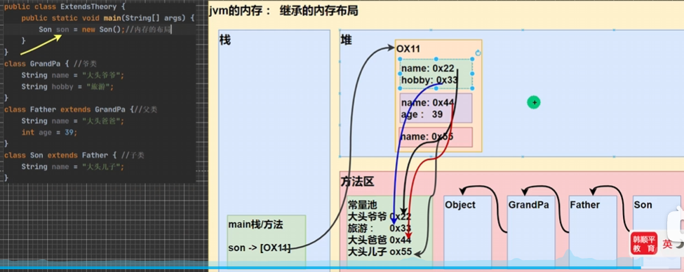

### super关键字

- 基本介绍

`super`代表父类的引用，用于访问父类的属性、方法、构造器

- 基本语法

1. 访问父类的属性，但不能访问父类的 `private`属性。`super.属性`
2. 访问父类的方法，不能访问父类的 `private`方法。`super.方法名(参数列表)`
3. 访问父类的构造器：`super(参数列表)`；只能放在构造器的第一句，只能出现一句。

- super给编程带来的遍历/细节

1. 调用父类的构造器的好处(分工明确，父类属性由父类初始化，子类的属性由子类初始化)
2. 当子类中有和父类的成员(属性和方法)重名时，为了访问父类的成员，必须通过 `super`。如果没有重名，使用 `super`、`this` 和直接访问结果是一样的。`2023-10-12:P300`
3. `super`的访问不限于直接父类，如果爷爷类和本类中有同名的成员，也可以直接使用 `super`去访问爷爷类的成员；如果多个基类(上级类)中多有同名的成员，使用 `super`访问遵循就近原则。`A->B->C`。当然也需要遵循访问权限规则。

- `super`和 `this`的比较

| 区别点       | this                                                   | super                                    |
| ------------ | ------------------------------------------------------ | ---------------------------------------- |
| 访问属性     | 访问本类中的属性，如果本类没有此属性则从父类中继续查找 | 从父类开始查找属性                       |
| 调用方法     | 访问本类中的方法，如果本类没有此属性则从父类中继续查找 | 直接访问父类中的方法                     |
| 调用构造函数 | 调用本类构造器，必须放在构造器的首行                   | 调用父类构造器，必须放在子类构造器的首行 |
| 特殊         | 表示当前对象                                           | 子类中访问父类对象                       |

### 方法重写/覆盖 `override`

- 方法重写就是子类中有一个方法，和父类的某个方法的**名称、返回类型、参数都一样**，那么就说子类的这个方法重写/覆盖了父类的那个方法。

方法重写/覆盖，需要满足下面的条件

1. 子类方法的**形参列表，方法名称**，要和父类的参数，方法名称**完全一样**。
2. **子类方法的返回类型和父类方法的返回类型一样，或者是父类返回类型的子类**，必须父类返回类型是 `Object`，子类方法返回类型是 `String`。
3. 子类方法不能缩小父类方法的访问权限。

- 方法重写和重载

| 名称           | 发生范围 | 方法名   | 形参列表                         | 返回类型                                                         | 修饰符                                   |
| -------------- | -------- | -------- | -------------------------------- | ---------------------------------------------------------------- | ---------------------------------------- |
| 重载(overload) | 本类     | 必须一样 | 类型，个数或者顺序至少有一个不同 | 无要求                                                           | 无要求                                   |
| 重写(override) | 父子类   | 必须一样 | 相同                             | 子类重写方法，返回的类型和父类返回的<br />类型一致，或者是其子类 | 子类方法不能缩小<br />父类方法的访问范围 |

### 面向对象编程-多态

- 多态(Polymorphic)：多态是建立在封装和继承基础之上的，面向对象的第三大特征。
- 多态的具体体现

1. 方法的多态：
   1. 方法的重载：通过传入不同的参数，实现对不同方法的调用
   2. 方法的重写：通过不同对象调用，实现调用不同的方法
2. **对象的多态**
   1. **一个对象的编译类型和运行类型可以不一致**
   2. **编译类型在定义对象时，就确定了，不能改变**
   3. **运行类型是可以变化的**
   4. **编译类型看定义时 `=`号的左边，运行类型看 `=`的右边**

- 多态注意事项和细节讨论
  - 多态的前提是：两个(类)存在继承关系
  - 多态的向上转型

1. 本质：父类的引用指向了子类的对象
2. 语法：`父类类型 引用名 = new 子类类型();`
3. 特点：编译类型看左边，运行类型看右边。
4. **可以调用父类中的所有成员(需遵循访问权限)；不能调用子类中特有成员；最终运行效果看子类的具体实现。**

- 多态的向下转型

1. 语法：`子类类型 引用名 = (子类类型) 父类引用;`
2. 只能强转父类的引用，不能强转父类的对象
3. 要求父类的引用必须指向的是当前目标类型的对象
4. 当向下转型后，就可以调用子类类型中的所有成员

```java
package com.hspedu.poly_.detail_;

public class PolyDetail {
    public static void main(String[] args) {
        // 向上转型：父类的引用指向子类的对象
        Animal animal = new Cat();
        Object object = new Cat();  // 也可以

//        animal.catchMouse();  // 但是不能调用子类的特有成员，因为在编译阶段，能调用哪些成员，是由编译类型来决定的
        // 最终运行效果看子类(运行类型)的具体实现，即调用方法时，按照从子类(运行类型)开始查找方法
        // 然后调用，规则如之前方法调用规则一致
        animal.show();  // 可以调用父类的所有成员(遵循访问权限)
        animal.eat();   // 猫吃鱼；调用的子类方法
        animal.run();   // 运行时，方法调用看运行类型，先从子类 Cat 中查找方法
        animal.sleep();

        // 向下转型
        // (1) 将父类的引用，强转为子类类型。语法：子类类型 引用名 = (子类类型) 父类引用;
        Cat cat = (Cat) animal; // cat的编译类型是 Cat，运行类型是 Cat
        // 编译类型是 Cat 所以可以调用 catchMouse，运行类型是 Cat，所以从 Cat类开始查找方法
        cat.catchMouse();   // 猫抓老鼠；
        // (2) 要求父类的引用必须指向的是当前目标类型的对象
//        Dog dig = (Dog) animal; // 错误，animal指向的不是目标类型 Dog 的对象
        System.out.println("OK~");
    }
}
```

- 多态的注意事项和细节讨论

  - 属性没有重写之说！属性的值看编译类型
  - `instance of`比较操作符，用于判断对象的类型是否为XX类型或XX类型的字类型。`a instanceof A`：判断a的**运行类型**是否是A！

  ```java
  public class PolyDetail02 {
      public static void main(String[] args) {
          // 属性没有继承之说！属性的值看编译类型
          Base base = new Sub();
          System.out.println("base.count=" + base.count); // base.count=10
          Sub sub = new Sub();
          System.out.println("sub.count=" + sub.count);   // sub.count=20
      }
  }
  class Base {
      int count = 10;
  }

  class Sub extends Base {
      int count = 20;
  }
  ```

```java
public class PolyDetail03 {
    public static void main(String[] args) {
        // a instanceof A ：判断 a 是否是 A类型或者A类型的字类型
        BB bb = new BB();
        System.out.println("bb instanceof BB: " + (bb instanceof BB));   // true
        System.out.println("bb instanceof AA: " + (bb instanceof AA));   // true

        // 是编译类型还是运行类型？ -> 运行类型！
        AA aa = new BB();
        System.out.println("aa instanceof BB: " + (aa instanceof BB));   // true
        System.out.println("aa instanceof AA: " + (aa instanceof AA));   // true

        Object obj = new Object();
        System.out.println("obj instanceof AA: " + (obj instanceof AA));   // false
        String str = "Hello";
        System.out.println("str instanceof Object: " + (str instanceof Object));  // true
    }
}

class AA { }
class BB extends AA { }
```

- **java的动态绑定机制(非常非常重要)**

1. 当调用对象方法的时候，该方法会和该对象的**内存地址/运行类型**绑定
2. **当调用对象属性时，没有动态绑定机制，哪里声明，哪里**使用。`2023-10-13:P316`

```java
package com.hspedu.poly_.dynamic_;

public class DynamicBinding {
    public static void main(String[] args) {
        // a 的编译类型是 A，运行类型是 B
        A a = new B();  // 向上转型
        /*
        1. 当调用对象方法时，该方法会和该对象的内存地址/运行类型绑定
        2. 当调用对象属性时，没有动态绑定机制，哪里声明，哪里使用
         */
        System.out.println("a.sum(): " + a.sum());  // a.sum(): 40 -> 30
        System.out.println("a.sum1(): " + a.sum1());    // a.sum1(): 30 -> 20
        System.out.println("a.i: " + a.i);    // 10，属性不会继承，调用属性时根据编译类型来
    }
}

class A {
    public int i = 10;
    // 动态绑定
    public int sum() {
        return getI() + 10; // 20 + 10 -> 30
    }
    public int sum1() {
        return i + 10;  // 10 + 10 -> 20
    }
    public int getI() {
        return i;
    }
}

class B extends A {
    public int i = 20;
//    public int sum() {
//        return i + 20;
//    }
    public int getI() {
        return i;
    }
//    public int sum1() {
//        return i + 10;
//    }
}
```

多态数组

- 数组的定义类型为父类类型，里面保存的实际元素类型为子类类型。

多态实参

- 方法定义的形参类型为父类型，实参类型允许子类类型

### Object类详解

- `equal`方法：`==`和 `equals`的对比

1. **`==`：既可以判断基本类型，又可以判断引用类型**
2. **`==`：如果判断基本类型，判断的是值是否相等。**
3. **`==`：如果判断引用类型，判断的是地址是否相等，即判定是不是同一个对象。**
4. **`equals`：是 `Object`类中的方法，只能判断引用类型**
5. **默认判断的是地址是否相等，子类中往往重写该方法，用于判断内容是否相等。**

```java
package com.hspedu.object_;

public class Equals01 {
    public static void main(String[] args) {
        A a = new A();
        A b = a;
        A c = b;
        // ==：对于引用类型，判断的是不是同一个对象
        System.out.println(a == c); // true
        System.out.println(b == c); // true

        B obj = a;  // 虽然编译类型不同，但是指向的内存地址相同
        System.out.println(obj == a);   // true

        // ==：对于基本类型，判断的是值是否相等
        int num1 = 10;
        double num2 = 10.0;
        System.out.println(num1 == num2);   // true

        // 查看实现/原码：ctrl + b
        // equals()只能判断引用类型，默认判断的是地址是否相等
        "Hello".equals("hello");
/*
    public boolean equals(Object anObject) {
        if (this == anObject) { // 如果是同一个对象(地址相同)
            return true;        // 返回 true
        }
        if (anObject instanceof String) {   // 判断类型
            String anotherString = (String)anObject;    // 向下转型
            int n = value.length;
            if (n == anotherString.value.length) {  // 如果长度相同
                char v1[] = value;
                char v2[] = anotherString.value;
                int i = 0;
                while (n-- != 0) {  // 一个一个比较字符
                    if (v1[i] != v2[i])
                        return false;
                    i++;
                }
                return true;    // 如果两个字符串的所有字符都相等，则返回true
            }
        }
        return false;
    }
 */
        Integer i = new Integer(100);
        Integer i1 = new Integer(100);
        System.out.println(i == i1);    // false    引用类型，判断的是否为同一对象
        System.out.println(i.equals(i1));   // true 重写equals方法，先判断是否为同一类型，再判断值是否相等
        System.out.println(i.equals(100.));   // false 类型不同，直接返回false

        String str1 = new String("Charlie");
        String str2 = new String("Charlie");
        System.out.println(str1 == str2);   // 引用类型，判断地址不同，返回 false
        System.out.println(str1.equals(str2));  // true 值相同
    }
}

class B {}
class A extends B {}
```

- `hashCode()`方法

1. 提高具有哈希结构的日期的效率！
2. 两个引用，如果指向同一个对象，则哈希值是一样的！
3. 两个引用，如果指向的是不同对象，则哈希值是不一样的
4. 哈希值主要根据地址号来的！不能完全将哈希值等价于地址
5. 后面在集合中 `hashCode`如果需要的话，也会重写

```java
public class HashCode {
    public static void main(String[] args) {
        AA aa = new AA();
        AA aa2 = new AA();
        AA aa3 = aa;
        System.out.println("aa.hashCode()=" + aa.hashCode());   // 460141958
        System.out.println("aa2.hashCode()=" + aa2.hashCode()); // 1163157884
        System.out.println("aa3.hashCode()=" + aa3.hashCode()); // 460141958
    }
}
class AA {}
```

- `toString()`方法

1. 默认返回：全类名+`@`+哈希值的十六进制。全类名包含包名
2. 子类往往会重写 `toString`方法，用于返回对象的属性信息
3. 当直接输出一个对象时，`toString`方法会被默认调用

```java
package com.hspedu.object_;

public class ToString_ {
    public static void main(String[] args) {
        /*  Object中的toString()方法
        // 1. getClass().getName()：类的全类名(包名+类名)
        // 2. Integer.toHexString(hashCode())：将对象的 hashCode 值转成16进制字符串
            public String toString() {
                return getClass().getName() + "@" + Integer.toHexString(hashCode());
            }
         */

        Monster monster = new Monster("小旋风", "巡山", 200);
//        System.out.println(monster.toString()); // 重写前：com.hspedu.object_.Monster@1b6d3586
        System.out.println(monster.toString()); // 重写后：Monster{name='小旋风', job='巡山', salary=200.0}
        System.out.println(monster);    // 当输出一个对象时，toString方法会被默认调用；输出同上
    }
}

class Monster {
    private String name;
    private String job;
    private double salary;

    public Monster(String name, String job, double salary) {
        this.name = name;
        this.job = job;
        this.salary = salary;
    }

    // 重写toString方法，输出对象的属性
    @Override
    public String toString() {  // 重写后，一般是把属性输出
        return "Monster{" +
                "name='" + name + '\'' +
                ", job='" + job + '\'' +
                ", salary=" + salary +
                '}';
    }
}
```

- `finalize`方法

1. 当对象被回收时，系统自动调用该对象的 `finalize`方法。子类可以重写该方法，做一些**释放资源**的操作
2. 什么时候被回收：当某个对象没有任何引用时，则jvm就认为这个对象是一个垃圾对象，就会使用垃圾回收机制来销毁该对象，在销毁该对象前，会先调用 `finalize`方法
3. 垃圾回收机制的调用，是由系统来决定的，也可以通过 `System.gc()`主动触发垃圾回收机制

### 断点调试

1. 在断点调试过程中，是**运行状态**，是以对象的**运行类型**来执行的 `2023-10-15:P331`

| 快捷键       | 功能                     |
| ------------ | ------------------------ |
| `F7`       | 跳入方法内               |
| `F8`       | 跳过                     |
| `shift+F8` | 跳出方法                 |
| `F9`       | resume，执行到下一个断点 |

> 既可以在本文件下断点，也可以在系统文件下断点
>
> 可以动态地下断点

| 访问修饰符    | 本类 | 同包 | 子类 | 不同包 |
| ------------- | ---- | ---- | ---- | ------ |
| `public`    | √   | √   | √   | √     |
| `protected` | √   | √   | √   | ×     |
| `默认`      | √   | √   | ×   | ×     |
| `private`   | √   | ×   | ×   | ×     |

> 1.说出 `==`和 `equals`的区别？
>
> - `==`是比较运算符。既可以用于基本数据类型，也可以用于引用类型。对基本类型，判断值是否相等；对引用类型，判断是否为同一个对象的引用。
> - `equals`是 `Object`类中的方法。不能用于基本数据类型，只用于判断是否为同一个对象的引用，一般在自定义类型时都会重写该方法。
>
> 2.什么是多态，多态具体体现有哪些？
>
>> 方法或对象具有多种形态，是OOP的第三大特征，是建立在封装和继承基础之上。多态具体体现：
>>
>> 1. 方法多态：
>>    1. 重载体现多态
>>    2. 重写体现多态
>> 2. 对象多态
>>    1. 对象的编译类型和运行类型可以不一致，编译类型在定义时，就确定，不能变化。
>>    2. 对象的运行类型是可以变化的，可以通过 `getClass()`查看运行类型
>>    3. 编译类型看定义时 `=`的左边，运行类型看 `=`的右边。
>>
>
> 3. `java`的多态绑定机制是什么？
>
>> 1. 当调用对象的**方法**时，该方法会和对象的**内存地址/运行类型**绑定。
>> 2. 当调用对象的**属性**时，没有动态绑定机制，遵守“哪里声明，那里使用”。
>>

### 类变量和类方法

- 什么是类变量

> 类变量也叫静态变量/静态属性，是该类的所有对象共享的变量，任何一个该的对象访问它时，取到的都是相同的值，同样任何一个该类的对象去修改它时，修改的也是同一个变量。

- 如何定义类变量

> `访问修饰符 static 数据类型 变量名;`[推荐]
>
> `static 访问修饰符 数据类型 变量名;`
>
> 静态变量的访问修饰符的访问权限和范围 和 普通属性是一样的

- 如何访问类变量

> 1. 类名.类变量名
> 2. 对象名.类变量名

- 类变量和实例变量(普通属性)区别

> 1. 类变量是该类的所有对象共享的
> 2. 实例变量是每个对象独享的
> 3. 实例变量不能通过 `类名.变量名`访问
> 4. 类变量的生命周期是随着类的加载开始，随着类消亡而销毁

- 类方法基本介绍

> 类方法也叫静态方法
>
> `访问修饰符 staic 数据返回类型 方法名() {}`[推荐]
>
> `static 访问修饰符 数据返回类型 方法名() {}`

- 类方法的调用

> `类名.类方法名()`
>
> `对象名.类方法名()`
>
> 前提是满足访问修饰符的访问权限和范围

- 类方法经典的使用场景

> - 当方法不设计任何和对象相关的成员时，可以设计成静态方法，提高开发效率
> - 可以不用创建实例，只听过类名来调用方法

- 类方法使用注意事项和细节

1. 类方法和普通方法都是随着类的加载而加载，将信息存储在方法区：**类方法中无 `this`参数**；普通方法中隐含 `this`的参数
2. 类方法可以通过类名调用，也可以通过对象名调用
3. **普通方法和对象有关，需要通过对象名调用，不能通过类名调用**。
4. 类方法中不允许使用和对象有关的关键字，比如 `this`和 `super`，普通方法(成员方法)可以。
5. **类方法(静态方法)中 只能访问 静态变量 或 静态方法。**
6. 普通成员方法，既可以访问 普通方法(方法)，也可以访问静态变量(方法)`2023-10-18:P382`

### 理解main方法语法

- 深入理解 `main`方法

> 解释 `main`方法的形式：`public static void main(String[] args) {}`
>
> 1. `main`方法是虚拟机调用
> 2. java虚拟机需要调用类的 `main()`方法，所以该方法的访问权限必须是 `public`
> 3. java虚拟机在执行 `main()`方法时不必创建对象，所以该方法必须是 `static`
> 4. 该方法接收 `String`类型的数组参数，该数组中保存执行java命令时传递给所运行的类的参数。
> 5. `java 执行的程序 参数1 参数2 参数3`
>
>> 在IDEA可以通过 `Edit configuration`设置main方法的参数
>>

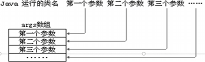

- 特别提示：

> 1. 在 `main()`方法中，可以直接调用 `main`方法所在类的静态方法或静态属性
> 2. 但是，不能直接访问该类中的非静态成员，**必须创建该类的一个实例对象后，才能通过这个对象去访问类中的非静态成员**。

```java
public class Main02 {
    // 静态的变量/属性
    private static String name = "Charlie";
    // 静态方法
    private static void sayHi() {
        System.out.println("Hi~");
    }

    // 非静态成员
    private int n1 = 21;
    private void eat() {
        System.out.println("同发号，启动！");
    }

    public static void main(String[] args) {
        // 可以直接使用 name
        // 1. 静态方法main 可以访问本类的静态成员
        System.out.println("name=" + name);
        sayHi();

        // 2. 静态方法main 不能访问本类的非静态成员
//        System.out.println("n1=" + n1);   // 错误
//        eat();  // 错误

        // 3. 静态方法main 要访问本类的非静态成员，需要先创建对象，再调用即可
        Main02 m = new Main02();
        System.out.println(m.n1);
        m.eat();

        // 调用静态方法
        test(); // 同发号，启动！
    }

    public static void test() {
        Main02 m = new Main02();
        m.eat();
    }
}
```

### 代码块

- 基本介绍

代码块又称为初始化块，属于类中的成员(即是类的一部分)，类似于方法，将逻辑语句封装在方法体中，通过 `{}`包围起来。

但和方法不同，没有方法名，没有返回，没有参数，只有方法体，而且不同通过对象或类显示调用，而是加载类时，或创建对象时隐式调用。

- 基本语法

```java
[修饰符] {
};
```

> 1. 修饰符可选，要写的话，也只能写 `static`
> 2. 代码块分为两类，使用 `static`修饰的叫静态代码块，没有 `static`修饰的，叫普通代码块/非静态代码块
> 3. 逻辑语句可以为任何逻辑语句(输入、输出、方法调用、判断等)
> 4. `;`号可以写，也可以省略

- 代码块的理解

1. 相当于另外一种形式的构造器(对构造器的补充机制)，可以做初始化的操作
2. 场景：如果多个构造器中都有重复的语句，可以抽取到代码块中，提高代码的重用性

```java
public class CodeBlock01 {
    public static void main(String[] args) {
        Movie movie = new Movie("霸王别姬");
        /*
        电影正式开始~         // 代码块内容先被调用
        电影霸王别姬正在播放~  // 然后再去调用构造器
         */
    }
}

class Movie {
    private String name;
    private double price;
    private String director;

    // 3个构造器 -> 重载
    // 1. 如下三个构造器都有相同的语句
    // 2. 这样代码看起来比较冗余
    // 3. 这时可以把相同的语句，放在一个代码块中
    // 4. 这样不管调用哪个构造器创建对象，都会先调用代码块的内容
    // 5. 代码块的调用优先于构造器
  
    {
        System.out.println("电影正式开始~");
    };

    public Movie(String name) {
//        System.out.println("电影正式开始~");
        System.out.println("电影" + name + "正在播放~");
        this.name = name;
    }

    public Movie(String name, double price) {
//        System.out.println("电影正式开始~");
        this.name = name;
        this.price = price;
    }

    public Movie(String name, double price, String director) {
//        System.out.println("电影正式开始~");
        this.name = name;
        this.price = price;
        this.director = director;
    }
}
```

- 代码块细节分析

> `static`代码块也叫静态代码块，作用就是对类进行初始化，而且它随着**类的 加载**而执行，只会执行一次。如果是普通代码块，每创建一个对象，就执行。

- **类什么时候被加载[重要]**

1. 创建对象实例时(`new`)
2. 创建子类对象实例，父类也会被加载
3. 使用类的静态成员时(静态属性、静态房啊)

- 普通的代码块，在创建对象实例时，会被隐式的调用。创建一次，就会调用一次。如果只是使用类的静态成员时，普通代码块并不会执行(没有创建对象，可以理解为普通代码块是构造器的补充)。

4. **创建一个对象时，在一个类中调用顺序是(重点，难点)：**

> 1. **调用静态代码块和静态属性初始化**
>    1. **静态代码块和静态属性初始化调用的优先级相同**
>    2. **如果有多个静态代码和多个静态变量初始化，则按照它们定义的顺序调用。**
> 2. **调用普通代码块和普通属性的初始化**
>    1. **普通代码块和普通属性初始化调用优先级相同**
>    2. **如果有多个代码块和多个普通属性初始化，则按照定义顺序调用**
> 3. **调用构造方法。**

5. 构造器的最前面其实隐含了 `super()`和调用普通代码块，静态相关的代码块、属性初始化，在类加载时就执行完毕。因此是优先于 构造器和普通代码块执行的
6. 看一下**创建一个子类对象时**(继承关系)

> 它们的静态代码块，静态属性初始化，普通代码块，普通属性初始化，构造方法的调用顺序如下：
>
> 1. **父类的静态代码块和静态属性(优先级一样，按定义顺序执行)**
> 2. **子类的静态代码块和静态属性(优先级一样，按定义顺序执行)**
> 3. **父类的普通代码块和普通属性初始化(优先级一样，按定义顺序执行)**
> 4. **父类的构造方法**
> 5. **子类的普通代码块和普通属性初始化(优先级一样，按定义顺序执行)**
> 6. **子类的构造方法**
>
> 即：**加载父类->加载子类->创建父类对象->创建子类对象**

7. 静态代码块执行**直接调用**静态成员(静态属性和静态方法)，普通代码块可以调用任意成员。

### 单例设计模式

1. 所谓类的单例设计模式，就是采取一定的方法保证在整个的软件系统中，对某个类只能存在一个对象实例，并且该类只能提供一个取得其对象实例的方法。
2. 单例模式有两种方式：1)饿汉式 2)懒汉式

> - 饿汉式
>
> 1. 构造器私有化 -> 防止直接 `new`
> 2. 类的内部创建对象
> 3. 向外暴露一个静态的公共方法，如 `getInstance`

```java
public class SingleTon01 {
    public static void main(String[] args) {
//        GirlFriend g1 = new GirlFriend("小红");
//        GirlFriend g2 = new GirlFriend("小兰");
        System.out.println(GirlFriend.n1);  // 使用类属性，类被加载，同时创建 GirlFriend 对象
        GirlFriend instance = GirlFriend.getInstance(); // 通过方法回去对象，但不会再创建新的 GirlFriend 对象
        System.out.println(instance);
        GirlFriend instance1 = GirlFriend.getInstance();
        System.out.println(instance1 == instance);  // true

        // 懒汉式 - Cat
        System.out.println(Cat.n1); // 即使类被加载，也没有创建单例对象
        Cat cat = Cat.getInstance();    // Cat对象被创建...
        System.out.println(cat);        // Cat{name='肥肥'}
        Cat cat1 = Cat.getInstance();   // 返回同一个对象
        System.out.println(cat1 == cat);    // true
    }
}

// GirlFriend 类
class GirlFriend {  // 饿汉式

    private String name;
    public static int n1 = 12;
    // 为了能够在静态方法中返回 gf对象，需要将其修饰为 static
    // 随着类的加载，对象即被创建，即使可能不会使用到 -> 饿汉式
    // 饿汉式可能造成创建了对象，但是没有使用
    private static GirlFriend gf = new GirlFriend("阿通");

    // 如何保障只能创建一个 GirlFriend 对象
    // 步骤【单例模式-饿汉式】
    // 1. 将构造器私有化 -> 防止在类的外部创建对象
    // 2. 在类的内部直接创建对象(该对象是static)
    // 3. 提供一个公共的 static 方法，返回 gf 对象 -> 为了能够在外部使用
    // 4. 懒汉式，只有当用户使用 getInstance时，才返回 Cat 对象，后面再次调用时，会返回上次创建的 cat 对象
    private GirlFriend(String name) {
        System.out.println("GirlFriend对象被创建...");
        this.name = name;
    }

    // 静态方法，不需要 new 对象，直接使用类名调用
    public static GirlFriend getInstance() {
        return gf;
    }

    @Override
    public String toString() {
        return "GirlFriend{" +
                "name='" + name + '\'' +
                '}';
    }
}

// 希望在程序运行过程中，只能创建一个 Cat 对象
class Cat {    // 懒汉式
    private String name;
    public static int n1 = 21;
    private static Cat cat;
    // 步骤
    // 1. 仍然将构造器私有化
    // 2. 定义一个 static
    // 3. 提供一个 public 的 static 方法，可以返回一个 Cat 对象
    private Cat(String name) {
        System.out.println("Cat对象被创建...");
        this.name = name;
    }

    public static Cat getInstance() {
        if (cat == null) {  // 还没有创建 Cat 对象
            cat = new Cat("肥肥");
        }
        return cat;
    }

    @Override
    public String toString() {
        return "Cat{" +
                "name='" + name + '\'' +
                '}';
    }
}
```

- 饿汉式VS懒汉式

1. 二者最主要的区别在于创建对象的时机不同：饿汉式是在类加载时就创建对象实例，而懒汉式是在使用时才创建。
2. 饿汉式不存在线程安全问题，懒汉式存在线程安全问题
3. 饿汉式存在浪费资源的可能。因为如果一对对象实例都没有使用，那么饿汉式创建的对象就浪费了，懒汉式是使用时才创建，就不存在这个问题。
4. 在 `javaSE`标准类中，`java.lang.Runtime`就是经典的单例模式

### final关键字

`final`可以修饰类、属性、方法和局部变量。在某些情况下，程序员可能有一下需求，就会使用到 `final`

1. 当不希望类被继承时，可以用 `final`修饰类
2. 放不希望父类的某个方法被子类覆盖/重写(Override)时，可以用 `final`关键字修饰方法
3. 放不希望类的某个属性的值被修改，可以用 `final`修饰属性。
4. 当不希望某个局部变量被修改，可以使用 `final`修饰

- `final`使用注意事项和细节讨论

1. `final`修饰的属性又叫常量，一般用 `XX_XX_XX`来命名
2. `final`修饰的属性在定义时，必须赋初值，并且以后不能再修改，赋值可以加在一下位置之一
   1. 定义时：如 `public final double TAX_RATE = 0.08;`
   2. 在构造器中
   3. 在代码块中
3. 如果 `final`修饰的属性是**静态**的，则初始化的位置只能是
   1. 定义时
   2. 在静态代码块，**不能在构造器中赋值**
4. `final`类不能继承，但是可以实例化对象。一般来说，如果一个类已经是 `final`类了，就没有必要再将方法修饰成 `final`方法。
5. 如果类不是 `final`类，但是含有 `final`方法，则该方法虽然不能重写，但是可以被继承。
6. `final`不能修饰构造器
7. `final`和 `static`往往搭配使用，效率更高，底层编译器做了优化处理
8. 包装类(`Integer`,`Double`,`Float`,`Boolean`等都是 `final`)，`String`也是 `final`类
9. `2023-10-19:P397`

### 抽象类

- 父类方法的不确定性

> 当父类的某些方法，需要声明，但是又不确定如何实现时，可以将其声明为抽象方法，那么这个类就是抽象类。

1. 用 `abstract`关键字修饰一个类时，这个类就叫抽象类。`访问修饰符 abstract 类名{}`
2. 用 `abstract`关键字来修饰一个方法时，这个方法就是抽象方法 `访问修饰符 abstract 返回类型 方法名(参数列表);`，没有方法体 `{}`
3. 抽象类的价值在于设计，是设计者设计好后，让子类继承并实现抽象类
4. 抽象类，在框架和设计模式中使用较多

- 抽象类使用的注意事项和细节讨论

> 1. 抽象类不能被实例化
> 2. 抽象类不一定要包含 `abstract`方法，也就是说，抽象类可以没有 `abstract`方法
> 3. 一旦类包含了 `abstract`方法，则这个类必须声明为 `abstract`
> 4. `abstratc`只能修饰类和方法，不能修饰属性和其他的
> 5. 抽象类可以有任意成员[**抽象类本质还是类**]，比如：非抽象方法、构造器、静态属性等等
> 6. 抽象方法不能有主体，即不能实现
> 7. 如果一个类继承了抽象类，则它必须实现抽象类中的所有抽象方法，除非它自己声明为 `abstract`类
> 8. 抽象方法不能使用 `private, final, 和 static`修饰，因为这些关键字都是和重写相违背的

```java
abstract final class A{}	// 错误：final是不能继承
public abstract static void test2();	// 错误：static关键字和方法重写无关
private abstract void test3();	// 错误：private的方法不能重写
```

- 抽象类最佳实践-**模板设计模式**

### 接口(interface)

- 基本介绍

接口就是给出一些没有实现的方法，封装到一起，到某个类要使用的时候，再根据具体情况把这些方法写出来

```java
interface 接口名{
	// 属性
	// 方法
	// 1.抽象方法 2.默认方法(需要加关键字 default 修饰) 3.静态方法
}

class 类名 implements 接口{
	// 自己属性
	// 自己方法
	// 必须实现的接口的抽象方法
}
```

> 1. 在 `JDK7.0`前，接口里的所有方法都没有方法体，即都是抽象方法
> 2. `JDK8.0`后，接口可以有静态方法、默认方法，也就是说接口中可以有方法的具体实现

- 注意事项和细节

> 1. 接口不能被实例化
> 2. 接口中所有方法默认都是 `public`，接口中抽象方法，可以不用 `abstract`修饰
> 3. 一个普通类实现接口，就必须将该接口的所有**抽象方法**都实现
> 4. 抽象类实现接口，可以不用实现接口的方法
> 5. 一个类可以同时实现多个接口
> 6. 接口中的属性，只能是 `final`的，而且是 `public static final`修饰符。比如：`int a = 1;`实际上是 `public static final int a = 1;`(必须初始化)
> 7. 接口中属性的访问形式：`接口名.属性名`
> 8. **一个接口不能直接继承其它的类，但是可以继承多个别的接口**
> 9. 接口的修饰符，只能是 `public`和默认，这单和类的修饰符是一样的 `2023-10-21:P406`

- 实现接口 VS 继承类

> 接口和继承解决的问题不同
>
> - 继承的价值在于：解决代码的复用性和可维护性
> - 接口的价值在于：设计，设计好各种规范(方法)，让其它类去实现这些方法，即更加灵活
>
> 接口比继承更加灵活：继承是满足 `is-a`关系，而接口只需要满足 `like-a`关系
>
> 接口在一定程度上实现代码解耦[即：接口规范性+动态绑定机制]

- 接口的多态特性

1. 多态参数：如前接口案例，形参 `UsbInterface usbInterface`，既可以接收手机对象，又可以接收相机对象。即：**接口引用可以指向实现了接口的类的对象**
2. 多态数组
3. 接口存在多态传递现象

### 内部类

- 基本介绍

一个类的内部又完整地嵌套了另一个类结构。被嵌套的类称为内部类(inener class)，嵌套其他类的类称为外部类(outer class)。内部类是类的第五大成员(**属性、方法、构造器、代码块、内部类**)，**内部类最大的特点就是可以直接访问私有属性，并且可以体现类与类之间的包含关系**。

```java
class Outer {	// 外部类
	class Inner {	// 内部类
	}
}
```

- 内部类的分类

在Java中一共有4中内部类

> - 定义在外部类局部位置上(比如方法内)：
>
> 1. 局部内部类(有类名)
> 2. 匿名内部类(没有类名，重点！！！)
>
> - 定义在外部类的成员位置上：
>
> 1. 成员内部类(没用static修饰)
> 2. 静态内部类(使用static修饰)

1. 局部内部类

> 局部内部类是定义在**外部类的局部位置**，比如方法中，并且有类名。
>
> 1. 可以直接访问外部类的所有成员，包含私有的
> 2. 不能添加访问修饰符，因为它的地位就是一个局部变量。局部变量是不能使用修饰符的。范式可以使用 `final`修饰，因为局部变量也可以使用 `final`
> 3. 作用域：仅仅在定义它的方法或代码块中
> 4. 局部内部类--访问--->外部类的成员[访问方式：直接方法]
> 5. 外部类--------访问-->局部内部类的成员[访问方式：创建对象，再访问(注意：必须在作用域内)]
> 6. 外部其他类--不能访问-->局部内部类(因为局部内部类地位就是一个局部变量)
> 7. 如果外部类和局部内部类的成员重名，默认遵循就近原则，如果想访问外部类的成员，则可以使用 `外部类.this.成员`去访问

2. **匿名内部类(重要！！！)**

> 匿名内部类是定义在外部类的局部位置，比如方法中，并且没有类名
>
>> 1）本质是类 2）内部类 3）该类没有名字 4）同时还是一个对象
>>
>
> ```java
> new 类或接口(参数列表) {
> 	// 类体
> };
> ```
>
> `2023-10-24:P418`
>
> 2. 匿名内部类的语法比较奇特，因为匿名内部类既是一个类的定义，同时它本身也是一个对象，因此从语法上看，它既有定义类的特定，也有创建对象的特征。
> 3. 可以直接访问外部类的所有成员，包含私有的
> 4. 不能添加访问修饰符，因为它的地位就是一个局部变量
> 5. 作用域：仅仅在定义它的方法或代码块
> 6. 匿名内部类--访问--->外部类成员[访问方式：直接访问]
> 7. 外部其他类--不能访问--->匿名内部类因为匿名外部类地位是一个局部变量)
> 8. 如果外部类和匿名内部类的成员重名时，匿名内部类访问的话，遵循就近原则，如果想访问外部类的成员，则可以使用(`外部类.this.成员`)访问

- 匿名内部类的最佳实践
  - 当做实参直接传递，简介高效

3. **成员内部类的使用**

> 说明：成员内部类是定义在外部类的成员位置，并且没有 `static`修饰
>
> 1. 可以直接访问外部类的所有成员，包含私有的
> 2. 可以添加任意访问修饰符(`public, protected, 默认, private`)，因为它的地位就是一个成员
> 3. 作用域和外部类的其他成员一样，为整个类体。
> 4. 成员内部类--访问--->外部类(比如：属性)[访问方式：直接访问]
> 5. 外部类---访问--->内部类[访问方式：创建对象，再访问]
> 6. 外部其他类---访问--->成员内部类
> 7. 如果外部类和内部类的成员重名时，内部类访问的话，默认遵循就近原则，如果想访问外部类的成员，则可以使用(`外部类.this.成员`)来访问

4. **静态内部类**

> 说明：静态内部类是定义在外部类的成员位置，并且有 `static`修饰
>
> 1. 可以直接访问外部类的所有静态成员，包括私有的，但不能直接访问非静态成员
> 2. 可以添加任意访问修饰符(`public, protected, 默认, private`)，因为它的地位就是一个成员
> 3. 作用域：同其他的成员，为整个类体
> 4. 静态内部类---访问--->外部类(比如：静态属性)[访问方式：直接访问所有静态成员]
> 5. 外部类---访问--->静态内部类[访问方式：创建对象，再访问]
> 6. 如果外部类和静态内部类的成员重名时，静态内部类访问时遵循就近原则，如果想访问外部类的成员，则可以使用(`外部类名.成员`)去访问

- 小结

> - 内部类有四种：
>
> 1. 局部内部类
> 2. **匿名内部类**(!!!)
>    `new 类/接口() {//...};`
> 3. 成员内部类
> 4. 静态内部类
>
>> 成员内部类和静态内部类放在外部类的成员位置，本质就是一个成员
>>

### 枚举

枚举(enumeration)是一组常量的集合，即属于一种特殊的类，里面只包含一组有限的特定的对象。

枚举的两种实现方式

1. **自定义**类实现枚举

```md
进行自定义类实现枚举，有如下特点：
1）构造器私有化
2）在本类内部创建一组对象
3）对外暴露对象（通过为对象添加`public static final`修饰符）
4）可以提供getXXX方法，但是不要提供setXXX方法
```

> 1. 不需要提供setXXX方法，因为枚举对象值通常为只读
> 2. 对枚举对象/属性使用 `static + final`共同修饰，实现底层优化
> 3. 枚举对象名通常使用全部大写，常量的命名规范
> 4. 枚举对象根据需要，也可以由多个属性

2. enum关键字实现枚举

```
     如果使用了 enum 来实现枚举类
     1. 使用关键字 enum 替代 class
     2. public static final Season2 SPRING = new Season2("春天", "温暖");
      ->  SPRING("春天", "温暖");
          常量名(实参列表);
     3. 如果有多个常量(对象)，使用 , 逗号间隔即可
     4. 如果使用 enum 实现枚举，要求将定义的常量对象，写在前面
```

> `enum`关键字实现枚举注意事项
>
> 1. 当使用 `enum`关键字开发一个枚举类时，默认会继承 `Enum`类，而且是一个 `final`类。使用  `JavaP`工具演示
> 2. 传统的 `public static final Season2 SPRING = new Season2();`，简化为 `SPRING();`，这里必须知道，它调用的是哪个构造器
> 3. 如果**使用无参构造器 创建 枚举对象，则实参列表和小括号都可以省略**
> 4. 当有多个枚举对象时，使用 `,`分隔，最后有一个分号结尾
> 5. **枚举对象必须放在枚举类的行首**

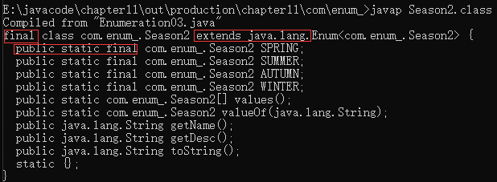

enum常用方法说明

>> 说明：使用关键字 `enum`时，会隐式继承 `Enum`类，这样就可以使用 `Enum`类相关的方法
>>
>
> 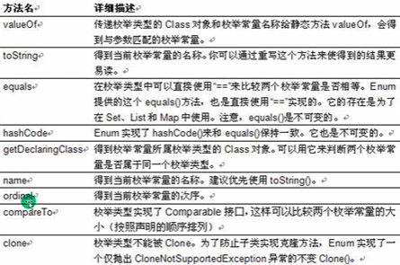
>
> 1. toString：Enum类已经重写过了，返回的是当前对象名，子类可以重写该方法，用于返回对象的属性信息
> 2. name：返回当前**对象名（常量名）**，子类中不能重写
> 3. ordinal：返回当前对象的**位置号，默认从0开始**
> 4. values：返回当前枚举类中所有常量
> 5. valueOf：**将字符串转换成枚举对象**，要求字符串必须为已有的常量名，否则报异常
> 6. compareTo：比较两个枚举常量，比较的就是**位置号**！

enum实现接口

> 1) 使用 `enum`关键字后，就不能在继承其他类了，因为 `enum`类会隐式继承 `Enum`类，而Java是单继承机制
> 2) 枚举类和普通类一样，可以实现接口，如下形式
>
> `enum 类名 implements 接口1, 接口2 {}`

### 注解的理解

1. 注解(Annotation)也被称为元数据(Metadata)，用于修饰解释包、类、方法、属性、构造器、局部变量等数据信息。
2. 和注释一样，注解不影响程序逻辑，但注解可以被编译或运行，相当于嵌入在代码中的补充信息。
3. 在JavaSE中，注解的使用目的比较简单，例如标记过失的功能，忽略警告等。在JavaEE中注解占据了更重要的角色，例如用来配置应用程序的任何切面，代替javaEE旧版中所遗留的繁冗代码和XML配置等。

- `@Override`：限定某个方法，是重写父类方法，该注解只能用于方法

> 1. `@Override`表示指定重写父类的方法（从编译层面验证），如果父类没有该方法，则会报错
> 2. 如果不写 `@Override`注解，而父类仍有 `public void fly(){}`，仍然构成重写
> 3. `@Override`只能修饰方法，不能修饰其他类、包、属性等等
> 4. 查看 `@Override`注解原码为
>
> ```java
> @Target(ElementType.METHOD)
> @Retention(RetentionPolicy.SOURCE)
> public @interface Override {
> }
> ```
>
> 5. `@Target`是修饰注解的注解，称为元注解

- `@Deprecated`的说明

> 1. 用于表示某个程序元素(类，方法等)已过时
> 2. 可以修饰方法，类，字段，包，参数等等
> 3. `@Target(value={CONSTRUCTOR, FIELD, LOCAL_VARIABLE, METHOD, PACKAGE, PARAMETER, TYPE})`
> 4. `@Deprecated`的作用可以做到新旧版本的兼容和过度

- `@SuppressWarning`：抑制编译器警告

```md
all，抑制所有警告
boxing，抑制与封装/拆装作业相关的警告
cast，抑制与强制转型作业相关的警告
dep-ann，抑制与淘汰注释相关的警告
deprecation，抑制与淘汰的相关警告
fallthrough，抑制与switch陈述式中遗漏break相关的警告
finally，抑制与未传回finally区块相关的警告
hiding，抑制与隐藏变数的区域变数相关的警告
incomplete-switch，抑制与switch陈述式(enum case)中遗漏项目相关的警告
javadoc，抑制与javadoc相关的警告
nls，抑制与非nls字串文字相关的警告
null，抑制与空值分析相关的警告
rawtypes，抑制与使用raw类型相关的警告
resource，抑制与使用Closeable类型的资源相关的警告
restriction，抑制与使用不建议或禁止参照相关的警告
serial，抑制与可序列化的类别遗漏serialVersionUID栏位相关的警告
static-access，抑制与静态存取不正确相关的警告
static-method，抑制与可能宣告为static的方法相关的警告
super，抑制与置换方法相关但不含super呼叫的警告
synthetic-access，抑制与内部类别的存取未最佳化相关的警告
sync-override，抑制因为置换同步方法而遗漏同步化的警告
unchecked，抑制与未检查的作业相关的警告
unqualified-field-access，抑制与栏位存取不合格相关的警告
unused，抑制与未用的程式码及停用的程式码相关的警告
```

- JDK的元Annotation（元注解）：用于修饰其他Annotation

> 1. `Retention`：指定注解的作用范围，三种 `SOURCE, CLASS, RUNTIME`
> 2. `Target`：指定注解可以在哪些地方使用
> 3. `Documented`：指定该注解是否会在javadoc体现
> 4. `Inherited`：子类会继承父类注解

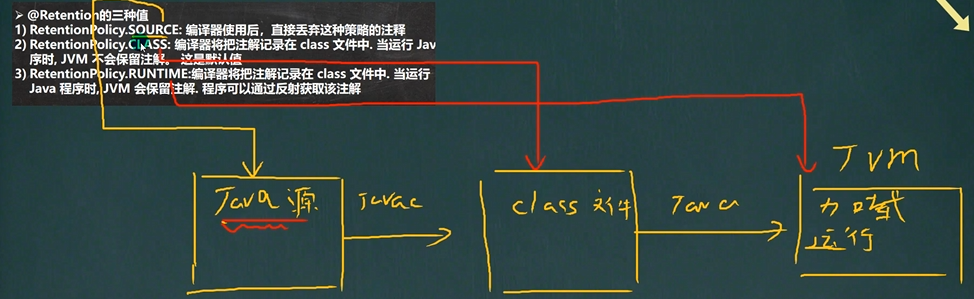

### 异常介绍

Java语言中，将程序执行中发生的不正常情况称为“异常”。执行过程中发生的异常事件可分为两类：

1. `Error(错误)`：Java虚拟机无法解决的严重问题。如：JVM系统内部错误、资源耗尽等严重问题。比如 `StackOverflowError(栈溢出)和OOM(out of memory)`，Error是严重错误，程序会崩溃
2. `Exception`：其他因边记错误或偶然的外在因素导致的一般性问题，可以使用只对行代码进行处理。例如空指针访问、试图读取不存在的文件，网络连接中断等等，Exception分为两大类：**运行时异常**[程序运行时，发生的异常]和**编译时异常**[编程时，编译器检测出的异常]。编译时异常，是编译器要求必须处理的异常。

| 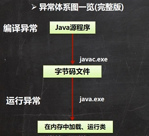 | 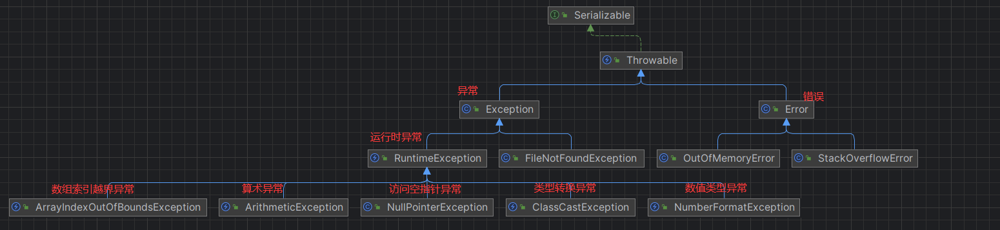 |
| ---------------------------------------------- | ---------------------------------------------- |

- 常见的运行时异常包括

1. `NullPointerException`：空指针异常，当程序试图在需要对象的地方使用 `null`时，抛出该异常。
2. `ArithmeticException`：数学运算异常
3. `ArrayIndexOutOfBoundsException`：数组下标越界异常，用非法索引访问数组时抛出该异常，如果索引为负或者大于等于数组大小
4. `ClassCastException`：类型转换异常，当试图将对象强制转换为不是实例的子类时抛出该异常。
5. `NumberFromatException`：数字格式不正确异常，当程序试图将字符串转换成一种数值类型，但该字符串不能转换为适当格式时，抛出该异常。

- 常见的编译异常

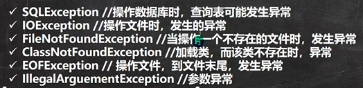

- 异常处理

1. `try-catch-finally`：程序员在代码中捕获发生的异常，自行处理

```java
// try-catch-finally处理机制
// 1. 如果发生了异常，则异常发生后面的代码不会执行，直接进入catch块
// 2. 如果异常没有发生，则顺序执行 try 代码块，不会进入到 catch
// 3. 如果希望不管是否发生异常，都执行某段代码(比如关闭连接，释放资源等)
// 4. 可以有多个catch语句，捕获不同的异常(进行不同的业务处理)，要求子类异常在前，父类异常在后，比如(Exception在后，NullPointerException在前)，如果发生异常，只会匹配一个catch
// 5. 可以进行try-finally配合使用，相当于没有捕获异常，因此程序会直接崩掉。应用场景：就是执行一段代码，不管是否发生异常，都必须执行某个业务逻辑
try {
    // 可能有异常的代码
} catch(Exception e) {
    // 捕获异常
    // 1. 当异常发生时
    // 2. 系统将异常封装成 Exception 对象 e
    //    传递给 catch
    // 3. 得到异常对象后，程序员自行处理
    // 4. 如果没有发生异常，catch代码块不执行
} finally {
    // 1. 不管有无异常发生，都会执行 finally
    // 2. 通常将释放资源的代码，放在 finally
}
```

2. `throws`：将发生的异常抛出，交给调用者(方法)来处理，最顶级的处理者就是JVM。try-catch-finally和throws二选一，如果没有显式地使用t-c-f，默认使用 `throws`

- 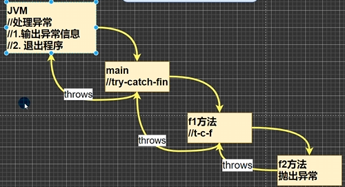

> - try-catch-finally执行顺序小结
>
> 1. 如果没有出现异常，则执行try块中的所有语句，不执行catch块中语句，如果有finally，最后还需要执行finally里面的语句
> 2. 如果出现异常，则try块中异常发生后，剩下的语句不再执行。将执行catch块中的语句，如果有finally，最后还需要执行finally里面的语句

- throws异常处理

1. 如果一个方法(中的语句执行时)可能生成某种异常，但是并不确定如何处理这种异常，则此方法显式地声明抛出异常，表明该方法将不对这些异常进行处理，而由该方法的**调用者负责处理**
2. 在方法声明中用 `throws`语句可以声明抛出异常的列表，throws后面的异常类型可以是方法中产生的异常类型，也可以是它的父类

> - 注意事项和使用细节
>
> 1. 对于编译异常，程序中必须处理，比如try-catch或者throws
> 2. 对于运行时异常，程序中如果没有处理，默认就是throws的处理方式
> 3. 子类重写父类方法时，对抛出异常的规定：子类重写的房啊，所抛出的异常类型要么和父类抛出的异常抑制，要么为父类抛出的类型的字类型
> 4. 在throws过程中，如果有方法try-catch，就相当于处理异常，就可以不必throws `2023-10-27:P455`

- 自定义异常

当程序中出现了某些“错误”，但该错误信息并没有在Throwable子类中描述处理，这个时候可以自己设计异常类，用于描述该错误信息。

1. 定义类：自定义异常类名继承 `Exception`或 `RuntimeException`
2. 如果继承 `Exception`，则属于编译异常
3. 如果继承 `RuntimeException`，属于运行异常(一般情况)

- `throw`和 `throws`的区别

|            | 意义                   | 位置       | 后面跟的东西 |
| ---------- | ---------------------- | ---------- | ------------ |
| `throws` | 异常处理的一种方式     | 方法声明处 | 异常类型     |
| `throw`  | 手动生成异常对象的方式 | 方法体中   | 异常对象     |

### 包装类

- 包装类 `Wrapper`的分类

1. 针对八种基本数据类型相应的引用类型——包装类
2. 有了类的特点，就可以调用类中的方法

- 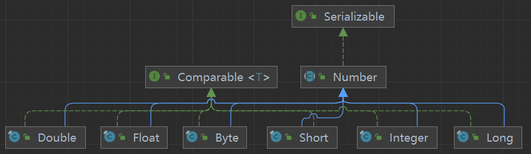

| 基本数据类型 | 包装类        |
| ------------ | ------------- |
| `boolean`  | `Boolean`   |
| `char`     | `Character` |
| `byte`     | `Byte`      |
| `short`    | `Short`     |
| `int`      | `Integer`   |
| `long`     | `Long`      |
| `float`    | `Float`     |
| `double`   | `Double`    |

- 包装类和基本数据类型

1. jdk5前的手动装箱和拆箱方式：装箱：基本类型->包装类型，反之，拆箱
2. jdk5以后(含jdk5)的自动装箱和拆箱方式
3. 自动装箱底层调用的是 `valueOf()`方法，比如 `Integer.valueOf()`
4. 其他包装类结果类似

```java
public class WrapperExercise01 {
    public static void main(String[] args) {
        Double d = 100d;    // 自动装箱：Double.valueOf(100d)
        Float f = 1.5f;     // 自动装箱：Float.valueOf(1.5f)

        Object obj1 = true ? new Integer(1) : new Double(2.0);  // 三元运算符，看作一个整体，精度提升为double
        System.out.println(obj1);   // 1.0

        Object obj2;
        if (true) {
            obj2 = new Integer(1);
        } else {
            obj2 = new Double(2.0);
        }
        System.out.println(obj2);   // 1

        // 包装类型和String类型的相互转换
        // 包装类(Integer)->String
        Integer i1 = 100;    // 自动装箱
        // 方式1
        String str1 = i1 + "";
        // 方式2
        String str2 = i1.toString();
        // 方式3
        String str3 = String.valueOf(i1);

        // String -> 包装类(Integer)
        String str4 = "1895";
        Integer i2 = Integer.parseInt(str4);    // 返回int类型，自动装箱为Integer
        Integer i3 = new Integer(str4); // 直接构造器接收 String 参数
        System.out.println("OK~");
    }
}
```

- Integer类和Character类的常用方法

```java
public class WrapperMethod {
    public static void main(String[] args) {
        System.out.println(Integer.MIN_VALUE);  // -2147483648
        System.out.println(Integer.MAX_VALUE);  // 2147483647

        System.out.println(Character.isDigit('8')); // true 判断是否是数字
        System.out.println(Character.isLetter('A'));    // true 判断是否是字母
        System.out.println(Character.isUpperCase('a'));    // false 判断是否是大写
        System.out.println(Character.isLowerCase('a'));    // true 判断是否是小写

        System.out.println(Character.isWhitespace('a'));    // false 判断是否是空格
        System.out.println(Character.toUpperCase('d')); // D 转成大写
        System.out.println(Character.toLowerCase('X')); // x 转成小写

        Integer i11 = 127;
        int i12 = 127;
        // 只要有基本数据类型，判断的是值是否相同
        System.out.println(i11 == i12); // true

        Integer i13 = 128;
        int i14 = 128;
        System.out.println(i13 == i14); // true
    }
}
```

- `String`类的理解和创建对象

1. `String`对象用于保存字符串，也就是一组字符序列
2. 字符串常量对象是用双引号括起来的字符序列。例如："你好", "13.14"
3. 字符串的字符使用 `Unicode`字符编码，一个字符(不区分字母还是汉字)占两个字节
4. `String`类较常用的构造方法
   - ```java
      String s1 = new String();
      String s2 = new String(String original);
      String s3 = new String(char[] a);
      String s4 = new String(char[] a, int startIndex, int count);
     ```

- **※两种创建String对象的区别※**

1. **直接赋值 `String s = "hsp";`**
   1. **方式一：先从常量池查看是否有 `"hsp"`数据空间，如果有，直接指向；如果没有则重新创建，然后指向。s最终指向的是常量池的空间地址**
2. **调用构造器 `String s2 = new String("hsp");`**
   1. **方式二：现在堆中创建空间，里面维护了value属性，指向常量池的hsp空间。如果常量池没有"hsp"空间，重新创建，如果有，直接通过value指向。最终指向的是堆中的空间地址。**
   2. 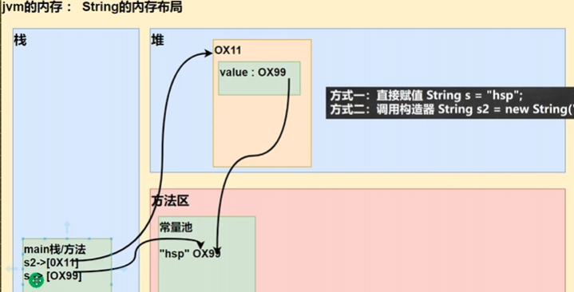

- `public String intern()`:
  - 当调用 `intern`方法时，如果池中已经包含了一个等于此String对象的字符串(用 `equals(Object)`方法确定)，则返回池中的字符串。否则，将此String对象添加到池中，并返回此String对象的引用。
  - 即 `b.intern()`方法最终返回的是常量池的地址/对象

```java
String s = "ab" + "cd";	// 编译器优化 -> String s = "abcd";

String a = "hello"; // 创建 a 对象
String b = "abc";   // 创建 b 对象
// 1. 先创建一个 StringBuilder sb = new StringBuilder();
// 2. 执行 sb.append("hello");
// 3.       sb.append("abc");
// 4. String c = sb.toString(); // new 了一个新对象
// 最后其实是 c 指向堆中的对象(String) value[] -> 池中 "helloabc"
String c = a + b;
String d = "helloabc";  // d 直接指向常量池中的 "helloabc"
System.out.println(c == d); // false
String e = "hello" + "abc";
System.out.println(d == e); // true
```

> 重要规则：
>
> - `String c1 = "ab" + "cd";`：常量相加，看的是池
> - `String c1 = a + b;`：变量相加，是在堆中

- String类的常见方法

`String`类是保存字符串常量的。每次更新都需要开辟空间，效率较低，因此java设计者还提供了 `StringBuilder`和 `StringBuffer`来增强 `String`的功能，并提高效率。

```java
public class StringMethod01 {
    public static void main(String[] args) {
        // 1. equals：比较内容是否相同，区分大小写
        String str1 = "hello";
        String str2 = "Hello";
        System.out.println(str1 == str2);   // false
        // 2. equalsIgnoreCase：忽略大小写，判断内容是否相同
        String name1 = "Charlie";
        if ("charlie".equalsIgnoreCase(name1)) {
            System.out.println("Success!"); // Success!
        } else {
            System.out.println("Failure!");
        }
        // 3. length：获取字符的个数，即字符串的长度
        System.out.println("橘子".length());  // 2
        // 4. indexOf：获取字符在字符串对象中第一次出现的索引，索引从0开始，如果找不到则返回-1
        String s1 = "Bruce@gmail.com";
        System.out.println(s1.indexOf('@'));    // 5
        // 5. lastIndexOf：获取字符在字符串对象中最后依次出现的索引，索引从0开始，如果没有返回-1
        s1 = "Bruce@com@";
        System.out.println(s1.lastIndexOf('@'));    // 9
        // 6. subString：截取指定范围的子串
        String name2 = "hello,张三";
        System.out.println(name2.substring(6)); // 从索引6开始截取后面所有内容
        System.out.println(name2.substring(2, 5));  // 截取索引[beginIndex, endIndex)范围的内容
    }
}
```

```java
public class StringMethod02 {
    public static void main(String[] args) {
        // 1. toUpperCase：转成大写
        String s = "Hello";
        System.out.println(s.toUpperCase());    // HELLO
        // 2. toLowerCase：装成小写
        System.out.println(s.toLowerCase());    // hello
        // 3. concat：拼接字符串
        String s1 = "木石";
        s1 = s1.concat("前盟").concat("阆苑仙葩").concat("美玉无瑕");
        System.out.println(s1); // 木石前盟阆苑仙葩美玉无瑕
        // 4. replace(oldChar, replacement)：替换字符串中的字符
        String s2 = "世人都晓神仙好，惟有功名忘不了！";
        s2 = s2.replace("功名", "金银");    // s1.replace()执行后，返回的结果才是替换过的，原对象无变化
        System.out.println(s2); // 世人都晓神仙好，惟有金银忘不了！
        // 5. split：分隔字符串，对于某些分隔字符，需要进行转义
        String poem = "安得广厦千万间，大庇天下寒士俱欢颜，风雨不动安如山";
        String[] split = poem.split("，");   // 以"，"为标准对 poem 进行分隔
        for (String str :
                split) {
            System.out.println(str);
        }
        String path = "E:\\aaa\\bbb";
        split = path.split("\\\\");
        for (String str :
                split) {
            System.out.println(str);    // E:   aaa bbb
        }
        // 6. toCharArray：转换成字符数组
        s = "happy";
        char[] chs = s.toCharArray();
        for (int i = 0; i < chs.length; i++) {
            System.out.print(chs[i] + " "); // h a p p y
        }
        System.out.println("");
        // 7. compareTo：比较两个字符串的大小，如果前者大，则返回正数，后者大，则返回负数，相等则返回0
        String a = "json";
        String b = "john";
        String c = "johnson";
        /*
        逐个比较字符，遇到不相同(如下标i)的则返回前一个对象的字符减去后一个对象的字符并返回该值，即 a.charAt(i) - b.charAt(i)
        如果前面部分都相同，则返回 a.length - b.length
         */
        System.out.println(a.compareTo(b)); // 返回值是 's' - 'o' = 4
        System.out.println(b.compareTo(c)); // 返回值是 b.length - c.length = -3
        // 8. format：格式化字符串
        // 1. %s %d %.2f %c 称为占位符
        // 2. 这些占位符由后面变量来替换
        // 3. %s：表示字符串；%d：表示正数；%c：表示字符；%.2f：表示浮点数，保留小数点后两位(四舍五入)
        String name = "张三";
        int age = 25;
        char gender = '男';
        double score = 278.5 / 3;
        String formatStr = "姓名：%s，性别：%c，年龄：%d，分数：%.2f";
        String info = String.format(formatStr, name, gender, age, score);
        System.out.println(info);   // 姓名：张三，性别：男，年龄：25，分数：92.83
    }
}
```

`2023-10-28:P475`

### StringBuffer类

- `java.lang.StringBuffer`代表可变的字符序列，可以对字符串内容进行增删
- 很多方法与 `String`相同，但 `StringBuffer`是可变长度的
- `StringBuffer`是一个容器

> String VS StringBuffer
>
> 1. String保存的是字符串常量，里面的值不能更改，每次String类的更新实际上就是更改地址，效率较低。`private final char value[];`
> 2. StringBuffer保存的是字符串变量，里面的值可以更改，每次StringBuffer的更新实际上可以更新内容，不用每次更新地址，效率较高。`char[] value;`放在堆中

- `StringBuffer`常用方法

```java
public class StringBufferMethod {
    public static void main(String[] args) {
        StringBuffer s = new StringBuffer("hello");
        // 增
        s.append(',');
        s.append("张三丰");
        s.append("太极").append(100).append(true).append(10.5);
        System.out.println(s);  // hello,张三丰太极100true10.5
        // 删
        s.delete(11, 14);   // 删除 [11, 14) 索引处字符
        System.out.println(s);  // hello,张三丰太极true10.5
        // 改
        s.replace(9, 11, "无极"); // 将 [9, 11) 索引处字符替换为 无极
        System.out.println(s);  // hello,张三丰无极true10.5
        // 查
        int index = s.indexOf("张三丰");
        System.out.println(index);  // 6
        // 插
        s.insert(9, "张无忌"); // 在索引为9的位置插入 "张无忌"，原来索引为9的内容自动后移
        System.out.println(s);
        // 长度
        System.out.println(s.length()); // 22
    }
}
```

### `StringBuilder`类

1. 一个可变的字符序列。此类提供了一个与 `StringBuffer`兼容的API，但不保证同步(StringBuilder不是线程安全)。该类被设计用作 `StringBuffer`的一个简易替换，**用在字符串缓冲区被单个线程使用的使用**。如果可能，建议优先使用该类，因为在大多数实现中，它比StringBuffer要快
2. 在StringBuilder上的主要操作是 `append`和 `insert`方法，可重载这些方法以接收任意类型的数据。

> `String, StringBuffer 和 StringBuilder`的比较
>
> 1. `StringBuilder`和 `StringBuffer`非常类似，均代表可变的字符序列，而且方法也一样
> 2. `String`：不可变字符序列，效率低，但是**复用率高**
>    1. 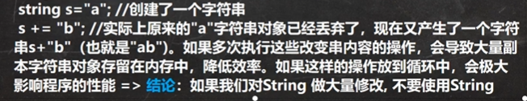
>    2. 如果对 `String`做大量修改，不要使用 `String`
>    3. 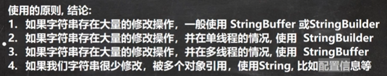
> 3. `StringBuffer`：可变字符序列、效率较高(增删)、线程安全 `synchronized`
> 4. `StringBuilder`：可变字符序列、效率最高、线程不安全

### `Math`类

```java
public class MathMethod {
    public static void main(String[] args) {
        // 常用的静态属性
        System.out.println("e: " + Math.E);
        System.out.println("PI: " + Math.PI);
        // 常用的静态方法
        // 1. abs：求绝对值
        System.out.println(Math.abs(-12));  // 12
        // 2. pow：求幂
        System.out.println(Math.pow(2, 4)); // 16.0
        // 3. ceil：向上取整，返回 >= 该参数的最小整数(->double)
        System.out.println(Math.ceil(-3.0001)); // -3.0
        // 4. floor：向下取整，返回 <= 该参数的最大整数(->double)
        System.out.println(Math.floor(-4.9999));   // -5.0
        // 5. round：四舍五入
        System.out.println(Math.round(5.51)); // 6
        // 6. sqrt：求开方
        System.out.println(Math.sqrt(9));   // 3.0
        // 7. random：求随机数，返回的是 [0, 1) 之间的一个随机小数
        System.out.println(Math.random());
        // 获取 [a, b] 之间的一个整数！
        // (int)(a + Math.random() * (b - a + 1))
        System.out.println((int)(2 + Math.random() * (7 - 2 + 1))); // 返回 [2, 7] 之间的一个随机整数
        // 8. max, min：返回两个数之间的最大值、最小值
        System.out.println(Math.max(10, 66));   // 66
        System.out.println(Math.min(10, 66));   // 10
    }
}
```

### `Arrays`类

1. `toString()`：返回数组的字符串形式
2. `sort()`：排序(默认排序和自定义排序)
3. `binarySearch()`：通过二分搜索法进行查找，要求必须排好序

```java
import java.util.Arrays;
import java.util.Comparator;

public class ArraysMethod01 {
    public static void main(String[] args) {
        // toString()
        Integer[] integers = {1, 8, 9, 5};
        System.out.println(Arrays.toString(integers));  // [1, 8, 9, 5]

        // sort()
        Integer[] arr = {1, -1, 7, 0, 89};
//        Arrays.sort(arr);   // 因为数组是引用类型，所以通过 sort 方法，会直接影响到实参 arr。默认升序排序
        System.out.println(Arrays.toString(arr));   // [-1, 0, 1, 7, 89]
        // sort()方法重载，通过传入一个接口 Comparator 实现自定义排序
        // 调用 自定义排序 时，传入两个参数 (1) 排序的数组 arr
        // (2) 实现了 Comparator 接口的匿名内部类，要求实现 compare 方法
        Arrays.sort(arr, new Comparator() {
            @Override
            public int compare(Object o1, Object o2) {
                Integer i1 = (Integer) o1;
                Integer i2 = (Integer) o2;
//                return i1 - i2;   // 升序排序
                return i2 - i1;     // 降序排序
            }
        });
        System.out.println("===排序后===");
        System.out.println(Arrays.toString(arr));

        Integer[] arr = {1, 2, 6, 10, 22, 63};
        // binarySearch：通过二分搜索进行查找，要求必须有序
        // 1. 使用 binarySearch 二分查找
        // 2. 要求该数组是有序的，如果该数组无序，则不能使用
        // 3. 如果数组中不存在该元素，则返回 如果存在是应处位置 low -> -(lor + 1)
        int index = Arrays.binarySearch(arr, 16);
        System.out.println("index=" + index);

        // copyOf：数组元素的数值
        // 1. 从 arr 数组中，拷贝 arr.length 个元素到 newArr 数组中
        // 2. 如果拷贝的长度 > arr.length ，就在新数组的后面，增加 null
        // 3. 如果拷贝长度 < 0，抛出异常
        // 4. 该方法的底层使用的是 System.arraycopy()
        Integer[] newArr = Arrays.copyOf(arr, arr.length);
        System.out.println(Arrays.toString(newArr));    // [1, 2, 6, 10, 22, 63]

        // fill：数组元素的填充
        // 1. 使用 key:99 去填充 num 数组，可以理解为替换原数组元素
        Integer[] num = new Integer[]{10, 7, 5};
        Arrays.fill(num, 99);
        System.out.println("===num数组填充后===");
        System.out.println(Arrays.toString(num));   // [99, 99, 99]

        // equals：比较两个数组元素内容是否完全一致
        // 1. 如果 arr 和 arr2 数组中元素完全一样，则方法返回 ture；否则返回 false
        Integer[] arr2 = new Integer[]{1, 2, 6, 10, 22, 63};
        boolean equals = Arrays.equals(arr, arr2);
        System.out.println(equals); // true

        // asList：将一组值，转换成 list
        // 1. asList方法，会将 (2, 5, 9, 7) 数据转成一个 List 集合
        // 2. 返回的 asList 编译类型是 List(接口)
        // 3.       asList 运行类型是 java.util.Arrays$ArrayList
        // Arrays 的静态内部类 private static class ArrayList<E> extends AbstractList<E>
        //                      implements RandomAccess, java.io.Serializable
        List asList = Arrays.asList(2, 5, 9, 7);
        System.out.println("asList=" + asList); // asList=[2, 5, 9, 7]
        System.out.println("asList.getClass()=" + asList.getClass());   // class java.util.Arrays$ArrayList
    }
```

`2023-10-29:P486`

### `System`类

1. `exit`：退出当前程序
2. `arraycopy`：复制数组元素，比较适合底层调用，一般使用 `Array.copyOf()`完成复制数组
3. `currentTimeMillens`：返回当前时间距离 `1970-01-01`的毫秒数
4. `gc`：运行垃圾回收机制 `System.gc()`

### `BigInteger`和 `BigDecimal`类

1. `BigInteger`适合保存比较大的整型
2. `BigDecimal`适合保存精度更高的浮点数(小数)

### 日期类(`Date, Calendar, `)

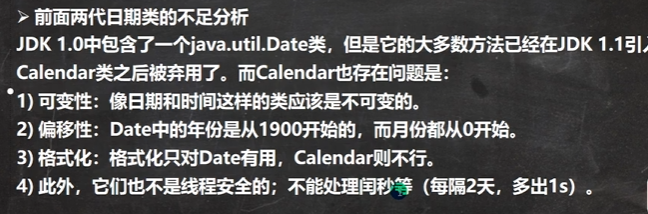


1

## END
