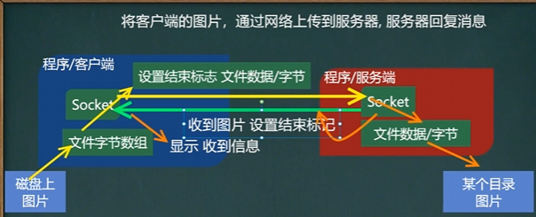

# Java

<!-- TOC -->
* [Java](#java)
  * [方法递归调用](#方法递归调用)
  * [对象创建的流程分析](#对象创建的流程分析)
  * [this](#this)
  * [包](#包)
  * [访问修饰符](#访问修饰符)
  * [面向对象编程-封装](#面向对象编程-封装)
  * [面向对象编程-继承](#面向对象编程-继承)
  * [super关键字](#super关键字)
  * [方法重写/覆盖 `override`](#方法重写覆盖-override)
  * [面向对象编程-多态](#面向对象编程-多态)
  * [Object类详解](#object类详解)
  * [断点调试](#断点调试)
  * [房屋出租系统](#房屋出租系统)
  * [类变量和类方法](#类变量和类方法)
  * [理解main方法语法](#理解main方法语法)
  * [代码块](#代码块)
  * [单例设计模式](#单例设计模式)
  * [final关键字](#final关键字)
  * [抽象类](#抽象类)
  * [接口(interface)](#接口interface)
  * [内部类](#内部类)
  * [枚举](#枚举)
  * [注解的理解](#注解的理解)
  * [异常介绍](#异常介绍)
  * [包装类](#包装类)
  * [StringBuffer类](#stringbuffer类)
  * [`StringBuilder`类](#stringbuilder类)
  * [`Math`类](#math类)
  * [`Arrays`类](#arrays类)
  * [`System`类](#system类)
  * [`BigInteger`和 `BigDecimal`类](#biginteger和-bigdecimal类)
  * [日期类(`Date, Calendar, `)](#日期类date-calendar-)
  * [集合](#集合)
  * [泛型](#泛型)
  * [坦克大战](#坦克大战)
  * [java事件处理机制](#java事件处理机制)
  * [线程](#线程)
  * [IO流原理及流的分类](#io流原理及流的分类)
  * [Java网络编程](#java网络编程)
  * [多用户通信系统](#多用户通信系统)
  * [反射机制(reflection)](#反射机制reflection)
  * [MySQL](#mysql)
    * [数据库三层结构](#数据库三层结构)
    * [数据库](#数据库)
      * [创建数据库](#创建数据库)
      * [查看、删除数据库](#查看删除数据库)
      * [备份和恢复数据库](#备份和恢复数据库)
    * [表](#表)
      * [创建表](#创建表)
      * [Mysql常用数据类型(列类型)](#mysql常用数据类型列类型)
      * [修改表](#修改表)
      * [CRUD](#crud)
      * [统计相关函数](#统计相关函数)
      * [字符串相关函数](#字符串相关函数)
      * [数学相关函数](#数学相关函数)
      * [时间日期相关函数](#时间日期相关函数)
      * [加密函数和系统函数](#加密函数和系统函数)
      * [流程控制函数](#流程控制函数)
      * [mysql表查询-加强](#mysql表查询-加强)
      * [多表查询](#多表查询)
      * [表子查询](#表子查询)
      * [表复制](#表复制)
      * [合并查询](#合并查询)
      * [mysql表外连接](#mysql表外连接)
    * [约束](#约束)
      * [自增长](#自增长)
    * [索引](#索引)
    * [事务](#事务)
      * [事务操作](#事务操作)
      * [隔离级别](#隔离级别)
      * [存储引擎](#存储引擎)
    * [视图](#视图)
    * [Mysql管理](#mysql管理)
  * [JDBC](#jdbc)
    * [JDBC概述](#jdbc概述)
    * [获取数据库连接的5种方式](#获取数据库连接的5种方式)
    * [ResultSet结果集](#resultset结果集)
    * [Statement](#statement)
    * [PreparedStatement](#preparedstatement)
    * [JDBC相关API小结](#jdbc相关api小结)
    * [封装JDBCUtils](#封装jdbcutils)
    * [事务](#事务-1)
    * [批处理](#批处理)
    * [数据库连接池](#数据库连接池)
    * [Apache-DBUtils](#apache-dbutils)
    * [DAO和增删改查通用方法-BasicDao](#dao和增删改查通用方法-basicdao)
  * [正则表达式](#正则表达式)
    * [正则表达式原理](#正则表达式原理)
    * [正则表达式语法](#正则表达式语法)
      * [选择匹配符](#选择匹配符)
      * [限定符](#限定符)
      * [定位符](#定位符)
      * [分组](#分组)
    * [正则表达式三个常用类](#正则表达式三个常用类)
    * [分组、捕获、反向引用](#分组捕获反向引用)
    * [String类中使用正则表达式](#string类中使用正则表达式)
    * [Java正则表达式参考](#java正则表达式参考)
      * [一、校验数字的表达式](#一校验数字的表达式)
      * [二、校验字符的表达式](#二校验字符的表达式)
      * [三、特殊需求表达式](#三特殊需求表达式)
<!-- TOC -->

## 方法递归调用

> **递归就是方法自己调用自己**,每次调用时传入不同的变量.递归有助于编程者解决复杂问题,
> 同时可以让代码变得简洁

|  |  |
|-------------------|---------------------|

```html
package chapter07;

public class Recursion01 {
    public static void main(String[] args) {
        /** 方法递归调用
         * 1. 执行一个方法时，就创建一个新的受保护的独立空间(栈空间)
         * 2. 方法的局部变量是独立的，不会相互影响
         * 3. 如果方法中使用的是引用类型变量(比如数组)，就会共享该引用类型的数据
         * 4. 递归必须向退出递归的条件逼近，否则就是无限递归，出现 StackOverflowError
         * 5. 当一个方法执行完毕，或者遇到return，就会返回，遵守谁调用，就将
         *      结果放回给谁，同时当方法执行完毕或者返回时，该方法也就执行完毕
         */
        T t1 = new T();
        t1.test(4);
        System.out.println("5! = " + t1.factorial(5));  // 5! = 120
        System.out.println("fibonacci(20) = " + t1.fibonacci(20));
        System.out.println("fibo(20) = " + t1.fibo(20));
    }
}

class T {
    public void test(int n) {
        if (n > 2) {
            test(n - 1);
        }
        System.out.println("n = " + n);
    }

    public int factorial(int n) {
        if (n == 0 || n == 1) {
            return 1;
        } else {
            return factorial(n - 1) * n;
        }
    }

    public int fibonacci(int n) {
        if (n == 1 || n == 2) {
            return 1;
        }
        return fibonacci(n - 1) + fibonacci(n - 2);
    }

    public int fibo(int n) {
        int a = 0, b = 1, tmp;
        for (int i = 1; i < n; ++i) {
            tmp = b;
            b += a;
            a = tmp;
        }
        return b;
    }
}
```

## 对象创建的流程分析

```java
class Person {
    String name;
    int age = 18;
    // 构造器
    public Person(String name, int age) {
        this.name = name;
        this.age = age;
    }
    public Person() {   // 默认构造函数
        age = 18;
    }
}

// Person p = new Person("Bruce", 12);
```

> 执行 `Person p = new Person("Bruce", 12);`
>
> 1. 在方法区加载 `Person`类，只会加载一次。
> 2. 在堆区分配空间(地址)，如 `0x1122`，存放 `age`和 `name`。
> 3. 完成对象初始化。
>    1. 先进行**默认初始化**，`age = 0; name -> null`；
>    2. 然后将 `age`**显式初始化**为90
>    3. 最后执行**构造器初始化**，在常量池存放 `String`的值 `Bruce`，地址为 `0x1133`，堆区 `name`存放该地址。将 `age`更改为20.
> 4. 将对象在堆中的地址 `0x1122`返回给引用 `p`，`p`在栈区，是对象的引用。

## this

```java
package chapter07;
public class This {
    public static void main(String[] args) {
        /** This
         * 1. this关键字可以用来访问本类的属性、方法、构造器
         * 2. this用于区分当前类的属性和局部变量
         * 3. 访问成员方法的语法：this.方法名(参数列表)
         * 4. 访问构造器语法：this(参数列表)；只能在构造器中使用
         *      即，只能在构造器中访问另外一个构造器
         *      并且必须放在第一条语句
         * 5. this不能再类定义的外部使用，只能在类定义的方法中使用
         */
        T t1 = new T();
        t1.f2();
    }
}

class T {

    String name;
    int age;

    public T() {
        // 注意：如果有this(参数列表);
        // 则该语句必须放在第一条语句
        this("jack", 100);
        System.out.println("T() 构造器");
    }
    public T(String name, int age) {
        System.out.println("T(String name, int age) 构造器");
    }

    public void f1() {
        System.out.println("f1() 方法...");
    }
  
    public void f2() {
        System.out.println("f2() 方法...");
        // 调用本类的f1
        f1();
        this.f1();
    }

    public void f3() {
        System.out.println("name = " + name + " age = " + age);
        System.out.println("this.name = " + this.name + " this.age = " + this.age);
    }
}

class Person {
    String name;
    int age;

    public Person(String name, int age) {
        this.name = name;
        this.age = age;
    }

    public boolean compareTo(Person p) {
        return this.name.equals(p.name) && this.age == p.age;
    }
}
```

## 包

包的三大作用：

1. 区分相同名字的类
2. 当类很多时，可以很好的管理类
3. 控制访问范围

包基本语法：`package com.hspedu`

1. `package`是关键字，表示打包
2. `com.hspedu`表示包名

包的本质：**实际上就是创建不同的文件夹/目录来保存类文件**

## 访问修饰符

- 4种访问修饰符的访问范围

| 访问级别 | 访问控制修饰符 | 同类 | 同包 | 子类 | 不同包 |
| -------- | -------------- | ---- | ---- | ---- | ------ |
| 公开     | `public`     | √   | √   | √   | √     |
| 受保护   | `protected`  | √   | √   | √   | ×     |
| 默认     | 没有修饰符     | √   | √   | ×   | ×     |
| 私有     | `private`    | √   | ×   | ×   | ×     |

- 使用注意事项

1. 修饰符可以用来修饰类种的属性，成员方法以及类
2. 只有默认的和 `public`才能修饰类！并且遵循上述访问权限的特点
3. **成员方法**的访问规则和**属性**完全一样

## 面向对象编程-封装

**封装**(`encapsulation`)就是把抽象出的数据[属性]和对数据的操作[方法]封装在一起，数据被保护在内部，程序的其他部分只有通过被授权的操作[方法]，才能对数据进行操作。

- 封装的理解和好处

1. 隐藏实现细节：方法(连接数据库) <--- 调用(传入参数)
2. 可以堆数据进行验证，保证安全合理

- 封装的实现步骤

1. 将属性进行私有化 `private`【不能直接修改属性】
2. 提供一个公共的(public)set方法，用于堆属性判断并赋值
3. 提供一个公共的(public)get方法，用于获取属性的值

## 面向对象编程-继承

> 继承可以解决代码复用，让编程更加接近人类思维。当多个类存在相同属性(变量)和方法时，可以从这些类种抽象出父类，在父类种定义这些相同的属性和方法，所有的子类不需要重新定义这些属性和方法，只需要通过 `extends`来声明继承父类即可。

- 继承的基本语法 `class 子类 extends 父类{}`

1. 子类就会自动拥有父类定义的属性和方法
2. 父类又叫超类、基类。子类又叫派生类

- 继承的深入讨论/细节

1. 子类继承了所有属性和方法，但是私有属性和方法不能在子类直接访问，要通过**父类提供公共的方法来访问**。
2. 子类必须调用父类的构造器，完成父类的初始化
3. 当创建子类对象时，不管使用子类的哪个构造器，默认情况下总会调用父类的无参构造器。如果父类没有提供无参构造器，则必须在子类的构造器中用 `super` 去显式指定使用父类的哪个构造器完成对象父类的初始化工作，否则，编译不会通过。
4. 如果希望指定去调用父类的某个构造器，则显式地指定它
5. `super`使用的时候，必须放在构造器的第一行，并且 `super`只能在构造器中使用
6. `super()`和 `this()`都只能放在构造器第一行，因此这两个方法不能共存在一个构造器中。
7. java所有类都是 `Object`类的子类，即 `Object`使所有类的基类。光标指定某个类，使用快捷键 `ctrl+H`可以查看该类的继承关系。
8. 父类构造器的调用不限于直接父类！将一直往上追溯知道 `Object`类(顶级父类)
9. 子类最多只能继承一个父类(指直接继承)，即java中是**单继承机制**。
10. 不能滥用继承，子类和父类之间必须满足 `is-a` 的逻辑关系。

- 继承的本质分析(重要)

```java
package com.hspedu.extend_;

public class ExtendTheory {
    public static void main(String[] args) {
        Son son = new Son();    // 内存的布局
        // ?-> 按照查找关系来返回信息
        // (1) 首先看子类是否有这个属性
        // (2) 如果子类有这个属性，并且可以访问，则返回信息
        // (3) 如果子类没有这个属性，就看父类有没有这个属性(如果父类有该属性，并且可以访问，就返回信息...)
        // (4) 如果父类没有就按照(3)的规则，继续找上级父类，直到Object
        // 当查找到属性存在某个父类中时，如果没有访问权限就会报错，而不是继续向上级父类继续查找！
        System.out.println(son.name);   // 大头儿子；Son类中name是默认访问权限，在同一个包下可以访问
        System.out.println(son.age);    // 39
        System.out.println(son.hobby);  // 旅游
    }
}

class GrandPa {
    String name = "大头爷爷";
    String hobby = "旅游";
}
class Father extends GrandPa {
    String name = "大头爸爸";
    int age = 39;
}
class Son extends Father {
    String name = "大头儿子";
}
```

执行 `Son son = new Son();`内存中的布局

1. 在方法区加载类。首先加载 `Object`，然后依次加载 `GranPa`，`Father`，`Son`
2. 在堆区开辟内存。首先为 `GrandPa`的属性开辟空间，然后依次为 `Father`，`Son`开辟内存空间。
3. 最后将对象地址 `0x11`返回给引用变量。对象中包含所有继承的属性。


## super关键字

- 基本介绍

`super`代表父类的引用，用于访问父类的属性、方法、构造器

- 基本语法

1. 访问父类的属性，但不能访问父类的 `private`属性。`super.属性`
2. 访问父类的方法，不能访问父类的 `private`方法。`super.方法名(参数列表)`
3. 访问父类的构造器：`super(参数列表)`；只能放在构造器的第一句，只能出现一句。

- super给编程带来的遍历/细节

1. 调用父类的构造器的好处(分工明确，父类属性由父类初始化，子类的属性由子类初始化)
2. 当子类中有和父类的成员(属性和方法)重名时，为了访问父类的成员，必须通过 `super`。如果没有重名，使用 `super`、`this` 和直接访问结果是一样的。`2023-10-12:P300`
3. `super`的访问不限于直接父类，如果爷爷类和本类中有同名的成员，也可以直接使用 `super`去访问爷爷类的成员；如果多个基类(上级类)中多有同名的成员，使用 `super`访问遵循就近原则。`A->B->C`。当然也需要遵循访问权限规则。

- `super`和 `this`的比较

| 区别点       | this                                                   | super                                    |
| ------------ | ------------------------------------------------------ | ---------------------------------------- |
| 访问属性     | 访问本类中的属性，如果本类没有此属性则从父类中继续查找 | 从父类开始查找属性                       |
| 调用方法     | 访问本类中的方法，如果本类没有此属性则从父类中继续查找 | 直接访问父类中的方法                     |
| 调用构造函数 | 调用本类构造器，必须放在构造器的首行                   | 调用父类构造器，必须放在子类构造器的首行 |
| 特殊         | 表示当前对象                                           | 子类中访问父类对象                       |

## 方法重写/覆盖 `override`

- 方法重写就是子类中有一个方法，和父类的某个方法的**名称、返回类型、参数都一样**，那么就说子类的这个方法重写/覆盖了父类的那个方法。

方法重写/覆盖，需要满足下面的条件

1. 子类方法的**形参列表，方法名称**，要和父类的参数，方法名称**完全一样**。
2. **子类方法的返回类型和父类方法的返回类型一样，或者是父类返回类型的子类**，必须父类返回类型是 `Object`，子类方法返回类型是 `String`。
3. 子类方法不能缩小父类方法的访问权限。

- 方法重写和重载

| 名称           | 发生范围 | 方法名   | 形参列表                         | 返回类型                                                         | 修饰符                                   |
| -------------- | -------- | -------- | -------------------------------- | ---------------------------------------------------------------- | ---------------------------------------- |
| 重载(overload) | 本类     | 必须一样 | 类型，个数或者顺序至少有一个不同 | 无要求                                                           | 无要求                                   |
| 重写(override) | 父子类   | 必须一样 | 相同                             | 子类重写方法，返回的类型和父类返回的<br />类型一致，或者是其子类 | 子类方法不能缩小<br />父类方法的访问范围 |

## 面向对象编程-多态

- 多态(Polymorphic)：多态是建立在封装和继承基础之上的，面向对象的第三大特征。
- 多态的具体体现

1. 方法的多态：
   1. 方法的重载：通过传入不同的参数，实现对不同方法的调用
   2. 方法的重写：通过不同对象调用，实现调用不同的方法
2. **对象的多态**
   1. **一个对象的编译类型和运行类型可以不一致**
   2. **编译类型在定义对象时，就确定了，不能改变**
   3. **运行类型是可以变化的**
   4. **编译类型看定义时 `=`号的左边，运行类型看 `=`的右边**

- 多态注意事项和细节讨论
  - 多态的前提是：两个(类)存在继承关系
  - 多态的向上转型

1. 本质：父类的引用指向了子类的对象
2. 语法：`父类类型 引用名 = new 子类类型();`
3. 特点：编译类型看左边，运行类型看右边。
4. **可以调用父类中的所有成员(需遵循访问权限)；不能调用子类中特有成员；最终运行效果看子类的具体实现。**

- 多态的向下转型

1. 语法：`子类类型 引用名 = (子类类型) 父类引用;`
2. 只能强转父类的引用，不能强转父类的对象
3. 要求父类的引用必须指向的是当前目标类型的对象
4. 当向下转型后，就可以调用子类类型中的所有成员

```java
package com.hspedu.poly_.detail_;

public class PolyDetail {
    public static void main(String[] args) {
        // 向上转型：父类的引用指向子类的对象
        Animal animal = new Cat();
        Object object = new Cat();  // 也可以

//        animal.catchMouse();  // 但是不能调用子类的特有成员，因为在编译阶段，能调用哪些成员，是由编译类型来决定的
        // 最终运行效果看子类(运行类型)的具体实现，即调用方法时，按照从子类(运行类型)开始查找方法
        // 然后调用，规则如之前方法调用规则一致
        animal.show();  // 可以调用父类的所有成员(遵循访问权限)
        animal.eat();   // 猫吃鱼；调用的子类方法
        animal.run();   // 运行时，方法调用看运行类型，先从子类 Cat 中查找方法
        animal.sleep();

        // 向下转型
        // (1) 将父类的引用，强转为子类类型。语法：子类类型 引用名 = (子类类型) 父类引用;
        Cat cat = (Cat) animal; // cat的编译类型是 Cat，运行类型是 Cat
        // 编译类型是 Cat 所以可以调用 catchMouse，运行类型是 Cat，所以从 Cat类开始查找方法
        cat.catchMouse();   // 猫抓老鼠；
        // (2) 要求父类的引用必须指向的是当前目标类型的对象
//        Dog dig = (Dog) animal; // 错误，animal指向的不是目标类型 Dog 的对象
        System.out.println("OK~");
    }
}
```

- 多态的注意事项和细节讨论
  - 属性没有重写之说！属性的值看编译类型
  - `instance of`比较操作符，用于判断对象的类型是否为XX类型或XX类型的字类型。`a instanceof A`：判断a的**运行类型**是否是A！

  ```java
  public class PolyDetail02 {
      public static void main(String[] args) {
          // 属性没有继承之说！属性的值看编译类型
          Base base = new Sub();
          System.out.println("base.count=" + base.count); // base.count=10
          Sub sub = new Sub();
          System.out.println("sub.count=" + sub.count);   // sub.count=20
      }
  }
  class Base {
      int count = 10;
  }

  class Sub extends Base {
      int count = 20;
  }
  ```

```java
public class PolyDetail03 {
    public static void main(String[] args) {
        // a instanceof A ：判断 a 是否是 A类型或者A类型的字类型
        BB bb = new BB();
        System.out.println("bb instanceof BB: " + (bb instanceof BB));   // true
        System.out.println("bb instanceof AA: " + (bb instanceof AA));   // true

        // 是编译类型还是运行类型？ -> 运行类型！
        AA aa = new BB();
        System.out.println("aa instanceof BB: " + (aa instanceof BB));   // true
        System.out.println("aa instanceof AA: " + (aa instanceof AA));   // true

        Object obj = new Object();
        System.out.println("obj instanceof AA: " + (obj instanceof AA));   // false
        String str = "Hello";
        System.out.println("str instanceof Object: " + (str instanceof Object));  // true
    }
}

class AA { }
class BB extends AA { }
```

- **java的动态绑定机制(非常非常重要)**
  1. 当调用对象方法的时候，该方法会和该对象的**内存地址/运行类型**绑定
  2. **当调用对象属性时，没有动态绑定机制，哪里声明，哪里**使用。`2023-10-13:P316`

```java
package com.hspedu.poly_.dynamic_;

public class DynamicBinding {
    public static void main(String[] args) {
        // a 的编译类型是 A，运行类型是 B
        A a = new B();  // 向上转型
        /*
        1. 当调用对象方法时，该方法会和该对象的内存地址/运行类型绑定
        2. 当调用对象属性时，没有动态绑定机制，哪里声明，哪里使用
         */
        System.out.println("a.sum(): " + a.sum());  // a.sum(): 40 -> 30
        System.out.println("a.sum1(): " + a.sum1());    // a.sum1(): 30 -> 20
        System.out.println("a.i: " + a.i);    // 10，属性不会继承，调用属性时根据编译类型来
    }
}

class A {
    public int i = 10;
    // 动态绑定
    public int sum() {
        return getI() + 10; // 20 + 10 -> 30
    }
    public int sum1() {
        return i + 10;  // 10 + 10 -> 20
    }
    public int getI() {
        return i;
    }
}

class B extends A {
    public int i = 20;
//    public int sum() {
//        return i + 20;
//    }
    public int getI() {
        return i;
    }
//    public int sum1() {
//        return i + 10;
//    }
}
```

多态数组
    - 数组的定义类型为父类类型，里面保存的实际元素类型为子类类型。

多态实参
    - 方法定义的形参类型为父类型，实参类型允许子类类型

## Object类详解

- `equal`方法：`==`和 `equals`的对比

1. **`==`：既可以判断基本类型，又可以判断引用类型**
2. **`==`：如果判断基本类型，判断的是值是否相等。**
3. **`==`：如果判断引用类型，判断的是地址是否相等，即判定是不是同一个对象。**
4. **`equals`：是 `Object`类中的方法，只能判断引用类型**
5. **默认判断的是地址是否相等，子类中往往重写该方法，用于判断内容是否相等。**

```java
package com.hspedu.object_;

public class Equals01 {
    public static void main(String[] args) {
        A a = new A();
        A b = a;
        A c = b;
        // ==：对于引用类型，判断的是不是同一个对象
        System.out.println(a == c); // true
        System.out.println(b == c); // true

        B obj = a;  // 虽然编译类型不同，但是指向的内存地址相同
        System.out.println(obj == a);   // true

        // ==：对于基本类型，判断的是值是否相等
        int num1 = 10;
        double num2 = 10.0;
        System.out.println(num1 == num2);   // true

        // 查看实现/原码：ctrl + b
        // equals()只能判断引用类型，默认判断的是地址是否相等
        "Hello".equals("hello");
/*
    public boolean equals(Object anObject) {
        if (this == anObject) { // 如果是同一个对象(地址相同)
            return true;        // 返回 true
        }
        if (anObject instanceof String) {   // 判断类型
            String anotherString = (String)anObject;    // 向下转型
            int n = value.length;
            if (n == anotherString.value.length) {  // 如果长度相同
                char v1[] = value;
                char v2[] = anotherString.value;
                int i = 0;
                while (n-- != 0) {  // 一个一个比较字符
                    if (v1[i] != v2[i])
                        return false;
                    i++;
                }
                return true;    // 如果两个字符串的所有字符都相等，则返回true
            }
        }
        return false;
    }
 */
        Integer i = new Integer(100);
        Integer i1 = new Integer(100);
        System.out.println(i == i1);    // false    引用类型，判断的是否为同一对象
        System.out.println(i.equals(i1));   // true 重写equals方法，先判断是否为同一类型，再判断值是否相等
        System.out.println(i.equals(100.));   // false 类型不同，直接返回false

        String str1 = new String("Charlie");
        String str2 = new String("Charlie");
        System.out.println(str1 == str2);   // 引用类型，判断地址不同，返回 false
        System.out.println(str1.equals(str2));  // true 值相同
    }
}

class B {}
class A extends B {}
```

- `hashCode()`方法

1. 提高具有哈希结构的日期的效率！
2. 两个引用，如果指向同一个对象，则哈希值是一样的！
3. 两个引用，如果指向的是不同对象，则哈希值是不一样的
4. 哈希值主要根据地址号来的！不能完全将哈希值等价于地址
5. 后面在集合中 `hashCode`如果需要的话，也会重写

```java
public class HashCode {
    public static void main(String[] args) {
        AA aa = new AA();
        AA aa2 = new AA();
        AA aa3 = aa;
        System.out.println("aa.hashCode()=" + aa.hashCode());   // 460141958
        System.out.println("aa2.hashCode()=" + aa2.hashCode()); // 1163157884
        System.out.println("aa3.hashCode()=" + aa3.hashCode()); // 460141958
    }
}
class AA {}
```

- `toString()`方法

1. 默认返回：全类名+`@`+哈希值的十六进制。全类名包含包名
2. 子类往往会重写 `toString`方法，用于返回对象的属性信息
3. 当直接输出一个对象时，`toString`方法会被默认调用

```java
package com.hspedu.object_;

public class ToString_ {
    public static void main(String[] args) {
        /*  Object中的toString()方法
        // 1. getClass().getName()：类的全类名(包名+类名)
        // 2. Integer.toHexString(hashCode())：将对象的 hashCode 值转成16进制字符串
            public String toString() {
                return getClass().getName() + "@" + Integer.toHexString(hashCode());
            }
         */

        Monster monster = new Monster("小旋风", "巡山", 200);
//        System.out.println(monster.toString()); // 重写前：com.hspedu.object_.Monster@1b6d3586
        System.out.println(monster.toString()); // 重写后：Monster{name='小旋风', job='巡山', salary=200.0}
        System.out.println(monster);    // 当输出一个对象时，toString方法会被默认调用；输出同上
    }
}

class Monster {
    private String name;
    private String job;
    private double salary;

    public Monster(String name, String job, double salary) {
        this.name = name;
        this.job = job;
        this.salary = salary;
    }

    // 重写toString方法，输出对象的属性
    @Override
    public String toString() {  // 重写后，一般是把属性输出
        return "Monster{" +
                "name='" + name + '\'' +
                ", job='" + job + '\'' +
                ", salary=" + salary +
                '}';
    }
}
```

- `finalize`方法

1. 当对象被回收时，系统自动调用该对象的 `finalize`方法。子类可以重写该方法，做一些**释放资源**的操作
2. 什么时候被回收：当某个对象没有任何引用时，则jvm就认为这个对象是一个垃圾对象，就会使用垃圾回收机制来销毁该对象，在销毁该对象前，会先调用 `finalize`方法
3. 垃圾回收机制的调用，是由系统来决定的，也可以通过 `System.gc()`主动触发垃圾回收机制

## 断点调试

1. 在断点调试过程中，是**运行状态**，是以对象的**运行类型**来执行的 `2023-10-15:P331`

| 快捷键       | 功能                     |
| ------------ | ------------------------ |
| `F7`       | 跳入方法内               |
| `F8`       | 跳过                     |
| `shift+F8` | 跳出方法                 |
| `F9`       | resume，执行到下一个断点 |

> 既可以在本文件下断点，也可以在系统文件下断点
>
> 可以动态地下断点

| 访问修饰符    | 本类 | 同包 | 子类 | 不同包 |
| ------------- | ---- | ---- | ---- | ------ |
| `public`    | √   | √   | √   | √     |
| `protected` | √   | √   | √   | ×     |
| `默认`      | √   | √   | ×   | ×     |
| `private`   | √   | ×   | ×   | ×     |

> 1.说出 `==`和 `equals`的区别？
>
> - `==`是比较运算符。既可以用于基本数据类型，也可以用于引用类型。对基本类型，判断值是否相等；对引用类型，判断是否为同一个对象的引用。
> - `equals`是 `Object`类中的方法。不能用于基本数据类型，只用于判断是否为同一个对象的引用，一般在自定义类型时都会重写该方法。
>
> 2.什么是多态，多态具体体现有哪些？
>
>> 方法或对象具有多种形态，是OOP的第三大特征，是建立在封装和继承基础之上。多态具体体现：
>>
>> 1. 方法多态：
>>    1. 重载体现多态
>>    2. 重写体现多态
>> 2. 对象多态
>>    1. 对象的编译类型和运行类型可以不一致，编译类型在定义时，就确定，不能变化。
>>    2. 对象的运行类型是可以变化的，可以通过 `getClass()`查看运行类型
>>    3. 编译类型看定义时 `=`的左边，运行类型看 `=`的右边。
>>
>
> 3. `java`的多态绑定机制是什么？
>
>> 1. 当调用对象的**方法**时，该方法会和对象的**内存地址/运行类型**绑定。
>> 2. 当调用对象的**属性**时，没有动态绑定机制，遵守“哪里声明，那里使用”。
>>

## 房屋出租系统

房屋租赁程序框架(分层模式)
- `view`：界面
- `service`：业务层
- `domain/model`：数据层
- `utils`：工具类
- `HouseRentApp`：程序入口

|   |   |   |
|---|---|---|

## 类变量和类方法

- 什么是类变量

> 类变量也叫静态变量/静态属性，是该类的所有对象共享的变量，任何一个该的对象访问它时，取到的都是相同的值，同样任何一个该类的对象去修改它时，修改的也是同一个变量。

- 如何定义类变量

> `访问修饰符 static 数据类型 变量名;`[推荐]
>
> `static 访问修饰符 数据类型 变量名;`
>
> 静态变量的访问修饰符的访问权限和范围 和 普通属性是一样的

- 如何访问类变量

> 1. 类名.类变量名
> 2. 对象名.类变量名

- 类变量和实例变量(普通属性)区别

> 1. 类变量是该类的所有对象共享的
> 2. 实例变量是每个对象独享的
> 3. 实例变量不能通过 `类名.变量名`访问
> 4. 类变量的生命周期是随着类的加载开始，随着类消亡而销毁

- 类方法基本介绍

> 类方法也叫静态方法
>
> `访问修饰符 staic 数据返回类型 方法名() {}`[推荐]
>
> `static 访问修饰符 数据返回类型 方法名() {}`

- 类方法的调用

> `类名.类方法名()`
>
> `对象名.类方法名()`
>
> 前提是满足访问修饰符的访问权限和范围

- 类方法经典的使用场景

> - 当方法不设计任何和对象相关的成员时，可以设计成静态方法，提高开发效率
> - 可以不用创建实例，只听过类名来调用方法

- 类方法使用注意事项和细节

1. 类方法和普通方法都是随着类的加载而加载，将信息存储在方法区：**类方法中无 `this`参数**；普通方法中隐含 `this`的参数
2. 类方法可以通过类名调用，也可以通过对象名调用
3. **普通方法和对象有关，需要通过对象名调用，不能通过类名调用**。
4. 类方法中不允许使用和对象有关的关键字，比如 `this`和 `super`，普通方法(成员方法)可以。
5. **类方法(静态方法)中 只能访问 静态变量 或 静态方法。**
6. 普通成员方法，既可以访问 普通方法(方法)，也可以访问静态变量(方法)`2023-10-18:P382`

## 理解main方法语法

- 深入理解 `main`方法

> 解释 `main`方法的形式：`public static void main(String[] args) {}`
>
> 1. `main`方法是虚拟机调用
> 2. java虚拟机需要调用类的 `main()`方法，所以该方法的访问权限必须是 `public`
> 3. java虚拟机在执行 `main()`方法时不必创建对象，所以该方法必须是 `static`
> 4. 该方法接收 `String`类型的数组参数，该数组中保存执行java命令时传递给所运行的类的参数。
> 5. `java 执行的程序 参数1 参数2 参数3`
>
>> 在IDEA可以通过 `Edit configuration`设置main方法的参数
>>


- 特别提示：

> 1. 在 `main()`方法中，可以直接调用 `main`方法所在类的静态方法或静态属性
> 2. 但是，不能直接访问该类中的非静态成员，**必须创建该类的一个实例对象后，才能通过这个对象去访问类中的非静态成员**。

```java
public class Main02 {
    // 静态的变量/属性
    private static String name = "Charlie";
    // 静态方法
    private static void sayHi() {
        System.out.println("Hi~");
    }

    // 非静态成员
    private int n1 = 21;
    private void eat() {
        System.out.println("同发号，启动！");
    }

    public static void main(String[] args) {
        // 可以直接使用 name
        // 1. 静态方法main 可以访问本类的静态成员
        System.out.println("name=" + name);
        sayHi();

        // 2. 静态方法main 不能访问本类的非静态成员
//        System.out.println("n1=" + n1);   // 错误
//        eat();  // 错误

        // 3. 静态方法main 要访问本类的非静态成员，需要先创建对象，再调用即可
        Main02 m = new Main02();
        System.out.println(m.n1);
        m.eat();

        // 调用静态方法
        test(); // 同发号，启动！
    }

    public static void test() {
        Main02 m = new Main02();
        m.eat();
    }
}
```

## 代码块

- 基本介绍

代码块又称为初始化块，属于类中的成员(即是类的一部分)，类似于方法，将逻辑语句封装在方法体中，通过 `{}`包围起来。

但和方法不同，没有方法名，没有返回，没有参数，只有方法体，而且不同通过对象或类显示调用，而是加载类时，或创建对象时隐式调用。

- 基本语法

```
[修饰符] {
};
```

> 1. 修饰符可选，要写的话，也只能写 `static`
> 2. 代码块分为两类，使用 `static`修饰的叫静态代码块，没有 `static`修饰的，叫普通代码块/非静态代码块
> 3. 逻辑语句可以为任何逻辑语句(输入、输出、方法调用、判断等)
> 4. `;`号可以写，也可以省略

- 代码块的理解

1. 相当于另外一种形式的构造器(对构造器的补充机制)，可以做初始化的操作
2. 场景：如果多个构造器中都有重复的语句，可以抽取到代码块中，提高代码的重用性

```java
public class CodeBlock01 {
    public static void main(String[] args) {
        Movie movie = new Movie("霸王别姬");
        /*
        电影正式开始~         // 代码块内容先被调用
        电影霸王别姬正在播放~  // 然后再去调用构造器
         */
    }
}

class Movie {
    private String name;
    private double price;
    private String director;

    // 3个构造器 -> 重载
    // 1. 如下三个构造器都有相同的语句
    // 2. 这样代码看起来比较冗余
    // 3. 这时可以把相同的语句，放在一个代码块中
    // 4. 这样不管调用哪个构造器创建对象，都会先调用代码块的内容
    // 5. 代码块的调用优先于构造器
  
    {
        System.out.println("电影正式开始~");
    };

    public Movie(String name) {
//        System.out.println("电影正式开始~");
        System.out.println("电影" + name + "正在播放~");
        this.name = name;
    }

    public Movie(String name, double price) {
//        System.out.println("电影正式开始~");
        this.name = name;
        this.price = price;
    }

    public Movie(String name, double price, String director) {
//        System.out.println("电影正式开始~");
        this.name = name;
        this.price = price;
        this.director = director;
    }
}
```

- 代码块细节分析

> `static`代码块也叫静态代码块，作用就是对类进行初始化，而且它随着**类的 加载**而执行，只会执行一次。如果是普通代码块，每创建一个对象，就执行。

- **类什么时候被加载[重要]**

1. 创建对象实例时(`new`)
2. 创建子类对象实例，父类也会被加载
3. 使用类的静态成员时(静态属性、静态房啊)

- 普通的代码块，在创建对象实例时，会被隐式的调用。创建一次，就会调用一次。如果只是使用类的静态成员时，普通代码块并不会执行(没有创建对象，可以理解为普通代码块是构造器的补充)。

4. **创建一个对象时，在一个类中调用顺序是(重点，难点)：**

> 1. **调用静态代码块和静态属性初始化**
>    1. **静态代码块和静态属性初始化调用的优先级相同**
>    2. **如果有多个静态代码和多个静态变量初始化，则按照它们定义的顺序调用。**
> 2. **调用普通代码块和普通属性的初始化**
>    1. **普通代码块和普通属性初始化调用优先级相同**
>    2. **如果有多个代码块和多个普通属性初始化，则按照定义顺序调用**
> 3. **调用构造方法。**

5. 构造器的最前面其实隐含了 `super()`和调用普通代码块，静态相关的代码块、属性初始化，在类加载时就执行完毕。因此是优先于 构造器和普通代码块执行的
6. 看一下**创建一个子类对象时**(继承关系)

> 它们的静态代码块，静态属性初始化，普通代码块，普通属性初始化，构造方法的调用顺序如下：
>
> 1. **父类的静态代码块和静态属性(优先级一样，按定义顺序执行)**
> 2. **子类的静态代码块和静态属性(优先级一样，按定义顺序执行)**
> 3. **父类的普通代码块和普通属性初始化(优先级一样，按定义顺序执行)**
> 4. **父类的构造方法**
> 5. **子类的普通代码块和普通属性初始化(优先级一样，按定义顺序执行)**
> 6. **子类的构造方法**
>
> 即：**加载父类->加载子类->创建父类对象->创建子类对象**

7. 静态代码块执行**直接调用**静态成员(静态属性和静态方法)，普通代码块可以调用任意成员。

## 单例设计模式

1. 所谓类的单例设计模式，就是采取一定的方法保证在整个的软件系统中，对某个类只能存在一个对象实例，并且该类只能提供一个取得其对象实例的方法。
2. 单例模式有两种方式：1)饿汉式 2)懒汉式

> - 饿汉式
>
> 1. 构造器私有化 -> 防止直接 `new`
> 2. 类的内部创建对象
> 3. 向外暴露一个静态的公共方法，如 `getInstance`

```java
public class SingleTon01 {
    public static void main(String[] args) {
//        GirlFriend g1 = new GirlFriend("小红");
//        GirlFriend g2 = new GirlFriend("小兰");
        System.out.println(GirlFriend.n1);  // 使用类属性，类被加载，同时创建 GirlFriend 对象
        GirlFriend instance = GirlFriend.getInstance(); // 通过方法回去对象，但不会再创建新的 GirlFriend 对象
        System.out.println(instance);
        GirlFriend instance1 = GirlFriend.getInstance();
        System.out.println(instance1 == instance);  // true

        // 懒汉式 - Cat
        System.out.println(Cat.n1); // 即使类被加载，也没有创建单例对象
        Cat cat = Cat.getInstance();    // Cat对象被创建...
        System.out.println(cat);        // Cat{name='肥肥'}
        Cat cat1 = Cat.getInstance();   // 返回同一个对象
        System.out.println(cat1 == cat);    // true
    }
}

// GirlFriend 类
class GirlFriend {  // 饿汉式

    private String name;
    public static int n1 = 12;
    // 为了能够在静态方法中返回 gf对象，需要将其修饰为 static
    // 随着类的加载，对象即被创建，即使可能不会使用到 -> 饿汉式
    // 饿汉式可能造成创建了对象，但是没有使用
    private static GirlFriend gf = new GirlFriend("阿通");

    // 如何保障只能创建一个 GirlFriend 对象
    // 步骤【单例模式-饿汉式】
    // 1. 将构造器私有化 -> 防止在类的外部创建对象
    // 2. 在类的内部直接创建对象(该对象是static)
    // 3. 提供一个公共的 static 方法，返回 gf 对象 -> 为了能够在外部使用
    // 4. 懒汉式，只有当用户使用 getInstance时，才返回 Cat 对象，后面再次调用时，会返回上次创建的 cat 对象
    private GirlFriend(String name) {
        System.out.println("GirlFriend对象被创建...");
        this.name = name;
    }

    // 静态方法，不需要 new 对象，直接使用类名调用
    public static GirlFriend getInstance() {
        return gf;
    }

    @Override
    public String toString() {
        return "GirlFriend{" +
                "name='" + name + '\'' +
                '}';
    }
}

// 希望在程序运行过程中，只能创建一个 Cat 对象
class Cat {    // 懒汉式
    private String name;
    public static int n1 = 21;
    private static Cat cat;
    // 步骤
    // 1. 仍然将构造器私有化
    // 2. 定义一个 static
    // 3. 提供一个 public 的 static 方法，可以返回一个 Cat 对象
    private Cat(String name) {
        System.out.println("Cat对象被创建...");
        this.name = name;
    }

    public static Cat getInstance() {
        if (cat == null) {  // 还没有创建 Cat 对象
            cat = new Cat("肥肥");
        }
        return cat;
    }

    @Override
    public String toString() {
        return "Cat{" +
                "name='" + name + '\'' +
                '}';
    }
}
```

- 饿汉式VS懒汉式

1. 二者最主要的区别在于创建对象的时机不同：饿汉式是在类加载时就创建对象实例，而懒汉式是在使用时才创建。
2. 饿汉式不存在线程安全问题，懒汉式存在线程安全问题
3. 饿汉式存在浪费资源的可能。因为如果一对对象实例都没有使用，那么饿汉式创建的对象就浪费了，懒汉式是使用时才创建，就不存在这个问题。
4. 在 `javaSE`标准类中，`java.lang.Runtime`就是经典的单例模式

## final关键字

`final`可以修饰类、属性、方法和局部变量。在某些情况下，程序员可能有一下需求，就会使用到 `final`

1. 当不希望类被继承时，可以用 `final`修饰类
2. 放不希望父类的某个方法被子类覆盖/重写(Override)时，可以用 `final`关键字修饰方法
3. 放不希望类的某个属性的值被修改，可以用 `final`修饰属性。
4. 当不希望某个局部变量被修改，可以使用 `final`修饰

- `final`使用注意事项和细节讨论

1. `final`修饰的属性又叫常量，一般用 `XX_XX_XX`来命名
2. `final`修饰的属性在定义时，必须赋初值，并且以后不能再修改，赋值可以加在一下位置之一
   1. 定义时：如 `public final double TAX_RATE = 0.08;`
   2. 在构造器中
   3. 在代码块中
3. 如果 `final`修饰的属性是**静态**的，则初始化的位置只能是
   1. 定义时
   2. 在静态代码块，**不能在构造器中赋值**
4. `final`类不能继承，但是可以实例化对象。一般来说，如果一个类已经是 `final`类了，就没有必要再将方法修饰成 `final`方法。
5. 如果类不是 `final`类，但是含有 `final`方法，则该方法虽然不能重写，但是可以被继承。
6. `final`不能修饰构造器
7. `final`和 `static`往往搭配使用，效率更高，底层编译器做了优化处理
8. 包装类(`Integer`,`Double`,`Float`,`Boolean`等都是 `final`)，`String`也是 `final`类
9. `2023-10-19:P397`

## 抽象类

- 父类方法的不确定性

> 当父类的某些方法，需要声明，但是又不确定如何实现时，可以将其声明为抽象方法，那么这个类就是抽象类。

1. 用 `abstract`关键字修饰一个类时，这个类就叫抽象类。`访问修饰符 abstract 类名{}`
2. 用 `abstract`关键字来修饰一个方法时，这个方法就是抽象方法 `访问修饰符 abstract 返回类型 方法名(参数列表);`，没有方法体 `{}`
3. 抽象类的价值在于设计，是设计者设计好后，让子类继承并实现抽象类
4. 抽象类，在框架和设计模式中使用较多

- 抽象类使用的注意事项和细节讨论

> 1. 抽象类不能被实例化
> 2. 抽象类不一定要包含 `abstract`方法，也就是说，抽象类可以没有 `abstract`方法
> 3. 一旦类包含了 `abstract`方法，则这个类必须声明为 `abstract`
> 4. `abstratc`只能修饰类和方法，不能修饰属性和其他的
> 5. 抽象类可以有任意成员[**抽象类本质还是类**]，比如：非抽象方法、构造器、静态属性等等
> 6. 抽象方法不能有主体，即不能实现
> 7. 如果一个类继承了抽象类，则它必须实现抽象类中的所有抽象方法，除非它自己声明为 `abstract`类
> 8. 抽象方法不能使用 `private, final, 和 static`修饰，因为这些关键字都是和重写相违背的

```java
abstract final class A{}	// 错误：final是不能继承
public abstract static void test2();	// 错误：static关键字和方法重写无关
private abstract void test3();	// 错误：private的方法不能重写
```

- 抽象类最佳实践-**模板设计模式**

## 接口(interface)

- 基本介绍

接口就是给出一些没有实现的方法，封装到一起，到某个类要使用的时候，再根据具体情况把这些方法写出来

```java
interface 接口名{
	// 属性
	// 方法
	// 1.抽象方法 2.默认方法(需要加关键字 default 修饰) 3.静态方法
}

class 类名 implements 接口{
	// 自己属性
	// 自己方法
	// 必须实现的接口的抽象方法
}
```

> 1. 在 `JDK7.0`前，接口里的所有方法都没有方法体，即都是抽象方法
> 2. `JDK8.0`后，接口可以有静态方法、默认方法，也就是说接口中可以有方法的具体实现

- 注意事项和细节

> 1. 接口不能被实例化
> 2. 接口中所有方法默认都是 `public`，接口中抽象方法，可以不用 `abstract`修饰
> 3. 一个普通类实现接口，就必须将该接口的所有**抽象方法**都实现
> 4. 抽象类实现接口，可以不用实现接口的方法
> 5. 一个类可以同时实现多个接口
> 6. 接口中的属性，只能是 `final`的，而且是 `public static final`修饰符。比如：`int a = 1;`实际上是 `public static final int a = 1;`(必须初始化)
> 7. 接口中属性的访问形式：`接口名.属性名`
> 8. **一个接口不能直接继承其它的类，但是可以继承多个别的接口**
> 9. 接口的修饰符，只能是 `public`和默认，这单和类的修饰符是一样的 `2023-10-21:P406`

- 实现接口 VS 继承类

> 接口和继承解决的问题不同
>
> - 继承的价值在于：解决代码的复用性和可维护性
> - 接口的价值在于：设计，设计好各种规范(方法)，让其它类去实现这些方法，即更加灵活
>
> 接口比继承更加灵活：继承是满足 `is-a`关系，而接口只需要满足 `like-a`关系
>
> 接口在一定程度上实现代码解耦[即：接口规范性+动态绑定机制]

- 接口的多态特性

1. 多态参数：如前接口案例，形参 `UsbInterface usbInterface`，既可以接收手机对象，又可以接收相机对象。即：**接口引用可以指向实现了接口的类的对象**
2. 多态数组
3. 接口存在多态传递现象

## 内部类

- 基本介绍

一个类的内部又完整地嵌套了另一个类结构。被嵌套的类称为内部类(inener class)，嵌套其他类的类称为外部类(outer class)。内部类是类的第五大成员(**属性、方法、构造器、代码块、内部类**)，**内部类最大的特点就是可以直接访问私有属性，并且可以体现类与类之间的包含关系**。

```java
class Outer {	// 外部类
	class Inner {	// 内部类
	}
}
```

- 内部类的分类

在Java中一共有4中内部类

> - 定义在外部类局部位置上(比如方法内)：
>
> 1. 局部内部类(有类名)
> 2. 匿名内部类(没有类名，重点！！！)
>
> - 定义在外部类的成员位置上：
>
> 1. 成员内部类(没用static修饰)
> 2. 静态内部类(使用static修饰)

1. 局部内部类

> 局部内部类是定义在**外部类的局部位置**，比如方法中，并且有类名。
>
> 1. 可以直接访问外部类的所有成员，包含私有的
> 2. 不能添加访问修饰符，因为它的地位就是一个局部变量。局部变量是不能使用修饰符的。范式可以使用 `final`修饰，因为局部变量也可以使用 `final`
> 3. 作用域：仅仅在定义它的方法或代码块中
> 4. 局部内部类--访问--->外部类的成员[访问方式：直接方法]
> 5. 外部类--------访问-->局部内部类的成员[访问方式：创建对象，再访问(注意：必须在作用域内)]
> 6. 外部其他类--不能访问-->局部内部类(因为局部内部类地位就是一个局部变量)
> 7. 如果外部类和局部内部类的成员重名，默认遵循就近原则，如果想访问外部类的成员，则可以使用 `外部类.this.成员`去访问

2. **匿名内部类(重要！！！)**

> 匿名内部类是定义在外部类的局部位置，比如方法中，并且没有类名
>
>> 1）本质是类 2）内部类 3）该类没有名字 4）同时还是一个对象
>>
>
> ```
> new 类或接口(参数列表) {
> 	// 类体
> };
> ```
>
> `2023-10-24:P418`
>
> 2. 匿名内部类的语法比较奇特，因为匿名内部类既是一个类的定义，同时它本身也是一个对象，因此从语法上看，它既有定义类的特定，也有创建对象的特征。
> 3. 可以直接访问外部类的所有成员，包含私有的
> 4. 不能添加访问修饰符，因为它的地位就是一个局部变量
> 5. 作用域：仅仅在定义它的方法或代码块
> 6. 匿名内部类--访问--->外部类成员[访问方式：直接访问]
> 7. 外部其他类--不能访问--->匿名内部类因为匿名外部类地位是一个局部变量)
> 8. 如果外部类和匿名内部类的成员重名时，匿名内部类访问的话，遵循就近原则，如果想访问外部类的成员，则可以使用(`外部类.this.成员`)访问

- 匿名内部类的最佳实践
  - 当做实参直接传递，简介高效

3. **成员内部类的使用**

> 说明：成员内部类是定义在外部类的成员位置，并且没有 `static`修饰
>
> 1. 可以直接访问外部类的所有成员，包含私有的
> 2. 可以添加任意访问修饰符(`public, protected, 默认, private`)，因为它的地位就是一个成员
> 3. 作用域和外部类的其他成员一样，为整个类体。
> 4. 成员内部类--访问--->外部类(比如：属性)[访问方式：直接访问]
> 5. 外部类---访问--->内部类[访问方式：创建对象，再访问]
> 6. 外部其他类---访问--->成员内部类
> 7. 如果外部类和内部类的成员重名时，内部类访问的话，默认遵循就近原则，如果想访问外部类的成员，则可以使用(`外部类.this.成员`)来访问

4. **静态内部类**

> 说明：静态内部类是定义在外部类的成员位置，并且有 `static`修饰
>
> 1. 可以直接访问外部类的所有静态成员，包括私有的，但不能直接访问非静态成员
> 2. 可以添加任意访问修饰符(`public, protected, 默认, private`)，因为它的地位就是一个成员
> 3. 作用域：同其他的成员，为整个类体
> 4. 静态内部类---访问--->外部类(比如：静态属性)[访问方式：直接访问所有静态成员]
> 5. 外部类---访问--->静态内部类[访问方式：创建对象，再访问]
> 6. 如果外部类和静态内部类的成员重名时，静态内部类访问时遵循就近原则，如果想访问外部类的成员，则可以使用(`外部类名.成员`)去访问

- 小结

> - 内部类有四种：
>
> 1. 局部内部类
> 2. **匿名内部类**(!!!)
>    `new 类/接口() {//...};`
> 3. 成员内部类
> 4. 静态内部类
>
>> 成员内部类和静态内部类放在外部类的成员位置，本质就是一个成员
>>

## 枚举

枚举(enumeration)是一组常量的集合，即属于一种特殊的类，里面只包含一组有限的特定的对象。

枚举的两种实现方式

1. **自定义**类实现枚举

```md
进行自定义类实现枚举，有如下特点：
1）构造器私有化
2）在本类内部创建一组对象
3）对外暴露对象（通过为对象添加`public static final`修饰符）
4）可以提供getXXX方法，但是不要提供setXXX方法
```

> 1. 不需要提供setXXX方法，因为枚举对象值通常为只读
> 2. 对枚举对象/属性使用 `static + final`共同修饰，实现底层优化
> 3. 枚举对象名通常使用全部大写，常量的命名规范
> 4. 枚举对象根据需要，也可以由多个属性

2. enum关键字实现枚举

```
     如果使用了 enum 来实现枚举类
     1. 使用关键字 enum 替代 class
     2. public static final Season2 SPRING = new Season2("春天", "温暖");
      ->  SPRING("春天", "温暖");
          常量名(实参列表);
     3. 如果有多个常量(对象)，使用 , 逗号间隔即可
     4. 如果使用 enum 实现枚举，要求将定义的常量对象，写在前面
```

> `enum`关键字实现枚举注意事项
>
> 1. 当使用 `enum`关键字开发一个枚举类时，默认会继承 `Enum`类，而且是一个 `final`类。使用  `JavaP`工具演示
> 2. 传统的 `public static final Season2 SPRING = new Season2();`，简化为 `SPRING();`，这里必须知道，它调用的是哪个构造器
> 3. 如果**使用无参构造器 创建 枚举对象，则实参列表和小括号都可以省略**
> 4. 当有多个枚举对象时，使用 `,`分隔，最后有一个分号结尾
> 5. **枚举对象必须放在枚举类的行首**


enum常用方法说明

>> 说明：使用关键字 `enum`时，会隐式继承 `Enum`类，这样就可以使用 `Enum`类相关的方法
>>
>
> 
>
> 1. toString：Enum类已经重写过了，返回的是当前对象名，子类可以重写该方法，用于返回对象的属性信息
> 2. name：返回当前**对象名（常量名）**，子类中不能重写
> 3. ordinal：返回当前对象的**位置号，默认从0开始**
> 4. values：返回当前枚举类中所有常量
> 5. valueOf：**将字符串转换成枚举对象**，要求字符串必须为已有的常量名，否则报异常
> 6. compareTo：比较两个枚举常量，比较的就是**位置号**！

enum实现接口

> 1) 使用 `enum`关键字后，就不能在继承其他类了，因为 `enum`类会隐式继承 `Enum`类，而Java是单继承机制
> 2) 枚举类和普通类一样，可以实现接口，如下形式
>
> `enum 类名 implements 接口1, 接口2 {}`

## 注解的理解

1. 注解(Annotation)也被称为元数据(Metadata)，用于修饰解释包、类、方法、属性、构造器、局部变量等数据信息。
2. 和注释一样，注解不影响程序逻辑，但注解可以被编译或运行，相当于嵌入在代码中的补充信息。
3. 在JavaSE中，注解的使用目的比较简单，例如标记过失的功能，忽略警告等。在JavaEE中注解占据了更重要的角色，例如用来配置应用程序的任何切面，代替javaEE旧版中所遗留的繁冗代码和XML配置等。

- `@Override`：限定某个方法，是重写父类方法，该注解只能用于方法

> 1. `@Override`表示指定重写父类的方法（从编译层面验证），如果父类没有该方法，则会报错
> 2. 如果不写 `@Override`注解，而父类仍有 `public void fly(){}`，仍然构成重写
> 3. `@Override`只能修饰方法，不能修饰其他类、包、属性等等
> 4. 查看 `@Override`注解原码为
>
> ```java
> @Target(ElementType.METHOD)
> @Retention(RetentionPolicy.SOURCE)
> public @interface Override {
> }
> ```
>
> 5. `@Target`是修饰注解的注解，称为元注解

- `@Deprecated`的说明

> 1. 用于表示某个程序元素(类，方法等)已过时
> 2. 可以修饰方法，类，字段，包，参数等等
> 3. `@Target(value={CONSTRUCTOR, FIELD, LOCAL_VARIABLE, METHOD, PACKAGE, PARAMETER, TYPE})`
> 4. `@Deprecated`的作用可以做到新旧版本的兼容和过度

- `@SuppressWarning`：抑制编译器警告

```md
all，抑制所有警告
boxing，抑制与封装/拆装作业相关的警告
cast，抑制与强制转型作业相关的警告
dep-ann，抑制与淘汰注释相关的警告
deprecation，抑制与淘汰的相关警告
fallthrough，抑制与switch陈述式中遗漏break相关的警告
finally，抑制与未传回finally区块相关的警告
hiding，抑制与隐藏变数的区域变数相关的警告
incomplete-switch，抑制与switch陈述式(enum case)中遗漏项目相关的警告
javadoc，抑制与javadoc相关的警告
nls，抑制与非nls字串文字相关的警告
null，抑制与空值分析相关的警告
rawtypes，抑制与使用raw类型相关的警告
resource，抑制与使用Closeable类型的资源相关的警告
restriction，抑制与使用不建议或禁止参照相关的警告
serial，抑制与可序列化的类别遗漏serialVersionUID栏位相关的警告
static-access，抑制与静态存取不正确相关的警告
static-method，抑制与可能宣告为static的方法相关的警告
super，抑制与置换方法相关但不含super呼叫的警告
synthetic-access，抑制与内部类别的存取未最佳化相关的警告
sync-override，抑制因为置换同步方法而遗漏同步化的警告
unchecked，抑制与未检查的作业相关的警告
unqualified-field-access，抑制与栏位存取不合格相关的警告
unused，抑制与未用的程式码及停用的程式码相关的警告
```

- JDK的元Annotation（元注解）：用于修饰其他Annotation

> 1. `Retention`：指定注解的作用范围，三种 `SOURCE, CLASS, RUNTIME`
> 2. `Target`：指定注解可以在哪些地方使用
> 3. `Documented`：指定该注解是否会在javadoc体现
> 4. `Inherited`：子类会继承父类注解


## 异常介绍

Java语言中，将程序执行中发生的不正常情况称为“异常”。执行过程中发生的异常事件可分为两类：

1. `Error(错误)`：Java虚拟机无法解决的严重问题。如：JVM系统内部错误、资源耗尽等严重问题。比如 `StackOverflowError(栈溢出)和OOM(out of memory)`，Error是严重错误，程序会崩溃
2. `Exception`：其他因边记错误或偶然的外在因素导致的一般性问题，可以使用只对行代码进行处理。例如空指针访问、试图读取不存在的文件，网络连接中断等等，Exception分为两大类：**运行时异常**[程序运行时，发生的异常]和**编译时异常**[编程时，编译器检测出的异常]。编译时异常，是编译器要求必须处理的异常。

|  |  |
|--------------------------------------------------|--------------------------------------------------|

- 常见的运行时异常包括

1. `NullPointerException`：空指针异常，当程序试图在需要对象的地方使用 `null`时，抛出该异常。
2. `ArithmeticException`：数学运算异常
3. `ArrayIndexOutOfBoundsException`：数组下标越界异常，用非法索引访问数组时抛出该异常，如果索引为负或者大于等于数组大小
4. `ClassCastException`：类型转换异常，当试图将对象强制转换为不是实例的子类时抛出该异常。
5. `NumberFromatException`：数字格式不正确异常，当程序试图将字符串转换成一种数值类型，但该字符串不能转换为适当格式时，抛出该异常。

- 常见的编译异常


- 异常处理

1. `try-catch-finally`：程序员在代码中捕获发生的异常，自行处理

```java
// try-catch-finally处理机制
// 1. 如果发生了异常，则异常发生后面的代码不会执行，直接进入catch块
// 2. 如果异常没有发生，则顺序执行 try 代码块，不会进入到 catch
// 3. 如果希望不管是否发生异常，都执行某段代码(比如关闭连接，释放资源等)
// 4. 可以有多个catch语句，捕获不同的异常(进行不同的业务处理)，要求子类异常在前，父类异常在后，比如(Exception在后，NullPointerException在前)，如果发生异常，只会匹配一个catch
// 5. 可以进行try-finally配合使用，相当于没有捕获异常，因此程序会直接崩掉。应用场景：就是执行一段代码，不管是否发生异常，都必须执行某个业务逻辑
try {
    // 可能有异常的代码
} catch(Exception e) {
    // 捕获异常
    // 1. 当异常发生时
    // 2. 系统将异常封装成 Exception 对象 e
    //    传递给 catch
    // 3. 得到异常对象后，程序员自行处理
    // 4. 如果没有发生异常，catch代码块不执行
} finally {
    // 1. 不管有无异常发生，都会执行 finally
    // 2. 通常将释放资源的代码，放在 finally
}
```

2. `throws`：将发生的异常抛出，交给调用者(方法)来处理，最顶级的处理者就是JVM。try-catch-finally和throws二选一，如果没有显式地使用t-c-f，默认使用 `throws`

- 

> - try-catch-finally执行顺序小结
>
> 1. 如果没有出现异常，则执行try块中的所有语句，不执行catch块中语句，如果有finally，最后还需要执行finally里面的语句
> 2. 如果出现异常，则try块中异常发生后，剩下的语句不再执行。将执行catch块中的语句，如果有finally，最后还需要执行finally里面的语句

- throws异常处理

1. 如果一个方法(中的语句执行时)可能生成某种异常，但是并不确定如何处理这种异常，则此方法显式地声明抛出异常，表明该方法将不对这些异常进行处理，而由该方法的**调用者负责处理**
2. 在方法声明中用 `throws`语句可以声明抛出异常的列表，throws后面的异常类型可以是方法中产生的异常类型，也可以是它的父类

> - 注意事项和使用细节
>
> 1. 对于编译异常，程序中必须处理，比如try-catch或者throws
> 2. 对于运行时异常，程序中如果没有处理，默认就是throws的处理方式
> 3. 子类重写父类方法时，对抛出异常的规定：子类重写的房啊，所抛出的异常类型要么和父类抛出的异常抑制，要么为父类抛出的类型的字类型
> 4. 在throws过程中，如果有方法try-catch，就相当于处理异常，就可以不必throws `2023-10-27:P455`

- 自定义异常

当程序中出现了某些“错误”，但该错误信息并没有在Throwable子类中描述处理，这个时候可以自己设计异常类，用于描述该错误信息。

1. 定义类：自定义异常类名继承 `Exception`或 `RuntimeException`
2. 如果继承 `Exception`，则属于编译异常
3. 如果继承 `RuntimeException`，属于运行异常(一般情况)

- `throw`和 `throws`的区别

|            | 意义                   | 位置       | 后面跟的东西 |
| ---------- | ---------------------- | ---------- | ------------ |
| `throws` | 异常处理的一种方式     | 方法声明处 | 异常类型     |
| `throw`  | 手动生成异常对象的方式 | 方法体中   | 异常对象     |

## 包装类

- 包装类 `Wrapper`的分类

1. 针对八种基本数据类型相应的引用类型——包装类
2. 有了类的特点，就可以调用类中的方法

- 

| 基本数据类型 | 包装类        |
| ------------ | ------------- |
| `boolean`  | `Boolean`   |
| `char`     | `Character` |
| `byte`     | `Byte`      |
| `short`    | `Short`     |
| `int`      | `Integer`   |
| `long`     | `Long`      |
| `float`    | `Float`     |
| `double`   | `Double`    |

- 包装类和基本数据类型

1. jdk5前的手动装箱和拆箱方式：装箱：基本类型->包装类型，反之，拆箱
2. jdk5以后(含jdk5)的自动装箱和拆箱方式
3. 自动装箱底层调用的是 `valueOf()`方法，比如 `Integer.valueOf()`
4. 其他包装类结果类似

```java
public class WrapperExercise01 {
    public static void main(String[] args) {
        Double d = 100d;    // 自动装箱：Double.valueOf(100d)
        Float f = 1.5f;     // 自动装箱：Float.valueOf(1.5f)

        Object obj1 = true ? new Integer(1) : new Double(2.0);  // 三元运算符，看作一个整体，精度提升为double
        System.out.println(obj1);   // 1.0

        Object obj2;
        if (true) {
            obj2 = new Integer(1);
        } else {
            obj2 = new Double(2.0);
        }
        System.out.println(obj2);   // 1

        // 包装类型和String类型的相互转换
        // 包装类(Integer)->String
        Integer i1 = 100;    // 自动装箱
        // 方式1
        String str1 = i1 + "";
        // 方式2
        String str2 = i1.toString();
        // 方式3
        String str3 = String.valueOf(i1);

        // String -> 包装类(Integer)
        String str4 = "1895";
        Integer i2 = Integer.parseInt(str4);    // 返回int类型，自动装箱为Integer
        Integer i3 = new Integer(str4); // 直接构造器接收 String 参数
        System.out.println("OK~");
    }
}
```

- Integer类和Character类的常用方法

```java
public class WrapperMethod {
    public static void main(String[] args) {
        System.out.println(Integer.MIN_VALUE);  // -2147483648
        System.out.println(Integer.MAX_VALUE);  // 2147483647

        System.out.println(Character.isDigit('8')); // true 判断是否是数字
        System.out.println(Character.isLetter('A'));    // true 判断是否是字母
        System.out.println(Character.isUpperCase('a'));    // false 判断是否是大写
        System.out.println(Character.isLowerCase('a'));    // true 判断是否是小写

        System.out.println(Character.isWhitespace('a'));    // false 判断是否是空格
        System.out.println(Character.toUpperCase('d')); // D 转成大写
        System.out.println(Character.toLowerCase('X')); // x 转成小写

        Integer i11 = 127;
        int i12 = 127;
        // 只要有基本数据类型，判断的是值是否相同
        System.out.println(i11 == i12); // true

        Integer i13 = 128;
        int i14 = 128;
        System.out.println(i13 == i14); // true
    }
}
```

- `String`类的理解和创建对象

1. `String`对象用于保存字符串，也就是一组字符序列
2. 字符串常量对象是用双引号括起来的字符序列。例如："你好", "13.14"
3. 字符串的字符使用 `Unicode`字符编码，一个字符(不区分字母还是汉字)占两个字节
4. `String`类较常用的构造方法
   - ```
      String s1 = new String();
      String s2 = new String(String original);
      String s3 = new String(char[] a);
      String s4 = new String(char[] a, int startIndex, int count);
     ```

- **※两种创建String对象的区别※**

1. **直接赋值 `String s = "hsp";`**
   1. **方式一：先从常量池查看是否有 `"hsp"`数据空间，如果有，直接指向；如果没有则重新创建，然后指向。s最终指向的是常量池的空间地址**
2. **调用构造器 `String s2 = new String("hsp");`**
   1. **方式二：现在堆中创建空间，里面维护了value属性，指向常量池的hsp空间。如果常量池没有"hsp"空间，重新创建，如果有，直接通过value指向。最终指向的是堆中的空间地址。**
   2. 

- `public String intern()`:
  - 当调用 `intern`方法时，如果池中已经包含了一个等于此String对象的字符串(用 `equals(Object)`方法确定)，则返回池中的字符串。否则，将此String对象添加到池中，并返回此String对象的引用。
  - 即 `b.intern()`方法最终返回的是常量池的地址/对象

```
String s = "ab" + "cd";	// 编译器优化 -> String s = "abcd";

String a = "hello"; // 创建 a 对象
String b = "abc";   // 创建 b 对象
// 1. 先创建一个 StringBuilder sb = new StringBuilder();
// 2. 执行 sb.append("hello");
// 3.       sb.append("abc");
// 4. String c = sb.toString(); // new 了一个新对象
// 最后其实是 c 指向堆中的对象(String) value[] -> 池中 "helloabc"
String c = a + b;
String d = "helloabc";  // d 直接指向常量池中的 "helloabc"
System.out.println(c == d); // false
String e = "hello" + "abc";
System.out.println(d == e); // true
```

> 重要规则：
>
> - `String c1 = "ab" + "cd";`：常量相加，看的是池
> - `String c1 = a + b;`：变量相加，是在堆中

- String类的常见方法

`String`类是保存字符串常量的。每次更新都需要开辟空间，效率较低，因此java设计者还提供了 `StringBuilder`和 `StringBuffer`来增强 `String`的功能，并提高效率。

```java
public class StringMethod01 {
    public static void main(String[] args) {
        // 1. equals：比较内容是否相同，区分大小写
        String str1 = "hello";
        String str2 = "Hello";
        System.out.println(str1 == str2);   // false
        // 2. equalsIgnoreCase：忽略大小写，判断内容是否相同
        String name1 = "Charlie";
        if ("charlie".equalsIgnoreCase(name1)) {
            System.out.println("Success!"); // Success!
        } else {
            System.out.println("Failure!");
        }
        // 3. length：获取字符的个数，即字符串的长度
        System.out.println("橘子".length());  // 2
        // 4. indexOf：获取字符在字符串对象中第一次出现的索引，索引从0开始，如果找不到则返回-1
        String s1 = "Bruce@gmail.com";
        System.out.println(s1.indexOf('@'));    // 5
        // 5. lastIndexOf：获取字符在字符串对象中最后依次出现的索引，索引从0开始，如果没有返回-1
        s1 = "Bruce@com@";
        System.out.println(s1.lastIndexOf('@'));    // 9
        // 6. subString：截取指定范围的子串
        String name2 = "hello,张三";
        System.out.println(name2.substring(6)); // 从索引6开始截取后面所有内容
        System.out.println(name2.substring(2, 5));  // 截取索引[beginIndex, endIndex)范围的内容
    }
}
```

```java
public class StringMethod02 {
    public static void main(String[] args) {
        // 1. toUpperCase：转成大写
        String s = "Hello";
        System.out.println(s.toUpperCase());    // HELLO
        // 2. toLowerCase：装成小写
        System.out.println(s.toLowerCase());    // hello
        // 3. concat：拼接字符串
        String s1 = "木石";
        s1 = s1.concat("前盟").concat("阆苑仙葩").concat("美玉无瑕");
        System.out.println(s1); // 木石前盟阆苑仙葩美玉无瑕
        // 4. replace(oldChar, replacement)：替换字符串中的字符
        String s2 = "世人都晓神仙好，惟有功名忘不了！";
        s2 = s2.replace("功名", "金银");    // s1.replace()执行后，返回的结果才是替换过的，原对象无变化
        System.out.println(s2); // 世人都晓神仙好，惟有金银忘不了！
        // 5. split：分隔字符串，对于某些分隔字符，需要进行转义
        String poem = "安得广厦千万间，大庇天下寒士俱欢颜，风雨不动安如山";
        String[] split = poem.split("，");   // 以"，"为标准对 poem 进行分隔
        for (String str :
                split) {
            System.out.println(str);
        }
        String path = "E:\\aaa\\bbb";
        split = path.split("\\\\");
        for (String str :
                split) {
            System.out.println(str);    // E:   aaa bbb
        }
        // 6. toCharArray：转换成字符数组
        s = "happy";
        char[] chs = s.toCharArray();
        for (int i = 0; i < chs.length; i++) {
            System.out.print(chs[i] + " "); // h a p p y
        }
        System.out.println("");
        // 7. compareTo：比较两个字符串的大小，如果前者大，则返回正数，后者大，则返回负数，相等则返回0
        String a = "json";
        String b = "john";
        String c = "johnson";
        /*
        逐个比较字符，遇到不相同(如下标i)的则返回前一个对象的字符减去后一个对象的字符并返回该值，即 a.charAt(i) - b.charAt(i)
        如果前面部分都相同，则返回 a.length - b.length
         */
        System.out.println(a.compareTo(b)); // 返回值是 's' - 'o' = 4
        System.out.println(b.compareTo(c)); // 返回值是 b.length - c.length = -3
        // 8. format：格式化字符串
        // 1. %s %d %.2f %c 称为占位符
        // 2. 这些占位符由后面变量来替换
        // 3. %s：表示字符串；%d：表示正数；%c：表示字符；%.2f：表示浮点数，保留小数点后两位(四舍五入)
        String name = "张三";
        int age = 25;
        char gender = '男';
        double score = 278.5 / 3;
        String formatStr = "姓名：%s，性别：%c，年龄：%d，分数：%.2f";
        String info = String.format(formatStr, name, gender, age, score);
        System.out.println(info);   // 姓名：张三，性别：男，年龄：25，分数：92.83
    }
}
```

`2023-10-28:P475`

## StringBuffer类

- `java.lang.StringBuffer`代表可变的字符序列，可以对字符串内容进行增删
- 很多方法与 `String`相同，但 `StringBuffer`是可变长度的
- `StringBuffer`是一个容器

> String VS StringBuffer
>
> 1. String保存的是字符串常量，里面的值不能更改，每次String类的更新实际上就是更改地址，效率较低。`private final char value[];`
> 2. StringBuffer保存的是字符串变量，里面的值可以更改，每次StringBuffer的更新实际上可以更新内容，不用每次更新地址，效率较高。`char[] value;`放在堆中

- `StringBuffer`常用方法

```java
public class StringBufferMethod {
    public static void main(String[] args) {
        StringBuffer s = new StringBuffer("hello");
        // 增
        s.append(',');
        s.append("张三丰");
        s.append("太极").append(100).append(true).append(10.5);
        System.out.println(s);  // hello,张三丰太极100true10.5
        // 删
        s.delete(11, 14);   // 删除 [11, 14) 索引处字符
        System.out.println(s);  // hello,张三丰太极true10.5
        // 改
        s.replace(9, 11, "无极"); // 将 [9, 11) 索引处字符替换为 无极
        System.out.println(s);  // hello,张三丰无极true10.5
        // 查
        int index = s.indexOf("张三丰");
        System.out.println(index);  // 6
        // 插
        s.insert(9, "张无忌"); // 在索引为9的位置插入 "张无忌"，原来索引为9的内容自动后移
        System.out.println(s);
        // 长度
        System.out.println(s.length()); // 22
    }
}
```

## `StringBuilder`类

1. 一个可变的字符序列。此类提供了一个与 `StringBuffer`兼容的API，但不保证同步(StringBuilder不是线程安全)。该类被设计用作 `StringBuffer`的一个简易替换，**用在字符串缓冲区被单个线程使用的使用**。如果可能，建议优先使用该类，因为在大多数实现中，它比StringBuffer要快
2. 在StringBuilder上的主要操作是 `append`和 `insert`方法，可重载这些方法以接收任意类型的数据。

> `String, StringBuffer 和 StringBuilder`的比较
>
> 1. `StringBuilder`和 `StringBuffer`非常类似，均代表可变的字符序列，而且方法也一样
> 2. `String`：不可变字符序列，效率低，但是**复用率高**
>    1. 
>    2. 如果对 `String`做大量修改，不要使用 `String`
>    3. 
> 3. `StringBuffer`：可变字符序列、效率较高(增删)、线程安全 `synchronized`
> 4. `StringBuilder`：可变字符序列、效率最高、线程不安全

## `Math`类

```java
public class MathMethod {
    public static void main(String[] args) {
        // 常用的静态属性
        System.out.println("e: " + Math.E);
        System.out.println("PI: " + Math.PI);
        // 常用的静态方法
        // 1. abs：求绝对值
        System.out.println(Math.abs(-12));  // 12
        // 2. pow：求幂
        System.out.println(Math.pow(2, 4)); // 16.0
        // 3. ceil：向上取整，返回 >= 该参数的最小整数(->double)
        System.out.println(Math.ceil(-3.0001)); // -3.0
        // 4. floor：向下取整，返回 <= 该参数的最大整数(->double)
        System.out.println(Math.floor(-4.9999));   // -5.0
        // 5. round：四舍五入
        System.out.println(Math.round(5.51)); // 6
        // 6. sqrt：求开方
        System.out.println(Math.sqrt(9));   // 3.0
        // 7. random：求随机数，返回的是 [0, 1) 之间的一个随机小数
        System.out.println(Math.random());
        // 获取 [a, b] 之间的一个整数！
        // (int)(a + Math.random() * (b - a + 1))
        System.out.println((int)(2 + Math.random() * (7 - 2 + 1))); // 返回 [2, 7] 之间的一个随机整数
        // 8. max, min：返回两个数之间的最大值、最小值
        System.out.println(Math.max(10, 66));   // 66
        System.out.println(Math.min(10, 66));   // 10
    }
}
```

## `Arrays`类

1. `toString()`：返回数组的字符串形式
2. `sort()`：排序(默认排序和自定义排序)
3. `binarySearch()`：通过二分搜索法进行查找，要求必须排好序

```java
import java.util.Arrays;
import java.util.Comparator;

public class ArraysMethod01 {
    public static void main(String[] args) {
        // toString()
        Integer[] integers = {1, 8, 9, 5};
        System.out.println(Arrays.toString(integers));  // [1, 8, 9, 5]

        // sort()
        Integer[] arr = {1, -1, 7, 0, 89};
//        Arrays.sort(arr);   // 因为数组是引用类型，所以通过 sort 方法，会直接影响到实参 arr。默认升序排序
        System.out.println(Arrays.toString(arr));   // [-1, 0, 1, 7, 89]
        // sort()方法重载，通过传入一个接口 Comparator 实现自定义排序
        // 调用 自定义排序 时，传入两个参数 (1) 排序的数组 arr
        // (2) 实现了 Comparator 接口的匿名内部类，要求实现 compare 方法
        Arrays.sort(arr, new Comparator() {
            @Override
            public int compare(Object o1, Object o2) {
                Integer i1 = (Integer) o1;
                Integer i2 = (Integer) o2;
//                return i1 - i2;   // 升序排序
                return i2 - i1;     // 降序排序
            }
        });
        System.out.println("===排序后===");
        System.out.println(Arrays.toString(arr));

        Integer[] arr = {1, 2, 6, 10, 22, 63};
        // binarySearch：通过二分搜索进行查找，要求必须有序
        // 1. 使用 binarySearch 二分查找
        // 2. 要求该数组是有序的，如果该数组无序，则不能使用
        // 3. 如果数组中不存在该元素，则返回 如果存在是应处位置 low -> -(lor + 1)
        int index = Arrays.binarySearch(arr, 16);
        System.out.println("index=" + index);

        // copyOf：数组元素的数值
        // 1. 从 arr 数组中，拷贝 arr.length 个元素到 newArr 数组中
        // 2. 如果拷贝的长度 > arr.length ，就在新数组的后面，增加 null
        // 3. 如果拷贝长度 < 0，抛出异常
        // 4. 该方法的底层使用的是 System.arraycopy()
        Integer[] newArr = Arrays.copyOf(arr, arr.length);
        System.out.println(Arrays.toString(newArr));    // [1, 2, 6, 10, 22, 63]

        // fill：数组元素的填充
        // 1. 使用 key:99 去填充 num 数组，可以理解为替换原数组元素
        Integer[] num = new Integer[]{10, 7, 5};
        Arrays.fill(num, 99);
        System.out.println("===num数组填充后===");
        System.out.println(Arrays.toString(num));   // [99, 99, 99]

        // equals：比较两个数组元素内容是否完全一致
        // 1. 如果 arr 和 arr2 数组中元素完全一样，则方法返回 ture；否则返回 false
        Integer[] arr2 = new Integer[]{1, 2, 6, 10, 22, 63};
        boolean equals = Arrays.equals(arr, arr2);
        System.out.println(equals); // true

        // asList：将一组值，转换成 list
        // 1. asList方法，会将 (2, 5, 9, 7) 数据转成一个 List 集合
        // 2. 返回的 asList 编译类型是 List(接口)
        // 3.       asList 运行类型是 java.util.Arrays$ArrayList
        // Arrays 的静态内部类 private static class ArrayList<E> extends AbstractList<E>
        //                      implements RandomAccess, java.io.Serializable
        List asList = Arrays.asList(2, 5, 9, 7);
        System.out.println("asList=" + asList); // asList=[2, 5, 9, 7]
        System.out.println("asList.getClass()=" + asList.getClass());   // class java.util.Arrays$ArrayList
    }
```

`2023-10-29:P486`

## `System`类

1. `exit`：退出当前程序
2. `arraycopy`：复制数组元素，比较适合底层调用，一般使用 `Array.copyOf()`完成复制数组
3. `currentTimeMillens`：返回当前时间距离 `1970-01-01`的毫秒数
4. `gc`：运行垃圾回收机制 `System.gc()`

## `BigInteger`和 `BigDecimal`类

1. `BigInteger`适合保存比较大的整型
2. `BigDecimal`适合保存精度更高的浮点数(小数)

## 日期类(`Date, Calendar, `)


## 集合

**数组**

1. 长度开始时必须指定，而且一旦指定，不能更改
2. 保存的必须为同一类型的元素
3. 使用数组进行增加/删除元素的时候比较麻烦

```
Person[] pers = new Person[1];
pers[0] = new Person();
// 增加新的Person独享
Person[] pers2 = new Person[pers.length + 1];
for(){}	// 拷贝pers数组的元素到pers2
pers2[per2.length - 1] = new Person();	// 添加新的对象
```

**集合**

1. 可以动态保存任意多个对象，使用比较方便
2. 提供了一些列方便的操作对象的方法：add、remove、set、get等
3. 使用集合添加/删除新元素操作简洁

**集合的框架体系**

|  |  |
| ---------------- | --------------------- |

```
1. 集合主要分为两组(单列集合，双列集合)
2. Collection 接口有两个重要的子接口 List Set 他们的实现子类都是单列集合
3. Map 接口的实现子类是 双列集合，存放的是 K-V
```

**`Collection`接口和常用方法**

`public interface Collection<E> extends Iterable<E> {}`

1. `collection`实现子类可以存放多个元素，每个元素可以是 `Object`
2. 有些Collection的实现类，可以存放重复的元素，有些不可以
3. 有些Collection的实现类，有些是有序的(List)，有些不是有序(Set)
4. Collection接口没有直接的实现子类，是通过它的子接口 `Set`和 `List`来实现的

```java
/*
add: 添加单个元素
remove: 删除指定元素
contains: 查找元素是否存在
size: 获取元素个数
isEmpty: 判断是否为空
clear: 清空
addAll: 添加多个元素
containsAll: 查找多个元素是否都存在
removeAll: 删除多个元素
// 说明：以 ArrayList 实现类来演示
 */
List list = new ArrayList();
// add: 添加单个元素
list.add("Bruce");
list.add(10);   // 等价于 list.add(new Integer(10));
list.add(true);
System.out.println("list=" + list); // list=[Bruce, 10, true]
// remove: 删除指定元素
list.remove(0); // 删除第一个元素
list.remove(true);  // 删除指定元素
// contains: 查找元素是否存在
System.out.println(list.contains("jack"));  // false
// size: 获取元素个数
System.out.println(list.size());    // 1
// isEmpty: 判断是否为空
list.clear();
// addAll: 添加多个元素
ArrayList<Object> objects = new ArrayList<>();
objects.add("红楼梦");
objects.add("三国演义");
list.addAll(objects);
System.out.println("list=" + list); // list=[红楼梦, 三国演义]
// containsAll: 查找多个元素是否都存在
System.out.println(list.contains(objects)); // true
// removeAll: 删除多个元素
list.add("聊斋志异");
list.removeAll(objects);
System.out.println("list=" + list); // list=[聊斋志异]
```

- Collection接口遍历元素方式1-使用 `Iterator`(迭代器)

`public interface Iterable<T> {}`

1. `Iterator`对象称为迭代器，主要用于遍历 `Collection`集合中的元素
2. 所有实现了 `Collection`接口的集合类都有一个 `iterator()`方法，用以返回一个实现了 `Iterator`接口的对象，即可以返回一个迭代器
3. `Iterator`的结构
4. `Iterator`仅用于遍历集合，`Iterator`本身并不存放对象

```java
// 迭代器的执行原理
Iterator iterator = coll.iteraor();	// 得到一个集合的迭代器
// hasNext(): 判断是否还有下一个元素
while (iterator.hasNext()) {
	// next();	// 1. 指针下移 2. 将下移以后集合位置上的元素返回
	System.out.println(iterator.next());
}
```

> 提示：在调用 `iterator.next()`方法之前必须要调用 `iteratir.hasNext()`方法进行检测，若不调用，且下一条记录无效，直接调用 `it.next()`会爆出 `NoSuchElementException`异常

`Collection`接口遍历对象方式2-**for循环增强**

> 增强for循环，可以代替iterator迭代器，特点：增强for就是简化版的iterator，本质一样。只能用于遍历集合或数组
>
> `for (元素类型 元素名 : 集合名或数组名) {// 访问元素}`

```java
public class CollectionMethod {
    @SuppressWarnings({"all"})
    public static void main(String[] args) {
        /*
        add: 添加单个元素
        remove: 删除指定元素
        contains: 查找元素是否存在
        size: 获取元素个数
        isEmpty: 判断是否为空
        clear: 清空
        addAll: 添加多个元素
        containsAll: 查找多个元素是否都存在
        removeAll: 删除多个元素
        // 说明：以 ArrayList 实现类来演示
         */
        List list = new ArrayList();
        // add: 添加单个元素
        list.add("Bruce");
        list.add(10);   // 等价于 list.add(new Integer(10));
        list.add(true);
        System.out.println("list=" + list); // list=[Bruce, 10, true]
        // remove: 删除指定元素
        list.remove(0); // 删除第一个元素
        list.remove(true);  // 删除指定元素
        // contains: 查找元素是否存在
        System.out.println(list.contains("jack"));  // false
        // size: 获取元素个数
        System.out.println(list.size());    // 1
        // isEmpty: 判断是否为空
        list.clear();
        // addAll: 添加多个元素
        ArrayList<Object> objects = new ArrayList<>();
        objects.add("红楼梦");
        objects.add("三国演义");
        list.addAll(objects);
        System.out.println("list=" + list); // list=[红楼梦, 三国演义]
        // containsAll: 查找多个元素是否都存在
        System.out.println(list.contains(objects)); // true
        // removeAll: 删除多个元素
        list.add("聊斋志异");
        list.removeAll(objects);
        System.out.println("list=" + list); // list=[聊斋志异]
    }
}
```

```java
import java.util.ArrayList;
import java.util.List;

public class ListMethod {
    public static void main(String[] args) {
        List<Object> list = new ArrayList<>();
        list.add("张三丰");
        list.add("贾宝玉");
        // void add(int index, Object elem): 在index位置插入elem元素
        list.add(1, "李自成");
        System.out.println("list=" + list); // list=[张三丰, 李自成, 贾宝玉]
        // boolean addAll(int index, Collection elems): 从index位置开始将elems中所有元素添加进来
        List<Object> list2 = new ArrayList();
        list2.add("Jack");
        list2.add("Pony");
        list2.add("Pony");
        list.addAll(1, list2);
        System.out.println("list=" + list); // list=[张三丰, Jack, Pony, Pony, 李自成, 贾宝玉]
        // Object get(int index): 获取指定index位置的元素
        // int indexOf(Object obj): 返回obj在集合中首次出现的位置
        System.out.println(list.indexOf("Jack"));   // 1
        // int lastIndexOf(Object obj): 返回obj在集合中最后一次出现的位置
        System.out.println(list.lastIndexOf("Pony"));   // 3
        // Object set(int index, Object elem): 设置指定index位置的元素为elem，相当于替换
        list.set(1, "marry");
        System.out.println("list=" + list); // list=[张三丰, marry, Pony, Pony, 李自成, 贾宝玉]
        // List subList(int fromIndex, int toIndex): 返回从 fromIndex 到 toIndex 位置的子集合
        List<Object> list3 = list.subList(0, 2);    // 前闭后开：[)
        System.out.println("list3=" + list3);   // list3=[张三丰, marry]
    }
}
```

`2023-11-01:P509`

`ArrayList`底层结构和源码分析

1. `permits all elements, including null`，ArrayList可以加入null，并且可以多个。 `transient Object[] elementData;`//transient表示瞬间，短暂的，表示该属性不会被序列化
2. `ArrayList`是由数组来实现数据存储的
3. ArrayList基本等同于Vector，处理ArrayList是线程不安全(执行效率高)。在多线程情况下，不建议使用ArrayList

`Vector`底层结构和源码剖析

1. `Vector`类的定义说明
2. Vector底层也是一个对象数组，`protected Object[] elementData`
3. Vector是线程同步的，即线程安全，Vector类的操作方法带有 `synchronized`
4. 在开发中，需要线程同步安全时，考虑使用Vector

- `Vector`和 `ArrayList`的比较

|               | 底层结构              | 版本   | 线程安全（同步）效率 | 扩容倍数                                                                                     |
| ------------- | --------------------- | ------ | -------------------- | -------------------------------------------------------------------------------------------- |
| `ArrayList` | 可变数组              | jdk1.2 | 不安全，效率高       | **如果有参构造1.5倍<br />如果是无参<br />1. 第一次10<br />2. 从第二次开始按1.5倍扩容** |
| `Vector`    | 可变数组 `Object[]` | jdk1.0 | 安全，效率不高       | **- 如果是无参，默认10，满后，就按2倍扩容<br />- 如果指定大小，则每次直接按2倍扩**     |

- `LinkedList`的全面说明

1. `LinkedList`底层实现了双向链表和双端队列特点
2. 可以添加任意元素(元素可以重复)，包括 `null`
3. 线程不安全，没有实现同步

> 1. LinkedList底层维护了一个双向链表
> 2. LinkedList中维护了两个属性 `first`和 `last`分别指向首节点和尾节点
> 3. 每个节点(Node对象)，里面又维护了 `pre, next, item`三个属性，其中通过prev指向前一个，通过next指向后一个节点。最终实现双向链表
> 4. 所以 `LinkedList`的元素**添加和删除**，不是通过数组完成的，相对来说效率较高

`2023-11-02:P516`

```java
package linkedlist_;

import java.util.Iterator;
import java.util.LinkedList;

public class LinkedListCRUD {
    public static void main(String[] args) {
        LinkedList<Object> linkedList = new LinkedList<>();
        linkedList.add(1);
        linkedList.add(2);
        linkedList.add(3);
        linkedList.add(4);
        linkedList.add(5);
        System.out.println("linkedList=" + linkedList); // linkedList=[1, 2, 3, 4, 5]
        // 演示删除一个结点
        linkedList.remove();    // 默认删除第一个结点，返回删除结点的内容(item)
        linkedList.remove(1);   //  按索引删除
        System.out.println("linkedList=" + linkedList); // linkedList=[2, 4, 5]

        // 修改某个结点对象
        linkedList.set(1, 6);
        System.out.println("linedList=" + linkedList);  // linedList=[2, 6, 5]

        // 得到某个结点对象
        Object o = linkedList.get(2);
        System.out.println(o);  // 5

        // 遍历：因为 LinkedList 实现了 List 接口，可以使用迭代器和增强for循环
        System.out.println("===LinkedList遍历===");
        Iterator<Object> iterator = linkedList.iterator();
        while (iterator.hasNext()) {
            Object next = iterator.next();
            System.out.println(next);
        }
        System.out.println("===增强for循环===");
        for (Object object : linkedList) {
            System.out.println(object);
        }

        /*  1.   LinkedList<Object> linkedList = new LinkedList<>();
                 public LinkedList() {}
            2. 此时 linkedList 的属性 size = 0 first = null, last = null
            3. 执行添加
            public boolean add(E e) {
                linkLast(e);    // 在尾部进行添加元素
                return true;
            }
            4. 将新的结点，加入到双向链表的最后
            void linkLast(E e) {
                final Node<E> l = last;
                final Node<E> newNode = new Node<>(l, e, null);
                last = newNode;
                if (l == null)
                    first = newNode;
                else
                    l.next = newNode;
                size++;
                modCount++;
            }
         */
        // 删除结点 linkedList.remove()
        /*
            1. 执行 removeFirst
            public E remove() {
                return removeFirst();
            }
            2. 执行
            public E removeFirst() {
                final Node<E> f = first;
                if (f == null)
                    throw new NoSuchElementException();
                return unlinkFirst(f);
            }
            3. 执行 unlinkFirst(f) 将 f 指向的双向链表的第一个结点拿掉
            private E unlinkFirst(Node<E> f) {
                // assert f == first && f != null;
                final E element = f.item;   // 返回删除结点的内容(item)
                final Node<E> next = f.next;
                f.item = null;
                f.next = null; // help GC
                first = next;
                if (next == null)
                    last = null;
                else
                    next.prev = null;
                size--;
                modCount++;
                return element;
            }
         */
    }
}
```

`ArrayList`和 `LinkedList`比较

|                | 底层结构 | 增删的效率         | 改查的效率 |
| -------------- | -------- | ------------------ | ---------- |
| `ArrayList`  | 可变数组 | 较低，数组扩容     | 较高       |
| `LinkedList` | 双向链表 | 较高，通过链表追加 | 较低       |

> 1. 如果改查的操作多，选择 `ArrayList`
> 2. 如果增删的操作多，选择 `LinkedList`
> 3. 一般来说，程序80%~90%都是查询，因此大部分情况下会选择 `ArrayList`

`2023-11-04:P518`

Map接口实现类-HashMap

1. Map接口的常用实现类：HashMap, Hashtable和Properties
2. HashMap是Map接口使用频率最高的实现类
3. HashMap是以 `key-val`对的方式来存储数据(HashMap$Node类型)
4. key不能重复，但是值可以重复，允许使用null键和null值
5. 如果添加相同的key，则会覆盖原来的key-val，等同于修改(key不会替换，val会替换)
6. 与HashSet一样，不保证映射的顺序，因为底层是一个hash表的方式来存储的(jdk8的HashMap底层 `数组+链表+红黑树`)
7. HashMap没有实现同步，因此是线程不安全的，方法没有做同步互斥的操作，没有 `synchronized`
8. 

HashMap扩容机制

1. HashMap底层维护了Node类型的数组table，默认为null
2. 当创建对象时，将加载因子(loadfactor)初始化为0.75
3. 当添加kay-val时，通过key的哈希值得到table的索引。然后判断索引处是否有元素，如果没有元素就直接添加。如果该索引处有元素，继续判断该元素的key和准备加入的key是否相等，如果相等，则直接替换val；如果不相等需要判断是树结构还是链表结构，做出相应处理。如果添加时发现容量不够，则需要扩容。
4. 第1次扩容，则需要扩容table容量为16， 临界值(threshold)为12(16*0.75)
5. 以后再扩容，则需要扩容table容量为原来的2倍，临界值为原来的2倍，即24，依此类推。
6. 在Java8中，如果一条链表的元素个数超过 `TREEIFY_THRESHOLD`(默认是8)，并且table的大小 >= `MIN_TREEIFY_CAPACITY`(默认64)，就会进行树化(红黑树)

**HashTable的基本介绍**

1. 存放的元素是键值对，即K-V
2. hashTable的键和值都不能为null，否则会抛出 `NullPointerException`
3. hashTable使用方法基本上和HashMap一样
4. hashTable是线程安全的，hashMap是线程不安全的

|               | 版本 | 线程安全(同步) | 效率 | 允许null键null值 |
| ------------- | ---- | -------------- | ---- | ---------------- |
| `HashMap`   | 1.2  | 不安全         | 高   | 可以             |
| `HashTable` | 1.0  | 安全           | 较低 | 不可以           |

Map接口实现类-Properties

1. Properties类继承自HashTable类并且实现了Map接口，也是使用一种键值对的形式来保存数据
2. 使用特点和HashTable类似
3. Properties还可以用于从 `xxx.properties`文件中，加载数据到Properties类对象，并进行读取和修改
4. 说明：工作后 `xxx.properties`文件通常作为配置文件

**总结-开发中如何选择集合实现类**

在开发中，选择什么集合实现类，主要取决于业务操作特点，然后根据集合实现类特性进行选择，分析如下：

1. 先判断存储的类型（一组对象[单列]或一组键值对[双列]）
2. 一组对象[单列]：Collection接口
   1. 允许重复：List
      1. 增删多：LinkedList【底层维护了一个双向链表】
      2. 改查多：ArrayList【底层维护Object类型的可变数组】
   2. 不允许重复：Set
      1. 无序：HashSet【底层HashMap，维护了一个哈希表，即(数组+链表+红黑树)】
      2. 排序：TreeSet
      3. 插入和取出顺序一致：LinkedHashSet【底层LinkedHashMap】，维护数组+双向链表
3. 一组键值对[双列]：Map
   1. 键无序：HashMap【底层是：哈希表 jdk7:数组+链表；jdk8：数组+链表+红黑树】
   2. 键排序：TreeMap
   3. 键插入和取出顺序一致：LinkedHashMap
   4. 读取文件：Properties

Collections工具类

1. `Collections`是一个操作Set、List和Map等集合的工具类
2. Collections中提供了一系列静态的方法对集合进行排序、查询和修改等操作

- 排序操作：(均为static方法)

1. `reverse(List)`：反转List中元素的排序
2. `shuffle(List)`：对List集合元素进行随机排序
3. `sort(List)`：根据元素的自然顺序对指定List集合元素按升序排序
4. `sort(List)`：根据指定的Comparator产生的顺序对List集合元素进行排序
5. `swap(List, Comparator)`：将指定List集合中的i处元素和j处元素进行交换

## 泛型

传统方法的问题分析

1. 不能对加入到集合 `ArrayList`种的数据类型进行约束(不安全)
2. 遍历的时候，需要进行类型转换，如果集合中的数据量较大，对效率有影响

泛型解决前面的问题

1. 编译时，检查添加元素的类型，提高了安全性
2. 减少了类型转换的次数，提高效率

   > - 不使用泛型
   >   Dog -加入->Object-取出->Dog;	// 放入到ArrayList会先转换成Object，在取出时，还需要转换成Dog
   > - 使用泛型
   >   Dog->Dog->Dog;	// 存入时和取出时，不需要类型转换，提高效率
   >
3. 不再提示编译警告

**泛型介绍**

1. 泛型又称为**参数化类型**，是JDK5.0出现的新特性，解决数据类型的安全性问题
2. 在类声明或实例化时只要指定好需要的具体的类型即可
3. Java泛型可以保证如果程序在编译时没有发出警告，运行时就不会产生 `ClassCastException`异常。提示，代码更加简介、健壮
4. 泛型的作用是：可以在类声明时通过一个标识表示类中某个属性的类型，或者是某个方法的返回值的类型，或者是参数类型。

**泛型的语法**

```
interface：接口<T>{}
class：类<K, V>{}
```

1. 其中，`T, K, V`不代表值，而是表示类型
2. 任意字母都可以。常用 `T`表示，是Type的缩写

- 泛型的实例化：在类名后面指定类型参数的值(类型)

泛型语法的注意事项和细节

1. 泛型类型只能是引用类型，不能是基本数据类型
2. 在指定泛型具体类型后，可以传入该类型或者其子类类型
3. 泛型使用方式
4. 如果没有显示指定泛型类型，默认为 `Object`类型

```java
import java.util.ArrayList;
import java.util.List;

public class GenericDetail {
    public static void main(String[] args) {
        // 1. 泛型类型 T, E 只能是引用类型
        List<Integer> list = new ArrayList<Integer>();
//        List<int> list1 = new ArrayList<int>();  // 错误：Type argument cannot be of primitive type
        // 2. 在给泛型指定具体类型后，可以传入该类型或者其子类类型
        Pig<A> aPig = new Pig<A>(new A());
        aPig.show();    // class generic_.A
        Pig<A> bPig = new Pig<A>(new B());
        bPig.show();    // class generic_.B
        // 3. 泛型使用形似和
        ArrayList<Integer> list1 = new ArrayList<Integer>();
        // 在实际开发中，往往简写
        // 编译器会进行类型推断，推荐使用写法
        ArrayList<Integer> list2 = new ArrayList<>();
        // 4. 如果不显示指定 T, E 默认为 Object 类型
        List list3 = new ArrayList();   // 等价于 List<Object> list3 = new ArrayList<>();
        Tiger tiger = new Tiger();
//        Tiger<Object> objectTiger = new Tiger<>();    // 与上等价
    }
}

class A {}
class B extends A {}

class Pig<E> {
    E e;

    public Pig(E e) {
        this.e = e;
    }

    public void show() {
        System.out.println(e.getClass());
    }
}
class Tiger<E> {
    E e;
    public Tiger(){}
}
```

**自定义泛型类**

```
// 基本语法
class 类名<T, R...> {// ...表示可以有多个泛型
	// 成员
}
```

注意细节

1. 普通成员可以使用泛型(属性、方法)
2. 使用泛型的数据，不能初始化
3. 静态方法中不能使用类的泛型
4. 泛型类的类型，是在创建对象时确定的(因为创建对象时，需要指定确定类型)
5. 如果在创建对象时，没有指定类型，默认为 `Object`

自定义泛型接口

注意细节

1. 接口中，静态成员也不能使用泛型(和泛型类规定一致)
2. 接口泛型的类型，在**继承接口**或者**实现接口**时确定
3. 没有指定类型，默认为 `Object`

自定义泛型方法

```
修饰符<T, R...> 返回类型 方法名(参数列表) {}
```

1. 泛型方法，可以定义在普通类中，也可以定义在泛型类中
2. 当泛型方法被调用时，类型会确定
3. `public void eat(E e){}`，修饰符后没有 `<T, R...>`，eat方法不是泛型方法，而是使用了泛型

泛型的继承和通配符

1. 泛型不具备继承性
2. `<?>`：支持任意泛型类型
3. `<? extends A>`：支持A类以及A类的子类，规定了泛型的上限
4. `<? super A>`：支持A类以及A类的父类，不限于直接父类，规定了泛型的下限

**JUnit5单元测试**

在方法上增加注解 `@Test`，`Alt+Enter`提示引入 `Junit5`

```
    @Test
    public void m1() {
        System.out.println("m1方法被调用");
    }
```

`2023-11-01:P569`

`P567`

## 坦克大战

- 坐标体系-介绍

坐标原点位于左上角，以像素为单位。在Java坐标系中，第一个是x坐标，表示当前位置为水平方向，距离坐标原点x个像素。


- 坐标体系-像素

计算机在屏幕上显示的内容都是由屏幕上的每一个像素组成的。例如，计算机显示器的分辨率是800×600，表示计算机屏幕上的每一行由800个点组成，共有600行，整个计算机屏幕共有480000个像素。像素是一个**密度单位**。

- 绘图原理

Component类提供了两个和绘图相关最重要的方法：

1. `paint(Graphics g)`绘制组件的外观
2. `repaint()`刷新组件的外观

```
以下情况`paint()`方法将会被调用：
1. 当组件第一次在屏幕显示的时候，程序会自动地调用paint()方法来绘制组件
2. 窗口最小化，再最大化
3. 窗口的大小发生变化
4. repaint函数被调用
```

## java事件处理机制

|  |  |
| ---------------------------------------------- | --------------------------------------------------------------------------------------------------------- |
|  |                                                             |
|  |                                                                                                           |

## 线程

1. **进程是指运行中的程序**，比如使用的QQ，就启动了一个进程，**操作系统就会为该进程分配内存空间**。当使用迅雷时，又启动了一个进程，操作系统将为询类分配新的内存空间。
2. **进程是程序的一次执行过程，或是正在运行的一个程序。是动态过程：有它自身的产生、存在和消亡的过程。**

什么是线程

1. 线程由进程创建，是进程的一个实体
2. 一个进程可以拥有多个线程

> 1. 单线程：同一时刻，只允许执行一个线程
> 2. 多线程：同一时刻，可以执行多个线程，比如：一个qq进程，可以同时打开多个聊天窗口，一个迅雷进程，可以同时下载多个文件
> 3. **并发：同一个驶可，多个任务交替执行，造成一种“貌似同时”的错觉，简单地说，单核cpu实现的多任务就是并发**
> 4. **并行：同一时刻，多个任务提示执行。多核cpu可以实现并行**

**创建线程的两种方式**

1. 继承 `Thread`类，重写 `run`方法
2. 实现 `Runnable`接口，重写 `run`方法
3. 

> 1. java单继承，在某些情况下一个类可能已经继承了某个父类，这时在用继承Thread类方法来创建线程显然不可能
> 2. java设计者们提供了另外一个方式创建线程，就是通过实现Runnable接口来创建线程

线程同步机制 `Synchronized`

1. 在多线程编程，一些敏感数据不允许被多个线程同时访问，此时就使用同步访问技术，保证数据在任何同一时刻，最多有一个线程访问，以保证数据的完整性。
2. **线程同步：即当有一个线程在对内存进行操作时，其它线程都不可以对这个内存进行操作，直到该线程完成操作，其它线程才能对该内存地址进行操作**

同步具体方法-Synchronized

1. 同步代码块
   ```
   synchronized (对象) {	// 得到对象的锁，才能操作同步代码
   	// 需要被同步的代码
   }
   ```
2. `synchronized`还可以放在方法声明中，表示整个方法为同步方法
   ```
   public synchronized void m(String name) {
   	// 需要被同步的代码
   }
   ```

**互斥锁**

1. Java语言中，引入了对象互斥锁的概念，来保证共享数据操作的完整性
2. 每个对象都对应一个可称为“互斥锁”的标记，这个标记用来保证在任一时刻，只能有一个线程访问该对象
3. 关键字 `synchronized`来与对象的互斥锁联系。当某个对象用 `synchronized`修饰时，表明该对象在任意时刻只能由一个线程访问
4. 同步的局限性：导致程序的执行效率要降低
5. 同步方法(非静态的)的锁可以是 `this`，也可以是其它对象(要求是同一个对象)
6. 同步方法(静态的)的锁为当前类本身。
7. 

**线程的死锁**

**多个线程都占用了对方的锁资源，但不肯相让，导致了死锁，在编程时一定要避免死锁的发生。**

**释放锁**

1. 当前线程的同步方法，同步代码块结束
2. 当前线程在同步代码块、同步方法中遇到break、return
3. 当前线程在同步代码块、同步方法中出现了未处理的Error或Exception，导致异常结束
4. 当前线程在同步代码块、同步方法中执行了线程对象的 `wait()`，当前线程暂停，并释放锁
5. 

`2023-11-11:P600`

## IO流原理及流的分类

- 按操作数据单位不同分为：字节流(8 bit)二进制文件，字符流(按字符)文本文件
- 按数据流的流向不同分为：输入流、输出流
- 按流的角色的不同分为：节点流、处理流/包装流

| (抽象基类) | 字节流           | 字符流     |
| ---------- | ---------------- | ---------- |
| 输入流     | `InputStream`  | `Reader` |
| 输出流     | `OutputStream` | `Writer` |

- **FileReader和FileWriter介绍**

|  |  |
| ---------------------------------------------- | ---------------------------------------------- |
|  |  |

- 对象流-`ObjectInputStream`和 `ObjectOutputStream`

序列化和反序列化

1. **序列化**就是在保存数据时，保存**数据的值**和**数据类型**
2. **反序列化**就是在恢复数据时，恢复数据的值和数据类型
3. 让某个对象支持序列化机制，则必须让其类是可序列化的，为了让某个类是可序列化的，该类必须实现如下两个接口之一
4. 

```
Serializable // 这是一个标记接口(推荐)，没有方法
Externalizable // 该接口有方法需要实现
```

`2023-11-14:P633`

- 转换流-`InputStreamReader`和 `OutputStreamWriter`

|  |
|--------------------------------------------------|

**Properties类**

1. 专门用于读写配置文件的集合类

   > 配置文件的格式：
   > 键=值
   > 键=值
   >
2. 注意：键值对不需要有空格，值不需要使用引号，默认类型是 `String`
3. 常见方法
4. 

## Java网络编程

- ip地址

> 1. 概念：用于**唯一标识**网络中的每台计算机/主机
> 2. 查看ip地址：`ipconfig`
> 3. ip地址的表示形式：点分十进制 `xx.xx.xx.xx`
>    1. **IP表示：对于IPV4，使用4个字节(32位)表示**
>    2. 
>    3. IPV6使用128位表示地址，16个字节，冒分十六进制表示
> 4. 每一个十进制数的范围：`0~255`
> 5. **ip地址的组成=网络地址+主机地址**，比如：192.168.16.69
> 6. iIPv6是互联网工程任务组射击的用于替代IPv4的下一代IP协议，其地址数量号称可以为全世界的每一粒沙子编上一个地址
> 7. 

- **域名：将IP地址映射成域名**。为了方便记忆，解决了记ip的困难
- **端口号：用于标识计算机上某个特定的网络程序，以整数形式表示(范围 `0~65535`)[2个字节表示端口号]**
- 0~1024已经被占用，比如 `ssh 22, ftp 21, smtp 25, http 80`
- 常见的网络程序端口号

  - tomcat:8080
  - mysql:3306
  - oracle:1521
  - sqlserver:1433

**网络通信协议**

> 协议(TCP/IP)
>
> - TCP/IP(Transmission Control Protocol/Internet Protocol)的简写，即传输控制协议/因特网互联协议，又叫网络通讯协议，是Internet最基本的协议、是由网络层的IP协议和传输层的TCP协议组成。**协议是数据的一种组织形式**

|  |  |
| ---------------------------------------------- | --------------------------------------------------------------------------------------------------------- |
|  |                                                             |

`11-15:P666`

**InetAddress类**

```java
import java.net.InetAddress;
import java.net.UnknownHostException;

/**
 * 演示 InetAddress类 的使用
 */
public class API_ {
    public static void main(String[] args) throws UnknownHostException {
        // 1. 获取本机的InetAddress对象
        InetAddress localHost = InetAddress.getLocalHost();
        System.out.println(localHost);  // Charlie/169.254.93.117
        // 2. 根据指定的主机名，获取InetAddress对象
        InetAddress host1 = InetAddress.getByName("Charlie");
        System.out.println("host1=" + host1);   // host1=Charlie/169.254.93.117
        // 3. 根据域名返回InetAddress对象，比如 www.baidu.com 对应的
        InetAddress host2 = InetAddress.getByName("www.baidu.com");
        System.out.println("host2=" + host2);   // host2=www.baidu.com/182.61.200.7
        // 4. 通过InetAddress对象，获取对应的地址
        String hostAddress = host2.getHostAddress();
        System.out.println("host2对应的ip=" + hostAddress);    // host2对应的ip=182.61.200.7
        // 5. 通过InetAddress对象，获取对应的主机名/域名
        String hostName = host2.getHostName();
        System.out.println("host2对应的主机名/域名=" + hostName);   // host2对应的主机名/域名=www.baidu.com
    }
}
```

**Socket**

|            |  |
| -------------------------------------------------------- | ---------------------------------------------- |
|            |  |
| `将客户端的图片，通过网络上传到服务器，服务器回复消息` |  |

TCP网络通信编程

1. 基于客户端-服务端的网络通信
2. 底层使用的是TCP/IP协议
3. 应用场景举例：客户端发送数据，服务端接收并显示控制台
4. 基于Socket的TCP编程

- **netstat指令**

1. `netstat -an`**可以查看当前主机网络情况，包括端口监听情况和网络连接情况**
2. `netstat -an | more`可以分页显示
3. 要求在 `dos`控制台下执行
4. `Listening`表示某个端口在监听
5. 如果有一个外部程序(客户端)连接到该端口，就会显示一条连接信息
   2. 使用管理员身份执行 `netstat -anb`可以查看具体监听的程序

**UDP网络编程**

|  |  |
| ---------------------------------------------- | ---------------------------------------------- |

`2023-11-16:P685`

## 多用户通信系统

| `多用户即时通信系统项目分析` |  |
| ------------------------------ | ---------------------------------------------- |
| `解决退出系统异常问题`       |  |
| `私聊`                       |  |
| `发送文件`                   |  |
| `服务器推送新闻`             |  |
| `发送离线信息`               |  |

## 反射机制(reflection)

**通过外部文件配置，在不修改源码情况下来控制程序，也符合设计模型的ocp原则(开闭原则：不修改源码，扩容功能)**

1. 反射机制允许程序在运行期借助 `Reflection API`取得任何类的内部信息(比如成员变量，构造器，成员方法等等)，并能操作对象的属性及方法。反射在设计模式和框架底层都会用到。
2. 加载完类之后，在堆中就产生一个Class类型的对象(一个类只有一个Class对象)，这个对象包含了类完整结构信息，通过这个对象得到类的结构。这个对象就像一面镜子，通过这个镜子看到类的结构，所以形象地称之为：反射。

| `Java程序在计算机有三个阶段` |                                                             |
| ------------------------------ | --------------------------------------------------------------------------------------------------------- |
| `Java反射机制可以完成`       |                                                             |
| `反射相关的主要类`           |  |
| `反射优点和缺点`             |                                                             |
| `反射调用优化-关闭访问检测`  |                                                             |

**Class类**

| `Class类基本介绍`                  |                                                             |
| ------------------------------------ | --------------------------------------------------------------------------------------------------------- |
|                                      |                                                             |
| `Class类的常用方法`                |                                                             |
| `获取Class类对象方式1：编译阶段`   |                                                             |
| `获取Class类对象方式2：类加载阶段` |                                                             |
| `获取Class类对象方式3：运行阶段`   |                                                             |
| `基本数据类型`                     |                                                             |
| `哪些类型有Class对象`              |                                                             |
| `类加载`                           |                                                             |
|                                      |                                                             |
| `加载阶段`                         |                                                             |
| `连接阶段-验证`                    |                                                             |
| `连接阶段-准备`                    |                                                             |
| `连接阶段-解析`                    |  |
| `b`                                |                                                             |

**类加载**

**反射机制是java实现动态语言的关键，也就是通过反射实现类动态加载**

1. 静态加载：编译时加载相关的类，如果没有则报错，依赖性太强
2. 动态加载：运行时加载需要的类，如果运行时不用该类，则不报错，降低了依赖性

**类加载的时机**

1. 当创建对象时(new)	// 静
2. 当子类被加载时，父类也加载	// 静
3. 调用类中的静态成员时	// 静
4. 通过反射	// 动

**通过反射获取类的结构信息**

| `java.lang.Class类`             |  |
| --------------------------------- | ---------------------------------------------- |
| `java.lang.reflect.Field`       |  |
| `java.lang.reflect.Method`      |  |
| `java.lang.reflect.Constructor` |  |

```java
package com.hspedu.reflection;

import org.junit.jupiter.api.Test;

import java.lang.annotation.Annotation;
import java.lang.reflect.Constructor;
import java.lang.reflect.Field;
import java.lang.reflect.Method;

public class ReflectionUtils {
    public static void main(String[] args) {

    }

    @Test
    public void api_02() throws ClassNotFoundException {
        // 得到Class对象
        Class<?> personCls = Class.forName("com.hspedu.reflection.Person");

        // getDeclaredFields：获取本类中所有属性(所有访问权限的，不包含父类)
        // getModifiers()：返回属性的修饰符，规定：默认修饰符是0，public是1，private是2，protected是4，static是8，final是16
        //
        Field[] declaredFields = personCls.getDeclaredFields();
        for (Field declaredField : declaredFields) {
            System.out.println("本类中所有属性" + declaredField.getName()
            + "，该属性的修饰符=" + declaredField.getModifiers()
            + "，该属性的类型=" + declaredField.getType());
        }

        // getDeclaredMethods：获取本类中所有方法   m1 m2 m3 m4
        System.out.println("======");
        Method[] declaredMethods = personCls.getDeclaredMethods();
        for (Method declaredMethod : declaredMethods) {
            System.out.println("本类中所有方法=" + declaredMethod.getName()
            + "，该方法的访问修饰符=" + declaredMethod.getModifiers()
            + "，该方法的返回类型=" + declaredMethod.getReturnType());

            // 输出档期方法的形参数组情况
            Class<?>[] parameterTypes = declaredMethod.getParameterTypes();
            for (Class<?> parameterType : parameterTypes) {
                System.out.println("该方法的形参类型=" + parameterType);
            }
        }

        // getDeclaredConstructors：获取本类所有构造器
        System.out.println("======");
        Constructor<?>[] declaredConstructors = personCls.getDeclaredConstructors();
        for (Constructor<?> declaredConstructor : declaredConstructors) {
            System.out.println("本类所有构造器" + declaredConstructor.getName());
            Class<?>[] parameterTypes = declaredConstructor.getParameterTypes();
            for (Class<?> parameterType : parameterTypes) {
                System.out.println("该构造器的形参类型=" + parameterType);
            }
        }
    }

    @Test
    public void api_01() throws ClassNotFoundException {
        // 得到Class对象
        Class<?> personCls = Class.forName("com.hspedu.reflection.Person");

        // getName：得到全类名
        System.out.println(personCls.getName());    // com.hspedu.reflection.Person

        // getSimpleName：获取简单类名
        System.out.println("======");
        System.out.println(personCls.getSimpleName());  // Person

        // getFields：获取所有public修饰的属性，包含本类以及父类的
        System.out.println("======");
        Field[] fields = personCls.getFields();
        for (Field field : fields) {    // name hobby 仅显示public的
            System.out.println("本类以及父类的属性=" + field.getName());
        }

        // getDeclaredFields：获取本类中所有属性(所有访问权限的，不包含父类)
        System.out.println("======");
        Field[] declaredFields = personCls.getDeclaredFields();
        for (Field declaredField : declaredFields) {
            System.out.println("本类中所有属性" + declaredField.getName());
        }

        // getMethods：获取所有public修饰的方法，包含本类以及父类的
        System.out.println("======");
        Method[] methods = personCls.getMethods();
        for (Method method : methods) { // 父类不局限于直接父类，包括超类 Object等
            System.out.println("本类以及父类的方法" + method.getName());
        }

        // getDeclaredMethods：获取本类中所有方法   m1 m2 m3 m4
        System.out.println("======");
        Method[] declaredMethods = personCls.getDeclaredMethods();
        for (Method declaredMethod : declaredMethods) {
            System.out.println(declaredMethod.getName());
        }

        // getConstructors：获取所有public修饰的构造器，仅包含本类
        System.out.println("======");
        Constructor<?>[] constructors = personCls.getConstructors();
        for (Constructor<?> constructor : constructors) {
            System.out.println("本类及父类构造器" + constructor.getName());
        }

        // getDeclaredConstructors：获取本类所有构造器
        System.out.println("======");
        Constructor<?>[] declaredConstructors = personCls.getDeclaredConstructors();
        for (Constructor<?> declaredConstructor : declaredConstructors) {
            System.out.println("本类所有构造器" + declaredConstructor.getName());
        }

        // getPackage：以Package形式返回 包信息
        System.out.println("======");
        System.out.println(personCls.getPackage()); // package com.hspedu.reflection

        // ：以Class形式返回父类信息
        System.out.println("======");
        System.out.println("父类Class对象" + personCls.getSuperclass());  // class com.hspedu.reflection.A

        // ：以Class[]形式返回接口信息
        System.out.println("======");
        Class<?>[] interfaces = personCls.getInterfaces();
        for (Class<?> anInterface : interfaces) {
            System.out.println(anInterface.getName());  // IA Ib
        }

        // ：以Annotation[] 形式返回注解信息
        System.out.println("======");
        Annotation[] annotations = personCls.getAnnotations();
        for (Annotation annotation : annotations) {
            System.out.println("注解信息=" + annotation);   // 注解信息=@java.lang.Deprecated()
        }
    }
}

class A {
    public String hobby;
    public void hi() {

    }

    public A() {
    }
}

interface IA {

}

interface IB {

}

@Deprecated
class Person extends A implements IA, IB {
    // 属性
    public String name;
    protected static int age;
    String job;
    private double sal;
    // 构造器

    public Person() {
    }

    public Person(String name) {
        this.name = name;
    }

    private Person(String name, int age) {
        this.name = name;
        this.age = age;
    }

    // 方法
    public void m1(String name, int age, double sal) {

    }

    protected String m2() {
        return null;
    }

    void m3() {

    }
    private void m4() {

    }
}
```

通过反射创建对象

1. 方式一：调用类中的public修饰的无参构造器
2. 方式二：调用类中的指定构造器

| `通过反射创建对象`       |  |
| -------------------------- | ---------------------------------------------- |
| `通过反射访问类中的成员` |  |
| `访问方法`               |  |

## MySQL

命令行窗口连接MySQL数据库
```
# 启动mysql数据库的常用方法[Dos命令]
> net start mysql   # 启动mysql服务
> net stop mysql    # 关闭服务

# 登录mysql服务，登录前保证服务启动
> mysql -h 主机名 -P 端口号 -u 用户名 -p密码
# 示例
> mysql -h 127.0.0.1 -P 3306 -u root -p9527
# 注意：-p和密码之间不空格，或者输入到-p直接回车，再进行密码验证
```

- 
- 使用 `netstat -abn` 查看服务及监听端口
- 
- 

### 数据库三层结构

1. 所谓安装Mysql数据库，就是在主机上安装一个数据库管理系统(database manage system, DBMS)，这个管理程序可以管理多个数据库
2. 一个数据库中可以创建多个表，以保存数据(信息)
3. 数据库管理系统(DBMS)、数据库和表的关系如下图所示：
    - 
    - Mysql数据库-普通表的本质仍然是**文件**
4. 数据在数据库中的存储方式
    - 
    - 表的一行称之为一条记录
    - 在java程序中，一行记录往往使用对象表示
5. SQL语句分类
    - DDL：数据定义语句 [create 表, 库...]
    - DML：数据操作语句 [增加 insert, 修改 update, 删除 delete]
    - DQL：数据查询语句 [select]
    - DCL：数据控制语句 [管理数据库：比如用户权限 grant revoke]

### 数据库

#### 创建数据库

- 
    1. `CHARACTER SET`：指定数据库采样的字符集，如果不指定字符集，默认 `utf8`
    2. `COLLATE`：指定数据库字符集的校对规则
        1. `utf8_bin`：区分大小写
        2. `utf8_general_ci`：**不区分大小写，默认选项**

```mysql
# 创建数据库，默认不区分大小写
CREATE DATABASE IF NOT EXISTS hsp_db01;
# 删除数据库
DROP DATABASE hsp_db01;
# 创建数据库 hsp_db02 区分大小写
CREATE DATABASE hsp_db02 CHARACTER SET utf8 COLLATE utf8_bin;
# 查询语句，select 查询 * 表示所有字段
# from 从哪个表 where 从哪个字段 name = 'tom' 查询名字是tom
SELECT * FROM t1 WHERE NAME = 'tom';
```

- 
- 以上查询语句，对于 `hsp_db01` 和 `hsp_db02` 的执行结果分别如下：
    - 
    - 

#### 查看、删除数据库

- 

```mysql
# 演示删除和查询数据库
# 查看当前数据库服务器中的所有数据库
SHOW DATABASES;
# 查看指定的数据库的定义信息
SHOW CREATE DATABASE hsp_db02;
# 在创建数据库，表时，为了规避关键字，可以使用反引号解决
CREATE DATABASE `create`;	# 创建名为 create 的数据库
# 删除前面创建创建的 hsp_db01 数据库
DROP DATABASE IF EXISTS hsp_db01;
```

#### 备份和恢复数据库

- 

```mysql
# 备份和恢复数据库
# 备份数据库，需要在 DOS 下执行 mysqldump指令(即：Mysql\bin\mysqldump.exe)
# 备份的文件，其实就是对应的sql语句
# dos> mysqldump -u root -p -B db03 hsp_db02 > d:\\bak.sql

# 恢复数据库(注意：进入到Mysql命令行再执行)
# mysql> source d:\\bak.sql
# 恢复方法2：直接将 bak.sql 的内容放到查询编辑器中，全部执行即可


# 备份和恢复数据库的表
# dos> mysqldump -u -p 数据库 表1 表2 表n > d:\\bak1.sql
/* 恢复备份的数据库中的表
1. 进入到 mysql命令行
	dos> mysql -u root -p
2. 选择数据库
	mysql> use db03
3. 恢复数据库中备份的表
	mysql> source d:\\bak1.sql
*/
```

<hr/>

```mysql
# 显示所有数据库
SHOW DATABASES;
# 查询当前所在数据库
SELECT DATABASE();
# 创建数据库
CREATE DATABASE IF NOT EXISTS db01 CHARACTER SET utf8 COLLATE utf8_general_ci;
# 查看指定数据库创建语句
SHOW CREATE DATABASE db01;
# 删除指定数据库
DROP DATABASE IF EXISTS db01;
# 备份数据库，dos> 表示在dos命令行下运行该指令
# dos> mysqldump -u root -p -B db03 hsp_db02 > d:\\bak.sql
# 备份数据库中的表
# dos> mysqldump -u root -p db03 users > d:\\bak1.sql
# 恢复备份的数据库
/*
方式1：
# 进入mysql命令行
dos> mysql -u root -p
# 恢复备份
mysql> source d:\\bak.sql
方式2：
直接复制备份的数据库文件(其实就是sql语句)中的内容，在编辑器下全部运行即可
*/
```

### 表

#### 创建表

- 

```mysql
# 创建表
CREATE TABLE `user` (
	id INT,
	`name` VARCHAR(255),
	`password` VARCHAR(32),
	`birthday` DATE)
	CHARACTER SET utf8 COLLATE utf8_bin ENGINE INNODB;
```

#### Mysql常用数据类型(列类型)

- 
1. 数值类型
    - 整型
        - `tinyint[1个字节]`
        - `smallint[2个字节]`
        - `mediumint[3个字节]`
        - `int[4个字节]`：※
        - `bigint[8个字节]`
        - `BIT(M)`：位类型，M指定位数，默认值1，范围1~64
    - 小数类型
        - `float[单精度 4字节]`
        - `double[双精度 8字节]`：※
        - `decimal[M,D]`：根据M和D确定精度，M指定长度，D表示小数点的位数 ※
2. 文本类型(字符串类型)
    - `char`：0~255 ※
    - `varchar`：0~65535(2^16-1) ※
    - `text`：0~2^16-1 ※
    - `longtext`：0~2^32-1
3. 二进制数据类型
    - `blob`：0~2^16-1
    - `longblob`：0~2^32-1
4. 日期类型
    - `date`：日期：年/月/日
    - `time`：事件：时/分/秒
    - `datetime`：年月日时分秒 [YYYY-MM-DD-HH:mm:ss] ※
    - `timestamp`：时间戳
    - `year`：年

- 数值型(整数)的基本使用
1. 说明：在能满足需求的情况下，尽量选择占用空间小的类型
2. 

```mysql
# 演示整型使用
# 说明：表的字符集、校验规则、存储引擎使用默认
# 1. 如果没有指定 unsigned ，则默认数值类型都为有符号类型
# 2. 以 tinyint 为例，有符号范围 -128~127 无符号 0~255
CREATE TABLE t2 (
	id TINYINT);
CREATE TABLE t3 (
	id TINYINT UNSIGNED);	# 无符号类型

INSERT INTO t2 VALUES(-128);	# 添加语句
SELECT * FROM t2;

INSERT INTO t3 VALUES(255);
SELECT * FROM t3;
```

- 数值型(bit)
- `bit`字段显示时，按照位的方式显示
- 查询的时候仍然可以使用添加的数值进行查询，如添加255，在数据库中保存为 `b'11111111'`，
  在查询时，仍然可以按照 255 查询
- 如果一个值只有0和1，可以考虑使用 `bit(1)` 节约空间
- 位类型，`bit(M)` M指定位数，默认值1，范围1~64

```mysql
# 演示 bit类型 使用
/* 说明
1. bit(m) m范围1~64
2. 添加数据 范围按照给定的 位数 确定，比如m=8，表示一个字节 0~255
3. 显示按照的bit，即二进制格式
4. 查询时，仍然可以按照数来查询
*/
CREATE TABLE t4 (num BIT(8));	# 8位，范围0~255
INSERT INTO t4 VALUES(255);	# b'11111111'
SELECT * FROM t4;
SELECT * FROM t4 WHERE num = 255;
```

- 数值型(小数类型)
- 
- 

```mysql
# 演示decimal类型、float、double使用

# 创建表
CREATE TABLE t5 (
	num1 FLOAT,
	num2 DOUBLE,
	num3 DECIMAL(30, 20));	# 30位长，20个小数位
# 添加数据
INSERT INTO t5 VALUES (88.12345678912345, 88.12345678912345, 88.12345678912345);
SELECT * FROM t5;
```

- 字符串
- 
- 
- 

```mysql
# 演示字符串类型使用 char varchar
# 注释的快捷键：shift+ctrl+c 取消注释：shift+ctrl+r
/*
CHAR(size)
- 固定长度字符串，最大255   字符
VARCHAR(size)
- 可变长度字符串，最大65535 字节    [utf8编码最大21844个字符，1~3个字节用于记录大小]
-- 如果表的编码是 utf8 varchar(size) size = (65535 - 3) / 3 = 21844(字符)
-- 如果表的编码是 gbk varchar(size) size = (65535 - 3) / 2 = 32766(字符)
*/


CREATE TABLE t6 (
	`name` CHAR(255));
CREATE TABLE t7 (
	`name` VARCHAR(21844));
CREATE TABLE t8 (
	`name` VARCHAR(32766)) CHARSET gbk;
-- drop table t8;


# 字符串使用细节
/*
* 细节1
* 1. char(4) 这个4表示字符数(最大255)，不是字节数，不管是中文还是字母都是放4个，按字符计算
* 2. varchar(4) 这个4也是表示字符串，不管是字母还是中文都是以定义好的表的编码方式来存放数据
* 细节2
* 1. char(4)是定长(固定的大小)，即使插入 'aa' 也会占用分配的4个字符的空间
* 2. varchar(4)是变长(变化的大小)，即如果插入了 'aa'，实际占用空间大小并非4个字符，而是按照实际
*	占用空间分配。varchar本身还需要占用1~3个字节来记录存放内容长度。L(实际数据大小) + (1~3)字节
* 细节3
* 什么使用使用 char 什么时候使用varchar
* 1. 如果数据是定长，推荐使用char，比如md5的密码、邮编、手机号、身份证号码等
* 2. 如果一个字段的长度是不确定的，就是用varchar，比如留言、文章
* 3. 查询速度：char > varchar
*/
CREATE TABLE t6 (
	`name` CHAR(4));	# 4表示字符个数，不区分是字母还是汉字。可以少于，不可多于
INSERT INTO t6 VALUES('史塔克');
SELECT * FROM t6;

CREATE TABLE t7 (
	`name` VARCHAR(4));
INSERT INTO t7 VALUES('拜拉席恩');
SELECT * FROM t7;

# 如果varchar不够用，可以使用mediumtext或者longtext
# 也可以简单点，直接使用text
CREATE TABLE t8 (content TEXT, context2 MEDIUMTEXT, context3 LONGTEXT);
INSERT INTO t8 VALUES('史塔克', '犀利01', '拜拉席恩');
SELECT * FROM t8;
```

- 日期类型的基本使用
- 
- 

```mysql
# 演示事件相关的类型
# 创建一张表
CREATE TABLE t9 (
	birthday DATE,	-- 生日
	jobtime DATETIME, -- 记录年月日 时分秒
	login_time TIMESTAMP
		NOT NULL			-- 非空
		DEFAULT CURRENT_TIMESTAMP 	-- 默认当前时间
		ON UPDATE CURRENT_TIMESTAMP	-- 更新时更新为当前时间
	);
SELECT * FROM t9;
INSERT INTO t9(birthday, jobtime) 
	VALUES ('2023-12-23', '2023-12-23 19:25:30');
-- 如果更新 t9表的某条记录，login_time列会自动的以当前时间进行更新
```

#### 修改表

- 

<hr/>

```mysql
# 创建一个员工表 emp
SELECT DATABASE();
# 删除数据库 db03
DROP DATABASE IF EXISTS db03;
# 查看当前有哪些数据库
SHOW DATABASES;
# 创建数据库 db01
CREATE DATABASE IF NOT EXISTS db01;
# 创建员工表 emp
CREATE TABLE emp (
	id INT,
	NAME VARCHAR(16),
	gender CHAR(1),
	birthday DATE,
	entry_date DATE,
	job VARCHAR(32),
	salary DOUBLE UNSIGNED,
	`resume` TEXT
	) CHARSET utf8 COLLATE utf8_general_ci ENGINE INNODB;
# 查看当前数据库有哪些表
SHOW TABLES;
# 查看表结构，可以查看表的所有列
DESC emp;


# 修改表
# 在 emp表 上增加一个 image列 varchar类型 要求在(resume列)后面
ALTER TABLE emp ADD image VARCHAR(16) NOT NULL DEFAULT '' 
			AFTER `resume`;	-- 在 resume字段 后面添加 image字段
# 修改 job列，使其长度为60
ALTER TABLE emp MODIFY job VARCHAR(60);
# 删除 gender列
ALTER TABLE emp DROP gender;
# 修改表名改为 employee
RENAME TABLE emp TO employee;
SHOW TABLES;	-- 查看发现已修改表名
DESC employee;
# 修改表的字符集为 utf8
ALTER TABLE employee CHARSET utf8;
# 将列名 name 修改为 user_name
ALTER TABLE employee CHANGE `name` use_name VARCHAR(32) NOT NULL DEFAULT '';
```

#### CRUD

数据库C[create]R[read]U[update]D[delete]
1. Insert语句-添加数据
2. Update语句-更新数据
3. Delete语句-删除数据
4. Select语句-查找数据

- `insert`语句
- 

```mysql
-- 练习insert语句
SELECT DATABASE();
USE db01;
CREATE TABLE `goods` (
	id INT,
	good_name VARCHAR(10),
	price DOUBLE);

-- 添加数据
INSERT INTO goods (id, good_name, price)
	VALUES(10, 'HUAWEI', 2000);
INSERT INTO goods (id, good_name, price)
	VALUES(12, 'APPLE', 3600);
SELECT * FROM goods;


# insert语句的细节
-- 1. 插入的数据应与字段的数据类型相同。如把 'abc' 添加到 int 类型会报错
-- 	如把 '30' 添加到 int类型中，会尝试类型转换，可以进行
INSERT INTO goods (id, good_name, price)
	VALUES ('30', 'MI', 1800);
-- 2. 数据的长度应在列的规定范围内，例如：不能将一个长度为80的字符串加入到长度为40的列中
-- 3. 在values中列出的数据位置必须与被加入的列的排列位置相对应
-- 4. 字符和日期型数据应包含在单引号中
/*insert into goods (id, good_name, price)
	values (40, VIVO, 2200);
*/
-- 5. 列可以插入空值(前提是该字段允许为空，默认可以为空)
INSERT INTO goods (id, good_name, price)
	VALUES (40, 'vivo', NULL);
-- 6. insert into tab_name (列名...) values (), (), () 形式添加多条记录
INSERT INTO goods (id, good_name, price)
	VALUES (50, 'oppo', 1900), (60, 'SAM', 3200);
-- 7. 如果是给表中的所有字段添加数据，可以不写前面字段名称
INSERT INTO goods VALUES (70, 'X', 3000);
-- 8. 默认值的使用，当不给某个字段值时，如果有默认值就会添加默认值，否则报错
--	如果某列没有指定 not null 那么当添加数据时，没有给定值，则会默认为null
-- 	如果希望指定某个列的默认值，可以在创建表时指定 default
INSERT INTO goods (id, good_name)
	VALUES (80, '格力手机');
```

- `update`语句
- 
- 

```mysql
# 演示update
ALTER TABLE employee ADD salary DOUBLE NOT NULL DEFAULT 1000 AFTER job;
DESC employee;
SELECT * FROM employee;
INSERT INTO employee VALUES 
	(110, '小妖怪', '1997-10-06', '巡视员', 800, '2021-03-12 10:00:00', '巡逻', '大王叫我来巡山');
-- 1. 将所有员工的薪水修改为 5000元
UPDATE employee SET salary = 5000;	# 如果没有带 where 条件，会修改所有的记录，因此需要谨慎
-- 2. 将姓名为小妖怪的员工薪水修改为3000
UPDATE employee SET salary = 3000 WHERE user_name = '小妖怪';
-- 3. 将李自成的薪水在原有基础上增加1000元
UPDATE employee SET salary = salary + 1000 WHERE user_name = '李自成';
-- 4. update可以修改多个列，中间使用 , 分隔
UPDATE employee SET salary = salary + 1000, job = '起义' WHERE user_name = '李自成';

# 使用细节
/*
1. update语法可以用新值更新原有表中的各列
2. set子句指示要修改哪些列和要给予哪些值
3. where子句指定应更新哪些行。如果没有where，则更新所有行(记录)，因此需要谨慎
4. 如果需要修改多个字段，可以通过 set filed1 = value1, field2 = value2...
*/
```

- `delete`语句
- 

```mysql
# delete 语句演示
SELECT * FROM employee;
-- 删除表中名称为小妖怪的记录
DELETE FROM employee 
	WHERE user_name = '小妖怪';

# delete使用细节
-- 1. 如果不适用where子句，将删除表中所有数据
DELETE FROM employee;
-- 2. delete语句不能删除某一列的值(可使用update设置为null或者'')
UPDATE employee SET job = '' WHERE user_name = '李自成';
-- 3. 使用delete语句仅删除记录，不删除表本身。如果要删除表，使用 drop table 表名;
DROP TABLE employee;
```

- `select`语句
- 
- 
- 
- 

```mysql
# select 语句[重点，难点]
CREATE TABLE student (
	id INT NOT NULL DEFAULT 1,
	`name` VARCHAR(20) NOT NULL DEFAULT '',
	chinese FLOAT NOT NULL DEFAULT 0.0,
	english FLOAT NOT NULL DEFAULT 0.0,
	math FLOAT NOT NULL DEFAULT 0.0
	);
INSERT INTO student (id, `name`, chinese, english, math) VALUES 
	(1, '王熙凤', 78, 65, 89),
	(2, '妙玉', 85, 70, 76),
	(3, '薛宝钗', 100, 80, 97),
	(4, '贾宝玉', 90, 70, 80),
	(5, '林黛玉', 100, 85, 96),
	(6, '史湘云', 93, 70, 82),
	(7, '贾探春', 90, 85, 86);


-- 1. 查询表中所有学生信息
SELECT * FROM student;
-- 2. 查询表中所有学生的姓名和对应的语文成绩
SELECT `name`, chinese FROM student;
-- 3. 过滤表中重复数据
SELECT DISTINCT english FROM student;	# 去掉 english 成绩重复的数据
-- 4. 要查询的记录，每个字段都相同，才会去重
SELECT DISTINCT `name`, chinese FROM student;	# 虽然语文成绩相同，但是姓名都不同，不会被去重

# 使用表达式对查询的列进行运算
-- 1. 统计每个学生的总分
SELECT `name`, (chinese + english + math) FROM student;
-- 2. 在所有学生总分上加10分，设置别名表示 name 和 总分成绩
SELECT `name` AS '姓名', (chinese + english + math + 10) AS '总分' FROM student;


# 使用where子句，进行过滤查询
-- 1. 查询姓名为林黛玉的学生成绩
SELECT * FROM student WHERE `name` = '林黛玉';
-- 2. 查询语文成绩大于90分的同学
SELECT * FROM student WHERE chinese > 90;
-- 3. 查询总分大于260分的所有同学
SELECT * FROM student WHERE (chinese+english+math) > 260;
-- 4. 查询数学大于60并且语文大于85的学生成绩
SELECT * FROM student WHERE math > 60 AND chinese > 85;
-- 5. 查询数学成绩大于语文成绩的同学
SELECT * FROM student WHERE math > chinese;
-- 6. 查询总分大于240分 并且 数学成绩小于语文成绩的姓贾的学生
--	'林%' 表示 名字中以林开头就可以
SELECT *, (chinese+math+english) AS total_score FROM student 
	WHERE (math+chinese+english) > 240 AND math < chinese AND `name` LIKE '林%';

# 查询语文成绩在80~90之间的学生	between and 是闭区间[]
SELECT * FROM student WHERE chinese BETWEEN 80 AND 90;
# 查询数学分数为 89,90,91 的同学
SELECT * FROM student WHERE math IN (89, 90, 91);
# 查询所有姓贾的学生成绩
SELECT * FROM student WHERE `name` LIKE '贾%';
# 查询数学>80 或 语文>90的学生
SELECT * FROM student WHERE math > 80 OR chinese > 90;


## order by 子句排序查询
-- 1. 对语文成绩排序后输出[升序]
SELECT * FROM student ORDER BY chinese ASC;	-- 默认即升序
-- 2. 对总分按从高到低的顺序输出
SELECT `name`, (chinese + math + english) AS total_score FROM student 
	ORDER BY total_score DESC;	-- 使用别名排序
-- 3. 对姓贾的学生成绩排序输出(升序)
SELECT `name`, (chinese+math+english) AS total_score FROM student 
	WHERE `name` LIKE '贾%' ORDER BY total_score ASC;	-- 起别名后，排序也可以按照 (chinese+...)来
```

#### 统计相关函数

- `count`返回行的总数
    - 
- `sum`返回满足`where`条件的行的和，一般使用在数值列
    - 
- `avg`函数返回满足`where`条件的一列的平均值
    - 
- `max/min`返回满足`where`条件的一列的最大/最小值
    - 

```mysql
# 演示mysql的统计函数的使用
-- 1. 统计一个班级中有多少学生
SELECT COUNT(*) FROM student;
-- 2. 统计语文大于90的学生人数
SELECT COUNT(*) FROM student WHERE chinese > 90;
-- 3. 统计总分大于250的人数
SELECT COUNT(*) FROM student WHERE (chinese+math+english) > 250;

/* count(*) 和 count(列名) 的区别
-- count(*)：返回满足条件的记录的行数
-- ocunt(列名)：统计满足条件的某列有多少个，但是会排序值为 NULL 的
*/
CREATE TABLE t1 (
	`name` VARCHAR(10));
INSERT INTO t1 VALUES ('tom'), ('jack'), (NULL);
SELECT * FROM t1;
SELECT COUNT(*), COUNT(`name`) FROM t1;	-- 3 2

# 演示sum函数的使用
-- 统计班级数学总成绩
SELECT SUM(math) FROM student;
-- 统计班级各科的总成绩
SELECT SUM(math), SUM(english), SUM(chinese) FROM student;
-- 统计班级总成绩的和
SELECT SUM(chinese+math+english) FROM student;
-- 统计一个班级语文的平均成绩
SELECT SUM(chinese) / COUNT(*) FROM student;

# 演示 avg 的使用
-- 求班级语文平均分
SELECT AVG(chinese) FROM student;
-- 求班级总成绩平均分
SELECT AVG(chinese+math+english), SUM(chinese+math+english)/COUNT(*) FROM student;

# 演示 max/min 使用
-- 求班级总分的最高分和最低分
SELECT MAX(math+chinese+english), MIN(chinese+math+english) FROM student;
-- 求出班级语文最高分和最低分
SELECT MAX(chinese), MIN(chinese) FROM student;
```

- `group by`对列进行分组
    - 
    - group by用于对查询的结果分组统计
- `having`对分组后的结果进行过滤
    - 
    - having子句用于限制分组显示结果

```mysql
# 演示 group by + having 使用
CREATE TABLE dept( /*部门表*/
	deptno MEDIUMINT   UNSIGNED  NOT NULL  DEFAULT 0,
	dname VARCHAR(20)  NOT NULL  DEFAULT '',
	loc VARCHAR(13) NOT NULL DEFAULT ''
	);
INSERT INTO dept VALUES 
	(10, 'accounting', 'NEW YORK'), 
	(20, 'RESEARCH', 'DALLAS'),
	(30, 'SALES', 'CHICAGO'),
	(40, 'OPERATIONS', 'BOSTON');
SELECT * FROM dept;

#创建表EMP雇员
CREATE TABLE emp
(empno  MEDIUMINT UNSIGNED  NOT NULL  DEFAULT 0, /*编号*/
ename VARCHAR(20) NOT NULL DEFAULT '', /*名字*/
job VARCHAR(9) NOT NULL DEFAULT '',/*工作*/
mgr MEDIUMINT UNSIGNED,/*上级编号*/
hiredate DATE NOT NULL,/*入职时间*/
sal DECIMAL(7,2)  NOT NULL,/*薪水*/
comm DECIMAL(7,2),/*红利*/
deptno MEDIUMINT UNSIGNED NOT NULL DEFAULT 0 /*部门编号*/
) ;
-- 添加测试数据
INSERT INTO emp VALUES(7369, 'SMITH', 'CLERK', 7902, '1990-12-17', 800.00, NULL, 20), 
(7499, 'ALLEN', 'SALESMAN', 7698, '1991-2-20', 1600.00, 300.00, 30),  
(7521, 'WARD', 'SALESMAN', 7698, '1991-2-22', 1250.00, 500.00, 30),  
(7566, 'JONES', 'MANAGER', 7839, '1991-4-2', 2975.00,NULL,20),  
(7654, 'MARTIN', 'SALESMAN', 7698, '1991-9-28',1250.00,1400.00,30),  
(7698, 'BLAKE','MANAGER', 7839,'1991-5-1', 2850.00,NULL,30),  
(7782, 'CLARK','MANAGER', 7839, '1991-6-9',2450.00,NULL,10),  
(7788, 'SCOTT','ANALYST',7566, '1997-4-19',3000.00,NULL,20),  
(7839, 'KING','PRESIDENT',NULL,'1991-11-17',5000.00,NULL,10),  
(7844, 'TURNER', 'SALESMAN',7698, '1991-9-8', 1500.00, NULL,30),  
(7900, 'JAMES','CLERK',7698, '1991-12-3',950.00,NULL,30),  
(7902, 'FORD', 'ANALYST',7566,'1991-12-3',3000.00, NULL,20),  
(7934,'MILLER','CLERK',7782,'1992-1-23', 1300.00, NULL,10);
SELECT * FROM emp;

#工资级别表
CREATE TABLE salgrade
(
grade MEDIUMINT UNSIGNED NOT NULL DEFAULT 0,	/*工资级别*/
losal DECIMAL(17,2)  NOT NULL,	/*该级别的最低工资*/
hisal DECIMAL(17,2)  NOT NULL	/*该级别的最高工资*/
);

#测试数据
INSERT INTO salgrade VALUES (1,700,1200);
INSERT INTO salgrade VALUES (2,1201,1400);
INSERT INTO salgrade VALUES (3,1401,2000);
INSERT INTO salgrade VALUES (4,2001,3000);
INSERT INTO salgrade VALUES (5,3001,9999);
SELECT * FROM salgrade;


-- 1. 如何显示每个部分的平均工资和最高工资
-- 	按照部分来分组查询
SELECT AVG(sal), MAX(sal), deptno FROM emp GROUP BY deptno;
-- 2. 显示每个部门的每种岗位的平均工资和最低工资
SELECT AVG(sal), MIN(sal), deptno, job FROM emp GROUP BY deptno, job;
-- 3. 显示平均工资低于2000的部分号和平均工资
/*
	化繁为简，各个击破
	1. 显示各个部门的平均工资和部分号
	2. 在1的结果基础商，进行过滤，保留 avg(sal) < 2000，对分组后结果过滤 使用having
	3. 使用别名进行过滤
*/
SELECT deptno, AVG(sal) AS avg_sal FROM emp GROUP BY deptno HAVING avg_sal < 2000;
```

#### 字符串相关函数

- 

```mysql
# 演示 字符串相关函数
-- charset(str) 返回字符串字符集
SELECT CHARSET(ename) FROM emp;
-- concat() 连接字符串
SELECT CONCAT(ename, ' job is ', job) FROM emp;
-- instr (string, substring) 返回 substring 在 string 中出现的位置，没有则返回0
# DUAL：亚元表，系统表用于测试
SELECT INSTR ('hanshunping', 'ping') FROM DUAL;	# 8

-- ucase 转成大写 lcase 转成小写
SELECT UCASE(ename), LCASE(ename) FROM emp;

-- left(string, length) 从string中的左边起取出length个字符 right从右边取
SELECT LEFT(ename, 2) FROM emp;

-- length(str) string长度，按照字节
SELECT LENGTH(ename) FROM emp;	-- length('李自成') 3*3=9

-- replace(str, search_str, replace_str) 在str中用search_str替换search_str
-- 			查找job，如果是 MANAGER 就替换为 经理
SELECT ename, REPLACE(job, 'MANAGER', '经理') FROM emp;

-- strcmp(str1, str2) 逐字符比较两字符串大小
SELECT STRCMP('asp', 'hsp') FROM DUAL;	-- -1

-- substring(str, position, [, length]) 从str的position位置开始[从1开始计算]，取length个字符
SELECT SUBSTRING(ename, 1, 2) FROM emp;

-- ltrim rtrim trim 取出前端或后端或左右两端的空格
SELECT LTRIM(' 李自成') FROM DUAL;
SELECT RTRIM('李自成  ') FROM DUAL;
SELECT TRIM('  李自成 ') FROM DUAL;

# 练习：以首字母小写的方式显示所有员工emp的姓名：两种方式
SELECT CONCAT(LCASE(SUBSTRING(ename, 1, 1)), SUBSTRING(ename, 2)) AS `name` FROM emp;
SELECT CONCAT(LCASE(LEFT(ename, 1)), SUBSTRING(ename, 2)) AS name2 FROM emp;
```

#### 数学相关函数

- 

```mysql
# 演示数学相关函数
-- abs 绝对值
SELECT ABS(-12) FROM DUAL;
-- bin(decimal_number) 十进制转二进制

SELECT BIN(10) FROM DUAL;	-- 1010
-- hex(DecimalNumber) 转十六进制
-- conv(num1, from_base, to_base) 进制转换，从 from_base 到 to_base
--	将10进制8转为2进制 -> 1000
SELECT CONV(8, 10, 2) FROM DUAL;
-- ceiling(num) 向上取整，得到比num大的最小整数

SELECT CEILING(1.2), CEILING(-1.2) FROM DUAL;	-- -2 -1
-- floor(num) 向下取整，得到比num小的最大整数
SELECT FLOOR(1.1) FROM DUAL; -- 1

-- format(num, decimal_places) 保留小数位数(四舍五入)
SELECT FORMAT(3.1415926, 2) FROM DUAL; -- 3.14
SELECT FORMAT(3.1415926, 3) FROM DUAL; -- 3.142

-- least(num1, num2 [,...]) 求最小值
SELECT LEAST(0, -1, 10, 3) FROM DUAL;

-- mode(numerator, denominator) 求余
SELECT MOD(10, 3) FROM DUAL;	-- 1

-- rand([seed]) 返回随机数，起范围为 [0, 1]
--	如果设计随机种子，相同的随机种子每次产生值固定
SELECT RAND(2) FROM DUAL;
```

#### 时间日期相关函数

- 

|  |  |  |
|---------------------------|---------------------------|---------------------------|

```mysql
# 日期时间相关函数

SELECT CURRENT_DATE() FROM DUAL; -- 当前日期：2023-12-25
SELECT CURRENT_TIME() FROM DUAL; -- 当前时间：16:32:02
SELECT CURRENT_TIMESTAMP() FROM DUAL; -- 当前时间戳：2023-12-25 16:32:14

-- 创建测试表：信息表
CREATE TABLE mes (
	id INT,
	content VARCHAR(30),
	send_time DATETIME);
-- 添加一条记录
INSERT INTO mes VALUES (1, '北京新闻', CURRENT_TIMESTAMP());
INSERT INTO mes VALUES (2, '上海新闻', NOW());
INSERT INTO mes VALUES (3, '广州新闻', NOW());
SELECT * FROM mes;

-- 1. 显示所有新闻信息，发布日期只显示日期，不用显示时间
SELECT id, content, DATE(send_time) FROM mes;
-- 2. 查询在10分钟内发布的新闻
--				发送日期加10分钟超过现在时间，就表示发送时间是在10分钟内
SELECT * FROM mes WHERE DATE_ADD(send_time, INTERVAL 10 MINUTE) >= NOW();
SELECT * FROM mes WHERE send_time >= DATE_SUB(NOW(), INTERVAL 10 MINUTE);
-- 3. 请在mysql的sql语句中求出 2011-11-11 和 1990-1-1 相差天数
SELECT DATEDIFF('2011-11-11', '1990-1-1') FROM DUAL; -- 7984
-- 4. 用sql语句求出你活了多少天
SELECT DATEDIFF(CURRENT_DATE(), '2001-3-12') FROM DUAL; -- 8323
-- 如果你能活90岁，i去除你还能活多少天
-- 思路：以出生日期加90年得到死亡日期；在计算死亡日期到今天的时间差
SELECT DATEDIFF(DATE_ADD('2001-3-12 10:15:6', INTERVAL 90 YEAR), NOW()) FROM DUAL; -- 24549
-- timediff(date1, date2) 两个时间差(多少消失多少分钟多少秒)
SELECT TIMEDIFF('16:45:00', CURRENT_TIME()) FROM DUAL;

# 年月日
SELECT YEAR(NOW()) FROM DUAL;
SELECT MONTH(NOW()) FROM DUAL;
SELECT DAY(NOW()) FROM DUAL;
-- unix_timestamp 返回1970-1-1 到现在的秒数
SELECT UNIX_TIMESTAMP() FROM DUAL;
-- from_unixtime() 把一个unix_timestamp秒数[时间戳]，转成指定格式的日期
-- 	在开发中，可以存放一个整数，然后表示时间，通过 from_unixtime 转换
--	在实际开发中，也经常使用 int 保存一个 unix_timestanp 时间戳
SELECT FROM_UNIXTIME(UNIX_TIMESTAMP(), '%Y-%m-%d %H:%i:%s') FROM DUAL;
```

#### 加密函数和系统函数

- 

```mysql
# 演示加密函数和系统函数
-- user() 查询当前是哪个用户在使用数据库
-- 可以查看登录到mysql的有些用户，以及登录的IP
SELECT USER() FROM DUAL;	-- 用户名@IP地址
-- database() 查询当前使用的数据库
SELECT DATABASE();

-- md5(str) 为字符串算出一个mds 32的字符串，常用加密
--	root密码是 hsp -> md5加密 -> 在数据库中存放的是加密后的密码
SELECT MD5('hsp') FROM DUAL;
SELECT LENGTH(MD5('hsp')) FROM DUAL; -- 32

-- 演示用户表，存放密码时，是md5
CREATE TABLE users (
	id INT,
	`name` VARCHAR(32) NOT NULL DEFAULT '',
	pwd CHAR(32) NOT NULL DEFAULT ''
	);
INSERT INTO users VALUES (100, '李自成', MD5('lzc'));
SELECT * FROM users;
SELECT * FROM users WHERE `name` = '李自成' AND pwd = MD5('lzc');
-- password(str) 加密函数，Mysql数据库的用户密码就是 PASSWORD函数加密
SELECT PASSWORD('hsp');
SELECT LENGTH(PASSWORD('hsp'));	-- 41
-- 查看数据库mysql中表user下用户信息
SELECT * FROM mysql.user WHERE `user` = 'root';
```

#### 流程控制函数

- 

```mysql
# 演示流程控制语句
-- if(expr1, expr2, expr3) 如果表达式1为True，则返回expr2，否则返回expr3
SELECT IF(TRUE, '北京', '上海') FROM DUAL;
-- inull(expr1, expr2) 如果1不为空NULL，则返回expr1，否则返回expr2
SELECT IFNULL(NULL, 'hsp'); -- hsp
-- select case where expr1 then expr2 when expr3 then expr4 end;
SELECT CASE WHEN TRUE THEN 'jack' WHEN FALSE THEN 'tom' ELSE 'smith' END;

-- 1. 查询emp表，如果comm为null，则显示0.0
-- 		强调：判断是否为null，要用 is / is not
SELECT ename, IF(comm IS NULL, 0.0, comm) FROM emp;
-- 2. 如果emp表的job是 clerk 则显示职员，如果是 manager 则显示经理，如果是 SALESMAN 则显示销售人员
-- select charset(job) from emp; -- utf8
SELECT ename, 
	(SELECT CASE WHEN job='clerk' THEN '职员' 
		WHEN job='manager' THEN '经理' 
		WHEN job='salesman' THEN '销售人员'
		ELSE job END) AS 'career', job 
	FROM emp;
```

#### mysql表查询-加强

```mysql
-- 查询加强
SELECT * FROM emp;
SELECT * FROM dept;
SELECT * FROM salgrade;

-- 1. 查询1992.1.1后入职的员工
-- 	在mysql中，日期类型数据可以直接比较
SELECT * FROM emp WHERE hiredate > '1992-1-1';
-- 2. 使用 like 操作符(模糊)查询
--	%：表示0到多个字符
--	_：表示单个任意字符
# 查询首字母为S的员工姓名和工资
SELECT ename, sal FROM emp WHERE ename LIKE 'S%';
# 查询第三个字符为大写o的所有员工的姓名和工资
SELECT ename, sal FROM emp WHERE ename LIKE '__O%';

# 查询没有上级的雇员情况
SELECT * FROM emp WHERE mgr IS NULL;
# 查询表结构
DESC emp;

# order by
-- 按照工资从低到高的顺序[升序] 显示雇员信息
SELECT * FROM emp ORDER BY sal ASC;
-- 按照部分号升序而雇员工资降序排序，显示员工信息
SELECT * FROM emp ORDER BY deptno ASC, sal DESC;
```

- 
- 推导公式：`select * from table_name order by empno limit (页数-1)*每页行数, 每页行数`

```mysql
# 分页查询
-- 按照雇员id号升序取出，每页显示3条记录，请分别显示 第1页 第2页 第3页
-- 基本语法：select ... from table_name order by field1 asc limit start, rows;
--	表示从 start+1 行开始取，取出 rows 行，start 从0开始计算
-- 推导公式：limit (页数-1)*行数, 行数
SELECT * FROM emp;
-- 第1页
SELECT * FROM emp 
	ORDER BY empno
	LIMIT 0, 3;
-- 第2页
SELECT * FROM emp 
	ORDER BY empno
	LIMIT 3, 3;
-- 第3页
SELECT * FROM emp 
	ORDER BY empno
	LIMIT 6, 3;
-- 第5页
SELECT * FROM emp ORDER BY empno LIMIT 12, 3;

-- 练习：按照雇员empno号降序取出，每页显示5条记录。请分别显示 第3页 第5页 对应sql语句
SELECT * FROM emp ORDER BY empno DESC LIMIT 10, 5;
SELECT * FROM emp ORDER BY empno DESC LIMIT 20, 5;
```

- 
-
- `select deptno, avg(sal) as avg_sal from emp group by deptno having avg_sal > 1000 order by avg_sal desc limit 0, 2;`
    1. `group by`
    2. `having`
    3. `order by`
    4. `limit`

```mysql
# 增强 group by 的使用
SELECT * FROM emp;
-- 1. 显示每种岗位的雇员总数、平均工资
SELECT COUNT(*) FROM emp;
SELECT job, COUNT(*), FORMAT(AVG(sal), 2) FROM emp 
	GROUP BY job;
-- 2. 显示雇员总数，以及获得补助的雇员数
-- 提示：获得补助即 comm is not null;
-- count(comm)：只统计comm列非空的
SELECT COUNT(*), COUNT(comm) FROM emp;
-- 统计没有获得补助的
-- if(comm is null, 1, null); 如果comm为null，返回1(非空值即可，会统计)，否则返回 null
SELECT COUNT(*), COUNT(IF(comm IS NULL, 1, NULL)) FROM emp;
-- 3. 显示管理者的总人数
SELECT COUNT(DISTINCT mgr) FROM emp; -- 5
-- 4. 显示雇员工资的最大差额
SELECT MAX(sal) - MIN(sal) FROM emp; -- 4200

# 统计各个部分(group by)的平均工资，并且是(having)大于1000的，
-- 并且按照平均工资从高到低排序(order by)，取出前两行记录(limit)
SELECT deptno, AVG(sal) AS avg_sal 
	FROM emp 
	GROUP BY deptno 
	HAVING avg_sal > 1000 
	ORDER BY avg_sal DESC 
	LIMIT 0, 2;

-- 错误，查询列没有包含在 group by 子句中，并且这些列没有使用聚合函数(如 sum, avg等)
SELECT deptno, job FROM emp GROUP BY deptno;
# 1. 将非聚合列添加到 group by 子句中
SELECT deptno, job FROM emp GROUP BY deptno, job;
# 2. 对非分组列使用聚合函数
SELECT deptno, COUNT(job) FROM emp GROUP BY deptno;
```

#### 多表查询

- **多表查询**是指基于两个和两个以上的表查询。在实际应用中，查询单个表可能不能满足你的需求。
- `select * from emp, dept;`
    - 在默认情况下，当两个表查询时，规则：
        1. 从第1张表中取出一行和第2张表的每一行进行组合，返回结果[含有两张表的所有列]
        2. 共返回：第1张表行数*第2张表行数，即13 * 4
        3. 这样多表查询默认处理方式，称为**笛卡尔积**
        4. 解决多表的关键就是写出正确的过滤条件 `where`，需要进行分析
    - 
- `select * from emp;`
    - 
- `select * from dept;`
    - 

```mysql
# 多表查询
-- 查询雇员名、雇员工资及所在部门的名字
/*
1. 雇员名、雇员工资 来自 emp 表
2. 部门名字 来自 dept 表
3. 需求对 emp 和 depy 查询
4. 当需要指定显示莫格表的某列时，需要使用：表.列名
5. 提示：多表查询的条件不能少于 表的个数-1，否则会出现笛卡尔积
*/
SELECT * FROM emp, dept;
SELECT * FROM emp;
SELECT * FROM dept;
SELECT * FROM salgrade;

SELECT ename, sal, dname FROM emp, dept 
	WHERE emp.deptno = dept.deptno;
-- 查询部门号为10的部门名、员工名和工资
SELECT dname, ename, sal FROM emp, dept
	WHERE emp.deptno = dept.deptno AND emp.deptno = 10;
-- 显示各个员工的姓名、工资及其工资的级别
SELECT ename, sal, grade
	FROM emp, salgrade -- 也可以不加表名，因为两表无相同列名
	WHERE emp.sal BETWEEN salgrade.losal AND salgrade.hisal;
-- 显示雇员名、雇员工资及所在部门的名字，并按部门排序[降序排]
SELECT ename, sal, dname
	FROM emp, dept
	WHERE emp.deptno = dept.deptno
	ORDER BY emp.deptno DESC;
```

- **自连接**：在同一张表的连接查询[将同一张表看作两张表]

```mysql
# 多表查询：自连接
-- 显示公司公司员工和他的上级的名字
/*
员工名字和其上级名字都在 emp
员工和上级是通过 dept 的 mgr列关联的
1. 把同一张表当作两张表使用
2. 需要给表取别名： from 表名 表别名
3. 如果列名不明确，可以指定列的别名： 列名 as 列别名
*/
SELECT worker.ename AS '职员名', boss.ename AS '上级名' 
	FROM emp AS worker, emp boss	-- 自连接需要设置别名，否则会报错
	WHERE worker.mgr = boss.empno;
```

#### 表子查询

- **子查询**是指嵌入在其它sql语句中的select语句，也叫嵌套查询
- 单行子查询：只返回一行数据的子查询语句
- 多行子查询：返回多行数据的子查询，使用关键字 `IN`
- 还可以将子查询的结果当作一个新表，可以解决很多问题

```mysql
# 子查询演示
-- 显示与SMITH同一个部分的所有员工
/*
1. 先查询到SMITH的部门号
2. 把上面的select语句当作一个子查询来使用
*/
SELECT deptno 
	FROM emp
	WHERE ename = 'SMITH';
-- 单行子查询
SELECT * FROM emp
	WHERE deptno = (
	SELECT deptno 
		FROM emp
		WHERE ename = 'SMITH'	
	);
-- 查询和部门10的工作相同的雇员的名字、岗位、工资、部门号，但是不含10号部门自己的员工
/*
1. 查询10号部门有哪些工作
2. 把上面查询的结果当作子查询使用
*/
SELECT DISTINCT job FROM emp WHERE deptno = 10; # 10号部门的工作
-- 多行子查询：IN
SELECT ename, job, sal, deptno 
	FROM emp
	WHERE job IN (SELECT DISTINCT job FROM emp WHERE deptno = 10)
		AND deptno <> 10;

-- 查询每个部门高于该部门平均工资的员工
# 将子查询的结果作为一张新表，可以解决很多很多问题
SELECT deptno, AVG(sal) FROM emp GROUP BY deptno; -- 查询每个部门的员工平均工资
SELECT ename, job, sal, emp.deptno, avg_sal
	FROM emp, (SELECT deptno, AVG(sal) AS avg_sal FROM emp GROUP BY deptno) temp -- 新表别名 temp
	WHERE emp.deptno = temp.deptno AND emp.sal > temp.avg_sal;
```

- `any` 和 `all` 操作符

```mysql
# 在多行子拆线呢中使用all和any操作符
-- 显示工资比部门30的所有员工的工资高的员工的姓名、工资和部门号
SELECT MAX(sal) FROM emp WHERE deptno = 30;
-- 使用 max
SELECT ename, sal, deptno FROM emp WHERE sal > (SELECT MAX(sal) FROM emp WHERE deptno = 30);
-- 使用 all操作符
SELECT ename, sal, deptno FROM emp WHERE sal > ALL(SELECT sal FROM emp WHERE deptno = 30);
-- 显示比30号部门其中的一个员工的工资高的员工的姓名、工资和部门号
-- 可以使用 any 也可以使用 min
SELECT ename, sal, deptno FROM emp WHERE sal > ANY(SELECT sal FROM emp WHERE deptno = 30);
```

- 多列子查询是指查询返回多个列数据的子查询语句

```mysql
# 多列子查询
-- 查询与allen的部门和岗位完全相同的所有雇员(并且不包含smithj本人)
-- (field1, field2...) = (select field1, field2 from ...)
/*
1. 得到smith的部门和岗位
2. 把上面的查询当作子查询来使用，并且使用多列子查询的语法进行匹配
*/
SELECT deptno, job FROM emp
	WHERE ename = 'allen';
SELECT * FROM emp
	WHERE (deptno, job) = (
		SELECT deptno, job 
		FROM emp
		WHERE ename = 'allen'
	) AND ename <> 'allen';
-- select * from stu
-- 	where (math, english, chinese) = (
-- 		select math, english, chinese from stu where `name` = '宋江'
-- 	) and `name` <> '宋江';
```

- [多表子查询练习](MySQL/sql/subquery_exercise.sql)

```mysql
# 子查询练习
-- 1. 查询每个部门工资高于本部门平均工资的人的资料
SELECT AVG(sal) FROM emp 
	GROUP BY deptno;
SELECT  emp.deptno, ename, sal, temp.avg_sal
	FROM emp, (SELECT deptno, AVG(sal) AS avg_sal FROM emp GROUP BY deptno) AS temp
	WHERE emp.deptno = temp.deptno AND emp.sal > avg_sal;
-- 2. 查找每个部门工资最高的人的详细资料
SELECT ename, job, sal, emp.deptno, max_sal
	FROM emp, (SELECT deptno, MAX(sal) AS max_sal FROM emp GROUP BY deptno) AS tmp
	WHERE emp.deptno = tmp.deptno AND emp.sal = tmp.max_sal;
-- 3. 查询每个部门的信息(包括：部门名、编号、地址)和人员数量
/*
1. 部门名、编号、地址 来自 dept表
2. 各个部门的人员数量 -> 构架一个临时表
*/
SELECT deptno, COUNT(*) FROM emp GROUP BY deptno; -- 按deptnp分组，查询到每个部门的人数
SELECT  dept.deptno, dname, loc, emp_num AS '人数'
	FROM dept, (SELECT deptno, COUNT(*) AS emp_num FROM emp GROUP BY deptno) AS tmp
	WHERE dept.deptno = tmp.deptno;
-- 还有一种写法：dept.* 表示将该表所有列都显示出来
-- 在多表查询时，当多个表的列不重复时，才可以直接写列名
SELECT  dept.*, emp_num AS '人数'
	FROM dept, (SELECT deptno, COUNT(*) AS emp_num FROM emp GROUP BY deptno) AS tmp
	WHERE dept.deptno = tmp.deptno;
```

#### 表复制

- 自我复制数据(蠕虫复制)，有时为了对某个sql语句进行效率测试，需要海量数据时，可以使用此法为表创建海量数据
- `create table my_tab like emp;`创建与表emp结构相同的表
- `insert into my_table (select * from my_table)`表自我复制

```mysql
# 表复制
CREATE TABLE my_tab01 (
	id INT,
	`name` VARCHAR(32),
	sal DOUBLE,
	job VARCHAR(32),
	deptno INT
	);
DESC my_tab01;
SELECT * FROM my_tab01;

-- 演示如何自我复制
-- 1. 先把 emp表 的记录复制到 my_tab01
INSERT INTO my_tab01(id, `name`, sal, job, deptno)	-- 不需要写 values
	(SELECT empno, ename, sal, job, deptno FROM emp);
-- 2. 自我复制
INSERT INTO my_tab01
	SELECT * FROM my_tab01;
SELECT COUNT(*) FROM my_tab01;
# 如何删除掉一张表的重复记录
-- 1. 先创建一张表 my_tab02
-- 2. 让 my_tab02 有重复的记录
CREATE TABLE my_tab02 LIKE emp;	-- 表示把 emp表的结构(列)，复制到my_tab02
DESC my_tab02;
INSERT INTO my_tab02
	SELECT * FROM emp;
SELECT * FROM my_tab02;
-- 3. 考虑去重
/* 思路
1. 先创建一张临时表 my_tmp，该表的结构和 my_tab02 一样
2. 把 my_tmp 记录，通过distinct关键字处理后，把记录复制到my_tmp;
3. 删除掉 my_tab02 记录
4. 把 my_tmp 表的记录复制到 my_tab02
*/
CREATE TABLE my_tmp LIKE my_tab02;
INSERT INTO my_tmp 
	(SELECT DISTINCT * FROM my_tab02);
-- 清除掉 my_tab02 记录
-- delete from my_tab02;
DROP TABLE my_tab02;	-- 直接删除表
RENAME TABLE my_tmp TO my_tab02; -- 再改名
SHOW TABLES;
SELECT * FROM my_tab02;
```

#### 合并查询

- 有时在实际应用中，为了合并多个 `select` 语句的结果，可以使用集合操作符号 `union`, `union all`
- `union all`该操作符用于确得两个结果集的并集。当使用该操作符时，不会取消重复行
- `union` 会去重

```mysql
# 合并查询
SELECT ename, job FROM emp WHERE sal > 2500;
SELECT ename, sal, job FROM emp WHERE job = 'MANAGER';
-- 1. union all 就是将两个查询结果合并，不会去重
SELECT ename, sal, job FROM emp WHERE sal > 2500 UNION ALL
	SELECT ename, sal, job FROM emp WHERE job = 'MANAGER';
-- 2. union 效果同上，但会去重
SELECT ename, sal, job FROM emp WHERE sal > 2500 UNION
	SELECT ename, sal, job FROM emp WHERE job = 'MANAGER';
```

#### mysql表外连接

- 
- 外连接
    - 左外连接：左侧的表完全显示。
        - `select * from 表1 left join 表2 on 条件`
        - 表1就是左表，表2就是右表
    - 右外连接：右侧的表完全显示
        - `select * from 表1 right join 表2 on 条件`
        - 表1还是左表，表2还是右表

> 在实际开发中，绝大多数情况下使用的是多表查询内连接即 `select * from emp, dept where ...;` 这种

```mysql
# 外连接
-- 列出部分名称和这些部门的员工名称和工作，要求同时显示出那些没有员工的部门
SELECT dname, ename, job FROM emp, dept
	WHERE emp.deptno = dept.deptno; -- 这个无法查到没有员工的部门

-- 创建 stu
CREATE TABLE stu (
	id INT,
	`name` VARCHAR(32)
);
INSERT INTO stu VALUES (1, 'jack'), (2, 'tom'), (3, 'kiki'), (4, 'vivo');
SELECT * FROM stu;
/* 创建 exam
id grade
1 56
2 76
*/
CREATE TABLE exam (
	id INT,
	grade INT
);
INSERT INTO exam VALUES (1, 56), (2, 76), (11, 8);
SELECT * FROM exam;
-- 1. 使用左连接，显示所有人的成绩，如果没有成绩，也要显示该人的姓名和id号
SELECT `name`, stu.id, grade FROM stu, exam
	WHERE stu.id = exam.id; -- 只会取两张表的交集部分
-- 改为外连接
SELECT `name`, stu.id, grade
	FROM stu LEFT JOIN exam
	ON stu.id = exam.id;
-- 2. 使用右连接，显示所有成绩，如果没有匹配的名字，就显示空
-- 即：右边的表exam和坐标没有匹配的记录，也会把右表的记录显示出来
SELECT  stu.id, `name`, grade
	FROM stu RIGHT JOIN exam
	ON stu.id = exam.id;
# 显示部门名称和部门的员工信息(名字和工作)，同时列出那些没有员工的部门
/* 分析
1. 同时显示那些没有员工的部门，即要求部门信息全部显示
*/
SELECT dname, ename, job FROM emp RIGHT JOIN dept
	ON emp.deptno = dept.deptno; -- 右外连接
SELECT dname, ename, job FROM dept LEFT JOIN emp
	ON dept.deptno = emp.deptno; -- 左外连接
```

### 约束

- 约束用于确保数据库的数据满足特定的业务
- `primary key`(主键)
    1. primary key 不可以重复，也不能为空
    2. 一张表中最多只能有一个主键，但可以是复合主键(比如id+name)
    3. 主键指定的方式有两种
        1. 直接在字段名后面指定 field primary key
        2. 在表定义最后写 primary key (列名);
    4. 使用 `desc 表名;` 可以查看主键的情况，看到Key列有多个PRI表示的是复合主键

```mysql
# 主键的使用
-- id name email
CREATE TABLE t2 (
	id INT PRIMARY KEY, -- 表示id列是主键
	`name` VARCHAR(32),
	email VARCHAR(32)
);
-- 主键列的值不可以重复
INSERT INTO t2 VALUES (1, 'jack', 'jack@sohu,com'), (2, 'tom', 'tom@sohu,com');
SELECT * FROM t2;
INSERT INTO t2 VALUES (1, 'hsp', 'hsp@163.com'); # 错误：Duplicate entry '1' for key 'PRIMARY'
# 主键使用的细节讨论
/*
1. primary key 不可以重复，也不能为空
2. 一张表中最多只能有一个主键，但可以是复合主键(比如id+name)
3. 主键指定的方式有两种
	1. 直接在字段名后面指定 field primary key
	2. 在表定义最后写 primary key (列名);
*/
-- 2) 演示复合主键
CREATE TABLE t3 (
	id INT,
	`name` VARCHAR(32),
	email VARCHAR(32),
	PRIMARY KEY (id, `name`) -- 这里就是复合主键
);
INSERT INTO t3 VALUES (1, 'jack', 'jack@sohu,com'), (2, 'tom', 'tom@sohu,com');
INSERT INTO t3 VALUES (1, 'hsp', 'hsp@163.com'); -- 正确：复合主键要求只要不全部相同，就可以添加
INSERT INTO t3 VALUES (1, 'hsp', 'xxx@163.com'); -- 错误：Duplicate entry '1-hsp' for key 'PRIMARY'
SELECT * FROM t3;
-- 3) 指定主键
CREATE TABLE t4 (
	id INT,
	`name` VARCHAR(32),
	email VARCHAR(32),
	PRIMARY KEY(id)
);
-- 使用desc表名，可以查看primary key的情况
DESC t3;
```

- `not null`(非空)
    - `字段名 字段类型 not null` 则必须为列提供数据
- `unique`(唯一)
    - 当定义了唯一约束后，该列值是不能重复的
    - 注意：当没有指定 `not null` 时，`unique`字段可以有多个 `null`
    - 一张表可以有多个 `unique` 字段

```mysql
# unique的使用
CREATE TABLE t5 (
	id INT UNIQUE, -- 表示id列是不可以重复的
	`name` VARCHAR(32),
	email VARCHAR(32)
);
INSERT INTO t5 VALUES (1, 'jack', 'jack@163.com');
INSERT INTO t5 VALUES (1, 'tom', 'tom@sohu.com'); # 错误：Duplicate entry '1' for key 'id'
-- unique使用细节
-- 1. 如果没有指定 not null ，则 unique字段可以有多个null
INSERT INTO t5 VALUES (NULL, 'kiki', 'kiki@sohu,com');
INSERT INTO t5 VALUES (NULL, 'lily', 'lily@sohu,com');
SELECT * FROM t5;
-- 2. 一张表可以有多个unique字段
CREATE TABLE t6 (
	id INT UNIQUE,
	`name` VARCHAR(32) UNIQUE,
	email VARCHAR(32)
);
```

- `foreign key`(外键)
    - 用于定义主表和从表之间的关系：外键约束要定义在从表上，主表则必须具有主键约束或是 `unique`约束
    - 当定义外键约束后，要求外键列数据必须在主表的主键列存在或是为`null`
    - 
    - 
- `foreign key (本表字段名) references 主表名(主键名或unique字段名)`
- 外键细节说明
    1. 外键指向的表的字段，要求是 `primary key` 或者是 `unique`
    2. 表的类型是 `innodb`，这样的表才支持外键
    3. 外键字段的类型要和主键字段的类型一致(长度可以不同)
    4. 外键字段的值，必须在主键字段出现过，或者为 `null`(前提是外键字段允许为null)
    5. 一旦建立主外键关系，数据就不能随意删除了。要想删除主键数据，必须保障没有从表的数据指向它

```mysql
# 外键约束
-- 创建主表 my_class 
CREATE TABLE my_class (
	id INT PRIMARY KEY, -- 班级编号
	`name` VARCHAR(32) NOT NULL DEFAULT ''
);
-- 创建从表 my_stu
CREATE TABLE my_stu (
	id INT PRIMARY KEY, -- 学生编号
	`name` VARCHAR(32) NOT NULL DEFAULT '',
	class_id INT, -- 学生所在班级编号
	-- 下面指定外键关系
	FOREIGN KEY(class_id) REFERENCES my_class(id)
);
-- 测试数据
INSERT INTO my_class VALUES (100, 'Java'), (200, 'Web');
SELECT * FROM my_class;
INSERT INTO my_stu VALUES (1, 'jack', 100), (2, 'charlie', 200);
SELECT * FROM my_stu;
INSERT INTO my_stu VALUES (3, 'hsp', 300); # 失败，因为300班级不存在
INSERT INTO my_stu VALUES (4, 'lzc', NULL); # 外键的值可以为null，前提是外键允许为空
-- 一旦建立外键的关系，数据不能随意删除了
DELETE FROM my_class WHERE id = 100; # 错误，my_stu表有外键指向它
```

- `check`：强制行数据必须满足的条件
- 

```mysql
# check
-- mysql5.7目前还不支持check，只做语法校验，但不会生效
CREATE TABLE t6 (
	id INT PRIMARY KEY,
	`name` VARCHAR(32) NOT NULL DEFAULT '',
	gender CHAR(1) CHECK (gender IN ('男', '女')),
	sal DOUBLE CHECK (sal > 1000 AND sal < 2000)
);
INSERT INTO t6 VALUES (1, 'charlie', '男', 8000); -- sal不符合check但仍会添加成功
```

<hr/>

```mysql
# 商品收获系统表设计案例
CREATE DATABASE IF NOT EXISTS shop_db;
USE shop_db;
CREATE TABLE goods (
	goods_id INT PRIMARY KEY,
	goods_name VARCHAR(64) NOT NULL DEFAULT '',
	unitprice DECIMAL(10, 2) NOT NULL CHECK (unitprice >= 1.0 AND unitprice <= 9999.99) ,
	catagory INT NOT NULL DEFAULT 0,
	provider VARCHAR(16) NOT NULL DEFAULT ''
);
CREATE TABLE customer (
	customer_id INT PRIMARY KEY,
	`name` VARCHAR(16) NOT NULL DEFAULT '',
	address VARCHAR(64) NOT NULL DEFAULT '',
	email VARCHAR(16) UNIQUE NOT NULL,
	gender ENUM('男', '女') NOT NULL,
	card_Id CHAR(18) UNIQUE
);
CREATE TABLE purchase (
	order_id INT UNSIGNED PRIMARY KEY,
	customer_id INT NOT NULL DEFAULT 0,
	goods_id INT NOT NULL DEFAULT 0,
	nums INT NOT NULL DEFAULT 0,
	-- 指定外键关系
	FOREIGN KEY (customer_id) REFERENCES customer(customer_id),
	FOREIGN KEY (goods_id) REFERENCES goods(goods_id)
);

-- drop table goods;
-- DROP TABLE customer;
-- DROP TABLE purchase;
SHOW TABLES;
```

#### 自增长

- 
- 给自增长列数据添加 `null`会自动复制
- 自增长使用细节
    1. 一般来说自增长是和 `primary key` 配合使用的
    2. 自增长也可以单独使用[但是需要配合一个 `unique`]
    3. 自增长修饰的字段为整数型的(虽然小数也可以但是不推荐使用)
    4. 自增长默认从1开始，也可以通过命令修改 `alter table 表名 auto_increment = ;`
    5. 如果添加数据时，给自增长字段指定了值，则以指定值为准。一般不这样来

```mysql
# 演示自增长的使用
-- 创建表
CREATE TABLE t7 (
	id INT PRIMARY KEY AUTO_INCREMENT,
	email VARCHAR(32) NOT NULL DEFAULT '',
	`name` VARCHAR(32) NOT NULL DEFAULT ''
);
DESC t7;
-- 测试自增长的使用
INSERT INTO t7 
	VALUES (NULL, 'tom@qq.com', 'tom');
INSERT INTO t7 (email, `name`) VALUES ('lzc@163.com', 'lzc');
SELECT * FROM t7;

-- 修改默认的自增长开始值
CREATE TABLE t8 (
	id INT PRIMARY KEY AUTO_INCREMENT,
	email VARCHAR(32) NOT NULL DEFAULT '',
	`name` VARCHAR(32) NOT NULL DEFAULT ''
);
ALTER TABLE t8 AUTO_INCREMENT = 100; -- 设置自增长的起始值
INSERT INTO t8 VALUES (NULL, 'tom@qq.com', 'tom');
# 如果指定自增长字段的值，则其值按照指定值来
INSERT INTO t8 VALUES (12, 'kiki@qq.com', 'kiki'); -- 12
-- 自增长从该列最大值开始
INSERT INTO t8 VALUES (NULL, 'vivo@qq.com', 'vivo'); -- 101
SELECT * FROM t8;
```

### 索引

- 创建索引后，只会对创建索引列查询速度变快，通过其它列查询不会变化

```mysql
# 索引
-- 创建测试数据库库 tmp
CREATE DATABASE tmp;
USE tmp;
CREATE TABLE dept( /*部门表*/
deptno MEDIUMINT   UNSIGNED  NOT NULL  DEFAULT 0,
dname VARCHAR(20)  NOT NULL  DEFAULT "",
loc VARCHAR(13) NOT NULL DEFAULT ""
);

#创建表EMP雇员
CREATE TABLE emp
(empno  MEDIUMINT UNSIGNED  NOT NULL  DEFAULT 0, /*编号*/
ename VARCHAR(20) NOT NULL DEFAULT "", /*名字*/
job VARCHAR(9) NOT NULL DEFAULT "",/*工作*/
mgr MEDIUMINT UNSIGNED NOT NULL DEFAULT 0,/*上级编号*/
hiredate DATE NOT NULL,/*入职时间*/
sal DECIMAL(7,2)  NOT NULL,/*薪水*/
comm DECIMAL(7,2) NOT NULL,/*红利*/
deptno MEDIUMINT UNSIGNED NOT NULL DEFAULT 0 /*部门编号*/
) ;

#工资级别表
CREATE TABLE salgrade
(
grade MEDIUMINT UNSIGNED NOT NULL DEFAULT 0,
losal DECIMAL(17,2)  NOT NULL,
hisal DECIMAL(17,2)  NOT NULL
);

#测试数据
INSERT INTO salgrade VALUES (1,700,1200);
INSERT INTO salgrade VALUES (2,1201,1400);
INSERT INTO salgrade VALUES (3,1401,2000);
INSERT INTO salgrade VALUES (4,2001,3000);
INSERT INTO salgrade VALUES (5,3001,9999);

DELIMITER $$

#创建一个函数，名字 rand_string，可以随机返回我指定的个数字符串
CREATE FUNCTION rand_string(n INT)
RETURNS VARCHAR(255) #该函数会返回一个字符串
BEGIN
#定义了一个变量 chars_str， 类型  varchar(100)
#默认给 chars_str 初始值   'abcdefghijklmnopqrstuvwxyzABCDEFJHIJKLMNOPQRSTUVWXYZ'
 DECLARE chars_str VARCHAR(100) DEFAULT
   'abcdefghijklmnopqrstuvwxyzABCDEFJHIJKLMNOPQRSTUVWXYZ'; 
 DECLARE return_str VARCHAR(255) DEFAULT '';
 DECLARE i INT DEFAULT 0; 
 WHILE i < n DO
    # concat 函数 : 连接函数mysql函数
   SET return_str =CONCAT(return_str,SUBSTRING(chars_str,FLOOR(1+RAND()*52),1));
   SET i = i + 1;
   END WHILE;
  RETURN return_str;
  END $$


 #这里我们又自定了一个函数,返回一个随机的部门号
CREATE FUNCTION rand_num( )
RETURNS INT(5)
BEGIN
DECLARE i INT DEFAULT 0;
SET i = FLOOR(10+RAND()*500);
RETURN i;
END $$

 #创建一个存储过程， 可以添加雇员
CREATE PROCEDURE insert_emp(IN START INT(10),IN max_num INT(10))
BEGIN
DECLARE i INT DEFAULT 0;
# set autocommit =0 把autocommit设置成0
 # autocommit = 0 含义: 不要自动提交
 SET autocommit = 0; #默认不提交sql语句
 REPEAT
 SET i = i + 1;
 #通过前面写的函数随机产生字符串和部门编号，然后加入到emp表
 INSERT INTO emp VALUES ((START+i) ,rand_string(6),'SALESMAN',0001,CURDATE(),2000,400,rand_num());
  UNTIL i = max_num
 END REPEAT;
 # commit整体提交所有sql语句，提高效率
   COMMIT;
 END $$

 #添加8000000数据
CALL insert_emp(100001,8000000)$$

#命令结束符，再重新设置为;
DELIMITER ;

SELECT COUNT(*) FROM emp; -- 8000000行
-- 没有创建索引前，查询速度
SELECT * FROM emp WHERE empno = 123456; -- 3.17s
-- 在没有创建索引前，emp.ibd大小为524,288KB
-- 创建索引后，大小为655.360KB
/*
empno_index 索引名称
on emp (empno) 表示在emp表的empno列创建索引
*/
CREATE INDEX empno_index ON emp(empno);
-- 创建索引后，查询速度
SELECT * FROM emp WHERE empno = 123457; -- 0s

# 创建索引后，只对创建了索引的列有效
SELECT * FROM emp WHERE ename = 'ZFdBwF'; -- 3.25s
```

- 索引的原理
    - 
    - 当没有索引，会进行**全表扫描**，查询速度慢
    - 当创建索引后，会对索引列**创建二叉树索引**，查询变快
- 索引的代价
    1. 磁盘占用
    2. 对表进行 `dml(update, delete, insert)` 操作，会对索引进行维护，影响到dml效率

- 索引类型
    1. 主键索引，主键自动的为主索引(类型 primary key)
    2. 唯一索引(unique)
    3. 普通索引(index)
    4. 全文索引(FULLTEXT)，适用于MyISAM。一般开发中不适用mysql自带的全文索引，而是使用：全文搜索 `Solr` 和 `ElasticSearch(ES)`

```mysql
create table t1 (
    id int primary key, -- 主键，同时也是索引，称为主键索引
    name varchar(32),
    email varchar(32) unique -- email是唯一的，同时也是索引，称为unique索引
);
```

- 小结：哪些列上适合使用索引
1. 较频繁的作为查询条件的字段应该创建索引
2. 唯一性太差的字段不适合单独创建索引，即使频繁作为查询的条件
3. 更新非常频繁的字段不适合创建索引
4. 不会出现在 `where` 子句中字段不该创建索引

```mysql
# 演示mysql的索引使用
USE db01;
CREATE TABLE t9 (
	id INT,
	`name` VARCHAR(32)
);
-- 查询表是否有索引
SHOW INDEXES FROM t9;
-- 添加索引
-- 添加唯一索引
CREATE UNIQUE INDEX id_index ON t9(id);
-- 添加普通索引1
CREATE INDEX id_index ON t9(id);
/* 如何选择
- 如果某列的值是不会重复的，则优先考虑使用unique索引，否则使用普通索引
*/
-- 添加普通索引方式2
ALTER TABLE t9 ADD INDEX id_index (id);

-- 添加主键索引
-- 1. 创建表时指定 primary key
-- 2. 创建表后指定
ALTER TABLE t9 ADD PRIMARY KEY (id);

-- 删除索引
DROP INDEX id_index ON t9;

-- 删除主键索引
ALTER TABLE t9 DROP PRIMARY KEY;

-- 修改索引，先删除，再添加新的索引

-- 查询索引
-- 1. 方式1
SHOW INDEX FROM t9;
-- 2. 方式2
SHOW INDEXES FROM t9;
-- 3. 方式3
SHOW KEYS FROM t9;
-- 4. 方式4
DESC t9;


# 练习
-- 方式1
CREATE TABLE t10 (
	id INT PRIMARY KEY,
	goods_name VARCHAR(32),
	customer VARCHAR(32)
);
-- 方式2
CREATE TABLE t11 (
	id INT,
	goods_name VARCHAR(32),
	customer VARCHAR(32)
);
ALTER TABLE t11 ADD PRIMARY KEY (id);
```

### 事务

#### 事务操作

- 事务：用于保证数据的一致性，它由**一组相关的dml语句组成**，该组dml语句要么全部成功。要么全部失败。
  如：转账就要用事务来处理，用以保证数据的一致性。
- 当执行事务操作时(dml语句)，mysql会在表上**加锁**，防止其它用户改表的数据，这对用户来说非常重要。
- 
- 
- 

```mysql
# 事务的一个重要概念和具体操作
DROP TABLE t10;
-- 1. 创建一张测试表
CREATE TABLE t10 (
	id INT,
	`name` VARCHAR(32)
);
-- 2. 开始事务
START TRANSACTION;
-- 3. 设置保存点
SAVEPOINT a;
-- 指定dml操作
INSERT INTO t10 VALUES (1, 'tom');
SAVEPOINT b;
-- 执行dml操作
INSERT INTO t10 VALUES (2, 'charlie');

-- 回退到b
ROLLBACK TO b;
-- 回退到a
ROLLBACK TO a;
# 查询
SELECT * FROM t10;
-- 如果这样写，表示直接回退到事务开始的状态
ROLLBACK;
```

- 事务的使用细节

```mysql
# 事务使用细节
-- 1. 如果不开启事务，默认情况下，dml操作时自动提交的，不能回滚
INSERT INTO t10 VALUES (1, 'charlie');
SELECT * FROM t10;
-- 2. 如果开启一个事务，没有创建保存点，可以执行rollback
-- 默认就是回退到事务开始的状态
START TRANSACTION;
INSERT INTO t10 VALUES (2, 'tom');
INSERT INTO t10 VALUES (3, 'hsp');
ROLLBACK; -- 表示直接回退到事务开始的状态
-- 3. 可以在事务还没提交时，创建多个保存点
-- 4. 可以在事务没有提交前，选择回退到那个保存点
-- 5. mysql需要使用InnoDB引擎才能使用事务，MyISAM不支持
-- 6. 开始一个事务 start transaction; set autocommit=off;
-- set autocommit=off;
```

#### 隔离级别

- 事务的隔离级别
1. 多个连接开启各自事务操作数据库中数据时，数据库系统要负责隔离操作，以保证各个连接在获取数据时的准确性。
2. **脏读**(dirty read):**当一个事务读取另一个事务尚未提交的修改时**，产生脏读
3. **不可重复读**(non-repeatable read):同一查询在同一事务中多次进行，由于其它提交事务所做的**修改或删除**，每次返回不同的结果集，
   此时发生不可重复读。
4. **幻读**(phantom read):同一查询在同一事务中多次进行，由于其它提交事务所做的**插入操作**，每次返回不同的结果集，称为幻读

- 事务隔离级别：Mysql隔离级别定义了事务与事务之间的隔离成都
- 
- 

- 事务的(acid)特性
- 

#### 存储引擎

- 
- `show engines;`
    - 
- 
- 
- 

```mysql
# 表类型和存储引擎
-- 查看所有的存储引擎
SHOW ENGINES;
-- innodb存储引擎
-- 1.支持事务 2.支持外键 3.支持行级锁

-- myisam存储引擎
CREATE TABLE t13 (
	id INT,
	`name` VARCHAR(32)
) ENGINE MYISAM;
-- 1. 添加速度块2.不支持事务和外键3.支持表级锁
START TRANSACTION;
SAVEPOINT t1;
INSERT INTO t13 VALUES (1, 'hsp');
SELECT * FROM t13;
ROLLBACK TO t1; -- 警告，不支持事务

-- memory 存储引擎
-- 1. 数据存储在内存中 2. 执行速度块(没有IO读写) 3.默认支持索引(hash表)
CREATE TABLE t14 (
	id INT,
	`name` VARCHAR(32)
) ENGINE MEMORY;
INSERT INTO t14 VALUES (1, 'tom'), (2, 'jack'), (3, 'charlie');
SELECT * FROM t14;
```

### 视图

- 试图(view)
    1. 视图是一个虚拟表，其内容由查询定义。同真实的表一样，视图包含列，其数据来自对应的真实表(基表)
    2. 通过视图可以修改基表的数据，同样，基表的变化也会影响视图的数据
- 
- 
-


```mysql
# 视图的使用
-- 创建一个视图 emp_view01
CREATE VIEW emp_view01 AS 
	SELECT empno, ename, job, deptno FROM emp;
-- 查看视图
DESC emp_view01;
SELECT * FROM emp_view01;
-- 修改视图
-- alter view emp_view01 as select ...; -- 更新成新的视图
-- 查看创建视图的指令
SHOW CREATE VIEW emp_view01;
-- 删除视图
DROP VIEW emp_view01;

# 视图的细节讨论
-- 1. 创建视图后，到数据库查看，对应视图只有一个视图结构文件(形式：视图名.frm)
-- 2. 视图的数据变化会影响到基表，同时基表数据的变化也会影响到视图
UPDATE emp_view01 SET job = 'MANAGER' WHERE empno = 7369;
SELECT * FROM emp WHERE empno = 7369;
UPDATE emp SET job = 'SALESMAN' WHERE empno = 7369;
SELECT * FROM emp_view01 WHERE empno = 7369;
-- 3. 视图中可以再使用视图，比如从 emp_view01 视图中，选出 empno 和 ename 做出新视图
CREATE VIEW emp_view02 AS SELECT empno, ename FROM emp_view01;
SELECT * FROM emp_view02;
```

- 视图最佳实践
    - 

```mysql
# 视图练习
-- 针对emp,dept和salgrade三张表，创建一个视图 emp_view03
-- 可以显示雇员编号，雇员名，雇员部门名称和薪水级别
SELECT DISTINCT empno, ename, dname, grade FROM emp, dept, salgrade
	WHERE emp.deptno = dept.deptno AND (sal BETWEEN losal AND hisal);
-- 将得到的表，构建成视图
CREATE VIEW my_emp03 AS
	SELECT DISTINCT empno, ename, dname, grade FROM emp, dept, salgrade
	WHERE emp.deptno = dept.deptno AND (sal BETWEEN losal AND hisal);
SELECT * FROM my_emp03;
```

### Mysql管理

Mysql中的用户，都存储再系统数据库 `mysql` 中的 `user` 表中
- 
- 

```mysql
# mysql用户管理
--  当做项目开发时，可以根据不同的开发人员，赋给他相应的Mysql操作权限
-- 所以，mysql数据库管理人员(root)，根据需求创建不同的用户，设置相应的权限
-- 1. 创建新用户
/*
1. 'charlie@localhost' 表示用户的完整信息 charlie用户名 localhost登录的IP
2. 123456密码，存放再mysql.user表的是经过 password('123456')加密后的
*/
CREATE USER 'charlie'@'localhost' IDENTIFIED BY '123456';
SELECT * FROM mysql.user;
DELETE FROM mysql.user WHERE `user` = 'charlie';

SELECT `host`, `user`, `authentication_string` FROM mysql.user;
-- 2. 删除用户
DROP USER 'charlie'@'localhost';
-- 1. 登录用户，
/*
不同的数据库用户，操作的库和表不相同
不同的数据库用户，登录到DBMS后，根据相应的权限，可以操作的数据库和数据对象(表，视图，触发器)不一样
*/

-- 4. 修改密码
SET PASSWORD = PASSWORD('abcdef');
-- 修改其他人的密码，需要权限
SET PASSWORD FOR 'root'@'localhost' = PASSWORD('123456');
```

Mysql权限管理
- `grant 权限列表 on 库.对象名 to '用户名'@'登录位置' [identified by '密码']`
- 
- 

```mysql
# 用户权限管理
CREATE USER 'hsp'@'localhost' IDENTIFIED BY '123';
-- 使用root用户创建testdb，表news
CREATE DATABASE IF NOT EXISTS testdb;
CREATE TABLE news (
	id INT,
	content VARCHAR(32)
);
-- 添加一条测试数据
INSERT INTO news VALUES (100, '联合早报');
SELECT * FROM news;
-- 给hsp用户 分配查看 news 表和 添加news的权限
GRANT SELECT, INSERT ON testdb.news TO 'hsp'@'localhost';
-- 修改hsp密码
SET PASSWORD FOR 'hsp'@'localhost' = '123456';
-- 回收hsp用户在testdb.news表的所有权限
REVOKE SELECT, UPDATE, INSERT ON testdb.news FROM 'hsp'@'localhost';

-- 删除用户hsp
DROP USER 'hsp'@'localhost';
SELECT * FROM mysql.user;
```

- mysql用户管理细节
    - 

```mysql
# 用户管理细节
-- 不指定登录IP，则为%，表示所有IP都有连接权限
CREATE USER 'hsp';
SELECT `host`, `user` FROM mysql.user;
-- 指定IP字段
-- '192.168.1.%'表示xxx与在192.168.1.*的ip都可以登录
CREATE USER 'jack'@'192.168.1.%';
-- 在删除用户时，如果host不是%，需要明确指定 '用户名'@'host值'
DROP USER hsp; -- 默认就是 drop user 'hsp'@'%'
DROP USER 'charlie'@'localhost';
```
[Mysql练习](MySQL/sql/mysql_homework.sql)

## JDBC

### JDBC概述

1. JDBC为访问不同的数据库提供了统一的接口，为使用者屏蔽了细节问题
2. Java程序员使用JDBC，可以连接任何提供了JDBC驱动程序的数据库系统，从而完成对数据库的各种操作
3. JDBC的基本原理
    - 
4. JDBC带来的好处
    - 
5. JDBC是Java提供一套用于数据库操作的接口API，**Java程序员只需要面向这套接口编程即可**。
   不同的数据库厂商，需针对这套接口，提供不同的实现。

**JDBC程序编写步骤**
1. 注册驱动-加载Driver类
2. 获取连接-得到Connection
3. 执行增删改查-发送SQL给mysql执行
4. 释放资源-关闭相关连接
5. 

```java
package com.charlie.jdbc;

import com.mysql.jdbc.Driver;

import java.sql.Connection;
import java.sql.SQLException;
import java.sql.Statement;
import java.util.Properties;

/**
 * 第一个jdbc程序，完成简单的操作
 */
public class Jdbc01 {
    public static void main(String[] args) throws SQLException {
        /*
        前置工作：在项目下创建一个文件夹比如 libs
        将 mysql.jar 拷贝到该目录下，点击 add to project 加入到项目中
         */

        // 1. 注册驱动
        Driver driver = new Driver();   // 创建driver对象

        // 2. 得到连接
        /*
        1) jdbc:mysql:// 规定好的表示协议，通过jdbc方式连接mysql
        2) localhost 主机，可以是IP地址
        3) 3306 表示mysql监听的接口
        4) /hsp_db02 表示连接到 mysql dbms 的哪个数据库
        5) mysql的连接本质上就是 socket 连接
         */
        String url = "jdbc:mysql://localhost:3306/hsp_db02";
       // 将用户名和密码放入到 Properties 对象
        Properties properties = new Properties();
        // 说明：user和password是规定号的，后面的值根据实际情况写
        properties.setProperty("user", "root"); // 用户
        properties.setProperty("password", "011121"); // 密码

        Connection connect = driver.connect(url, properties);

        // 3. 执行sql
//        String sql = "insert into actor values(null, '刘德华', '男', '1970-11-11', '135')";
//        String sql = "update actor set `name` = '周星驰' where id = 1";
        String sql = "delete from actor where id = 1";

        // statement 用于执行静态SQL语句并返回生成结果的对象
        Statement statement = connect.createStatement();
        int rows = statement.executeUpdate(sql);    // 如果是dml语句，返回的就是影响的行数

        System.out.println(rows > 0 ? "成功" : "失败");

        // 4. 关闭连接资源
        statement.close();
        connect.close();
    }
}
```

### 获取数据库连接的5种方式

> 提示：
> 1. mysql驱动5.1.6可以无需 `Class.forName("com.mysql.jdbc.Driver");`
> 2. 从jdk1.5以后使用jdbc4，不需要再显式调用 `Class.forName()` 注册驱动而是自动调用驱动
     >     jar包下 `META-INF\services\java.sql.Driver` 文本种的类名称去注册
> 3. 建议写上 `Class.forName()` 更加明确

- 

```java
package com.charlie.jdbc;

import com.mysql.jdbc.Driver;
import org.junit.Test;

import java.io.FileInputStream;
import java.io.FileNotFoundException;
import java.io.IOException;
import java.sql.Connection;
import java.sql.DriverManager;
import java.sql.SQLException;
import java.sql.Statement;
import java.util.Properties;

/**
 * Java连接mysql的5种方式
 */
public class JdbcConn {

    public static void main(String[] args) throws Exception {
        // 使用方式5完成练习
        Properties properties = new Properties();
        String fileName = "src\\mysql.properties";
        properties.load(new FileInputStream(fileName));
        String url = properties.getProperty("url");
        String user = properties.getProperty("user");
        String password = properties.getProperty("password");
        String driver = properties.getProperty("driver");

        Class.forName(driver);
        Connection connection = DriverManager.getConnection(url, user, password);
        Statement statement = connection.createStatement();
        String sql1 = "create table news " +
                "(id int primary key auto_increment," +
                "`name` varchar(32) not null default ''," +
                "content text not null);";
        int row1 = statement.executeUpdate(sql1);
        System.out.println(row1 > 0 ? "创建成功" : "创建失败");

        String sql2 = "insert into news values" +
                "(null, '北京日报', '建设美丽中国')," +
                "(null, '今晚报', '自由民主')," +
                "(null, '联合早报', '花园城市')," +
                "(null, '南方周末', '民以食为天')," +
                "(null, '新京报', '跨年');";
        int row2 = statement.executeUpdate(sql2);
        System.out.println(row2 > 0 ? "添加成功" : "添加失败");

        String sql3 = "update news set content = 'hello, world' where id = 1;";
        int row3 = statement.executeUpdate(sql3);
        System.out.println(row3 > 0 ? "修改成功" : "修改失败");

        String sql4 = "delete from news where id = 3;";
        int row4 = statement.executeUpdate(sql4);
        System.out.println(row4 > 0 ? "删除成功" : "删除失败");

        // 关闭连接资源
        statement.close();
        connection.close();
    }

    @Test
    public void connect01() throws SQLException {
        Driver driver = new Driver();   // 创建 driver 对象
        String url = "jdbc:mysql://localhost:3306/hsp_db02";
        Properties properties = new Properties();
        properties.setProperty("user", "root");
        properties.setProperty("password", "011121");
        Connection connect = driver.connect(url, properties);
        System.out.println("方式1：" + connect);
    }

    @Test
    public void connect02() throws ClassNotFoundException, InstantiationException, IllegalAccessException, SQLException {
        // 使用反射加载Driver类，动态加载，更加灵活，减少依赖性
        Class<?> aClass = Class.forName("com.mysql.jdbc.Driver");
        Driver driver = (Driver) aClass.newInstance();

        String url = "jdbc:mysql://localhost:3306/hsp_db02";
        Properties properties = new Properties();
        properties.setProperty("user", "root");
        properties.setProperty("password", "011121");
        Connection connect = driver.connect(url, properties);
        System.out.println("方式2：" + connect);
    }

    @Test
    public void connect03() throws Exception {
        // 使用 DriverManager 替代 Driver 进行统一管理
        Class<?> aClass = Class.forName("com.mysql.jdbc.Driver");
        Driver driver = (Driver) aClass.newInstance();

        // 创建 url user 和 password
        String url = "jdbc:mysql://localhost:3306/hsp_db02";
        String user = "root";
        String password = "011121";

        DriverManager.registerDriver(driver); // 注册
        Connection connection = DriverManager.getConnection(url, user, password);
        System.out.println("方式3：" + connection);
    }

    @Test /* 推荐使用 */
    public void connect04() throws Exception {
        // 方式4：使用 Class.forName 自动完成注册驱动，简化代码
        // 在加载Driver类是，完成注册
        /*
        1. 静态代码块，在类加载时，会执行一次
        2. DriverManager.registerDriver(new Driver());
        3. 因此注册driver的工作已经完成
            static {
                try {
                    DriverManager.registerDriver(new Driver());
                } catch (SQLException var1) {
                    throw new RuntimeException("Can't register driver!");
                }
            }
         */
        Class.forName("com.mysql.jdbc.Driver");
        String url = "jdbc:mysql://localhost:3306/hsp_db02";
        String user = "root";
        String password = "011121";
        Connection connection = DriverManager.getConnection(url, user, password);
        System.out.println("方式4：" + connection);
    }

    // 方式5：在方式4的基础商改进，增加配置文件，让连接mysql更加灵活
    @Test
    public void connect05() throws IOException, ClassNotFoundException, SQLException {
        // 通过 Properties对象 获取配置文件的信息
        Properties properties = new Properties();
        properties.load(new FileInputStream("src\\mysql.properties"));
        String user = properties.getProperty("user");
        String password = properties.getProperty("password");
        String driver = properties.getProperty("driver");
        String url = properties.getProperty("url");

        Class.forName(driver);  // 建议写上

        Connection connection = DriverManager.getConnection(url, user, password);
        System.out.println("方式5：" + connection);
    }
}
```

### ResultSet结果集

1. `ResultSet`表示数据库结果集的数据表，通常通过执行擦汗寻数据库的语句生成
2. `ResultSet`对象保持一个光标指向其当前的数据行。最初，光标位于第一行之前
3. `next`方法将光标移动到下一行，并且由于在 `ResultSet` 对象种没有更多行时返回 `false`
   因此可以在 while循环种使用循环来遍历结果集
- 

```java
package com.charlie.jdbc.resultset_;

import java.io.FileInputStream;
import java.sql.*;
import java.util.Properties;

/**
 * 演示一个查询语句返回 ResultSet
 */
public class ResultSet_ {
    public static void main(String[] args) throws Exception {
        String mysqlFile = "src\\mysql.properties";
        Properties properties = new Properties();
        properties.load(new FileInputStream(mysqlFile));
        // 获取相关值
        String url = properties.getProperty("url");
        String user = properties.getProperty("user");
        String password = properties.getProperty("password");
        String driver = properties.getProperty("driver");
        // 1. 注册驱动
        Class.forName(driver);
        // 2. 得到连接
        Connection connection = DriverManager.getConnection(url, user, password);
        // 3. 得到statement
        Statement statement = connection.createStatement();
        // 4. sql语句
        String sql = "select id, name, gender, borndate from actor";
        // 执行给定的SQL语句，返回单个 ResultSet 对象
        ResultSet resultSet = statement.executeQuery(sql);
        /*
        +----+-----------+--------+---------------------+-------+
        | id | name      | gender | borndate            | phone |
        +----+-----------+--------+---------------------+-------+
        |  2 | 李自成    | 男     | 1997-12-20 00:00:00 | 136   |
        |  3 | 高育良    | 男     | 1950-08-07 00:00:00 | 166   |
        +----+-----------+--------+---------------------+-------+
         */

        // 5. 使用while取出数据
        while (resultSet.next()) {  // 让光标向后移动，如果没有更多行，则返回false
            int id = resultSet.getInt(1);    // 获取该行的第1列数据
            String name = resultSet.getString(2); // 第2列
            String gender = resultSet.getString(3);
            Date date = resultSet.getDate(4);
            System.out.println(id + "\t" + name + "\t" + gender + "\t" + date);
        }

        // 6. 关闭连接
        statement.close();
        connection.close();
    }
}
```

### Statement

1. `Statement`对象，用于执行静态SQL的语句并返回其生成的结果的对象
2. 在连接建立后，需要对书库进行访问，执行命令或是SQL语句，可以通过
    - Statement-存在SQL注入
    - PreparedStatement-预处理
    - CallableStatement-存储过程
3. `Statement`对象执行SQL语句，存在**SQL注入**风险
4. SQL注入是利用某些系统没有对用户输入的数据进行充分的检查，而在用户输入数据中注入非法SQL语句段或命令
   恶意国际数据库
5. 要防范SQL注入，只要用 `PreparedStatement` 取代 Statement 即可

```java
package com.charlie.jdbc.statement_;

import java.io.FileInputStream;
import java.io.IOException;
import java.sql.*;
import java.util.Properties;
import java.util.Scanner;

/**
 * 演示SQL注入问题
 */
public class Statement_ {
    public static void main(String[] args) throws IOException, ClassNotFoundException, SQLException {
        Scanner scanner = new Scanner(System.in);
        // 让用户输入管理员名和密码
        System.out.print("请输入管理员的名字："); // next() 当接受到 空格 或者 单引号 时表示结束
        String admin_name = scanner.nextLine(); // 如果希望看到SQL注入，需要用 nextLine()
        System.out.print("请输入管理员的密码：");
        String admin_pwd = scanner.nextLine();

        String mysqlFile = "src\\mysql.properties";
        Properties properties = new Properties();
        properties.load(new FileInputStream(mysqlFile));
        // 获取相关值
        String url = properties.getProperty("url");
        String user = properties.getProperty("user");
        String password = properties.getProperty("password");
        String driver = properties.getProperty("driver");
        // 1. 注册驱动
        Class.forName(driver);
        // 2. 得到连接
        Connection connection = DriverManager.getConnection(url, user, password);
        // 3. 得到statement
        Statement statement = connection.createStatement();
        // 4. sql语句
//        String sql = "select name, pwd from admin";
        String sql = "select name, pwd from admin where name = '"
                + admin_name + "' and pwd = '" + admin_pwd + "';";
        ResultSet resultSet = statement.executeQuery(sql);

        if (resultSet.next()) { // 如果查询到一条记录，则说明该管理存在
            System.out.println("登录成功！");
        } else {
            System.out.println("登录失败~");
        }

        // 6. 关闭连接
        statement.close();
        connection.close();
    }
}
```

### PreparedStatement

1. `PreparedStatement`执行的SQL语句中的参数用问号`?`表示，调用`PreparedStatement`对象的`setXXX()`方法来设置这些参数
   `setXXX()`方法有两个参数，第一个参数是要设置的SQL语句中的参数的索引(从1开始)，第二个是设置的SQL语句中的参数的值
2. 调用 `executeQuery()` 返回 `ResultSet` 对象
3. 调用 `executeUpdate()` 执行更新，包括增、删、修改
4. 

```java
package com.charlie.jdbc;

import java.io.FileInputStream;
import java.io.IOException;
import java.sql.*;
import java.util.Properties;
import java.util.Scanner;

public class PreparedStatementExercise {
    public static void main(String[] args) throws IOException, ClassNotFoundException, SQLException {
        // 注册驱动
        String mysqlPath = "src\\mysql.properties";
        Properties properties = new Properties();
        properties.load(new FileInputStream(mysqlPath));
        String url = properties.getProperty("url");
        String user = properties.getProperty("user");
        String password = properties.getProperty("password");
        String driver = properties.getProperty("driver");

        // 建立连接
        Class.forName(driver);
        Connection connection = DriverManager.getConnection(url, user, password);

        // sql：创建admin表
        String sql1 = "create table admin (" +
                "id int primary key auto_increment," +
                "name varchar(32) not null default ''," +
                "pwd varchar(32) not null default ''" +
                ");";
        PreparedStatement preparedStatement = connection.prepareStatement(sql1);
        int rows1 = preparedStatement.executeUpdate();
        preparedStatement.close();
        System.out.println(rows1 > 0 ? "创表成功！" : "创表失败~");

        // sql：添加数据
//        String sql2 = "insert into admin values" +
//                "(null, 'jack', '123')," +
//                "(null, 'tom', '666')," +
//                "(null, 'hsp', 'hsp')," +
//                "(null, 'lzc', '111')," +
//                "(null, 'charlie', '777');";
        Scanner scanner = new Scanner(System.in);
        String adminName = "";
        String adminPwd = "";
        String sql2 = "insert into admin values" +
                "(null, ?, ?);";
        PreparedStatement preparedStatement1 = connection.prepareStatement(sql2);
        for (int i = 0; i < 5; i++) {
            System.out.print("请输入管理员姓名：");
            adminName = scanner.nextLine();
            System.out.print("请输入管理员密码：");
            adminPwd = scanner.nextLine();
            preparedStatement1.setString(1, adminName);
            preparedStatement1.setString(2, adminPwd);
            int j = preparedStatement1.executeUpdate();
            System.out.println(j > 0 ? "添加成功！" : "添加失败~");
        }
        preparedStatement1.close();

        // sql：修改记录
        String sql3 = "update admin set name = 'king' where name = 'tom'";
        PreparedStatement preparedStatement2 = connection.prepareStatement(sql3);
        int rows2 = preparedStatement2.executeUpdate();
        System.out.println(rows2 > 0 ? "修改成功！" : "修改失败~");

        // sql：删除记录
        String sql4 = "delete from admin where name = ?";
        PreparedStatement preparedStatement3 = connection.prepareStatement(sql4);
        System.out.print("请输入要删除的管理员姓名：");
        adminName = scanner.nextLine();
        preparedStatement3.setString(1, adminName);
        int rows3 = preparedStatement3.executeUpdate();
        preparedStatement3.close();
        System.out.println(rows3 > 0 ? "删除成功！" : "删除失败~");

        // sql：查询全部记录，并显示在控制台
        String sql = "select * from admin";
        PreparedStatement preparedStatement4 = connection.prepareStatement(sql);
        ResultSet resultSet = preparedStatement4.executeQuery(sql);
        while (resultSet.next()) {
            int id = resultSet.getInt(1);
            String name = resultSet.getString(2);
            String pwd = resultSet.getString(3);
            System.out.println(id + "\t" + name + "\t" + pwd);
        }

        // 关闭连接
        preparedStatement4.close();
        connection.close();
    }
}
```

### JDBC相关API小结

- **JDBC API**
    - `DriverManager`驱动管理类
        - `getConnection(url, user, pwd)`获取到连接
    - `Connection`接口
        - `createStatement`创建`Statement`对象
        - `preparedStatement(sql)`生成预处理对象
    - `Statement`接口
        - `executeUpdate(sql)`执行dml语句，返回影响的行数
        - `executeQuery(sql)`执行查询，返回`ResultSet`对象
        - `execute(sql)`执行任意的sql语句，返回布尔值
    - `PreparedStatement`接口
        - `executeUpdate(sql)`执行dml语句
        - `executeQuery(sql)`执行查询，返回`ResultSet`对象
        - `execute(sql)`执行任意的sql语句，返回布尔值
        - `setXXX(占位符索引, 占位符的值)` 解决SQL注入问题
        - `setObject(占位符索引, 占位符的值)`
    - `ResultSet`结果集
        - `next()`向下移动一行，如果没有下一行，返回`false`
        - `previous()`向上移动，如果没有上一行，返回`false`
        - `getXXX(列索引/列名)`，返回对应列的值，返回类型是XXX
        - `getObject(列索引/列名)`返回对应列的自豪，接收类型为`Object`

### 封装JDBCUtils

- [JDBCUtils](JDBC/src/com/charlie/jdbc/utils/JDBCUtils.java)
- [测试工具类](JDBC/src/com/charlie/jdbc/utils/JDBCUtils_Use.java)

```java
package com.charlie.jdbc.utils;

import java.io.FileInputStream;
import java.io.IOException;
import java.sql.*;
import java.util.Properties;

/**
 * 工具类，完成 mysql 的连接和关闭资源
 */
public class JDBCUtils {
    // 定义相关的属性(4个)，因为只需要一份，所以做成static
    private static final String user;
    private static final String password;
    private static final String url;
    private static final String driver;

    // 在static代码块中初始化
    static {
        try {
            Properties properties = new Properties();
            properties.load(new FileInputStream("src\\mysql.properties"));
            // 读取相关的属性值
            user = properties.getProperty("user");
            password = properties.getProperty("password");
            url = properties.getProperty("url");
            driver = properties.getProperty("driver");
        } catch (IOException e) {
            // 在实际开发中，可以这样梳理
            // 1. 将编译异常转成运行异常
            // 2. 这时调用者可以选择捕获该异常，也可以选择默认处理该异常，比较方便
            throw new RuntimeException(e);
        }
    }

    // 连接数据库，返回Connection
    public static Connection getConnection() {
        try {
            return DriverManager.getConnection(url, user, password);
        } catch (SQLException e) {
            throw new RuntimeException(e);
        }
    }

    // 关闭资源
    /*
    1. ResultSet 结果集
    2. Statement 或者 PreparedStatement
    3. Connection
    4. 如果需要关闭资源，就传入对象，否则传入null
     */
    public static void close(ResultSet set, Statement statement, Connection connection) {
        // 判断是否为null
        try {
            if (set != null) {
                set.close();
            }
            if (statement != null) {
                statement.close();
            }
            if (connection != null) {
                connection.close();
            }
        } catch (SQLException e) {
            // 将编译异常转成运行异常
            throw new RuntimeException(e);
        }
    }
}
```

```java
package com.charlie.jdbc.utils;

import org.junit.Test;

import java.sql.*;

/**
 * 演示如何使用 JDBCUtils 工具类，完成dml和select
 */
public class JDBCUtils_Use {
    public static void main(String[] args) {

    }

    @Test
    public void testDML() { // insert, update, delete
        // 1. 得到连接
        Connection connection = null;
        // 2. 编写sql
        String sql = "update actor set name = ? where id = ?;";
//        String sql = "insert into actor values (null, ?, null, null, ?)";
        // 3. 创建 PreparedStatement 对象
        PreparedStatement preparedStatement = null;
        try {
            connection = JDBCUtils.getConnection();
            preparedStatement = connection.prepareStatement(sql);
            // 给占位符赋值
            preparedStatement.setString(1, "李达康");
            preparedStatement.setInt(2, 2);
            // 执行
            preparedStatement.executeUpdate();
        } catch (SQLException e) {
            throw new RuntimeException(e);
        } finally {
            // 关闭资源
            JDBCUtils.close(null, preparedStatement, connection);
        }
    }

    @Test
    public void testSelect() {
        Connection connection = null;
        PreparedStatement preparedStatement = null;
        ResultSet set = null;
        try {
            connection = JDBCUtils.getConnection();
            String sql = "select * from actor;";
            preparedStatement = connection.prepareStatement(sql);
            set = preparedStatement.executeQuery();
            while (set.next()) {
                int id = set.getInt("id");
                String name = set.getString("name");
                String gender = set.getString("gender");
                Date date = set.getDate("borndate");
                String phone = set.getString("phone");
                System.out.println(id + "\t" + name + "\t" + gender + "\t" + date + "\t" + phone);
            }
        } catch (SQLException e) {
            throw new RuntimeException(e);
        } finally {
            // 关闭资源
            JDBCUtils.close(set, preparedStatement, connection);
        }
    }
}
```

### 事务

- 

```java
package com.charlie.jdbc.transaction_;

import com.charlie.jdbc.utils.JDBCUtils;
import org.junit.Test;

import java.sql.Connection;
import java.sql.PreparedStatement;
import java.sql.SQLException;

/**
 * 演示在JDBC中如何使用事务
 */
public class Transaction_ {

    @Test
    public void noTransaction() {
        // 1. 得到连接
        Connection connection = null;
        // 2. 编写sql
        String sql1 = "update account set balance = balance - 100 where id = 1;";
        String sql2 = "update account set balance = balance + 100 where id = 2;";
        // 3. 创建 PreparedStatement 对象
        PreparedStatement preparedStatement = null;
        try {
            connection = JDBCUtils.getConnection(); // connection在默认情况下是自动提交的
            preparedStatement = connection.prepareStatement(sql1);
            preparedStatement.executeUpdate();  // 执行第一条sql

            int i = 1 / 0;  // 没有使用事务

            preparedStatement = connection.prepareStatement(sql2);
            preparedStatement.executeUpdate();  // 执行第二条sql
        } catch (SQLException e) {
            throw new RuntimeException(e);
        } finally {
            // 关闭资源
            JDBCUtils.close(null, preparedStatement, connection);
        }
    }

    @Test
    public void useTransaction() {
        // 1. 得到连接
        Connection connection = null;
        // 2. 编写sql
        String sql1 = "update account set balance = balance - 100 where id = 1;";
        String sql2 = "update account set balance = balance + 100 where id = 2;";
        // 3. 创建 PreparedStatement 对象
        PreparedStatement preparedStatement = null;
        try {
            connection = JDBCUtils.getConnection();

            // 将 connection 设置为不自动提交
            connection.setAutoCommit(false);    // 相当于在这开启了事务

            preparedStatement = connection.prepareStatement(sql1);
            preparedStatement.executeUpdate();  // 执行第一条sql

//            int i = 1 / 0;  // 模拟异常

            preparedStatement = connection.prepareStatement(sql2);
            preparedStatement.executeUpdate();  // 执行第二条sql

            // 在这里提交事务
            connection.commit();
        } catch (Exception e) {
            // 这里可以进行回滚，即撤销执行的SQL
            System.out.println("执行发生了异常，撤销执行的sql语句");
            try {
                // 默认回滚到事务开始的状态
                connection.rollback();
            } catch (SQLException ex) {
                throw new RuntimeException(ex);
            }
            e.printStackTrace();
        } finally {
            // 关闭资源
            JDBCUtils.close(null, preparedStatement, connection);
        }
    }
}
```

### 批处理

- 当需要成批插入或者更新记录时，可以采用Java的批量更新机制，这一机制允许多条语句一次性提交给数据库批量处理，
  通常情况下比单独提交处理更有效率
- 
- JDBC连接Mysql时，如果要使用批处理功能，需要在url中加入参数 `?rewriteBatchedStatements=true`，如
  `url=jdbc:mysql://localhost:3306/hsp_db02?rewriteBatchedStatements=true`

```java
package com.charlie.jdbc.batch_;

import com.charlie.jdbc.utils.JDBCUtils;
import org.junit.Test;

import java.sql.Connection;
import java.sql.PreparedStatement;
import java.sql.SQLException;

/**
 * 演示java批处理
 */
public class Batch_ {

    // 传统方法，添加5000条数据到admin2
    @Test
    public void noBatch() throws SQLException {
        Connection connection = JDBCUtils.getConnection();
        String sql = "insert into admin2 values (null, ?, ?);";
        PreparedStatement preparedStatement = connection.prepareStatement(sql);
        System.out.println("===开始执行===");
        long start = System.currentTimeMillis();
        for (int i = 0; i < 5000; i++) {    // 5000次循环
            preparedStatement.setString(1, "jack" + i);
            preparedStatement.setString(2, "666");
            preparedStatement.executeUpdate();
        }
        long end = System.currentTimeMillis();
        System.out.println("传统方法 耗时：" + (end - start)); // 2477ms
        // 关闭连接
        JDBCUtils.close(null, preparedStatement, connection);
    }

    // 使用批量方式添加数据
    @Test
    public void batch() throws SQLException {
        Connection connection = JDBCUtils.getConnection();
        String sql = "insert into admin2 values (null, ?, ?)";  // 注意sql语句的末尾不要加分号 ;
        PreparedStatement preparedStatement = connection.prepareStatement(sql);
        System.out.println("===开始执行===");
        long start = System.currentTimeMillis();
        for (int i = 0; i < 5000; i++) {    // 5000次循环
            preparedStatement.setString(1, "jack" + i);
            preparedStatement.setString(2, "666");

            // 将sql语句加入到批处理包中
            /*  看源码 addBatch()
                1. 第一次会创建 ArrayList - elementData => Object[]
                2. elementData => Object[] 存放预处理的sql语句
                3. 当elementData满后，就按照1.5倍扩容
                4. 当添加到指定值后，就执行批量处理 executeBatch
                5. 批量处理会减少发送sql语句的次数，而且减少编译次数，因此效率提高
                public void addBatch() throws SQLException {
                    synchronized(this.checkClosed().getConnectionMutex()) {
                        if (this.batchedArgs == null) {
                            this.batchedArgs = new ArrayList();
                        }

                        for(int i = 0; i < this.parameterValues.length; ++i) {
                            this.checkAllParametersSet(this.parameterValues[i], this.parameterStreams[i], i);
                        }

                        this.batchedArgs.add(new BatchParams(this.parameterValues, this.parameterStreams, this.isStream, this.streamLengths, this.isNull));
                    }
                }
             */
            preparedStatement.addBatch();
            // 当有1000条记录时，再批量执行
            if ((i + 1) % 1000 == 0) {
                preparedStatement.executeBatch();
                // 清空一把
                preparedStatement.clearBatch();
            }
        }
        long end = System.currentTimeMillis();
        System.out.println("批量方式 耗时：" + (end - start)); //批量方式耗时： 34ms
        // 关闭连接
        JDBCUtils.close(null, preparedStatement, connection);
    }
}
```

### 数据库连接池

- 传统获取Connection问题分析
- 

```java
package com.charlie.jdbc.datasource;

import com.charlie.jdbc.utils.JDBCUtils_Test;
import org.junit.Test;

import java.sql.Connection;

public class ConnQuestion {
    // 测试连接MySQL 5000次
    @Test
    public void testConn() {
        long start = System.currentTimeMillis();
        for (int i = 0; i < 5000; i++) {
            // 使用传统jdbc方式，得到连接
            Connection connection = JDBCUtils_Test.getConnection();
            // 这里可以做一些工作，比如得到 preparedStatement
            /********** 不断开连接会报错 ： "Too many connections"  ***************/
            // 关闭
            JDBCUtils_Test.close(null, null, connection);
        }
        long end = System.currentTimeMillis();
        System.out.println("传统方式连接5000次，耗时：" + (end - start));  // 4145ms
    }
}
```

- 数据库连接池基本介绍
- 
- [c3p0](JDBC/src/com/charlie/jdbc/datasource/C3P0_.java)
- [druid](JDBC/src/com/charlie/jdbc/datasource/Druid_.java)
- [JDBCUtilsByDruid](JDBC/src/com/charlie/jdbc/utils/JDBCUtilsByDruid.java)

```java
package com.charlie.jdbc.datasource;

import com.mchange.v2.c3p0.ComboPooledDataSource;
import org.junit.Test;

import javax.swing.plaf.IconUIResource;
import java.beans.PropertyVetoException;
import java.io.FileInputStream;
import java.io.FileNotFoundException;
import java.io.IOException;
import java.sql.Connection;
import java.sql.SQLException;
import java.util.Properties;

/**
 * 演示c3p0的使用
 */
public class C3P0_ {
    // 方式1：相关参数，在程序中指定 user, url, password等
    @Test
    public void testC3P0_01() throws Exception {
        // 1. 创建一个数据源对象
        ComboPooledDataSource comboPooledDataSource = new ComboPooledDataSource();
        // 2. 通过配置文件 mysql.properties 获取相关的信息
        Properties properties = new Properties();
        properties.load(new FileInputStream("src\\mysql.properties"));
        String url = properties.getProperty("url");
        String user = properties.getProperty("user");
        String password = properties.getProperty("password");
        String driver = properties.getProperty("driver");
        // 3. 给数据源 comboPooledDataSource 设置相关的参数
        // 注意：连接管理是由 comboPooledDataSource 来管理
        comboPooledDataSource.setDriverClass(driver);
        comboPooledDataSource.setJdbcUrl(url);
        comboPooledDataSource.setUser(user);
        comboPooledDataSource.setPassword(password);

        // 设置初始化连接数
        comboPooledDataSource.setInitialPoolSize(10);
        // 设置最大连接数
        comboPooledDataSource.setMaxPoolSize(50);

        // 测试连接池的效率，连接mysql 5000次操作
        long start = System.currentTimeMillis();
        for (int i = 0; i < 5000; i++) {
            // 获取连接
            Connection connection = comboPooledDataSource.getConnection();
            // 关闭连接
            connection.close();
        }
        long end = System.currentTimeMillis();
        System.out.println("C3P0 5000次连接mysql，耗时：" + (end - start));    // 193
    }

    // 第二种方式：使用配置文件模板来完成
    // 1. 将c3p0提供的 c3p0.config,xml 拷贝到 src 目录下
    // 2. 该文件指定了连接数据库和连接池的相关参数
    @Test
    public void testC3P0_02() throws SQLException {
        ComboPooledDataSource comboPooledDataSource = new ComboPooledDataSource("hsp_edu");
        long start = System.currentTimeMillis();
        for (int i = 0; i < 5000; i++) {
            Connection connection = comboPooledDataSource.getConnection();
//            System.out.println("连接成功~");
            connection.close();
        }
        long end = System.currentTimeMillis();
        System.out.println("C3P0 5000次连接mysql，耗时：" + (end - start));    // 197
    }
}
```

```java
package com.charlie.jdbc.datasource;

import com.alibaba.druid.pool.DruidDataSourceFactory;
import org.junit.Test;

import javax.sql.DataSource;
import java.io.FileInputStream;
import java.sql.Connection;
import java.util.Properties;

public class Druid_ {
    @Test
    public void testDruid() throws Exception {
        // 1. 加入 Druid jar包
        // 2. 加入 配置文件 到 src 目录下
        // 3. 创建 Properties 对象，读取配置文件
        Properties properties = new Properties();
        properties.load(new FileInputStream("src\\druid.properties"));
        // 4. 创建一个指定参数的数据库连接池
        DataSource dataSource = DruidDataSourceFactory.createDataSource(properties);
        long start = System.currentTimeMillis();
        for (int i = 0; i < 5000; i++) {
            Connection connection = dataSource.getConnection();
//            System.out.println("连接成功...");
            connection.close();
        }
        long end = System.currentTimeMillis();
        System.out.println("Druid连接池，连接5000次耗时：" + (end - start));  // 260
    }
}
```

```java
package com.charlie.jdbc.utils;

import com.alibaba.druid.pool.DruidDataSourceFactory;

import javax.sql.DataSource;
import java.io.FileInputStream;
import java.sql.*;
import java.util.Properties;

/**
 * 基于Druid数据库连接池的工具类
 */
public class JDBCUtilsByDruid {
    private static final String druidProperties = "src\\druid.properties";
    private static final DataSource ds;

    // 测试 该工具类
    public static void main(String[] args) throws Exception {
        String sql = "select * from admin";
        Connection connection = JDBCUtilsByDruid.getConnection();
        // class com.alibaba.druid.pool.DruidPooledConnection
        System.out.println(connection.getClass());
        PreparedStatement preparedStatement = connection.prepareStatement(sql);
        ResultSet resultSet = preparedStatement.executeQuery(sql);
        while (resultSet.next()) {
            int id = resultSet.getInt("id");
            String name = resultSet.getString("name");
            String pwd = resultSet.getString("pwd");
            System.out.println(id + "\t" + name + "\t" + pwd);
        }
        JDBCUtilsByDruid.close(resultSet, preparedStatement, connection);
    }

    static {
        Properties properties = new Properties();
        try {
            properties.load(new FileInputStream(druidProperties));
            ds = DruidDataSourceFactory.createDataSource(properties);
        } catch (Exception e) {
            throw new RuntimeException(e);
        }
    }

    public static Connection getConnection() throws SQLException {
        return ds.getConnection();
    }

    // 关闭连接，注意：在数据库连接池技术中，close不是真正地断掉连接
    // 而是把使用的 Connection对象 放回到连接池
    public static void close(ResultSet set, PreparedStatement preparedStatement, Connection connection) {
        try {
            if (set != null) {
                set.close();
            }
            if (preparedStatement != null) {
                preparedStatement.close();
            }
            if (connection != null) {
                connection.close();
            }
        } catch (SQLException e) {
            throw new RuntimeException(e);
        }
    }
}
```

### Apache-DBUtils

现有问题：
1. 关闭 `connection`后，`resultSet`结果集无法使用
2. `resultSet`不利于数据管理
3. 

```java
package com.charlie.jdbc.utils;

import org.junit.Test;

import java.sql.*;
import java.util.ArrayList;

/**
 * 基于Druid数据库连接池的工具类
 */
public class JDBCUtilsByDruid_USE {

    @Test
    public ArrayList<Actor> testSelectToArrayList() {
        Connection connection = null;
        PreparedStatement preparedStatement = null;
        ResultSet set = null;

        // 创建ArrayList对象，存放actor对象
        ArrayList<Actor> list = new ArrayList<>();

        try {
            connection = JDBCUtilsByDruid.getConnection();
            String sql = "select * from actor where id >= ?;";
            preparedStatement = connection.prepareStatement(sql);
            preparedStatement.setInt(1, 3);
            set = preparedStatement.executeQuery();
            while (set.next()) {
                int id = set.getInt("id");
                String name = set.getString("name");
                String gender = set.getString("gender");
                Date date = set.getDate("borndate");
                String phone = set.getString("phone");

                // 把得到的resultSet的记录，封装到Actor对象，放入到list集合
                list.add(new Actor(id, name, gender, date, phone));
            }
//            System.out.println("list集合数据：" + list);
        } catch (SQLException e) {
            throw new RuntimeException(e);
        } finally {
            // 关闭资源
            JDBCUtilsByDruid.close(set, preparedStatement, connection);
        }
        
        // 因为 ArrayList 和 connection 没有任何关联，所以该集合可以在关闭连接后继续使用
        return list;
    }
}
```

- 

```java
package com.charlie.jdbc.datasource;

import com.charlie.jdbc.utils.Actor;
import com.charlie.jdbc.utils.JDBCUtilsByDruid;
import org.apache.commons.dbutils.QueryRunner;
import org.apache.commons.dbutils.handlers.BeanHandler;
import org.apache.commons.dbutils.handlers.BeanListHandler;
import org.apache.commons.dbutils.handlers.ScalarHandler;
import org.junit.Test;

import java.sql.*;
import java.util.List;

/**
 * 基于Druid数据库连接池的工具类
 */
public class DBUtils_USE {

    // 使用 apache-DBUtils 工具类 + druid 完成对表的 crud 操作
    @Test
    public void testQueryMany() throws SQLException {
        // 1. 得到连接 druid
        Connection connection = JDBCUtilsByDruid.getConnection();
        // 2. 使用 DBUtils 类和接口，先引进 DBUtils 相关的 jar，加入到本project
        // 3. 创建 QueryRunner
        QueryRunner queryRunner = new QueryRunner();
        // 4. 就可以执行相关的方法，返回 ArrayList 结果集
//        String sql = "select * from actor where id >= ?";
        // 注意：sql语句也可以查询部分属性
        String sql = "select id, name from actor where id >= ?";

        /*
        1) query() 方法就是执行 sql语句，得到 resultSet --封装到--> ArrayList集合中
        2) 返回集合
        3) connection：连接
        4) sql：执行的sql语句
        5) new BeanListHandler<>(Actor.class) 在将resultSet -> Actor对象 -> 封装到 ArrayList
                底层使用反射机制获取 Actor类的属性，然后进行封装
        6) 1 就是传给 sql语句中的 ? 赋值，可以有多个值，因为是可变参数 Object... params
        7) 底层得到的 resultSet 会在 query 关闭，关闭 preparedStatement
         */
        /**
         *     public <T> T query(Connection conn, String sql, ResultSetHandler<T> rsh, Object... params) throws SQLException {
         *         PreparedStatement stmt = null;   // 定义 PreparedStatement
         *         ResultSet rs = null;             // 接收返回的 ResultSet
         *         T result = null;                 // 返回 ArrayList
         *
         *         try {
         *             stmt = this.prepareStatement(conn, sql); // 创建 PreparedStatement
         *             this.fillStatement(stmt, params);        // 对 sql 进行 ? 赋值
         *             rs = this.wrap(stmt.executeQuery());     // 执行sql 返回 resultSet
         *             result = rsh.handle(rs);                 // 返回的 resultSet --> ArrayList[resultSet] 底层使用到反射机制
         *         } catch (SQLException var33) {
         *             this.rethrow(var33, sql, params);
         *         } finally {
         *             try {
         *                 this.close(rs);                      // 关闭 resultSet
         *             } finally {
         *                 this.close((Statement)stmt);         // 关闭 preparedStatement
         *             }
         *         }
         *
         *         return result;
         *     }
         */
        List<Actor> list =
                queryRunner.query(connection, sql, new BeanListHandler<>(Actor.class), 1);
        System.out.println("输出集合信息");
        for (Actor actor : list) {
            System.out.print(actor);
        }
        // 释放资源
        JDBCUtilsByDruid.close(null, null, connection);
    }

    // 演示 apache-dbutils + druid 完成 返回的结果是单行记录(单个对象)
    @Test
    public void testQuerySingle() throws SQLException {
        // 1. 得到连接 druid
        Connection connection = JDBCUtilsByDruid.getConnection();
        // 2. 使用 DBUtils类和接口，创建 QueryRunner
        QueryRunner queryRunner = new QueryRunner();
        // 3. 执行相关方法，返回单个对象
        String sql = "select * from actor where id = ?";
        /*
        因为知道返回的是单行记录 <----> 单个对象，使用 Handler 是 BeanHandler
         */
        Actor actor = queryRunner.query(connection, sql, new BeanHandler<>(Actor.class), 4);
        if (actor != null) {
            System.out.println(actor);
        } else {
            System.out.println("查无此记录~");
        }
        // 释放资源
        JDBCUtilsByDruid.close(null, null, connection);
    }

    // 演示 apache-dbutils + druid 完成查询结果是单行单列-返回的就是object
    @Test
    public void testScalar() throws SQLException {
        Connection connection = JDBCUtilsByDruid.getConnection();
        QueryRunner queryRunner = new QueryRunner();
        String sql = "select name from actor where id = ?";
        /*
        因为返回的是一个对象，使用的 handler 是 ScalarHandler
         */
        Object obj = queryRunner.query(connection, sql, new ScalarHandler(), 3);
        if (obj == null) {
            System.out.println("查无此人");
        } else {
            System.out.println(obj);
        }
        JDBCUtilsByDruid.close(null, null, connection);
    }

    // 演示 apache-dbutils + druid 完成 dml (update, insert, delete)
    @Test
    public void testDML() throws SQLException {
        Connection connection = JDBCUtilsByDruid.getConnection();
        QueryRunner queryRunner = new QueryRunner();
        // 这里组织sql语句完成 update, insert, delete
//        String sql = "update actor set name = ? where id = ?";
//        String sql = "insert into actor values (null, '侯亮平', '男', '1975-1-9', '166')";
        String sql = "delete from actor where id = ?";
        /*
        1. 执行 dml 操作是 queryRunner.update()
        2. 返回值是受影响的行数
         */
        int affectedRow = queryRunner.update(connection, sql, 4);
        System.out.println(affectedRow > 0 ? "执行成功！" : "执行未影响到表");
        JDBCUtilsByDruid.close(null, null, connection);
    }
}
```

- 表和JavaBean的类型映射关系
- 
- `int`和`double`等在Java中都用**包装类**，因为mysql中的所有类型都可能是 `null`，而Java只有引用数据类型才有Null值

### DAO和增删改查通用方法-BasicDao

- `apache-dbutils` + `druid`简化了JDBC开发，但还有不足：
1. SQL语句是固定的，不能通过参数传入，通用性不好，需要进行改进，更方便执行**增删改查**
2. 对于select操作，如果有返回值，返回类型不能固定，需要使用泛型
3. 将来的表很多，业务需求复杂，不可能只靠一个Java类完成
4. 引入 ---> BasicDAO
- 
- `DAO`：(data access object)数据访问对象
- `BasicDao`即通用类，是专门和数据库交互的，即完成对数据库(表)的crud操作
- 在`BasicDao`的基础商，实现一张表对应一个Dao，更好的完成功能，
  比如 `Customer`表-`Customer.java`类(javabean)-`CustomerDao.java`
- 

- [dao/BasicDAO](JDBC/src/com/charlie/dao_/dao/BasicDAO.java)
- [dao/ActorDAO](JDBC/src/com/charlie/dao_/dao/ActorDAO.java)
- [domain/Actor](JDBC/src/com/charlie/dao_/domain/Actor.java)
- [utils](JDBC/src/com/charlie/dao_/utils/JDBCUtilsByDruid.java)
- [test/TestDAO](JDBC/src/com/charlie/dao_/test/TestDAO.java)

## 正则表达式

### 正则表达式原理

- regular expression => RegExp
- 一个正则表达式，就是用某种模式去匹配字符串的一个公式。

- 正则表达式的原理
- 

```java
package com.charlie.regexp;

import java.util.regex.Matcher;
import java.util.regex.Pattern;

/**
 * 分析java的正则表达式底层实现
 */
public class RegTheory {
    public static void main(String[] args) {
        String content = "1998年12月8日，第二代Java平台的企业版J2EE发布。1999年6月，Sun公司发布了" +
                "第二代Java平台（简称为Java2）的3个版本：J2ME（Java2 Micro Edition，Java2平台的微型" +
                "版），应用于移动、无线及有限资源的环境；J2SE（Java 2 Standard Edition，Java 2平台的" +
                "标准版），应用于桌面环境；J2EE（Java 2Enterprise Edition，Java 2平台的企业版），应" +
                "用3443于基于Java的应用服务器。Java 2平台的发布，是Java发展过程中最重要的一个" +
                "里程碑，标志着Java的应用开始普及9889 ";
        // 目标：匹配所有四个数字
        // 1. \\d 表示一个任意的数字(0-9)
        String regStr = "(\\d\\d)(\\d\\d)";
        // 2. 创建模式对象，即正则表达式对象
        Pattern pattern = Pattern.compile(regStr);
        // 3. 创建匹配器
        // 创建匹配器 matcher，按照正则表达式规则去匹配content字符串
        Matcher matcher = pattern.matcher(content);
        // 4. 开始匹配
        /**
         * matcher.find() 完成的工作
         * 1) 根据指定的规则 pattern ，定位满足规则的子字符串(比如1998)
         * 2) 找到后，将子字符串的开始索引记录到 matcher对象的属性 int[] groups;
         *  groups[0] = 0; 把该字符串的结果的索引+1的值记录到 group[1] = 4;
         * 3) 同时记录 oldLast 的值为 子字符串的结束的 索引+1的值即4，即下次执行 find是，就从4开始匹配
         * 4) matcher.group(0)
         *     public String group(int group) {
         *         if (first < 0)
         *             throw new IllegalStateException("No match found");
         *         if (group < 0 || group > groupCount())
         *             throw new IndexOutOfBoundsException("No group " + group);
         *         if ((groups[group*2] == -1) || (groups[group*2+1] == -1))
         *             return null;
         *         return getSubSequence(groups[group * 2], groups[group * 2 + 1]).toString();
         *     }
         *     1. 根据 groups[0]=0 和 groups[1]=4 的记录的位置，从content开始截取子字符串并返回
         *          就是 [0, 4) 包含0但是不包含索引为4的位置
         * 5) 如果再次执行 find() 方法，仍然按照上面分析来执行
         *
         *
         * 分组情况：当正则表达式中有小括号()时，比如 (\d\d)(\d\d)，第1个()表示第1组，第2个()表示第2组
         * 1) 根据指定的规则 pattern ，定位满足规则的子字符串，比如 (19)(98)
         * 2) 找到后，将子字符串的开始索引记录到 matcher对象的属性 int[] groups;
         *      2.1) groups[0] = 0，把该字符串的 结束的索引+1 的值记录到 groups[1] = 4;
         *      2.2) 把记录第1组()匹配到的字符串 groups[2] = 0, groups[3] = 2;
         *      2.3) 把记录第2组()匹配到的字符串 groups[4] = 2, groups[4] = 4;
         *      2.4) 如果有更多的分组，继续匹配
         * 3) 同时记录 oldLast 的值为 子字符串的结束的 索引+1的值即4，即下次执行 find是，就从4开始匹配
         * 4) matcher.group(0)
         */
        while (matcher.find()) {
            System.out.println("匹配到：" + matcher.group(0) + " "
                            + matcher.group(1) + " " + matcher.group(2));
            /*
            matcher.group(0)仍然记录整个正则表达式匹配到的字符串
            匹配到：1998 19 98
            匹配到：1999 19 99
            匹配到：3443 34 43
            匹配到：9889 98 89
             */
        }
    }
}
```

### 正则表达式语法

1. 限定符
2. 选择匹配符
3. 分组组合和反向引用符
4. 特殊字符
5. 字符匹配符
6. 定位符

- 元字符(`Metacharacter`)-转义符号 `\\`
    - 
    - 需要用到转义符号的有 `.*+()$/\?[]^{}`

```java
package com.charlie.regexp;

import java.util.regex.Matcher;
import java.util.regex.Pattern;

public class RegExp02 {
    public static void main(String[] args) {
        String content = "abc$(abcd(123(";
        // 匹配 ( => \\(
        // 匹配 . => \\.
        String regStr = "\\(";
        Pattern pattern = Pattern.compile(regStr);
        Matcher matcher = pattern.matcher(content);
        while (matcher.find()) {
            System.out.println(matcher.group(0));
        }
    }
}
```

| 符号    | 符号                                  | 示例             | 解释                                          |
|-------|-------------------------------------|----------------|---------------------------------------------|
| `[]`  | 可接收的字符列表                            | `[efgh]`       | `efgh`中的任意1个字符                              |
| `[^]` | 不可接收的字符列表                           | `[^abc]`       | 除`abc`之外的任意1个字符，包括数字和特殊字符                   |
| `-`   | 连字符                                 | `A-Z`          | 任意单个大写字母                                    |
| `.`   | 匹配除`\n`以外的任何字符                      | `a..b`         | 以a开头，b结尾，中间包括2个任意字符的长度为4的字符串，如`aaab`,`a3#b` |
| `\\d` | 匹配单个数字字符，相当于`[0-9]`                 | `\\d{3}(\\d)?` | 包含3个活4个数字的字符串，如`123`,`9527`                 |
| `\\D` | 匹配单个非数字字符，相当于`[^0-9]`               | `\\D(\\d)*`    | 以单个非数字字符开头，后接任意个数字字符串，如`a`,`A342`           |
| `\\w` | 匹配单个数字、大小写字母字符和下划线，相当于`[0-9a-zA-Z]` | `\\d{3}\\w{4}` | 以3个数字字符揩油的长度为7的数字字母字符串，如`234abcd`,`12345Pe` |
| `\\W` | 匹配单个非数字、大小写字母字符，相当于`[^0-9a-zA-Z]`   | `\\W+\\d{2}`   | 以至少1个非数字字母字符开头，2个数字字符结尾的字符串，如`#29`,`#?@10`  |
| `\\s` | 匹配任何空白字符(空格，制表符等)                   |                |                                             |
| `\\S` | 匹配任何非空白字符，和`\\s`刚好相反                |                |                                             |

> 中括号`{}`中表示字符出现的次数，如 `\\d{3}` 表示连续3个数字
>
> `?`表示0个或1个，如 `\\d(\\d)?`表示包含3个或4和数字的字符串
>
> `*`表示任意个数的字符，如 `\\D(\\d)*`表示以单个非数字字符开头，后接任意个数字字符
>
> `+`表示至少1个字符，如 `\\W+\\d{2}` 表示以至少1个非数字字母字符开头，2个数字字符结尾的字符串

- java正则表达式默认区分大小写，如何实现不区分大小写
    - `(?i)abc`表示abc都不区分大小写
    - `a(?i)bc`表示bc不区分大小写
    - `a((?i)b)c`表示只有b不区分大小写
    - `Pattern.compile(regExp, Pattern.CASE_INSENSITIVE);`

#### 选择匹配符

- 元字符-**选择匹配符**
    - 在匹配某个字符串的时候是选择性的，即既可以匹配这个，又可以匹配哪个，这时需要用到选择匹配符号 `|`
    - 

#### 限定符

| 符号       | 含义                        | 示例            | 说明                           | 匹配输入                    |
|----------|---------------------------|---------------|------------------------------|-------------------------|
| `*`      | 指定字符重复0次或n次(无要求)-**0到多**  | `(abc)*`      | 仅包含任意个abc的字符串，等效于`\w?`       |  |
| `+`      | 指定字符重复1次或n次(至少一次)-**1到多** | `m+(abc)*`    | 以至少1个m开头，后接任意个abc的字符串        |  |
| `?`      | 指定字符重复0次或1次(最多一次)-**0到1** | `m+abc?`      | 以至少1个m开头，后接ab或abc的字符串        |  |
| `{n}`    | 只能输入n个字符                  | `[abcd]{3}`   | 由abcd中字母组成的任意长度为3的字符串        |  |
| `{n,}`   | 指定至少n个匹配                  | `[abcd]{3,}`  | 由abcd中字母组成的任意长度不小于3的字符串      |  |
| `{n, m}` | 指定至少n个但不多于m个匹配            | `[abcd]{3,5}` | 由abcd中字母组成的任意长度不小于3，不大于5的字符串 |  |

```java
package com.charlie.regexp;

import java.util.regex.Matcher;
import java.util.regex.Pattern;

/**
 * 演示限定符的使用
 */
public class RegExp05 {
    public static void main(String[] args) {
        String content = "a1111111aaaaaahello";
//        String regStr = "a{3}"; // 匹配 aaa
//        String regStr = "1{4}"; // 匹配 1111
//        String regStr = "\\d{2}";   // 表示匹配 两位的任意数字字符

        // java是贪婪匹配，即尽可能匹配多的
//        String regStr = "a{3,4}";   // 表示匹配 aaa 或 aaaa
//        String regStr = "\\d{2,5}";   // 表示匹配 2/3/4/5位数

//        String regStr = "1+";   // 表示匹配 1个或多个 1，默认仍然是贪婪匹配
        String regStr = "a1?";   // 表示匹配 a 或 a1

        Pattern pattern = Pattern.compile(regStr);
        Matcher matcher = pattern.matcher(content);
        while (matcher.find()) {
            System.out.println("匹配到：" + matcher.group(0));
        }
    }
}
```

#### 定位符

- 

```java
package com.charlie.regexp;

import java.util.regex.Matcher;
import java.util.regex.Pattern;

/**
 * 演示定位符的使用
 */
public class RegExp06 {
    public static void main(String[] args) {
//        String content = "123abc";
        String content = "hanshunping sphan nnhan";
//        String regStr = "^[0-9]+[a-z]*";    // 以至少1个数字开头，后接任意个小写字母的字符串
//        String regStr = "^[0-9]+[a-z]+$";    // 以至少1个数字开头，必须以1小写字母结束

//        String regStr = "han\\b";    // 表示匹配右边界的han，边界可以是字符串最后，也可以是空格分隔的子串
        String regStr = "han\\B";    // 表示匹配左边界的han，边界可以是字符串最后，也可以是空格分隔的子串

        Pattern pattern = Pattern.compile(regStr);
        Matcher matcher = pattern.matcher(content);
        while (matcher.find()) {
            System.out.println("匹配到：" + matcher.group(0));
        }
    }
}
```

#### 分组

- 

```java
package com.charlie.regexp;

import java.util.regex.Matcher;
import java.util.regex.Pattern;

public class RegExp07 {
    public static void main(String[] args) {
        String content = "hanshunping s7789 nn1895han";

        // 非命名分组
        /*
        1. matcher.group(0) 得到匹配到的字符串
        1. matcher.group(1) 得到匹配到的字符串的第1个分组内容
        1. matcher.group(2) 得到匹配到的字符串的第2个分组内容
         */
        // String regStr = "(\\d\\d)(\\d\\d)"; // 匹配4个数字的字符串

        // 命名分组：即可以给分组取名
        String regStr = "(?<g1>\\d\\d)(?<g2>\\d\\d)"; // 匹配4个数字的字符串

        Pattern pattern = Pattern.compile(regStr);
        Matcher matcher = pattern.matcher(content);
        while (matcher.find()) {
            System.out.println("匹配到：" + matcher.group(0));
            System.out.println("第1个分组内容：" + matcher.group(1));
            System.out.println("通过组名取得内容：" + matcher.group("g1"));
            System.out.println("第2个分组内容：" + matcher.group(2));
            System.out.println("通过组名取得内容：" + matcher.group("g2"));
        }
    }
}
```

- 非捕获分组
- 

```java
package com.charlie.regexp;

import java.util.regex.Matcher;
import java.util.regex.Pattern;

/**
 * 演示非捕获分组，语法比较奇怪
 */
public class RegExp08 {
    public static void main(String[] args) {
        String content = "韩顺平 韩顺平你好 hello韩顺平教育 韩顺平老师jack 韩顺平同学js";

//        String regStr = "韩顺平教育|韩顺平老师|韩顺平同学";
        // 上面的写法可以等价的非捕获分组
//        String regStr = "韩顺平(?:教育|老师|同学)";  // 韩顺平教育 韩顺平老师 韩顺平同学
//        String regStr = "韩顺平(?=教育|老师)";  // 只匹配 韩顺平教育或韩顺平老师 中的 韩顺平
        String regStr = "韩顺平(?!教育|老师)";  // 找到 韩顺平 这个关键字，但是要求不是 韩顺平教育和韩顺平老师 中包含有的韩顺平

        Pattern pattern = Pattern.compile(regStr);
        Matcher matcher = pattern.matcher(content);
        while (matcher.find()) {
            System.out.println("匹配到：" + matcher.group(0));
        }
    }
}
```

- [非贪婪匹配](chapter27_regular_expression/src/com/charlie/regexp/RegExp09.java)
- [匹配URL](chapter27_regular_expression/src/com/charlie/regexp/RegExp11.java)

### 正则表达式三个常用类

`java.util.regex`包主要包括以下三个类
- `Pattern`类
    - 
- `Matcher`类
    - 
    - 
    - 
- `PatternSyntaxException`类
    - 

```java
package com.charlie.regexp;

import java.util.regex.Pattern;

/**
 * 演示 matches方法，用于整体匹配，在验证输入的字符串是否满足条件时使用
 */
public class PatternMethod {
    public static void main(String[] args) {
        String content = "hello abc hello, world";
//        String regStr = "hello";  // false 只匹配到部分内容
        String regStr = "hello.*";  // true 整体匹配
        boolean matches = Pattern.matches(regStr, content);
        System.out.println("整体匹配：" + matches);
    }
}
```

```java
package com.charlie.regexp;

import java.util.regex.Matcher;
import java.util.regex.Pattern;

/**
 * Matcher类的常用方法
 */
public class MatcherMethod {
    public static void main(String[] args) {
        String content = "hello edu charlie haha~ hello Monkey.D.Luff";
        String regStr = "hello";
        Pattern pattern = Pattern.compile(regStr);
        Matcher matcher = pattern.matcher(content);
        while (matcher.find()) {
            System.out.println("==================");
            // 返回匹配到的起止索引
            System.out.println(matcher.start() + ": " + matcher.end());
            System.out.println("匹配到：" + content.substring(matcher.start(), matcher.end()));
//            System.out.println("匹配到：" + matcher.group(0));
        }

        // 整体匹配方法，常用于检验某个字符串是否满足某个规则
        System.out.println("整体匹配：" + matcher.matches());

        // 如果有charlie，就替换为bruce
        regStr = "charlie";
        pattern = Pattern.compile(regStr);
        matcher = pattern.matcher(content);
        // 注意：返回的字符串才是替换后的字符串
        String newContent = matcher.replaceAll("bruce");
        System.out.println("替换结果：" + newContent);   // hello edu bruce haha~ hello Monkey.D.Luff
    }
}
```

### 分组、捕获、反向引用

- 

```java
package com.charlie.regexp;

import java.util.regex.Matcher;
import java.util.regex.Pattern;

public class RegExp12 {
    public static void main(String[] args) {
        String content = "Hello17 12315-777999111jack tom11, jack22 yyy666666 xx5225 leslie1551";

        // 匹配一个二位数，个十位数字相同
//        String regStr = "(\\d)\\1"; // 11 22 66 66 66
        // 匹配五个连续的相同数字：(\\d)\\1{4}
//        String regStr = "(\\d)\\1{4}";  // 66666
        // 匹配个位与千位相同，十位与百位相同的数，如 5225 1551 (\\d)(\\d)\\2\\1
//        String regStr = "(\\d)(\\d)\\2\\1"; // 6666 5225 1551

        /**
         * 在字符串中检索商品编号，形式如：12321-333999111 这样的号码。
         * 要求满足前面是一个五位数，然后一个-号，后面是一个九位数，连续的每三位要相同
         */
        String regStr = "\\d{5}-(\\d)\\1{2}(\\d)\\2{2}(\\d)\\3{2}";

        Pattern pattern = Pattern.compile(regStr);
        Matcher matcher = pattern.matcher(content);
        while (matcher.find()) {
            System.out.println("匹配到：" + matcher.group(0));
        }
    }
}
```

```java
package com.charlie.regexp;

import java.util.regex.Matcher;
import java.util.regex.Pattern;

public class RegExp13 {
    public static void main(String[] args) {
        String content = "我...我要...学学学学...编程java";
        // 1. 去掉所有的.
        Pattern pattern = Pattern.compile("\\.");
        Matcher matcher = pattern.matcher(content);
        content = matcher.replaceAll("");
//        System.out.println(content);    // 我我要学学学学编程java

        // 2. 去掉重复的字
        /*
        思路
        1) 使用 (.)\\1+ 匹配连续出现的任意字符
        2) 使用 反向引用$1
         */
//        pattern = Pattern.compile("(.)\\1+");
//        matcher = pattern.matcher(content);
//        while (matcher.find()) {
//            System.out.println(matcher.group(0)); // 我我 学学学学
//        }
//        // 使用反向引用$1 替换匹配到的内容
//        content = matcher.replaceAll("$1");
//        System.out.println(content);

        // 3. 使用一条语句，去掉重复的字
        content = Pattern.compile("(.)\\1+").matcher(content).replaceAll("$1");
        System.out.println(content);
    }
}
```

### String类中使用正则表达式

```java
package com.charlie.regexp;

public class StringReg {
    public static void main(String[] args) {
        String content = "附加额外开发和你就问吧v我就分解为开发那我就服你JDK1.3dwjdji还无法金额分别为JDK1.4复活节二百万厚积薄发JDK1.4dwjkdno";

        // 使用正则表达式，将JDK1.3和JDK1.4替换为JDK
        content = content.replaceAll("JDK1\\.[3-4]", "JDK");
        System.out.println(content);

        // 验证一个手机号，要求必须是以 139 139开头
        content = "13688889999";
        System.out.println(content.matches("13(6|8)\\d{8}") ? "验证成功！" : "验证失败~");

        // 分隔功能：要求按照#或者-或者~或者数字来分割
        content = "hello#abc-jack12smith~北京";
        String[] split = content.split("#|-|~|\\d+");
        for (String s : split) {
            System.out.println(s);
        }
    }
}
```

- [作业练习](chapter27_regular_expression/src/com/charlie/regexp/Homework.java)

### Java正则表达式参考

#### 一、校验数字的表达式

1. 数字：^[0-9]*$
2. n位的数字：^\d{n}$
3. 至少n位的数字：^\d{n,}$
4. m-n位的数字：^\d{m,n}$
5. 零和非零开头的数字：^(0|[1-9][0-9]*)$
6. 非零开头的最多带两位小数的数字：^([1-9][0-9]*)+(.[0-9]{1,2})?$
7. 带1-2位小数的正数或负数：^(\-)?\d+(\.\d{1,2})?$
8. 正数、负数、和小数：^(\-|\+)?\d+(\.\d+)?$
9. 有两位小数的正实数：^[0-9]+(.[0-9]{2})?$
10. 有1~3位小数的正实数：^[0-9]+(.[0-9]{1,3})?$
11. 非零的正整数：^[1-9]\d*$ 或 ^([1-9][0-9]*){1,3}$ 或 ^\+?[1-9][0-9]*$
12. 非零的负整数：^\-[1-9][]0-9"*$ 或 ^-[1-9]\d*$
13. 非负整数：^\d+$ 或 ^[1-9]\d*|0$
14. 非正整数：^-[1-9]\d*|0$ 或 ^((-\d+)|(0+))$
15. 非负浮点数：^\d+(\.\d+)?$ 或 ^[1-9]\d*\.\d*|0\.\d*[1-9]\d*|0?\.0+|0$
16. 非正浮点数：^((-\d+(\.\d+)?)|(0+(\.0+)?))$ 或 ^(-([1-9]\d*\.\d*|0\.\d*[1-9]\d*))|0?\.0+|0$
17. 正浮点数：^[1-9]\d*\.\d*|0\.\d*[1-9]\d*$ 或 ^(([0-9]+\.[0-9]*[1-9][0-9]*)|([0-9]*[1-9][0-9]*\.[0-9]+)|([0-9]*[1-9][0-9]*))$
18. 负浮点数：^-([1-9]\d*\.\d*|0\.\d*[1-9]\d*)$ 或 ^(-(([0-9]+\.[0-9]*[1-9][0-9]*)|([0-9]*[1-9][0-9]*\.[0-9]+)|([0-9]*[1-9][0-9]*)))$
19. 浮点数：^(-?\d+)(\.\d+)?$ 或 ^-?([1-9]\d*\.\d*|0\.\d*[1-9]\d*|0?\.0+|0)$

#### 二、校验字符的表达式

1. 汉字：^[\u4e00-\u9fa5]{0,}$
2. 英文和数字：^[A-Za-z0-9]+$ 或 ^[A-Za-z0-9]{4,40}$
3. 长度为3-20的所有字符：^.{3,20}$
4. 由26个英文字母组成的字符串：^[A-Za-z]+$
5. 由26个大写英文字母组成的字符串：^[A-Z]+$
6. 由26个小写英文字母组成的字符串：^[a-z]+$
7. 由数字和26个英文字母组成的字符串：^[A-Za-z0-9]+$
8. 由数字、26个英文字母或者下划线组成的字符串：^\w+$ 或 ^\w{3,20}$
9. 中文、英文、数字包括下划线：^[\u4E00-\u9FA5A-Za-z0-9_]+$
10. 中文、英文、数字但不包括下划线等符号：^[\u4E00-\u9FA5A-Za-z0-9]+$ 或 ^[\u4E00-\u9FA5A-Za-z0-9]{2,20}$
11. 可以输入含有^%&',;=?$\"等字符：[^%&',;=?$\x22]+
12. 禁止输入含有~的字符：[^~\x22]+

#### 三、特殊需求表达式

1. Email地址：^\w+([-+.]\w+)*@\w+([-.]\w+)*\.\w+([-.]\w+)*$
2. 域名：[a-zA-Z0-9][-a-zA-Z0-9]{0,62}(/.[a-zA-Z0-9][-a-zA-Z0-9]{0,62})+/.?
3. InternetURL：[a-zA-z]+://[^\s]* 或 ^https://([\w-]+\.)+[\w-]+(/[\w-./?%&=]*)?$
4. 手机号码：^(13[0-9]|14[5|7]|15[0|1|2|3|5|6|7|8|9]|18[0|1|2|3|5|6|7|8|9])\d{8}$
5. 电话号码("XXX-XXXXXXX"、"XXXX-XXXXXXXX"、"XXX-XXXXXXX"、"XXX-XXXXXXXX"、"XXXXXXX"和"XXXXXXXX)：^(\(\d{3,4}-)|\d{3.4}-)?\d{7,8}$
6. 国内电话号码(0511-4405222、021-87888822)：\d{3}-\d{8}|\d{4}-\d{7}
7. 身份证号：
    - 15或18位身份证：^\d{15}|\d{18}$
    - 15位身份证：^[1-9]\d{7}((0\d)|(1[0-2]))(([0|1|2]\d)|3[0-1])\d{3}$
    - 18位身份证：^[1-9]\d{5}[1-9]\d{3}((0\d)|(1[0-2]))(([0|1|2]\d)|3[0-1])\d{4}$
8. 短身份证号码(数字、字母x结尾)：^([0-9]){7,18}(x|X)?$ 或 ^\d{8,18}|[0-9x]{8,18}|[0-9X]{8,18}?$
9. 帐号是否合法(字母开头，允许5-16字节，允许字母数字下划线)：^[a-zA-Z][a-zA-Z0-9_]{4,15}$
10. 密码(以字母开头，长度在6~18之间，只能包含字母、数字和下划线)：^[a-zA-Z]\w{5,17}$
11. 强密码(必须包含大小写字母和数字的组合，不能使用特殊字符，长度在8-10之间)：^(?=.*\d)(?=.*[a-z])(?=.*[A-Z]).{8,10}$
12. 日期格式：^\d{4}-\d{1,2}-\d{1,2}
13. 一年的12个月(01～09和1～12)：^(0?[1-9]|1[0-2])$
14. 一个月的31天(01～09和1～31)：^((0?[1-9])|((1|2)[0-9])|30|31)$
15. 钱的输入格式：
16. 1.有四种钱的表示形式我们可以接受:"10000.00" 和 "10,000.00", 和没有 "分" 的 "10000" 和 "10,000"：^[1-9][0-9]*$
17. 2.这表示任意一个不以0开头的数字,但是,这也意味着一个字符"0"不通过,所以我们采用下面的形式：^(0|[1-9][0-9]*)$
18. 3.一个0或者一个不以0开头的数字.我们还可以允许开头有一个负号：^(0|-?[1-9][0-9]*)$
19. 4.这表示一个0或者一个可能为负的开头不为0的数字.让用户以0开头好了.把负号的也去掉,因为钱总不能是负的吧.下面我们要加的是说明可能的小数部分：^[0-9]+(.[0-9]+)?$
20. 5.必须说明的是,小数点后面至少应该有1位数,所以"10."是不通过的,但是 "10" 和 "10.2" 是通过的：^[0-9]+(.[0-9]{2})?$
21. 6.这样我们规定小数点后面必须有两位,如果你认为太苛刻了,可以这样：^[0-9]+(.[0-9]{1,2})?$
22. 7.这样就允许用户只写一位小数.下面我们该考虑数字中的逗号了,我们可以这样：^[0-9]{1,3}(,[0-9]{3})*(.[0-9]{1,2})?$
23. 8.1到3个数字,后面跟着任意个 逗号+3个数字,逗号成为可选,而不是必须：^([0-9]+|[0-9]{1,3}(,[0-9]{3})*)(.[0-9]{1,2})?$
24. 备注：这就是最终结果了,别忘了"+"可以用"*"替代如果你觉得空字符串也可以接受的话(奇怪,为什么?)最后,别忘了在用函数时去掉去掉那个反斜杠,一般的错误都在这里
25. xml文件：^([a-zA-Z]+-?)+[a-zA-Z0-9]+\\.[x|X][m|M][l|L]$
26. 中文字符的正则表达式：[\u4e00-\u9fa5]
27. 双字节字符：[^\x00-\xff] (包括汉字在内，可以用来计算字符串的长度(一个双字节字符长度计2，ASCII字符计1))
28. 空白行的正则表达式：\n\s*\r (可以用来删除空白行)
29. HTML标记的正则表达式：<(\S*?)[^>]*>.*?|<.*? /> (网上流传的版本太糟糕，上面这个也仅仅能部分，对于复杂的嵌套标记依旧无能为力)
30. 首尾空白字符的正则表达式：^\s*|\s*$或(^\s*)|(\s*$) (可以用来删除行首行尾的空白字符(包括空格、制表符、换页符等等)，非常有用的表达式)
31. 腾讯QQ号：[1-9][0-9]{4,} (腾讯QQ号从10000开始)
32. 中国邮政编码：[1-9]\d{5}(?!\d) (中国邮政编码为6位数字)
33. IP地址：\d+\.\d+\.\d+\.\d+ (提取IP地址时有用)
