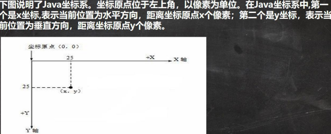
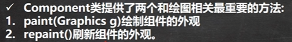
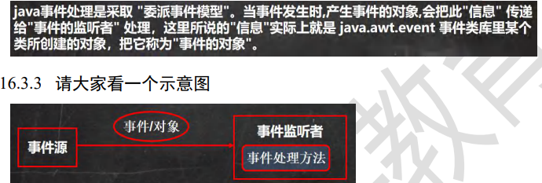
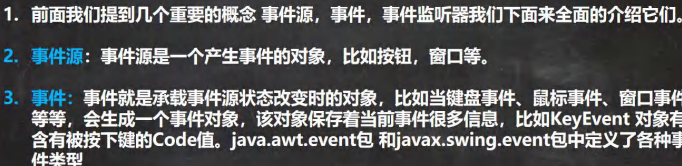
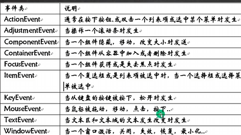
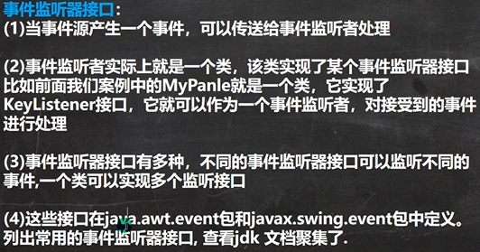
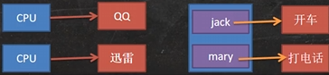
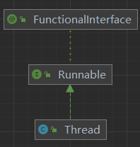
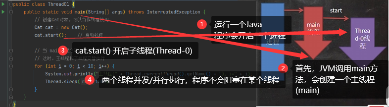
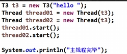

# 坦克大战

## Java绘图技术

### Java绘图坐标体系



### 绘图原理

|  |  |
|---------------------|-------------------------|

## Java事件处理机制

|  |  |
|-------------------------|-------------------------|
|       |     |

```java
package com.charlie.event_;

import javax.swing.*;
import java.awt.*;
import java.awt.event.KeyEvent;
import java.awt.event.KeyListener;

/**
 * 演示小球通过键盘控制上下左右移动 -> Java事件控制
 */
public class BallMove extends JFrame {

    private MyPanel mp = null;

    public static void main(String[] args) {
        new BallMove();
    }

    public BallMove() throws HeadlessException {
        mp = new MyPanel();
        this.add(mp);
        this.setDefaultCloseOperation(JFrame.EXIT_ON_CLOSE);
        this.setSize(400, 300);
        this.setVisible(true);
        // 窗口 JFrame 对象可以监听键盘事件，即可以监听到面板发生的键盘事件
        this.addKeyListener(mp);
    }
}

// KeyListener 监听器
class MyPanel extends JPanel implements KeyListener {

    // 为了让相求可以移动，把它的左上角的坐标设置为变量
    private int x = 10;
    private int y = 10;

    @Override
    public void paint(Graphics g) {
        super.paint(g);
        g.fillOval(x, y, 20, 20);
    }

    // 有字符输出时，该方法就会触发
    @Override
    public void keyTyped(KeyEvent e) {

    }

    // 当某个键按下时，该方法就会触发
    @Override
    public void keyPressed(KeyEvent e) {
//        System.out.println((char)e.getKeyCode() + " 被按下...");
        // 根据用户按下的不同键，来处理小球的移动(上下左右的键)
        // 在java中，会给每一个键，分配一个值(key)
        if (e.getKeyCode() == KeyEvent.VK_DOWN) {   // KeyEvent.VK_DOWN 就是向下的箭头对应的code
            y += 2;
        } else if (e.getKeyCode() == KeyEvent.VK_UP) {
            y -= 2;
        } else if (e.getKeyCode() == KeyEvent.VK_LEFT) {
            x -= 2;
        } else if (e.getKeyCode() == KeyEvent.VK_RIGHT) {
            x += 2;
        }

        // 让面板重绘，重绘后小圆球才会动起来！
        this.repaint();
    }

    // 当某个键松开(释放)时，触发该方法
    @Override
    public void keyReleased(KeyEvent e) {

    }
}
```

## 线程基础

### 进程

1. 进程是指运行中的程序，比如使用QQ就启动了一个进程，操作系统就会为该进程分配内存空间。
    当使用迅雷时，又启动了一个进程，操作系统将为迅雷分配新的内存空间。
2. 进程是程序的一次执行，或是正在运行的一个程序，是动态的过程，有它自身的产生、存在和小王的过程。

### 线程

1. 线程由进程创建，是进程的一个实体
2. 一个进程可以拥有多个线程

其它相关概念
1. 单线程：同一个时刻，只允许执行一个线程
2. 多线程：同一个时刻，可以执行多个线程，比如：一个qq进程，可以同时打开多个聊天窗口，一个迅雷进程，可以同时下载多个文件
3. `并发`：同一个时刻，多个任务交替执行，造成一种“貌似同时”的错觉，简单地说，单核CPU实现的多任务就是并发
    - 
4. `并行`：同一个时刻，多个任务同时执行。多核CPU可以实现并行
    - 

### 线程的基本使用

创建线程的两种方式：
1. 继承 `Thread` 类，重写 `run()` 方法
2. 实现 `Runnable` 接口，重写 `run()` 方法
    - 



> 在多线程中，不是主线程(`main`)结束，程序就退出，程序在所有线程都结束后进程(Application)才会结束。
> 
> `cat.start()`：方法会开启一个子线程，底层会通过 `start0()` 方法调用 `run()`，
> 而 `run()` 只是一个普通的方法，不会开启新的线程

- 继承Thread类

```java
package com.charlie.threaduse;

/**
 * 演示通过继承Thread类，创建线程
 */
public class Thread01 {
    public static void main(String[] args) throws InterruptedException {
        // 创建Cat对象，可以当作线程使用
        Cat cat = new Cat();

        /*
        (1)
        public synchronized void start() {
            start0();
        }
        (2)
        // start0() 是本地房啊，是JVM调用，底层是c/c++实现
        // 真正实现多线程的效果是 start0() 而不是 run()
        private native void start0();
         */
        cat.start();    // 启动线程 -> 最终会执行 run() 方法

        // run方法就是一个普通的房啊，并没有真正启动一个线程，程序会阻塞在此，
        // 直到把run方法执行完毕，才会向下执行
//        cat.run();

        // 当 main线程启动一个子线程 Thread-0，主线程不会阻塞，会继续执行
        // 这时，主线程和子线程交替执行
        for (int i = 0; i < 100; i++) {
            System.out.println("主线程(" + Thread.currentThread().getName() + ")，i=" + i);
            Thread.sleep(1000);
        }
    }
}

// 1. 当一个类继承了 Thread类，该类就可以当作一个线程使用
// 2. 重写 run() 方法，写上自己的业务逻辑
// 3. run Thread类实现了 Runnable接口的 run方法
/*  Thread类中的 run() 方法
    @Override
    public void run() {
        if (target != null) {
            target.run();
        }
    }
 */
class Cat extends Thread {

    private int count = 0;

    @Override
    public void run() { // 重写 run() ，实现自己的业务逻辑
        while (true) {
            // 该线程每隔1秒，在控制台输出一段信息
            System.out.println("同学们，大家起来，担负起天下的兴亡" + (++count)
                            + " 线程名：" + Thread.currentThread().getName());
            // 让线程休眠1s
            try {
                Thread.sleep(1000);
            } catch (InterruptedException e) {
                throw new RuntimeException(e);
            }
            if (count == 80) {
                // 当 count 到8，退出 while，该线程也就退出
                break;
            }
        }
    }
}
```

- 实现Runnable接口

说明：
1. java是单继承，在某些情况下一个类可能已经继承了某个父类，此时就无法在实体继承 `Thread`类的房啊
    来创建线程
2. java设计者提供了另外一个方法创建线程，就是通过实现 `Runnable` 接口来创建线程

```java
package com.charlie.threaduse;

public class Thread02 {
    public static void main(String[] args) {
        Dog dog = new Dog();
//        dog.start();    // 这里不能调用 start()

        // 创建Thread匿名对象，把dog对象(实现Runnable)，放入Thread
        new Thread(dog).start();

//        Tiger tiger = new Tiger();
//        new ThreadProxy(tiger).start();
    }
}

class Animal {}

class Tiger extends Animal implements Runnable {
    @Override
    public void run() {
        System.out.println("吊睛白额的大虫~");
    }
}

// 线程代理类，模拟一个简单的 Thread类
class ThreadProxy implements Runnable { // 可以把 ThreadProxy类 当作 Thread类

    // 属性，类型是 Runnable
    private Runnable target = null;

    public ThreadProxy(Runnable target) {
        this.target = target;
    }

    @Override
    public void run() {
        if (target != null) {
            target.run();   // 动态绑定，运行类型 Tiger
        }
    }

    public void start() {
        // 这个方法是真正实现多线程的方法
        start0();
    }

    public void start0() {
        run();
    }
}

class Dog implements Runnable {

    private int count = 0;

    @Override
    public void run() {
        while (true) {
            System.out.println("线程(" + Thread.currentThread().getName() + "): hi~" + (++count));
            try {
                Thread.sleep(1000);
            } catch (InterruptedException e) {
                throw new RuntimeException(e);
            }
            if (count == 10) {
                break;
            }
        }
    }
}
```

继承Thread和实现Runnable区别
1. 从java设计来看，通过继承Thread或者实现Runnable接口来创建线程本质上没有区别。
2. **实现Runnable接口方式更加适合多个线程共享一个资源的情况，并且避免了单继承的限制**，建议使用Runnable
    - 

