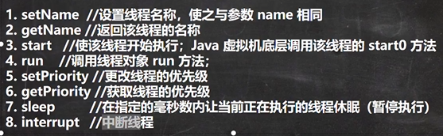

# 坦克大战

## Java绘图技术

### Java绘图坐标体系


### 绘图原理

|  |  |
|---------------------|-------------------------|

## Java事件处理机制

|  |  |
|-------------------------|-------------------------|
|       |     |

```java
package com.charlie.event_;

import javax.swing.*;
import java.awt.*;
import java.awt.event.KeyEvent;
import java.awt.event.KeyListener;

/**
 * 演示小球通过键盘控制上下左右移动 -> Java事件控制
 */
public class BallMove extends JFrame {

    private MyPanel mp = null;

    public static void main(String[] args) {
        new BallMove();
    }

    public BallMove() throws HeadlessException {
        mp = new MyPanel();
        this.add(mp);
        this.setDefaultCloseOperation(JFrame.EXIT_ON_CLOSE);
        this.setSize(400, 300);
        this.setVisible(true);
        // 窗口 JFrame 对象可以监听键盘事件，即可以监听到面板发生的键盘事件
        this.addKeyListener(mp);
    }
}

// KeyListener 监听器
class MyPanel extends JPanel implements KeyListener {

    // 为了让相求可以移动，把它的左上角的坐标设置为变量
    private int x = 10;
    private int y = 10;

    @Override
    public void paint(Graphics g) {
        super.paint(g);
        g.fillOval(x, y, 20, 20);
    }

    // 有字符输出时，该方法就会触发
    @Override
    public void keyTyped(KeyEvent e) {

    }

    // 当某个键按下时，该方法就会触发
    @Override
    public void keyPressed(KeyEvent e) {
//        System.out.println((char)e.getKeyCode() + " 被按下...");
        // 根据用户按下的不同键，来处理小球的移动(上下左右的键)
        // 在java中，会给每一个键，分配一个值(key)
        if (e.getKeyCode() == KeyEvent.VK_DOWN) {   // KeyEvent.VK_DOWN 就是向下的箭头对应的code
            y += 2;
        } else if (e.getKeyCode() == KeyEvent.VK_UP) {
            y -= 2;
        } else if (e.getKeyCode() == KeyEvent.VK_LEFT) {
            x -= 2;
        } else if (e.getKeyCode() == KeyEvent.VK_RIGHT) {
            x += 2;
        }

        // 让面板重绘，重绘后小圆球才会动起来！
        this.repaint();
    }

    // 当某个键松开(释放)时，触发该方法
    @Override
    public void keyReleased(KeyEvent e) {

    }
}
```

## 线程基础

### 进程

1. 进程是指运行中的程序，比如使用QQ就启动了一个进程，操作系统就会为该进程分配内存空间。
    当使用迅雷时，又启动了一个进程，操作系统将为迅雷分配新的内存空间。
2. 进程是程序的一次执行，或是正在运行的一个程序，是动态的过程，有它自身的产生、存在和小王的过程。

### 线程

1. 线程由进程创建，是进程的一个实体
2. 一个进程可以拥有多个线程

其它相关概念
1. 单线程：同一个时刻，只允许执行一个线程
2. 多线程：同一个时刻，可以执行多个线程，比如：一个qq进程，可以同时打开多个聊天窗口，一个迅雷进程，可以同时下载多个文件
3. `并发`：同一个时刻，多个任务交替执行，造成一种“貌似同时”的错觉，简单地说，单核CPU实现的多任务就是并发
    - 
4. `并行`：同一个时刻，多个任务同时执行。多核CPU可以实现并行
    - 

### 线程的基本使用

创建线程的两种方式：
1. 继承 `Thread` 类，重写 `run()` 方法
2. 实现 `Runnable` 接口，重写 `run()` 方法
    - 


> 在多线程中，不是主线程(`main`)结束，程序就退出，程序在所有线程都结束后进程(Application)才会结束。
> 
> `cat.start()`：方法会开启一个子线程，底层会通过 `start0()` 方法调用 `run()`，
> 而 `run()` 只是一个普通的方法，不会开启新的线程

- 继承Thread类

```java
package com.charlie.threaduse;

/**
 * 演示通过继承Thread类，创建线程
 */
public class Thread01 {
    public static void main(String[] args) throws InterruptedException {
        // 创建Cat对象，可以当作线程使用
        Cat cat = new Cat();

        /*
        (1)
        public synchronized void start() {
            start0();
        }
        (2)
        // start0() 是本地房啊，是JVM调用，底层是c/c++实现
        // 真正实现多线程的效果是 start0() 而不是 run()
        private native void start0();
         */
        cat.start();    // 启动线程 -> 最终会执行 run() 方法

        // run方法就是一个普通的房啊，并没有真正启动一个线程，程序会阻塞在此，
        // 直到把run方法执行完毕，才会向下执行
//        cat.run();

        // 当 main线程启动一个子线程 Thread-0，主线程不会阻塞，会继续执行
        // 这时，主线程和子线程交替执行
        for (int i = 0; i < 100; i++) {
            System.out.println("主线程(" + Thread.currentThread().getName() + ")，i=" + i);
            Thread.sleep(1000);
        }
    }
}

// 1. 当一个类继承了 Thread类，该类就可以当作一个线程使用
// 2. 重写 run() 方法，写上自己的业务逻辑
// 3. run Thread类实现了 Runnable接口的 run方法
/*  Thread类中的 run() 方法
    @Override
    public void run() {
        if (target != null) {
            target.run();
        }
    }
 */
class Cat extends Thread {

    private int count = 0;

    @Override
    public void run() { // 重写 run() ，实现自己的业务逻辑
        while (true) {
            // 该线程每隔1秒，在控制台输出一段信息
            System.out.println("同学们，大家起来，担负起天下的兴亡" + (++count)
                            + " 线程名：" + Thread.currentThread().getName());
            // 让线程休眠1s
            try {
                Thread.sleep(1000);
            } catch (InterruptedException e) {
                throw new RuntimeException(e);
            }
            if (count == 80) {
                // 当 count 到8，退出 while，该线程也就退出
                break;
            }
        }
    }
}
```

- 实现Runnable接口

说明：
1. java是单继承，在某些情况下一个类可能已经继承了某个父类，此时就无法在实体继承 `Thread`类的房啊
    来创建线程
2. java设计者提供了另外一个方法创建线程，就是通过实现 `Runnable` 接口来创建线程

```java
package com.charlie.threaduse;

public class Thread02 {
    public static void main(String[] args) {
        Dog dog = new Dog();
//        dog.start();    // 这里不能调用 start()

        // 创建Thread匿名对象，把dog对象(实现Runnable)，放入Thread
        new Thread(dog).start();

//        Tiger tiger = new Tiger();
//        new ThreadProxy(tiger).start();
    }
}

class Animal {}

class Tiger extends Animal implements Runnable {
    @Override
    public void run() {
        System.out.println("吊睛白额的大虫~");
    }
}

// 线程代理类，模拟一个简单的 Thread类
class ThreadProxy implements Runnable { // 可以把 ThreadProxy类 当作 Thread类

    // 属性，类型是 Runnable
    private Runnable target = null;

    public ThreadProxy(Runnable target) {
        this.target = target;
    }

    @Override
    public void run() {
        if (target != null) {
            target.run();   // 动态绑定，运行类型 Tiger
        }
    }

    public void start() {
        // 这个方法是真正实现多线程的方法
        start0();
    }

    public void start0() {
        run();
    }
}

class Dog implements Runnable {

    private int count = 0;

    @Override
    public void run() {
        while (true) {
            System.out.println("线程(" + Thread.currentThread().getName() + "): hi~" + (++count));
            try {
                Thread.sleep(1000);
            } catch (InterruptedException e) {
                throw new RuntimeException(e);
            }
            if (count == 10) {
                break;
            }
        }
    }
}
```

继承Thread和实现Runnable区别
1. 从java设计来看，通过继承Thread或者实现Runnable接口来创建线程本质上没有区别。
2. **实现Runnable接口方式更加适合多个线程共享一个资源的情况，并且避免了单继承的限制**，建议使用Runnable
    - 

### 线程终止

基本说明
1. 当线程完成任务后，会自动退出
    - 
2. 还可以通过**使用变量**来控制 `run()` 方法退出的方式停止线程，即通知方式

```java
package com.charlie.exit_;

public class ThreadExit_ {
    public static void main(String[] args) {
        T t1 = new T();
        t1.start();

        // 如果希望主线程main线程去控制t1线程的终止，必须可以修改 loop
        // 让 t1 退出 run() 从而终止 t1线程 -> 通知方式
        try {
            // 让主线程休眠10s再通知子线程退出
            Thread.sleep(10 * 1000);
        } catch (InterruptedException e) {
            throw new RuntimeException(e);
        }
        t1.setLoop(false);
    }
}

class T extends Thread {
    private int count = 0;
    // 设置一个控制变量
    private boolean loop = true;
    @Override
    public void run() {
        while (loop) {
            try {
                Thread.sleep(50);
            } catch (Exception e) {
                throw new RuntimeException(e);
            }

            System.out.println("线程(" + Thread.currentThread().getName() + "): " + (++count));
        }
    }

    public void setLoop(boolean loop) {
        this.loop = loop;
    }
}
```

### 线程常用方法

|  |  |
|---------------------------|---------------------------|
|  |                           |

```java
package com.charlie.threadmethod;

public class ThreadMethod01 {
    public static void main(String[] args) throws InterruptedException {
        T t = new T();
        t.setName("Charlie");   // 设置线程名称
        t.setPriority(Thread.MIN_PRIORITY); // 设置线程优先级
        t.start();  // 启动线程

        for (int i = 0; i < 5; i++) {
            Thread.sleep(1000);
            System.out.println("hi~ " + i);
        }

        System.out.println("线程t的优先级：" + t.getPriority());   // 1

        // 当执行到这里是，就会中断 t线程的休眠
        // 线程t休眠被中断后，会机制执行 run() 方法中后续的代码
        t.interrupt();
    }
}

class T extends Thread {
    @Override
    public void run() {
        while (true) {
            for (int i = 0; i < 3; i++) {
                System.out.println(Thread.currentThread().getName() + " 线程~" + i);
            }
            try {
                System.out.println(Thread.currentThread().getName() + " 正在休眠");
                Thread.sleep(20 * 1000);    // 休眠20s
            } catch (InterruptedException e) {
                // 当线程执行到一个 interrupt 方法时，就会catch一个异常，可以加入自己的业务代码
                System.out.println(Thread.currentThread().getName() + " 被 interrupt...");
            }
        }
    }
}
```

- 用户线程和守护线程
  - 当所有用户线程结束，守护线程也结束
- 

```java
package com.charlie.threadmethod;

public class ThreadMethod03 {
    public static void main(String[] args) throws InterruptedException {
        MyDaemonThread myDaemonThread = new MyDaemonThread();
        // 希望当 main 线程结束后，子线程自动结束
        // 只需要将线程设置为守护线程即可
        myDaemonThread.setDaemon(true); // 先设置为守护线程，再启动
        myDaemonThread.start();
        
        for (int i = 0; i < 10; i++) {
            System.out.println("同学们，大家起来");
            Thread.sleep(1000);
        }
    }
}

class MyDaemonThread extends Thread {
    @Override
    public void run() {
        for (;;) {
            try {
                // 休眠 50ms
                Thread.sleep(500);
            } catch (Exception e) {
                e.printStackTrace();
            }
            System.out.println("担负起天下的兴亡~");
        }
    }
}
```

### 线程的声明周期

- 
  - `Runnable`状态可以再分为：`Ready` 和 `Running`
  - 
  - 
  - 
- 

### 线程同步

线程同步(`Synchronized`)
1. 在多线程编程，一些数据不允许被多个线程同时访问，此时就使用同步访问技术，保证数据在任何同一时刻，
    最多有一个线程访问，以保证数据的完整性。
2. 线程同步：即让有一个线程在对内存进行操作时，其它线程都不可以对这个内存地址进行操作，直到该线程完成操作，
    其它线程才能对该内存地址进行操作

同步具体方法- `Synchronized`
1. 同步代码块
   - 
2. 同步方法
   - 

互斥锁
1. Java语言中，引入了对象互斥锁的概念，来保证共享数据操作的完整性
2. 每个对象都对应以恶搞可称为“互斥锁”的白哦及，这个标记原来保证在任一时刻，只能有一个线程访问该对象
3. 关键字 `synchronized` 来与对象的互斥锁联系。当某个对象用 `synchronized` 修饰时，表明该对象
    在任一时刻只能由一个线程访问
4. 同步的局限性：导致程序的执行效率降低
5. 同步方法(非静态的)的锁可以是 `this` ，也可以是其它对象(要求是同一个对象)
6. 同步方法(静态的)的锁为当前类本身

```java
package com.charlie.sync;

/**
 * 使用多线程，模拟三个窗口同时售票 100 张
 */
public class SellTicket {
    public static void main(String[] args) {
        // 测试 synchronized
        SellTicket03 sellTicket03 = new SellTicket03();
        new Thread(sellTicket03).start();
        new Thread(sellTicket03).start();
        new Thread(sellTicket03).start();
    }
}

// 实现接口方式，使用 synchronized 实现线程同步
class SellTicket03 implements Runnable {

    private static int ticketNum = 100;   // 让多个线程共享 ticketNum
    private boolean loop = true;
    Object obj =  new Object();

    // 同步方法(静态的)的锁为当前类本身
    /*
    1. public synchronized static void m1() {} 锁是加载 SellTicket03.class 上
    2. 如果在静态方法中，实现一个同步代码块
        synchronized (SellTicket03.class) {
            System.out.println("m2");
        }
     */
    public synchronized static void m1() {}

    public static void m2() {
        synchronized (SellTicket03.class) {
            System.out.println("m2");
        }
    }

    /*
    1. public synchronized void sell()  就是一个同步方法
    2. 这时锁在 this 对象
    3. 也可以在代码块上写 synchronized，同步代码块，互斥锁可以this对象，或者其它同一个对象
     */
    public synchronized void sell() {   // 同步方法，在同一个时刻，最多只能有一个线程来执行 run() 方法
        synchronized (/*this*/ obj) {
            if (ticketNum <= 0) {
                System.out.println("售票结束...");
                loop = false;
                return;
            }
        }

        // 休眠50ms
        try {
            Thread.sleep(50);
        } catch (Exception e) {
            throw new RuntimeException(e);
        }

        System.out.println("线程(" + Thread.currentThread().getName() + "): 售票，还剩 "
                + (--ticketNum) + " 张票~");
    }

    @Override
    public void run() {
        while (loop) {
            sell(); // sell方法是一个同步方法
        }
    }
}
```

注意事项和细节
- 

### 死锁

- 多个线程都占用了对方的锁资源，但不肯相让，导致了死锁，在编程中一定要避免死锁的发生

```java
package com.charlie.sync;

public class DeadLock_ {
    public static void main(String[] args) {
        // 模拟死锁
        DeadLockDemo a = new DeadLockDemo(true);
        a.setName("A");
        DeadLockDemo b = new DeadLockDemo(false);
        b.setName("B");

        a.start();
        b.start();
    }
}

class DeadLockDemo extends Thread {
    public static Object o1 = new Object();
    public static Object o2 = new Object();
    private boolean flag;

    public DeadLockDemo(boolean flag) {
        this.flag = flag;
    }

    @Override
    public void run() {
        /*
        1. 如果 flag 为 T，线程 A就会先得到/持有 o1 对象锁，然后尝试去获取 o2 对象锁
        2. 如果线程A得不到 o2 对象锁，就会 Blocked
        3. 如果 flag 为 F，线程 B就会先得到/持有 o2 对象锁，然后尝试去获取 o1 对象锁
        4. 如果线程B得不到 o1 对象锁，就会 Blocked
         */
        if (flag) {
            synchronized (o1) {
                System.out.println(Thread.currentThread().getName() + "进入1");
                synchronized (o2) {
                    System.out.println(Thread.currentThread().getName() + "进入2");
                }
            }
        } else {
            synchronized (o2) {
                System.out.println(Thread.currentThread().getName() + "进入3");
                synchronized (o1) {
                    System.out.println(Thread.currentThread().getName() + "进入4");
                }
            }
        }
    }
}
```

### 释放锁

下面操作会释放锁
- 
下面操作不会释放锁
- 

```java
package com.charlie.sync;

import java.util.Scanner;

/**
 * 练习：
 *  A线程随机输出1~100之内的整数
 *  当B线程检测到输入 'Q' 时，A线程终止
 *  提示：B对象中要持有A对象，才可以通知A对象线程终止
 */
public class homework01 {
    public static void main(String[] args) {
        A a = new A();
        B b = new B(a); // 要把线程A的对象传入，才可以
        a.start();
        b.start();
    }
}

class A extends Thread {
    private boolean loop = true;
    @Override
    public void run() {
        while (loop) {
            System.out.println((int) (Math.random() * 100) + 1);
            try {
                Thread.sleep(1000);
            } catch (InterruptedException e) {
                throw new RuntimeException(e);
            }
        }
    }

    public void setLoop(boolean loop) {
        this.loop = loop;
    }
}

class B extends Thread {
    private Scanner scanner = new Scanner(System.in);
    private A a;

    public B(A a) { // 构造器中，直接传入A类对象
        this.a = a;
    }

    @Override
    public void run() {
        // 接收到用户输入
        while (true) {
            System.out.print("请输入你的指令(Q表示退出)：");
            char key = scanner.next().toUpperCase().charAt(0);
            if (key == 'Q') {
                // 以通知的方式，结束A线程
                this.a.setLoop(false);
                System.out.println(Thread.currentThread().getName() + "退出~");
                break;
            }
        }
    }
}
```

```java
package com.charlie.sync;

/**
 * 有2个用户分别从同一张卡上取钱
 * 每次都取1000.当余额不足时，就不能取款了
 * 不能出现超取现象
 */
public class homework02 {
    public static void main(String[] args) {
        BankCard bankCard = new BankCard();
        new Thread(bankCard).start();
        new Thread(bankCard).start();
    }
}

/*
1. 因为这里涉及到多个线程共享资源，所以使用实现 Runnable 方式
2. 每次取出 1000
 */
class BankCard implements Runnable {
    private int balance = 10000;
    private boolean loop = true;

    public void f() {
        /*
        1. 使用 synchronized 实现了线程同步
        2. 当多个线程执行到这里时，就会去争夺 this 对象锁
        3. 哪个线程得到 this对象锁，就执行 synchronized 代码块，执行完后，会释放this对象锁
        4. 拿不到this对象锁，就 blocked，准备继续争夺
         */
        synchronized (this) {
            if (balance < 1000) {
                System.out.println("余额不足...");
                loop = false;
                return;
            }
            balance -= 1000;
            System.out.println(Thread.currentThread().getName() + " 在取钱，余额：" + balance);
        }
        try {
            Thread.sleep(1000);
        } catch (Exception e) {
            e.printStackTrace();
        }
    }

    @Override
    public void run() {
        while (loop) {
            f();
        }
    }
}
```
