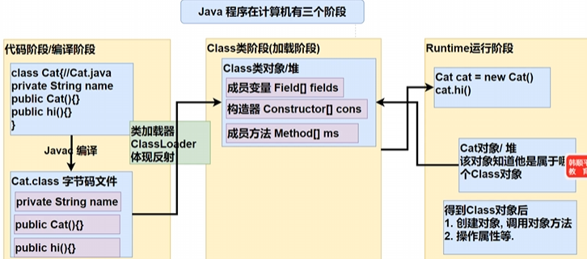
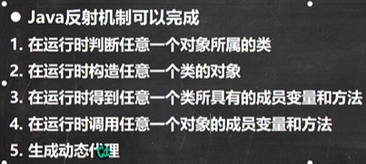
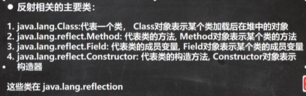
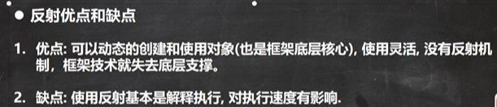
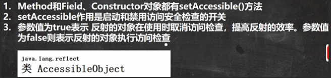

# 23. 反射

## 反射机制(reflection)

**通过外部文件配置，在不修改源码情况下来控制程序，也符合设计模型的ocp原则(开闭原则：不修改源码，扩容功能)**

1. 反射机制允许程序在运行期借助 `Reflection API`取得任何类的内部信息(比如成员变量，构造器，成员方法等等)，
    并能操作对象的属性及方法。反射在设计模式和框架底层都会用到
2. 加载完类之后，在堆中就产生一个Class类型的对象(**一个类只有一个Class对象**)，这个对象包含了类完整结构信息，
    通过这个对象得到类的结构。这个对象就像一面镜子，通过这个镜子看到类的结构，所以形象地称之为：反射

反射机制
- 
- 
- 
- 
- 

```java
package com.hspedu.reflection;

import java.io.FileInputStream;
import java.lang.reflect.Constructor;
import java.lang.reflect.Field;
import java.lang.reflect.Method;
import java.util.Properties;

public class Reflection01 {
    public static void main(String[] args) throws Exception {
        // 1. 使用 Properties 类，可以读写配置文件
        Properties properties = new Properties();
        properties.load(new FileInputStream("src\\re.properties"));
        String classfullpath = properties.get("classfullpath").toString();
        String methodName = properties.get("method").toString();
        // 2. 创建对象，传统方法行不通 -> 反射机制
//        new classfullpath();
        // 3. 使用反射机制解决
        // (1) 加载类，返回Class类型的对象
        Class<?> cls = Class.forName(classfullpath);
        // (2) 通过 cls对象得到加载的类 com.hspedu.Cat 的对象实例
        Object o = cls.newInstance();
        System.out.println("o的运行类型=" + o.getClass());   // 运行类型 class com.hspedu.Cat
        // (3) 通过 cls 得到加载的类 com.hspedu.Cat 的 methodName 的方法对象
        //      即：再反射中，可以把方法视为对象(万物皆对象)
        Method method1 = cls.getMethod(methodName);
        // (4) 通过method1调用方法，即通过方法对象来实现对象方法
        System.out.println("===========");
        method1.invoke(o);  // 传统方法：对象.方法()；反射机制：方法.invoke(对象)

        // java.lang.reflect.Field：代表类的成员变量，Field对象标识某个类的成员变量
        Field ageField = cls.getField("age");  // getField不能得到私有字段
        System.out.println(ageField.get(o));    // 传统写法：对象.成员变量；反射：成员变量.get(对象) 2

        // java.lang.reflect.Constructor：代表类的构造方法，Constructor对象标识构造器
        Constructor<?> constructor = cls.getConstructor();  // ()中可以指定构造器参数类型
        System.out.println(constructor);    // public com.hspedu.Cat()

        Constructor<?> constructor1 = cls.getConstructor(String.class); // 传入的 String.class 就是String的Class类对象
        System.out.println(constructor1);   // public com.hspedu.Cat(java.lang.String)
    }
}
```

```java
package com.hspedu.reflection;

import com.hspedu.Cat;

import java.io.FileInputStream;
import java.lang.reflect.Method;
import java.util.Properties;

public class Reflection02 {
    public static void main(String[] args) throws Exception {
        // Field, Method, Constructor都继承了AccessibleObject类进行检测
        m1();   // 传统方法调用hi 耗时=3
        m2();   // 反射方法调用hi 耗时=728
        m3();   // 反射优化调用hi 耗时=532
    }
    // 传统方法来调用hi
    public static void m1() {
        Cat cat = new Cat();
        long start = System.currentTimeMillis();
        for (int i = 0; i < 900000000; i++) {
            cat.hi();
        }
        long end = System.currentTimeMillis();
        System.out.println("传统方法调用hi 耗时=" + (end - start));
    }
    // 反射机制调用hi方法
    public static void m2() throws Exception {
        Properties properties = new Properties();
        properties.load(new FileInputStream("src/re.properties"));
        String classFullPath = properties.get("classfullpath").toString();
        String method = properties.get("method").toString();

        // 反射
        Class<?> cls = Class.forName(classFullPath);
        Object o = cls.newInstance();
        Method method1 = cls.getMethod(method);

        long start = System.currentTimeMillis();
        for (int i = 0; i < 900000000; i++) {
            method1.invoke(o);
        }
        long end = System.currentTimeMillis();
        System.out.println("反射方法调用hi 耗时=" + (end - start));
    }

    // 反射调用优化 - 关闭访问检测
    public static void m3() throws Exception {
        // 反射
        Class<?> cls = Class.forName("com.hspedu.Cat");
        Object o = cls.newInstance();
        Method hi = cls.getMethod("hi");
        hi.setAccessible(true);    // 设置为true表示，在反射调用方法时，取消访问检测
        long start = System.currentTimeMillis();
        for (int i = 0; i < 900000000; i++) {
            hi.invoke(o);
        }
        long end = System.currentTimeMillis();
        System.out.println("反射优化调用hi 耗时=" + (end - start));
    }
}
```

## Class类

> 2023-12-21: P711~715

