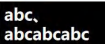
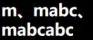
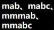
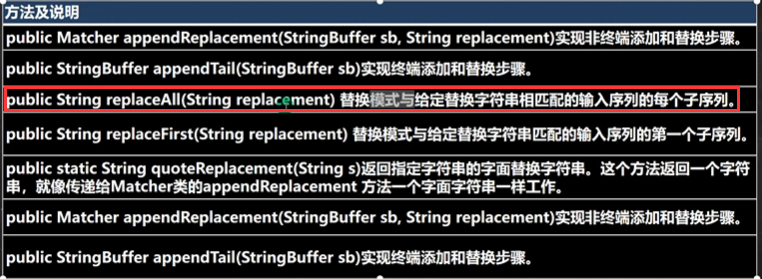

# 正则表达式

## 正则表达式原理

- regular expression => RegExp
- 一个正则表达式，就是用某种模式去匹配字符串的一个公式。

- 正则表达式的原理
- 

```java
package com.charlie.regexp;

import java.util.regex.Matcher;
import java.util.regex.Pattern;

/**
 * 分析java的正则表达式底层实现
 */
public class RegTheory {
    public static void main(String[] args) {
        String content = "1998年12月8日，第二代Java平台的企业版J2EE发布。1999年6月，Sun公司发布了" +
                "第二代Java平台（简称为Java2）的3个版本：J2ME（Java2 Micro Edition，Java2平台的微型" +
                "版），应用于移动、无线及有限资源的环境；J2SE（Java 2 Standard Edition，Java 2平台的" +
                "标准版），应用于桌面环境；J2EE（Java 2Enterprise Edition，Java 2平台的企业版），应" +
                "用3443于基于Java的应用服务器。Java 2平台的发布，是Java发展过程中最重要的一个" +
                "里程碑，标志着Java的应用开始普及9889 ";
        // 目标：匹配所有四个数字
        // 1. \\d 表示一个任意的数字(0-9)
        String regStr = "(\\d\\d)(\\d\\d)";
        // 2. 创建模式对象，即正则表达式对象
        Pattern pattern = Pattern.compile(regStr);
        // 3. 创建匹配器
        // 创建匹配器 matcher，按照正则表达式规则去匹配content字符串
        Matcher matcher = pattern.matcher(content);
        // 4. 开始匹配
        /**
         * matcher.find() 完成的工作
         * 1) 根据指定的规则 pattern ，定位满足规则的子字符串(比如1998)
         * 2) 找到后，将子字符串的开始索引记录到 matcher对象的属性 int[] groups;
         *  groups[0] = 0; 把该字符串的结果的索引+1的值记录到 group[1] = 4;
         * 3) 同时记录 oldLast 的值为 子字符串的结束的 索引+1的值即4，即下次执行 find是，就从4开始匹配
         * 4) matcher.group(0)
         *     public String group(int group) {
         *         if (first < 0)
         *             throw new IllegalStateException("No match found");
         *         if (group < 0 || group > groupCount())
         *             throw new IndexOutOfBoundsException("No group " + group);
         *         if ((groups[group*2] == -1) || (groups[group*2+1] == -1))
         *             return null;
         *         return getSubSequence(groups[group * 2], groups[group * 2 + 1]).toString();
         *     }
         *     1. 根据 groups[0]=0 和 groups[1]=4 的记录的位置，从content开始截取子字符串并返回
         *          就是 [0, 4) 包含0但是不包含索引为4的位置
         * 5) 如果再次执行 find() 方法，仍然按照上面分析来执行
         *
         *
         * 分组情况：当正则表达式中有小括号()时，比如 (\d\d)(\d\d)，第1个()表示第1组，第2个()表示第2组
         * 1) 根据指定的规则 pattern ，定位满足规则的子字符串，比如 (19)(98)
         * 2) 找到后，将子字符串的开始索引记录到 matcher对象的属性 int[] groups;
         *      2.1) groups[0] = 0，把该字符串的 结束的索引+1 的值记录到 groups[1] = 4;
         *      2.2) 把记录第1组()匹配到的字符串 groups[2] = 0, groups[3] = 2;
         *      2.3) 把记录第2组()匹配到的字符串 groups[4] = 2, groups[4] = 4;
         *      2.4) 如果有更多的分组，继续匹配
         * 3) 同时记录 oldLast 的值为 子字符串的结束的 索引+1的值即4，即下次执行 find是，就从4开始匹配
         * 4) matcher.group(0)
         */
        while (matcher.find()) {
            System.out.println("匹配到：" + matcher.group(0) + " "
                            + matcher.group(1) + " " + matcher.group(2));
            /*
            matcher.group(0)仍然记录整个正则表达式匹配到的字符串
            匹配到：1998 19 98
            匹配到：1999 19 99
            匹配到：3443 34 43
            匹配到：9889 98 89
             */
        }
    }
}
```

## 正则表达式语法

1. 限定符
2. 选择匹配符
3. 分组组合和反向引用符
4. 特殊字符
5. 字符匹配符
6. 定位符

- 元字符(`Metacharacter`)-转义符号 `\\`
  - 
  - 需要用到转义符号的有 `.*+()$/\?[]^{}`

```java
package com.charlie.regexp;

import java.util.regex.Matcher;
import java.util.regex.Pattern;

public class RegExp02 {
    public static void main(String[] args) {
        String content = "abc$(abcd(123(";
        // 匹配 ( => \\(
        // 匹配 . => \\.
        String regStr = "\\(";
        Pattern pattern = Pattern.compile(regStr);
        Matcher matcher = pattern.matcher(content);
        while (matcher.find()) {
            System.out.println(matcher.group(0));
        }
    }
}
```

| 符号    | 符号                                  | 示例             | 解释                                          |
|-------|-------------------------------------|----------------|---------------------------------------------|
| `[]`  | 可接收的字符列表                            | `[efgh]`       | `efgh`中的任意1个字符                              |
| `[^]` | 不可接收的字符列表                           | `[^abc]`       | 除`abc`之外的任意1个字符，包括数字和特殊字符                   |
| `-`   | 连字符                                 | `A-Z`          | 任意单个大写字母                                    |
| `.`   | 匹配除`\n`以外的任何字符                      | `a..b`         | 以a开头，b结尾，中间包括2个任意字符的长度为4的字符串，如`aaab`,`a3#b` |
| `\\d` | 匹配单个数字字符，相当于`[0-9]`                 | `\\d{3}(\\d)?` | 包含3个活4个数字的字符串，如`123`,`9527`                 |
| `\\D` | 匹配单个非数字字符，相当于`[^0-9]`               | `\\D(\\d)*`    | 以单个非数字字符开头，后接任意个数字字符串，如`a`,`A342`           |
| `\\w` | 匹配单个数字、大小写字母字符和下划线，相当于`[0-9a-zA-Z]` | `\\d{3}\\w{4}` | 以3个数字字符揩油的长度为7的数字字母字符串，如`234abcd`,`12345Pe` |
| `\\W` | 匹配单个非数字、大小写字母字符，相当于`[^0-9a-zA-Z]`   | `\\W+\\d{2}`   | 以至少1个非数字字母字符开头，2个数字字符结尾的字符串，如`#29`,`#?@10`  |
| `\\s` | 匹配任何空白字符(空格，制表符等)                   |                |                                             |
| `\\S` | 匹配任何非空白字符，和`\\s`刚好相反                |                |                                             |

> 中括号`{}`中表示字符出现的次数，如 `\\d{3}` 表示连续3个数字
> 
> `?`表示0个或1个，如 `\\d(\\d)?`表示包含3个或4和数字的字符串
> 
> `*`表示任意个数的字符，如 `\\D(\\d)*`表示以单个非数字字符开头，后接任意个数字字符
> 
> `+`表示至少1个字符，如 `\\W+\\d{2}` 表示以至少1个非数字字母字符开头，2个数字字符结尾的字符串

- java正则表达式默认区分大小写，如何实现不区分大小写
  - `(?i)abc`表示abc都不区分大小写
  - `a(?i)bc`表示bc不区分大小写
  - `a((?i)b)c`表示只有b不区分大小写
  - `Pattern.compile(regExp, Pattern.CASE_INSENSITIVE);`

### 选择匹配符

- 元字符-**选择匹配符**
  - 在匹配某个字符串的时候是选择性的，即既可以匹配这个，又可以匹配哪个，这时需要用到选择匹配符号 `|`
  - 

### 限定符

| 符号       | 含义                        | 示例            | 说明                           | 匹配输入                    |
|----------|---------------------------|---------------|------------------------------|-------------------------|
| `*`      | 指定字符重复0次或n次(无要求)-**0到多**  | `(abc)*`      | 仅包含任意个abc的字符串，等效于`\w?`       |  |
| `+`      | 指定字符重复1次或n次(至少一次)-**1到多** | `m+(abc)*`    | 以至少1个m开头，后接任意个abc的字符串        |  |
| `?`      | 指定字符重复0次或1次(最多一次)-**0到1** | `m+abc?`      | 以至少1个m开头，后接ab或abc的字符串        |  |
| `{n}`    | 只能输入n个字符                  | `[abcd]{3}`   | 由abcd中字母组成的任意长度为3的字符串        |  |
| `{n,}`   | 指定至少n个匹配                  | `[abcd]{3,}`  | 由abcd中字母组成的任意长度不小于3的字符串      |  |
| `{n, m}` | 指定至少n个但不多于m个匹配            | `[abcd]{3,5}` | 由abcd中字母组成的任意长度不小于3，不大于5的字符串 |  |

```java
package com.charlie.regexp;

import java.util.regex.Matcher;
import java.util.regex.Pattern;

/**
 * 演示限定符的使用
 */
public class RegExp05 {
    public static void main(String[] args) {
        String content = "a1111111aaaaaahello";
//        String regStr = "a{3}"; // 匹配 aaa
//        String regStr = "1{4}"; // 匹配 1111
//        String regStr = "\\d{2}";   // 表示匹配 两位的任意数字字符

        // java是贪婪匹配，即尽可能匹配多的
//        String regStr = "a{3,4}";   // 表示匹配 aaa 或 aaaa
//        String regStr = "\\d{2,5}";   // 表示匹配 2/3/4/5位数

//        String regStr = "1+";   // 表示匹配 1个或多个 1，默认仍然是贪婪匹配
        String regStr = "a1?";   // 表示匹配 a 或 a1

        Pattern pattern = Pattern.compile(regStr);
        Matcher matcher = pattern.matcher(content);
        while (matcher.find()) {
            System.out.println("匹配到：" + matcher.group(0));
        }
    }
}
```

### 定位符

- 

```java
package com.charlie.regexp;

import java.util.regex.Matcher;
import java.util.regex.Pattern;

/**
 * 演示定位符的使用
 */
public class RegExp06 {
    public static void main(String[] args) {
//        String content = "123abc";
        String content = "hanshunping sphan nnhan";
//        String regStr = "^[0-9]+[a-z]*";    // 以至少1个数字开头，后接任意个小写字母的字符串
//        String regStr = "^[0-9]+[a-z]+$";    // 以至少1个数字开头，必须以1小写字母结束

//        String regStr = "han\\b";    // 表示匹配右边界的han，边界可以是字符串最后，也可以是空格分隔的子串
        String regStr = "han\\B";    // 表示匹配左边界的han，边界可以是字符串最后，也可以是空格分隔的子串

        Pattern pattern = Pattern.compile(regStr);
        Matcher matcher = pattern.matcher(content);
        while (matcher.find()) {
            System.out.println("匹配到：" + matcher.group(0));
        }
    }
}
```

### 分组

- 

```java
package com.charlie.regexp;

import java.util.regex.Matcher;
import java.util.regex.Pattern;

public class RegExp07 {
    public static void main(String[] args) {
        String content = "hanshunping s7789 nn1895han";

        // 非命名分组
        /*
        1. matcher.group(0) 得到匹配到的字符串
        1. matcher.group(1) 得到匹配到的字符串的第1个分组内容
        1. matcher.group(2) 得到匹配到的字符串的第2个分组内容
         */
        // String regStr = "(\\d\\d)(\\d\\d)"; // 匹配4个数字的字符串

        // 命名分组：即可以给分组取名
        String regStr = "(?<g1>\\d\\d)(?<g2>\\d\\d)"; // 匹配4个数字的字符串

        Pattern pattern = Pattern.compile(regStr);
        Matcher matcher = pattern.matcher(content);
        while (matcher.find()) {
            System.out.println("匹配到：" + matcher.group(0));
            System.out.println("第1个分组内容：" + matcher.group(1));
            System.out.println("通过组名取得内容：" + matcher.group("g1"));
            System.out.println("第2个分组内容：" + matcher.group(2));
            System.out.println("通过组名取得内容：" + matcher.group("g2"));
        }
    }
}
```

- 非捕获分组
- 

```java
package com.charlie.regexp;

import java.util.regex.Matcher;
import java.util.regex.Pattern;

/**
 * 演示非捕获分组，语法比较奇怪
 */
public class RegExp08 {
    public static void main(String[] args) {
        String content = "韩顺平 韩顺平你好 hello韩顺平教育 韩顺平老师jack 韩顺平同学js";

//        String regStr = "韩顺平教育|韩顺平老师|韩顺平同学";
        // 上面的写法可以等价的非捕获分组
//        String regStr = "韩顺平(?:教育|老师|同学)";  // 韩顺平教育 韩顺平老师 韩顺平同学
//        String regStr = "韩顺平(?=教育|老师)";  // 只匹配 韩顺平教育或韩顺平老师 中的 韩顺平
        String regStr = "韩顺平(?!教育|老师)";  // 找到 韩顺平 这个关键字，但是要求不是 韩顺平教育和韩顺平老师 中包含有的韩顺平

        Pattern pattern = Pattern.compile(regStr);
        Matcher matcher = pattern.matcher(content);
        while (matcher.find()) {
            System.out.println("匹配到：" + matcher.group(0));
        }
    }
}
```

- [非贪婪匹配](src/com/charlie/regexp/RegExp09.java)
- [匹配URL](src/com/charlie/regexp/RegExp11.java)

## 正则表达式三个常用类

`java.util.regex`包主要包括以下三个类
- `Pattern`类
  - 
- `Matcher`类
  - 
  - 
  - 
- `PatternSyntaxException`类
  - 

```java
package com.charlie.regexp;

import java.util.regex.Pattern;

/**
 * 演示 matches方法，用于整体匹配，在验证输入的字符串是否满足条件时使用
 */
public class PatternMethod {
    public static void main(String[] args) {
        String content = "hello abc hello, world";
//        String regStr = "hello";  // false 只匹配到部分内容
        String regStr = "hello.*";  // true 整体匹配
        boolean matches = Pattern.matches(regStr, content);
        System.out.println("整体匹配：" + matches);
    }
}
```

```java
package com.charlie.regexp;

import java.util.regex.Matcher;
import java.util.regex.Pattern;

/**
 * Matcher类的常用方法
 */
public class MatcherMethod {
    public static void main(String[] args) {
        String content = "hello edu charlie haha~ hello Monkey.D.Luff";
        String regStr = "hello";
        Pattern pattern = Pattern.compile(regStr);
        Matcher matcher = pattern.matcher(content);
        while (matcher.find()) {
            System.out.println("==================");
            // 返回匹配到的起止索引
            System.out.println(matcher.start() + ": " + matcher.end());
            System.out.println("匹配到：" + content.substring(matcher.start(), matcher.end()));
//            System.out.println("匹配到：" + matcher.group(0));
        }

        // 整体匹配方法，常用于检验某个字符串是否满足某个规则
        System.out.println("整体匹配：" + matcher.matches());

        // 如果有charlie，就替换为bruce
        regStr = "charlie";
        pattern = Pattern.compile(regStr);
        matcher = pattern.matcher(content);
        // 注意：返回的字符串才是替换后的字符串
        String newContent = matcher.replaceAll("bruce");
        System.out.println("替换结果：" + newContent);   // hello edu bruce haha~ hello Monkey.D.Luff
    }
}
```

## 分组、捕获、反向引用

- 

```java
package com.charlie.regexp;

import java.util.regex.Matcher;
import java.util.regex.Pattern;

public class RegExp12 {
    public static void main(String[] args) {
        String content = "Hello17 12315-777999111jack tom11, jack22 yyy666666 xx5225 leslie1551";

        // 匹配一个二位数，个十位数字相同
//        String regStr = "(\\d)\\1"; // 11 22 66 66 66
        // 匹配五个连续的相同数字：(\\d)\\1{4}
//        String regStr = "(\\d)\\1{4}";  // 66666
        // 匹配个位与千位相同，十位与百位相同的数，如 5225 1551 (\\d)(\\d)\\2\\1
//        String regStr = "(\\d)(\\d)\\2\\1"; // 6666 5225 1551

        /**
         * 在字符串中检索商品编号，形式如：12321-333999111 这样的号码。
         * 要求满足前面是一个五位数，然后一个-号，后面是一个九位数，连续的每三位要相同
         */
        String regStr = "\\d{5}-(\\d)\\1{2}(\\d)\\2{2}(\\d)\\3{2}";

        Pattern pattern = Pattern.compile(regStr);
        Matcher matcher = pattern.matcher(content);
        while (matcher.find()) {
            System.out.println("匹配到：" + matcher.group(0));
        }
    }
}
```

```java
package com.charlie.regexp;

import java.util.regex.Matcher;
import java.util.regex.Pattern;

public class RegExp13 {
    public static void main(String[] args) {
        String content = "我...我要...学学学学...编程java";
        // 1. 去掉所有的.
        Pattern pattern = Pattern.compile("\\.");
        Matcher matcher = pattern.matcher(content);
        content = matcher.replaceAll("");
//        System.out.println(content);    // 我我要学学学学编程java

        // 2. 去掉重复的字
        /*
        思路
        1) 使用 (.)\\1+ 匹配连续出现的任意字符
        2) 使用 反向引用$1
         */
//        pattern = Pattern.compile("(.)\\1+");
//        matcher = pattern.matcher(content);
//        while (matcher.find()) {
//            System.out.println(matcher.group(0)); // 我我 学学学学
//        }
//        // 使用反向引用$1 替换匹配到的内容
//        content = matcher.replaceAll("$1");
//        System.out.println(content);

        // 3. 使用一条语句，去掉重复的字
        content = Pattern.compile("(.)\\1+").matcher(content).replaceAll("$1");
        System.out.println(content);
    }
}
```

## String类中使用正则表达式

```java
package com.charlie.regexp;

public class StringReg {
    public static void main(String[] args) {
        String content = "附加额外开发和你就问吧v我就分解为开发那我就服你JDK1.3dwjdji还无法金额分别为JDK1.4复活节二百万厚积薄发JDK1.4dwjkdno";

        // 使用正则表达式，将JDK1.3和JDK1.4替换为JDK
        content = content.replaceAll("JDK1\\.[3-4]", "JDK");
        System.out.println(content);

        // 验证一个手机号，要求必须是以 139 139开头
        content = "13688889999";
        System.out.println(content.matches("13(6|8)\\d{8}") ? "验证成功！" : "验证失败~");

        // 分隔功能：要求按照#或者-或者~或者数字来分割
        content = "hello#abc-jack12smith~北京";
        String[] split = content.split("#|-|~|\\d+");
        for (String s : split) {
            System.out.println(s);
        }
    }
}
```

- [作业练习](src/com/charlie/regexp/Homework.java)
