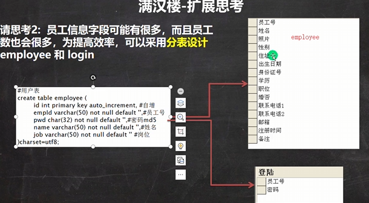

# 满汉楼

- 

软件分层是逻辑概念
1. 可以用不同包来存放对应类
2. 体现了一个**调用的关系**
3. 可以**各司其职**

- 满汉楼多表处理：
  - 在 `domain` 中构建一个 `MultiTableBean`类
  - `DAO`-`MultiTableBeanDAO`
  - 根据业务需要看是否需要增加 `service`

```java
    /*
    思考：这里的属性名是否一定要和表的列名保持一致？
    答：可以不一致，但是需要sql做相应的修改(别名)，建议保持一致
    private String name2;
    select name as name2 from menu where id=?;
     */
```

- 满汉楼扩展
  - 
  - 
